# Introduction

"Just use Tor (hide your IP) and you're anonymous" — this is nothing more than a fantasy in the face of modern advanced tracking technologies and state-level actors (Global Passive Adversaries).

In 2013, Ross Ulbricht, the founder of the largest darknet marketplace "Silk Road," was arrested by the FBI. What brought down the man who was supposed to be hidden behind layers of proxies was "a single email address trace left on an early forum (Entity linking)" and "the timing correlation when his home VPN disconnected right after logging in (Traffic Analysis)." In the 2015 Playpen child exploitation case, the FBI operated the site itself as a honeypot, deploying malware (NIT) that exploited Tor Browser vulnerabilities to extract the "real IP addresses (Device leakage)" of over 1,000 users. And in 2024, even the mastermind (LockBitSupp) of "LockBit," the ransomware group that terrorized the world, was identified and sanctioned through a joint international investigation.

As these real-world cases demonstrate, they don't break the encryption head-on. They piece together fragments of past behavior, steal browser fingerprints, monitor communication timing, and fill in the moat from the outside through **Correlation Attacks**.

On the other hand, there are legendary cases where **"not a single person has ever uncovered their true identity."**
**Satoshi Nakamoto**, the creator of Bitcoin, was active from 2008 to 2010 before vanishing completely. His wallet holds Bitcoin worth trillions of yen, yet as of now, no one has been able to determine his (or their) identity or IP address. Additionally, **DeSnake**, who revived the darknet marketplace AlphaBay in 2021 before disappearing again, has managed to evade the relentless pursuit of law enforcement agencies worldwide and remains "At Large" to this day.

Those who get caught, and those who escape. What is the decisive difference?
It lies in whether they could maintain a paranoid **5-layer Defense in Depth** architecture — severing every single point of contact from communication routes to device behavior to personal conduct — "without a single mistake."

This article will thoroughly dissect the defense techniques across these 5 layers, with proof-of-concept code and diagrams.

## The Critical "Asymmetry" Between Users and Service Operators

Before diving in, there's an important premise to share. Maintaining anonymity as "a mere user (browser)" versus as "a service operator (e.g., a Tor Hidden Service server)" involves fundamentally different levels of difficulty and concerns.

* **[User] A Regular User's Anonymity:**
  You only connect to the network when you want to access something, and you just need to hide your IP and device fingerprint. Once you go offline, tracking is severed, making anonymity relatively easy to maintain.
* **[Server] A Service Operator's Anonymity (Location Hidden Service):**
  You must keep your system running 24/7/365 to serve requests from anyone. This means **"you are constantly exposed as a massive target for the adversary's traffic analysis (correlation analysis)."**
  Additionally, web server applications like Apache and Nginx can accidentally leak the real IP (Transport layer) or hostname (Device layer) through error messages or HTTP headers due to "web-side misconfigurations." In fact, the initial trigger for many darknet operator arrests was not the cracking of sophisticated encryption, but a decisive Operational Security (OpSec) failure — such as "a single line of PHP debug code that leaked their real IP."

As such, the two perspectives require guarding different aspects, but they share one absolute condition: "if even one spot has a hole, you're dead (identified)." The following 5 layers are what they must clear to evade state-level agencies.

1. **Transport (Route):** Tor / Mixnet (Concealing IP addresses and communication paths)
2. **Payload (Content):** E2EE / Signal Protocol (Encrypting the data itself)
3. **Entity (Identity):** Unlinkability / ZKP (Making ID linking and tracking impossible)
4. **Device (Environment):** Anti-Fingerprinting (Normalizing device characteristics)
5. **Traffic (Behavior):** Padding / Obfuscation (Hiding communication volume and timing patterns)


---

## 1. Transport (Route Anonymization)

The layer that conceals the relationship between the "source" and "destination" of communication. It protects the metadata contained in TCP/IP headers, the foundation of the Internet.

### Tor (The Onion Router) and the 512-Byte Rule

* **Overview:** Primarily designed for "anonymous access to the Internet (out-proxying)."
* **Mechanism:** Routes communication through 3 relays (Guard → Middle → Exit) operated by volunteers worldwide. Packets are encrypted in multiple layers (Onion Routing), and each node can only know "the node before it" and "the node after it."

What's particularly noteworthy is the countermeasure against traffic analysis. All data flowing through the Tor network is divided into units called **Cells**. Historically, these Cells have been designed at a **fixed length of 512 bytes** (Command=0 `CELL_PADDING`).
This makes it extremely difficult for an outside interceptor to guess "who is communicating how much data."

* **Topology:** **Bidirectional circuit (circuit-switching approach)**. Uses the same path (tunnel) for both outgoing and incoming traffic, making it suited for low-latency communication.
* **Directory:** A centralized set of directory servers manages node information.

### I2P (Invisible Internet Project) and Garlic Routing

* **Mechanism:** Unlike Tor, I2P primarily uses UDP-based, message-oriented **packet-switching approach**. In addition to using unidirectional tunnels (completely separate routes for sending and receiving), its greatest feature is "bundling multiple messages into a single encrypted block (Garlic)."

**Why does "bundling (Garlic)" dramatically improve anonymity?**

The fundamental weakness of Tor's Onion Routing is that it's essentially a "1 In, 1 Out" bucket relay. One encrypted packet enters a node, and one packet exits.
Suppose a state-level adversary (Global Passive Adversary) is monitoring the "shape" and "timing" of traffic by controlling major ISPs and submarine cables. Even without decrypting the encryption, they can perform **timing and size correlation analysis** — "a 512-byte packet entered Node A, and a fraction of a second later, a 512-byte packet exited Node B" — to link the origin and destination.

Garlic Routing physically destroys this "input/output volume correlation."
The sender doesn't send the message (Clove: a segment of garlic) to the real destination (Bob) alone. They bundle it with a message to someone completely different (Carol) and **dummy messages (Cover Traffic) whose sole purpose is to disrupt the route and generate noise traffic**, encrypting them all into one large Garlic (a bulb of garlic) and hurling it out.

When one Garlic hits a relay node and the node peels away its layer of encryption, multiple skins (Cloves) burst out from inside, flying off in completely different directions.
From the perspective of a surveillance logger, it looks like "one packet came in, and suddenly three packets spawned and scattered in different directions." Like a cluster bomb detonating mid-air. This makes it mathematically impossible to "correlate input packets with output packets on a 1-to-1 basis."

```mermaid
sequenceDiagram
    participant User as Sender (Alice)
    participant Node1 as Router 1
    participant Node2 as Router 2
    participant Dest as Dest (Bob)
    participant Ob as Other (Carol)

    rect rgb(200, 255, 200)
    Note over User,Ob: Onion Routing (Tor) - "1 In, 1 Out" bucket relay (tracking risk)
    User->>Node1: 📦 Enc(Msg, Bob)
    Node1->>Node2: 📦 Enc(Msg, Bob)
    Node2->>Dest: 📦 Msg
    end

    rect rgb(255, 200, 200)
    Note over User,Ob: Garlic Routing (I2P) - Detonates at impact, scattering dummies
    User->>Node1: 🧄 Garlic [ Clove(Bob) + Clove(Carol) + Clove(Dummy) ]
    note right of Node1: Peeling the encryption causes<br>fragmentation in multiple directions,<br>making tracking impossible
    Node1->>Node2: 📦 Clove(Bob)
    Node1->>Ob: 📦 Clove(Carol)
    note right of Node1: 🗑 Clove(Dummy) is discarded or reflected
    Node2->>Dest: 📦 Msg_Bob
    end
```



### Technical Comparison (Tor vs I2P)

| Feature        | Tor                                                          | I2P                                                              |
| -------------- | ------------------------------------------------------------ | ---------------------------------------------------------------- |
| **Routing**    | **Onion Routing** (Onion: layered encryption of one message) | **Garlic Routing** (Garlic: bundled encryption of multiple msgs) |
| **Path**       | **Bidirectional, 1 route** (Circuit Switching)               | **Unidirectional, 2+ routes** (Packet Switching)                 |
| **Bottleneck** | **Exit Node** (exit nodes are easily monitored)              | **None** (no exit needed, communication stays internal)          |
| **Use Case**   | Web browsing, general Internet usage                         | P2P file sharing, censorship-resistant server hosting            |

## 2. Payload (Data Encryption) and the Obsession with Forward Secrecy

Even if the communication route (Layer 1) is perfectly anonymized, sending "I am Alice" in plaintext ends everything. Or, since Tor's Exit Nodes by design relay traffic to the destination, plaintext communication would be fully visible to the exit node operator.
This layer demands a design that protects past communication content (Forward Secrecy) even if **"the communication partner's device is seized in the future."**

The pinnacle of this is the **Signal Protocol**, adopted by WhatsApp, Skype, and others.

* **The Insanity of the Double Ratchet Algorithm:**
  In typical TLS/SSL communication, once a session key is established, the same key is used for encryption for a while.
  However, Signal adopts a paranoid design where **"every single message sent generates a brand new encryption key that is immediately discarded"** (Ratchet: like a gear that only turns one way).


Even if your phone is seized by police today and the private key (Identity Key) is extracted, **decrypting yesterday's messages is mathematically impossible**. Because the key that encrypted yesterday's messages has already been completely erased from memory (Forward Secrecy).

## 3. Entity (Identity Unlinkability) and "Identity Isolation"

"My login ID hasn't been exposed, so I'm safe" — this is an amateur's thought. Modern Entity modeling pieces together every detail of your behavioral history to forge a single profile (Shadow Profile).

* **Unlinkability:**
  The property that behavioral history on site A and behavioral history on site B cannot be linked as "belonging to the same person."
  For example, even if you perfectly hide your IP with Tor and perfectly encrypt your data with Signal, **the moment you habitually "pay for server costs from the same Bitcoin address you used before," all anonymity collapses and you're traced back to the real you.**
  Ross Ulbricht (founder of Silk Road) was also identified by the FBI through the linking of a trivial email address he posted on an early forum.

* **Cryptographic Solutions:**
  * **Zero-Knowledge Proofs (ZKP):**
    A technology that mathematically proves the fact "I am over 18 years old" without ever sending the "actual age" or "date of birth" to the server.

    **Intuitive Understanding: The Color Vision Proof**
    Suppose you (the verifier) are colorblind and cannot distinguish between a red and a green ball. I (the prover) claim "these two are different colors," but I don't want to tell you what color they actually are.
    You hide the two balls behind your back, randomly swap them (or don't), and ask me "Did you swap?" If I can distinguish the colors, I can answer correctly 100% of the time. If I can't, I only have a 50% chance of guessing right.
    **Repeat this 100 times.** Here's the logic: if I'm **lying and actually can't see the colors**, each answer is the same as a 50% coin flip. The probability of getting 100 consecutive correct answers by coin flip is `(1/2)^100 ≈ 0.0000000000000000000000000000008` — effectively zero.
    Conversely, **if I did get 100 consecutive correct answers, the only conclusion is "this person wasn't guessing by coin flip — they really can see the colors (= they possess the knowledge)."** And yet, at no point were the words "red" or "green" ever communicated to you (the verifier). This is the core of Zero-Knowledge Proofs.

    **Application to Age Verification (zk-SNARKs):**

    

    In cryptocurrencies like Zcash (ZEC), zk-SNARKs are used to prove "the transaction is not fraudulent (the balance is sufficient)" on the blockchain while completely concealing "who sent how much to whom." In regular Bitcoin, `A sent 3 BTC to B` is visible on the blockchain, but in Zcash, only "Proof data" is recorded, with sender, receiver, and amount fully hidden.

    **Important: Who is the secret protected FROM?**
    A critical point here is that **you do need to send your identification to the Certificate Authority (a trusted third party like the government)**. The CA knows exactly who you are. Zero-Knowledge Proofs protect your secrets only **"from the Web service (the verifier)."**
    However, since Proof generation is performed locally on the user's device, the CA cannot know "which service you submitted your Proof to." In other words, a **Trust Separation** is established: **"The CA knows your ID but not your access destinations" and "The service knows your access but not your ID."** This is the core design philosophy of Zero-Knowledge Proofs.

  * **Ring Signatures:**
    Creates an anonymous signature that says "someone in this group (e.g., 10 people) signed this." Adopted by Monero (XMR), it hides who made the transaction behind a fog of probability.

## 4. Device (Environment Normalization)

The layer that prevents tracking through unique configuration values (Fingerprints) held by browsers and operating systems. Even if you hide your IP, users can be uniquely identified by screen resolution and font lists, so this must be prevented.

* **Fingerprinting Protection:**
  * **Canvas Fingerprinting Countermeasures:** HTML5 Canvas is a browser feature that allows drawing graphics (text, shapes, etc.) via JavaScript. The subtle differences in rendering results (dependent on GPU and drivers) are exploited for tracking. This is neutralized or noise is injected.
  * **User-Agent Normalization:** Makes all users appear as if they have the same OS and browser version.
* **Implementation Examples:**
  * **Tor Browser:** Fixes window size and restricts JavaScript capabilities to make everyone appear as "identical Windows users."
  * **Tails / Whonix:** Enforces MAC address randomization and hardware information concealment at the OS level.

### [Hands-on] Extract Your Browser's "Fingerprint"

Let's verify with actual code why hiding your IP is useless. Paste the following JavaScript into the developer console (F12) of Google Chrome or similar browser and execute it.

```javascript
// Draw invisible text using Canvas and get the hash of the result
async function getCanvasFingerprint() {
  const canvas = document.createElement('canvas');
  const ctx = canvas.getContext('2d');
  
  // Intentionally perform complex drawing (to bring out GPU/OS font rendering differences)
  ctx.textBaseline = "top";
  ctx.font = "14px 'Arial'";
  ctx.textBaseline = "alphabetic";
  ctx.fillStyle = "#f60";
  ctx.fillRect(125,1,62,20);
  ctx.fillStyle = "#069";
  ctx.fillText("Hello, world! 😃", 2, 15);
  ctx.fillStyle = "rgba(102, 204, 0, 0.7)";
  ctx.fillText("Hello, world! 😃", 4, 17);

  // Get the drawing result as a DataURL (Base64)
  const dataURL = canvas.toDataURL();
  
  // Hash with SHA-256
  const hashBuffer = await crypto.subtle.digest('SHA-256', new TextEncoder().encode(dataURL));
  const hashArray = Array.from(new Uint8Array(hashBuffer));
  const hashHex = hashArray.map(b => b.toString(16).padStart(2, '0')).join('');
  
  console.log("%c[Canvas Fingerprint]", "color: red; font-size: 16px; font-weight: bold;");
  console.log(hashHex);
}

getCanvasFingerprint();
```

Try opening an incognito window (private browsing) and running it again. **The hash value should be exactly the same.** No matter how many cookies you clear or how many times you change your IP, you're already trackable through the "inescapable fingerprint" of your OS and GPU rendering characteristics.

Tor Browser prevents this by either warning the user when a Canvas read access (`toDataURL`, etc.) is attempted, or by forcibly returning a completely blank, solid-color image — a brute-force approach to disguise everyone as "identical users."

## 5. Traffic (Behavior Concealment)

Even if all packets are split into the same size (512 bytes, etc.) and highly encrypted, the adversary doesn't give up. They analyze the **metadata itself — the "timing" and "frequency" of packets (Traffic Analysis).**
"Right after person A turned on their PC (traffic spike), accesses to an anonymous whistleblower site surged. Is this a coincidence?" — that kind of inference.

This layer demands designs so extreme they flatly contradict our networking common sense as engineers.

* **Dummy Traffic: The Desperately Wasteful Bandwidth Consumption:**
  Even when no actual communication is taking place, **meaningless data (garbage) is encrypted and continuously sent** at random or at a constant rate.
  In other words, to prevent the inference "oh, traffic increased so they must be talking now," you keep pumping out meaningless packets at full blast 24/7/365 (Constant Bitrate - CBR). This is the ultimate defense, completely antithetical to concepts like communication efficiency or eco-friendliness.

* **Obfuscation for Censorship Evasion:**
  Sophisticated DPI (Deep Packet Inspection) systems like China's Great Firewall (GFW) use machine learning to detect the "characteristics (handshake structure, etc.)" of Tor's encrypted packets, and forcibly terminate TCP connections (RST) by determining "this is Tor traffic" — even without decrypting anything.
  The countermeasure is **Pluggable Transports (obfs4, Snowflake, etc.).**
  For example, Snowflake uses WebRTC to **disguise Tor traffic as "ordinary video chat traffic from a browser."** From the adversary's perspective, it looks like nothing more than Zoom or Google Meet packets.

---

## Conclusion

The 5 layers introduced (Transport, Payload, Entity, Device, Traffic) — if even one is missing, it leads to a fatal information leak, and an individual can be easily identified through correlation analysis. Even if you hide your IP with Tor, if your browser window is maximized, your fingerprint gets extracted at the Device layer. Even if you protect messages with E2EE, if the packet transmission timing before and after encryption matches, "who is talking to whom" can be inferred at the Traffic layer.

Building a "perfect anonymity system" is a path that demands enormous sacrifices in usability (UX) and performance (increased latency, CAPTCHA hell, feature restrictions). However, as engineers, even if we never use the dark web or whistleblower sites ourselves, we can deeply learn "what defensive design truly means" from these architectures.

The next time you design a web application or system, try thinking just a little bit paranoidly: "If Google or a state agency were storing and intercepting all communication data on the route, how would our system protect its users?"
