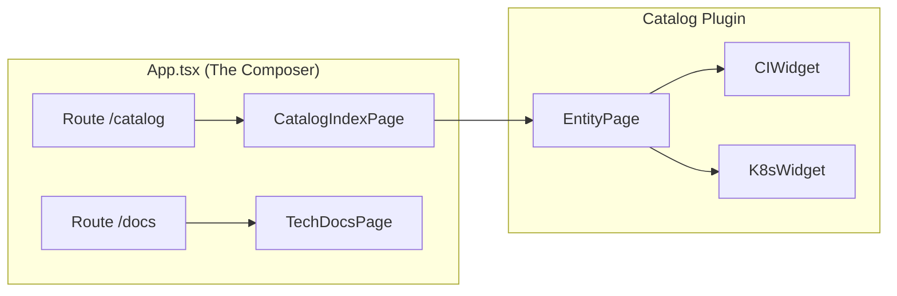
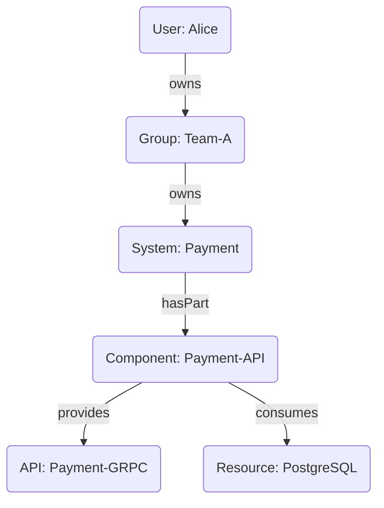

# Backstage Deep Dive: 開発者ポータルの裏側をコードから解剖する

Platform Engineering の文脈で必ず名前が挙がる **Backstage**。
「Spotify が作った開発者ポータル」として有名ですが、その実態は単なるポータルサイトではなく、**「インフラやツールを抽象化するための TypeScript 製フレームワーク」** です。

今回は、Backstage の巨大なモノレポ（`backstage/backstage`）を読み解き、その魔法のようなプラグインシステムやカタログ機能がどのように実装されているのか、視覚的に解説します。

## 1. Backstage の全体像: The 3 Pillars

Backstage のアーキテクチャは、大きく3つの柱で構成されています。

```mermaid
graph TD
    %% Styling
    classDef frontend fill:#e1f5fe,stroke:#01579b,stroke-width:2px;
    classDef backend fill:#fff9c4,stroke:#fbc02d,stroke-width:2px;
    classDef catalog fill:#f3e5f5,stroke:#7b1fa2,stroke-width:2px;

    subgraph "Frontend (React / SPA)"
        App[App Shell]:::frontend
        PluginA[Plugin A (Catalog)]:::frontend
        PluginB[Plugin B (TechDocs)]:::frontend
        
        App --> PluginA
        App --> PluginB
    end

    subgraph "Backend (Node.js)"
        Router[Router / Service Discovery]:::backend
        BackendA[Catalog Backend]:::backend
        BackendB[TechDocs Backend]:::backend
        
        PluginA -- REST API --> BackendA
        PluginB -- REST API --> BackendB
    end

    subgraph "The Catalog (Data Model)"
        Entity[Entity (YAML)]:::catalog
        
        BackendA -- Ingest --> Entity
    end
```

1.  **Core (Frontend Framework)**: React をベースにした、プラグインを組み込むための土台。
2.  **Plugins**: 機能の単位。画面（Frontend）と API（Backend）が対になっています。
3.  **Software Catalog**: すべてのリソース（Service, API, Library）を中心的に管理するデータベース。

## 2. Plugin Architecture: 画面のコンポーネント化

Backstage のフロントエンドにおいて最も特徴的なのが、**Routing System** です。
`packages/core-plugin-api/src/routing/types.ts` を見ると、`RouteRef` という概念が登場します。

```typescript
// packages/core-plugin-api/src/routing/types.ts

export type RouteRef<Params extends AnyParams = any> = {
  // ...
  params: ParamKeys<Params>;
};
```

これにより、プラグイン同士が「URL をハードコードせずに」相互リンクできるようになっています。

### コンポジションの仕組み



開発者は `App.tsx` でレゴブロックのようにプラグインを配置するだけで、自分たちだけのポータルを作ることができます。これが Backstage の強みです。

## 3. The Catalog: データモデルの正体

Backstage の心臓部は **Software Catalog** です。
そのデータ構造は Kubernetes の Custom Resource Definition (CRD) に強く影響を受けています。

`packages/catalog-model/src/entity/Entity.ts` を見ると、おなじみの構造が見て取れます。

```typescript
// packages/catalog-model/src/entity/Entity.ts

export type Entity = {
  apiVersion: string;
  kind: string; // Component, API, Group, User, ...
  metadata: EntityMeta;
  spec?: JsonObject;
};
```

### Entity の関係性 (Relations)

Catalog は単なるリストではなく、グラフ構造を持っています。



このグラフ構造により、「このマイクロサービスがダウンしたら誰に連絡すればいいか？」「この API を使っているのは誰か？」といった依存関係分析が可能になります。

## 4. Backend System: 新しいサービスの形

現在、Backstage のバックエンドは大きな変革期（New Backend System）にあります。
`packages/backend-plugin-api` を見ると、従来の Express Router ベースの実装から、**Dependency Injection (DI)** を活用したモジュラーなアーキテクチャへの移行が見て取れます。

```typescript
// 概念コード: New Backend System

const backend = createBackend();

backend.add(import('@backstage/plugin-catalog-backend/alpha'));
backend.add(import('@backstage/plugin-techdocs-backend/alpha'));

// 依存関係（Logger, Database, Cache）は自動的に注入される
backend.start();
```

これにより、バックエンドプラグインの追加や設定が、数行のコードで完結するようになりました。

## まとめ

Backstage のコードベースを読み解くと、それが単なる「便利ツール集」ではなく、**「組織のスケーリングに耐えうる抽象化レイヤー」** を提供しようとしていることが分かります。

- **Frontend**: `RouteRef` による疎結合なプラグイン連携。
- **Data Model**: Kubernetes ライクな `Entity` による統一的なメタデータ管理。
- **Backend**: DI コンテナによる拡張性と保守性の向上。

Platform Engineering を推進する上で、Backstage が「Interface」として選ばれる理由が、この堅牢なアーキテクチャに詰まっています。
