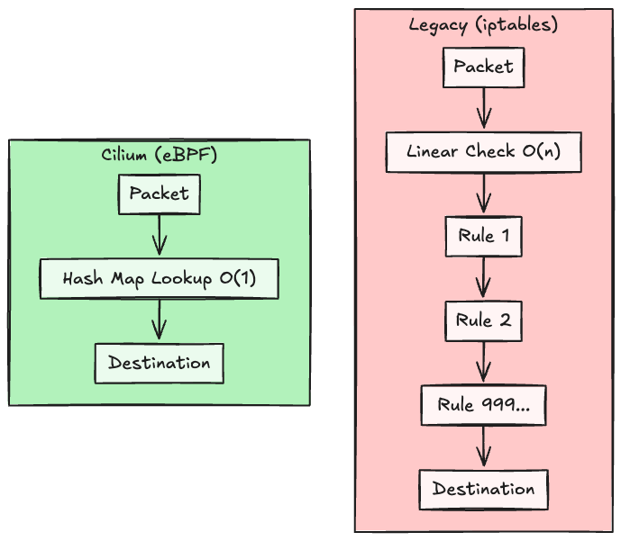
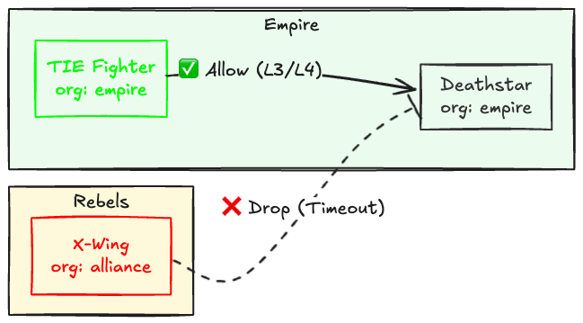
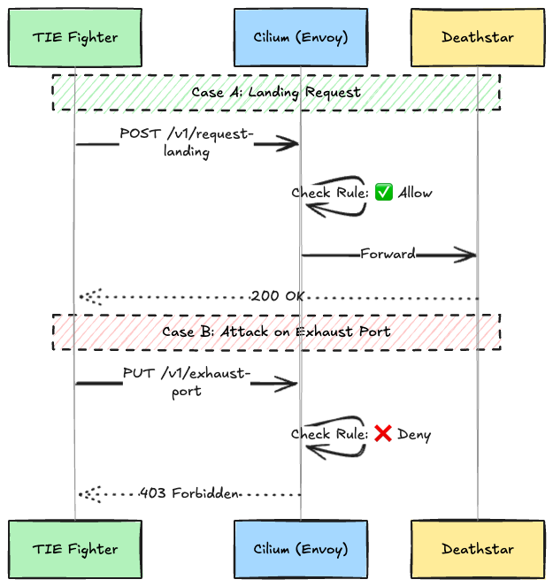
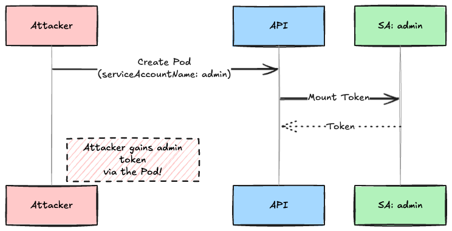
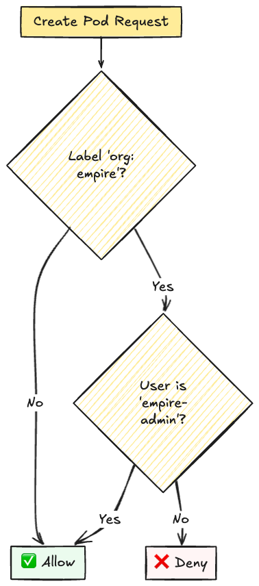
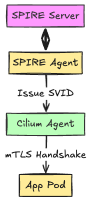
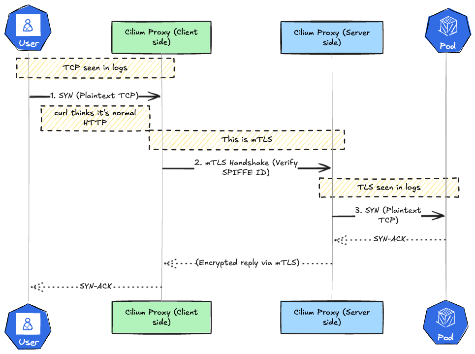
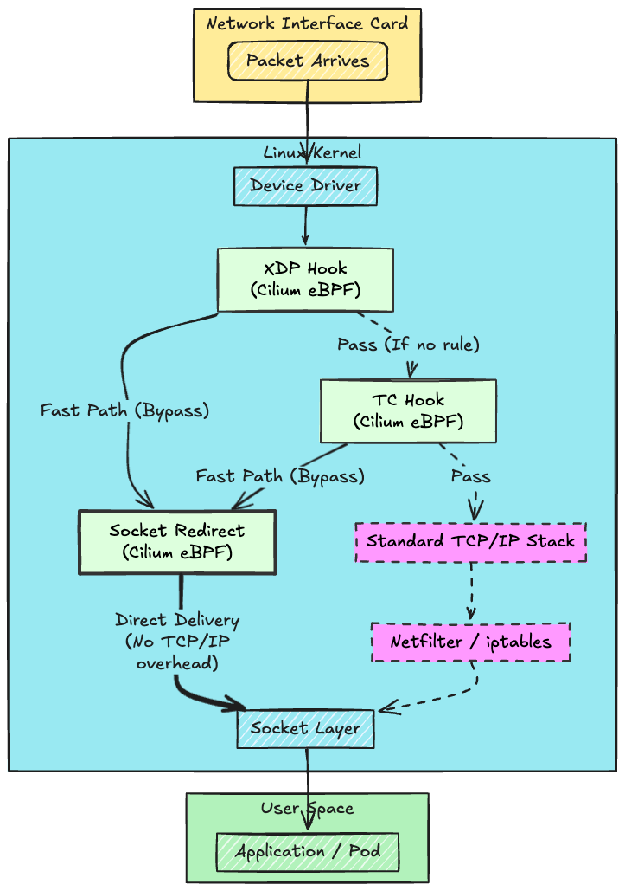
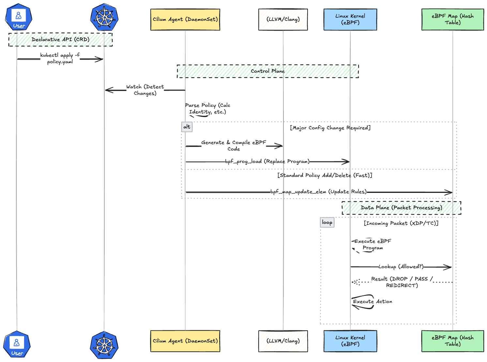

# Introduction

In recent years, a technology called **eBPF (Extended Berkeley Packet Filter)** has been hailed as a revolution in the Linux kernel world.

It is often described as magic that "allows you to safely extend kernel functionality without rewriting kernel source code." However, when you actually try to write and run C code yourself, the hurdles of environment setup and verification are high, often making it look like "difficult black magic."

However, **Cilium** serves as the perfect gateway to understanding eBPF.

Cilium is a CNI (Container Network Interface) for Kubernetes built using eBPF. By using it, you can intuitively experience **"how eBPF changes the world of networking and security"** without writing a single line of eBPF code.

In this article, we will build Cilium in a local Kubernetes environment (Kind) and unravel its power through the following four steps:

1. **Observability**: Kernel-level visualization with Hubble
2. **Network Policy**: L3-L7 control using eBPF + Envoy
3. **Governance**: Policy enforcement via VAP (Validating Admission Policy)
4. **Zero Trust**: Transparent mTLS integration with SPIRE

## 1. Why Cilium?

First, let's understand the decisive difference between traditional Kubernetes networking and Cilium (eBPF).

### 1-1. Moving away from iptables (kube-proxy)

In a standard Kubernetes configuration, `kube-proxy` handles packet control by manipulating `iptables`.

However, `iptables` processes rules using linear search (O(n)), which causes latency in large-scale environments as the number of rules increases.

Cilium replaces this with eBPF.

Since eBPF references hash tables (Maps) within the kernel directly, the computational complexity remains **O(1)** regardless of how many services are added.



### 1-2. Identity-Aware

Traditional firewalls identify traffic by "IP Address," but in the container world, IPs change frequently. Cilium assigns a unique "Identity (numeric ID)" to each Pod and manages it at the eBPF level, maintaining policies even if the IP changes.

## 2. Hands-on Experiment

### Prerequisites

* Docker, Kind, kubectl
* Cilium CLI (`brew install cilium-cli`, etc...)

### Step 1: Create a Kind Cluster

To let Cilium handle all networking, we create the cluster with `disableDefaultCNI: true` to disable the default CNI (kindnet).

```bash
cat <<EOF > kind-config.yaml
kind: Cluster
apiVersion: kind.x-k8s.io/v1alpha4
nodes:
  - role: control-plane
  - role: worker
  - role: worker
networking:
  disableDefaultCNI: true
  podSubnet: "10.0.0.0/8"
  serviceSubnet: "172.18.0.0/16"
EOF

kind create cluster --config kind-config.yaml --name cilium-test
```

**Verification Command:**
Since there is no CNI yet, the nodes will be in a `NotReady` state.

```bash
kubectl get nodes
# STATUS: NotReady (Expected)
```

### Step 2: Install Cilium

Install using the Cilium CLI.

```bash
cilium install --version 1.18.5
```

**Verification Command:**
Once installation is complete, the nodes will become `Ready`.

```bash
cilium status --wait
# Status: OK
kubectl get nodes
# STATUS: Ready
```

## Step 3. Enable Hubble (Observability)

Enable Hubble, Cilium's visualization feature.

```bash
cilium hubble enable --ui
```

**Verification Command:**
Launch the Hubble UI and open `http://localhost:12000` in your browser.

```bash
cilium hubble ui
```

Generate some test traffic from another terminal.

```bash
cilium connectivity test
# This takes a very long time
```

Looking at the Hubble UI, communication between Pods is visualized as a Service Map.

> [!TIP]
> A Service Map is a network topology diagram that automatically visualizes dependencies, showing "which service (Pod) is communicating with which service" within the Kubernetes cluster.

Because eBPF captures data at the socket level, you can see details like "DNS query content" and "HTTP methods" without injecting any sidecars.

## Step 4. Enable Network Policy (L3-L7)

We will use a Star Wars demo app to control access between the Empire and the Alliance.

### 4-1. Deploy the App

```bash
kubectl create -f https://raw.githubusercontent.com/cilium/cilium/HEAD/examples/minikube/http-sw-app.yaml
```

**Verification Command:**
Wait for the Pods to start.

```bash
kubectl wait --for=condition=Ready pod --all --timeout=60s
kubectl get pods
```

### 4-2. L3/L4 Control: IP Level Blocking

Apply a policy stating "Only Empire ships (`org=empire`) can access the Death Star."



```yaml
cat <<EOF | kubectl apply -f -
apiVersion: "cilium.io/v2"
kind: CiliumNetworkPolicy
metadata:
  name: "rule1"
spec:
  endpointSelector:
    matchLabels:
      org: empire
      class: deathstar
  ingress:
  - fromEndpoints:
    - matchLabels:
        org: empire
    toPorts:
    - ports:
      - port: "80"
        protocol: TCP
EOF
```

**Verification:**
Access from the Alliance (X-Wing) times out (drops).

```bash
kubectl exec xwing -- curl -s --connect-timeout 2 -XPOST deathstar.default.svc.cluster.local/v1/request-landing
# command terminated with exit code 28
```

Access from the Empire (TIE Fighter) succeeds.

```bash
kubectl exec tiefighter -- curl -s -XPOST deathstar.default.svc.cluster.local/v1/request-landing
# Ship landed
```

### 4-3. L7 Control: HTTP Method Blocking

Furthermore, let's add a policy: "Even for the Empire, **attacks on the exhaust port (`PUT /exhaust-port`)** are prohibited." Cilium achieves this by integrating with Envoy.



```yaml
cat <<EOF | kubectl apply -f -
apiVersion: "cilium.io/v2"
kind: CiliumNetworkPolicy
metadata:
  name: "rule1"
spec:
  endpointSelector:
    matchLabels:
      org: empire
      class: deathstar
  ingress:
  - fromEndpoints:
    - matchLabels:
        org: empire
    toPorts:
    - ports:
      - port: "80"
        protocol: TCP
      rules:
        http:
        - method: "POST"
          path: "/v1/request-landing"
EOF
```

**Verification:**

```bash
# Request Landing (POST) -> OK
kubectl exec tiefighter -- curl -s -XPOST deathstar.default.svc.cluster.local/v1/request-landing
# Ship landed

# Attack (PUT) -> Access Denied (403)
kubectl exec tiefighter -- curl -s -XPUT deathstar.default.svc.cluster.local/v1/exhaust-port
# Access denied
```

## Step 5. Enable Validating Admission Policy (VAP)

Using **VAP**, a new feature in Kubernetes 1.30+, we can enforce governance during resource creation.

### Sidebar: ServiceAccount Impersonation Risk

In K8s, a "user who can create Pods" can specify any ServiceAccount (SA). If they use an SA with strong privileges without permission, it can lead to privilege escalation attacks.



### 5-1. Applying Policy

We create a rule: "Only the privileged user (`empire-admin`) is allowed to attach the `org: empire` label."



```yaml
cat <<EOF | kubectl apply -f -
apiVersion: admissionregistration.k8s.io/v1
kind: ValidatingAdmissionPolicy
metadata:
  name: "demo-strict-empire-label"
spec:
  failurePolicy: Fail
  matchConstraints:
    resourceRules:
    - apiGroups:   [""]
      apiVersions: ["v1"]
      operations:  ["CREATE", "UPDATE"]
      resources:   ["pods"]
  validations:
    - expression: >
        !('org' in object.metadata.labels) ||
        object.metadata.labels['org'] != 'empire' ||
        request.userInfo.username == 'system:serviceaccount:default:empire-admin'
      message: "You are not authorized to use the 'org: empire' label."
EOF
```

Create the binding as well.

```yaml
cat <<EOF | kubectl apply -f -
apiVersion: admissionregistration.k8s.io/v1
kind: ValidatingAdmissionPolicyBinding
metadata:
  name: "demo-strict-empire-label-binding"
spec:
  policyName: "demo-strict-empire-label"
  validationActions: [Deny]
  matchResources:
    namespaceSelector:
      matchLabels:
        kubernetes.io/metadata.name: default
EOF
```

### 5-2. Verification

**Execute as a normal user (Denied):**

```bash
cat <<EOF | kubectl apply -f -
apiVersion: v1
kind: Pod
metadata:
  name: spy-x-wing
  labels:
    org: empire
spec:
  containers:
  - image: nginx
    name: c
EOF
# The pods "spy-x-wing" is invalid: : ValidatingAdmissionPolicy 'demo-strict-empire-label' with binding 'demo-strict-empire-label-binding' denied request: You are not authorized to use the 'org: empire' label.
```

## Step 6. Combine with SPIRE

Finally, we will build a Zero Trust network integrated with **SPIRE**.
Authentication is performed based on **"Issued Certificates (SVIDs)"** rather than IP addresses or passwords.

### 6-1. Overview of SPIRE Integration



1. SPIRE Server/Agent issues SVIDs (x509 certificates) to each workload.
2. The Cilium Agent retrieves them.
3. When communication occurs, Cilium (eBPF) automatically performs an mTLS handshake on the data plane.

First, delete the Network Policy created in the previous experiments to start with a clean state.

```bash
# Delete old policies
kubectl delete cnp --all
```

Next, use Helm to add and install SPIRE components to the environment installed via Cilium CLI.

```bash
# 1. Add Cilium Helm repository
helm repo add cilium https://helm.cilium.io/
helm repo update

# 2. Upgrade Cilium with SPIRE integration enabled
helm upgrade --install cilium cilium/cilium --version 1.16.1 \
  --namespace kube-system \
  --set authentication.mutual.spire.enabled=true \
  --set authentication.mutual.spire.install.enabled=true \
  --set authentication.mutual.spire.install.server.dataStorage.enabled=false \
  --set hubble.relay.enabled=true \
  --set hubble.ui.enabled=true
# 3. Confirm SPIRE is running
kubectl get pods -n cilium-spire
```

By simply specifying `authentication.mode: required` in the policy, mTLS is enforced.

```yaml
cat <<EOF | kubectl apply -f -
apiVersion: cilium.io/v2
kind: CiliumNetworkPolicy
metadata:
  name: secure-access
spec:
  endpointSelector:
    matchLabels:
      org: empire
      class: deathstar
  ingress:
  - authentication:
      mode: required  # <--- Force mTLS
    fromEndpoints:
    - matchLabels:
        org: empire
EOF
```

This ensures that traffic from workloads without a certificate (not registered in SPIRE) is rejected.

**Verification:**
Access from the Alliance (X-Wing) times out (drops).

```bash
kubectl exec xwing -- curl -s --connect-timeout 2 -XPOST deathstar.default.svc.cluster.local/v1/request-landing
# command terminated with exit code 28
```

Access from the Empire (TIE Fighter) succeeds.

```bash
kubectl exec tiefighter -- curl -s -XPOST deathstar.default.svc.cluster.local/v1/request-landing
# Ship landed
```

You can verify in the Hubble UI that Authentication is set to `SPIRE`.

Although the curl logs look like TCP, this is because Cilium performs mTLS transparently.



## So, what is Cilium actually doing?

We have verified the operation in various cases, but what is Cilium actually doing?

Since Cilium is a CNI (Container Network Interface), it is responsible for programmably extending and controlling the Linux kernel's network stack itself.

It replaces parts where default Kubernetes uses the **standard Linux network stack (iptables and the traditional TCP/IP processing flow)**. In other words, packet filtering, routing, and load balancing, as well as visualization and security monitoring, are performed by eBPF programs loaded into the kernel by Cilium.

The packet flow can be represented as follows. By replacing these parts, we achieve overwhelming speed by bypassing the traditional TCP/IP stack processing and advanced control at the L7 level without modifying the OS kernel itself.



As shown in this diagram, the relationship between Cilium and eBPF is as follows:

* **Cilium (User Space)**: Acts as the "Brain." It monitors the state of Kubernetes, and based on that, **creates eBPF programs (bytecode) and injects (loads) them into the kernel**.
* **eBPF (Kernel Space)**: Acts as the "Limbs/Hands." Once injected by Cilium, it executes **at high speed** inside the kernel whenever an event (like packet reception) occurs. During actual communication, the Cilium Agent does not intervene; processing is completed solely by eBPF, making it extremely fast.

Cilium controls the network by generating and managing eBPF, but users simply define policies via CRDs to have Cilium create or update the eBPF programs. The following flow illustrates how CRDs are reflected in the eBPF layer (programs and Maps).



## Summary

Through Cilium, we experienced the world of "Visualization," "Control," "Governance," and "Zero Trust" brought by eBPF.

* **Hubble**: Kernel-level visualization.
* **Network Policy**: Precise control with eBPF + Envoy.
* **VAP**: Entry-level inspection at the API level.
* **SPIRE**: Robust certificate-based authentication.

These are not "black magic," but practical technologies that fuse the latest Linux kernel features with the Kubernetes ecosystem.
Please try it out in your own environment.

## Cleanup

```bash
kind delete cluster --name cilium-test
rm kind-config.yaml
```
