# Introduction

It is 2026. If you ask an AI agent to "speed up this process," it will return parallelized code in seconds.
However, how many engineers can logically explain **why that code becomes faster**, or **why it doesn't become as fast as expected**?

AI solves the "How" of implementation, but the "Why" and "Structure" that ensure the integrity and scalability of the entire system remain the responsibility of the engineer.

In this article, we will systematically explain everything from the timeless "First Principles" of concurrency theory to the mental models for combining them, and finally, concrete implementation patterns.

---

## 1. First Principles: Concurrency vs. Parallelism

Before learning design patterns, we must eliminate ambiguity in definitions. **Concurrency** and **Parallelism** are distinctly different.

### 1.1 Definitions and Reality

|     Concept     |                            Definition                            |   Hardware Requirement    |                        Purpose                         |
| :-------------: | :--------------------------------------------------------------: | :-----------------------: | :----------------------------------------------------: |
| **Concurrency** | Multiple tasks are in **progress** (switching via time-slicing). | Possible on a single core | Effective utilization of wait time (e.g., I/O waiting) |
| **Parallelism** |   Multiple tasks are executing **physically simultaneously**.    |    Requires multi-core    |     Improving throughput (calculation speed, etc.)     |

> **"Concurrency is about dealing with lots of things at once. Parallelism is about doing lots of things at once."**
> — Rob Pike (Co-creator of Go)

```mermaid
graph LR
    subgraph "Concurrency"
        direction TB
        A1["Task A<br/>Running"] --> A2["Task B<br/>Running"] --> A3["Task A<br/>Running"] --> A4["Task B<br/>Running"]
        style A1 fill:#e1f5fe
        style A2 fill:#fff3e0
        style A3 fill:#e1f5fe
        style A4 fill:#fff3e0
    end

    subgraph "Parallelism"
        direction TB
        B1["Core 1: Task A Running"]
        B2["Core 2: Task B Running"]
        style B1 fill:#e1f5fe
        style B2 fill:#fff3e0
    end

```

### 1.2 Two Approaches to State Management (and the Hybrid Reality)

The difficulty of concurrency lies in "managing state (memory)." Theoretically, there are two main approaches, but **in real-world systems (especially in Go, Rust, etc.), these are combined in the right places**.

#### A. Shared Memory Model

Multiple threads reference the same address space.

* **Features**: Fast because it only requires passing pointers. Suitable for simple state sharing.
* **Risks**: Exclusive control (Mutex/Lock) is mandatory to prevent Race Conditions.
* **Examples**: Java (Threads), C++ (std::thread). Go's `sync.Mutex` and Rust's `Arc/Mutex` also fall under this model.

#### B. Message Passing Model

Each process/thread has independent memory and exchanges data via communication.

* **Features**: Safe because memory is not shared. The philosophy is "Do not communicate by sharing memory; instead, share memory by communicating." Suitable for pipelining processes.
* **Risks**: Overhead from data copying occurs.
* **Examples**: Erlang (Actors). Go's `Channel` and Rust's `mpsc` also fall under this model.

> **💡 Field Best Practice**
> Even in Go, which recommends message passing, the official best practice is to use `sync.Mutex` (shared memory) for protecting internal caches (Maps) or simple counters. Modern design is not a binary choice but a proper application of both: **"Use messages for coordinating control flow, and use locks for protecting simple state."**

---

## 2. Theoretical Limits: How Fast Can It Go?

There are physical and mathematical limits to parallelization.

### 2.1 Amdahl's Law

**"The serial processing part (which cannot be parallelized) becomes the bottleneck, limiting the overall performance improvement."**

* : Parallelizable proportion (e.g., 0.9 = 90%)
* : Number of processors
* : Serial proportion (cannot be parallelized)

If **10%** of the program is serial (), even if you provide **infinite** processors (), it will only become **10 times** faster () at maximum.

### 2.2 Gustafson's Law

Amdahl's Law assumes "fixed problem size." In reality, if resources increase, we try to solve **larger problems (higher resolution, more data)**.
This theory states that under the premise of "fixed time, expanded problem size," the speedup from parallelization scales linearly with the number of processors.

Here, as the number of processors  increases, the absolute amount of the parallelizable part  expands, so the strict cap (upper limit) seen in Amdahl's Law does not occur.

---

## 3. The 4 Demons to Avoid

Concurrency bugs have low reproducibility and are difficult to debug. Structurally preventing the following 4 patterns is the main goal of design.

---

## 4. Mental Model: Combining 3 Layers

Before diving into concrete patterns, let's map out the design landscape.
Concurrency design patterns are **not conflicting, but rather meant to be combined across layers**.

It is easy to understand if you compare it to designing a restaurant kitchen.

|            Layer             |         Role          |        Decision to make        |
| :--------------------------: | :-------------------: | :----------------------------: |
|    **Lv 3. Architecture**    | **Overall Structure** | Data flow of the entire system |
| **Lv 2. Task Decomposition** |      **Tactics**      |   How to handle large tasks    |
|  **Lv 1. State Management**  |   **Communication**   |    Rules for data transfer     |

### Combination Decision Tree

The combination of patterns you should choose depends on what you want to build.

From the next chapter, we will explain each element (pattern) on this map specifically.

---

## 5. Lv2 Pattern: Task Decomposition

First is the Lv2 pattern: "How to split a large job into processable sizes."

### 5.1 Fork-Join Pattern

Recursively split tasks and finally integrate the results.

* **Structure**: Split (Fork) → Execute → Wait/Combine (Join).
* **Application**: Divide and conquer algorithms like Merge Sort, Image Processing.
* **Implementation**: Java `ForkJoinPool`.

### 5.2 MapReduce Pattern

The classic and royal road of distributed processing. By separating processing into "Transform (Map)" and "Aggregate (Reduce)", dependencies between nodes are severed.

1. **Map**: Transform input into `(key, value)`. Executable in parallel.
2. **Shuffle**: Transfer data with the same `key` to the same node.
3. **Reduce**: Aggregate values for each `key`.

### 5.3 Work Stealing Pattern

A dynamic load balancing pattern. "Idle threads steal work from busy threads," maximizing CPU utilization.

* **Self (Owner)**: Takes tasks from the **head** of its own queue (LIFO). High cache hit rate.
* **Thief**: Steals tasks from the **tail** of others' queues (FIFO). Minimizes contention.
* **Adoption**: Go Runtime Scheduler, Java ForkJoinPool, Rust Tokio.

### 5.4 Master-Worker Pattern

A centralized pattern where roles are clearly divided between the "Master" who manages processing and "Workers" who perform the actual calculations.
The Master handles task assignment, progress tracking, and retries upon failure, while Workers simply follow orders and calculate.

* **Structure**: Master manages the task queue, Workers accept (or are assigned) work from it.
* **Features**: Fault-tolerant. If a Worker dies, the Master simply re-assigns the task to another Worker.

* **🔍 Specific Use Case**: **Kubernetes / CI/CD Pipelines**
* **Kubernetes**: The **Control Plane (Master)** decides the pod schedule and issues commands to the kubelet on each **Node (Worker)**. If a Node crashes, the Master restarts the pods on another Node.
* **Jenkins / GitHub Actions**: The **Controller** manages build jobs, while **Agents (Runners)** execute the actual builds and tests.

* **Difference from Work Stealing**:
* **Master-Worker**: A "Boss (Master)" manages work. There is management cost, but overall control is effective.
* **Work Stealing**: There is no boss; "Peers" accommodate each other. It is autonomous, but grasping the overall situation is difficult.

---

## 6. Lv3 Pattern: Architecture and Data Flow

Lv3 (Macro perspective) patterns define how data flows through the entire system.

### 6.1 Pipeline Pattern

Processing is divided into stages, and each stage is connected by a queue (buffer).
It absorbs throughput differences between stages and turns the entire system into stream processing.

* **🔍 Implementation Example**: **ELK Stack (Elasticsearch, Logstash, Kibana) Log Pipeline**
* **Structure**: Application logs are buffered in **Kafka**, formatted by **Logstash**, and indexed by **Elasticsearch**.
* **Effect**: Even if Elasticsearch writing is delayed, Kafka accepts the overflowing logs as a buffer, so the application side does not stop.

### 6.2 Producer-Consumer Pattern

Producers and Consumers are separated by a "Bounded Queue."
The key is control of **Backpressure**. Design decisions are needed on whether to block the producer or discard data when the queue is full.

```mermaid
graph LR
    subgraph "Producers"
        P1["Web Server A"]
        P2["Web Server B"]
    end

    P1 & P2 -->|Publish| Q{{"Amazon SQS<br/>(Visibility Timeout)"}}

    subgraph "Consumers"
        Q -->|Poll| W1["AWS Lambda<br/>(Image Resize)"]
        Q -->|Poll| W2["AWS Lambda<br/>(Image Resize)"]
    end

    Q -.->|"🛑 Evacuate to DLQ / Throttling"| P1

    style Q fill:#ffcc80,stroke:#f57c00,stroke-width:2px
    style W1 fill:#e1f5fe,stroke:#0288d1
    style W2 fill:#e1f5fe,stroke:#0288d1

```

* **🔍 Implementation Example**: **Amazon SQS + AWS Lambda (Serverless Architecture)**
* **Structure**: The Web Server (Producer) uploads an image to S3 and puts a notification in **SQS**. **Lambda** (Consumer) picks it up and creates a thumbnail.
* **Backpressure**: Even if image uploads surge, SQS acts as a cushion, adjusting the processing pace so as not to exceed Lambda's Concurrency Limit.

### 6.3 Scatter-Gather Pattern

One request is **scattered** to multiple backends, and the results are **gathered**.
Used frequently in search engines, price comparison sites, and aggregation in microservices.

* **🔍 Implementation Example**: **Elasticsearch (Distributed Search)**
* **Structure**: A search query from a client is received by a "Coordinator Node" and scattered to all "Shards" holding data.
* **Gather**: Each shard returns only the "Top 10 search results" within its own data, and the coordinator merges them to create the final ranking. This is why Google-scale searches finish in milliseconds.

---

## 7. Lv3/Lv1 Pattern: Async & Messaging

Patterns for minimizing I/O wait time without blocking threads. This has properties of both Architecture (Lv3) and Communication (Lv1).

### 7.1 Actor Model

**"Everything is an actor."**
Each actor has a "Mailbox" and processes messages asynchronously. The internal state of the actor is hidden from the outside, guaranteeing thread safety.

* **Merit**: Lock-free design, high location transparency (can send to actors on other servers in the same way).

```mermaid
graph LR
    subgraph "Actor A (Sender)"
        StateA[("State A")]
        LogicA["Logic"]
    end

    subgraph "Actor B (Receiver)"
        MailboxB[/"📩 Mailbox (Queue)"/]
        LogicB["Logic (Single Thread)"]
        StateB[("State B<br/>(Private)")]
        
        MailboxB -->|"Process one by one"| LogicB
        LogicB --> StateB
    end

    LogicA -.->|"Message: Update(5)"| MailboxB

    style StateB fill:#ffcc80,stroke:#f57c00
    style MailboxB fill:#e1f5fe

```

* **🔍 Representative Implementation / Adoption**:
* **Erlang/OTP & Elixir**: Chat infrastructure for **WhatsApp** and **Discord**. Handles hundreds of millions of user connections with millions of lightweight processes (actors).
* **Akka (Scala/Java)**: Framework for building distributed systems. Similar concepts are used behind FaaS like AWS Lambda.
* **Microsoft Orleans**: Adopted on the server side of the game **"Halo 4"**. Uses the concept of "Virtual Actors" to automatically move actors to other servers during server failure.

### 7.2 CSP (Communicating Sequential Processes)

A model adopted by the Go language. While the Actor Model emphasizes "Who to send to (ID)," CSP emphasizes "Where to send (Channel)." Processes and channels become loosely coupled, allowing for flexible configuration.

* **🔍 Representative Implementation / Adoption**:
* **Go (Goroutines & Channels)**: Native support as a language feature. Heavily used in the internal implementation of Docker and Kubernetes.
* **Clojure (core.async)**: Library realizing CSP on the JVM.
* **Kotlin (Coroutines Channel)**: Realizes behavior close to Go channels in Kotlin.

### 7.3 Future / Promise

An abstraction for handling the results of asynchronous processing.

* **Future**: "A read-only placeholder where a value is scheduled to enter in the future."
* **Promise**: "A write port to enter the value after calculation is complete."
* **Modern**: Recent languages (JS, Rust, C#, etc.) allow writing asynchronous processing serially using `async/await` syntax, but this pattern is running behind the scenes.

* **🔍 Representative Implementation / Adoption**:
* **JavaScript (Promise / async-await)**: Basis of Web Frontend development like `fetch('api')`.
* **Java (CompletableFuture)**: Describes chains of asynchronous tasks (After A, then B, then C).
* **Rust (Future trait)**: Combined with runtimes like `Tokio` to realize zero-cost abstracted asynchronous processing.

### 7.4 Reactor / Proactor Pattern

Event-driven architecture for handling massive concurrent connections (C10K problem).

* **Reactor (Node.js, Netty)**: Notifies that "Reading is **possible**." The application performs the reading process itself.
* **Proactor (Windows IOCP, tokio-uring)**: Notifies that "Reading is **completed**." The OS performs I/O on behalf (True Asynchronous I/O).

* **🔍 Representative Implementation / Adoption**:
* **Node.js (libuv)**: Representative for handling massive I/O with a single thread. Based on the Reactor pattern.
* **Nginx**: Achieved overwhelming simultaneous connection numbers compared to Apache (Thread Model) by combining "Master-Worker Model" x "epoll (Reactor)".
* **Netty (Java)**: Java asynchronous network framework. Runs behind Spring WebFlux and gRPC.
* **io_uring (Linux)**: Latest Linux kernel feature. Realizes high-speed I/O of "Completion Notification" type close to Proactor pattern, being adopted in next-generation DBs and Web servers.

> **💡 Column: What is the difference from CSP (Channel)?**
> The goal of "Non-blocking" is the same, but the **Layer** they solve is different.
> * **Reactor (epoll)**: **OS Level**. Interested in the **Notification** of "**When** can I read?"
> * **CSP (Channel)**: **App Level**. Interested in the **Coordination** of "**What** to send to whom?"
> 
> 
> In fact, behind the runtimes of Go (CSP) and Node.js (Event Loop), this Reactor pattern runs mud-stained like an engine, supporting the concurrency models that are easy for humans to handle.

---

## 8. Case Studies: Standing on the Shoulders of Giants

Let's see how these Lv1-Lv3 patterns are combined in systems that actually support the world.

### Case 1: Nginx (Champion of C10K)

Nginx, the de facto standard for Web servers, was designed to solve the problem that "Creating massive threads is heavy."

* **Lv3 Architecture**: **Event-Driven (Reactor)**
* Runs with one master process and a few worker processes.

* **Lv1 State Management**: **Non-blocking I/O**
* Does not stop threads waiting for requests, but switches processing only by notification from the OS (epoll/kqueue).

* **Effect of Combination**:
* Minimized memory consumption and made it possible to handle tens of thousands of simultaneous connections. Node.js also follows this architecture.

### Case 2: Go Runtime Scheduler (Demon of CPU Efficiency)

The secret to "Why can Go run millions of Goroutines?" lies in the task decomposition of the runtime itself.

* **Lv3 Architecture**: **M:N Threading**
* Maps OS threads (M) and lightweight Goroutines (N) in a many-to-many relationship.

* **Lv2 Task Decomposition**: **Work Stealing**
* When a processor's queue becomes empty, it steals half of the Goroutines from another busy processor's queue.

* **Lv1 State Management**: **CSP (Channels) & Mutex**
* While recommending channels at the user code level, it uses fast atomic operations/Mutex for queue operations and memory management inside the runtime.

* **Effect of Combination**:
* Automatically uses the performance of multi-core CPUs while avoiding heavy OS context switches.

### Case 3: Chromium / Modern Browsers (Keystone of Robustness)

"Even if one tab crashes, the entire browser does not go down." This norm is a victory of concurrency patterns.

* **Lv3 Architecture**: **Multi-Process Architecture**
* Assigns an independent process (Renderer Process) to each tab. This is a concept close to the Actor Model in a broad sense.

* **Lv1 State Management**: **Message Passing (IPC)**
* Memory is not shared between processes; they communicate via IPC (Inter-Process Communication).

* **Effect of Combination**:
* Even if a memory protection violation occurs, the impact can be confined only to that tab (process).

---

## Conclusion

Concurrency design patterns are not just code fragments.
They are **blueprints for appropriately combining the three layers of "Architecture," "Task Decomposition," and "State Management" according to the purpose**.

Even when using code generated by AI, humans must perform reviews from the following perspectives:

1. **Validity of Selection**: Are you using "Actor Model" even though it is "Calculation Heavy"? (Excessive overhead)
2. **Layer Consistency**: Are you using inappropriate shared memory locks (Lv1) inside a Pipeline (Lv3)?
3. **Understanding Constraints**: Are you over-parallelizing while ignoring Amdahl's Law?

Only by having this "basic fitness" and "overview" and leveraging AI tools will it be possible to build robust and scalable systems of the 2026 standard.
