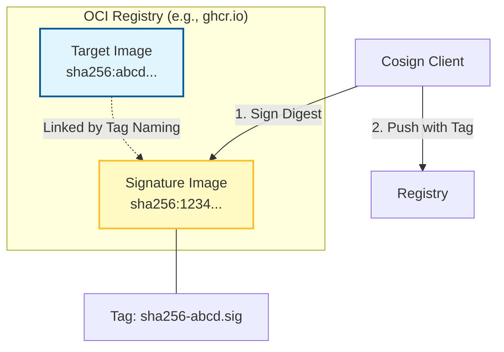
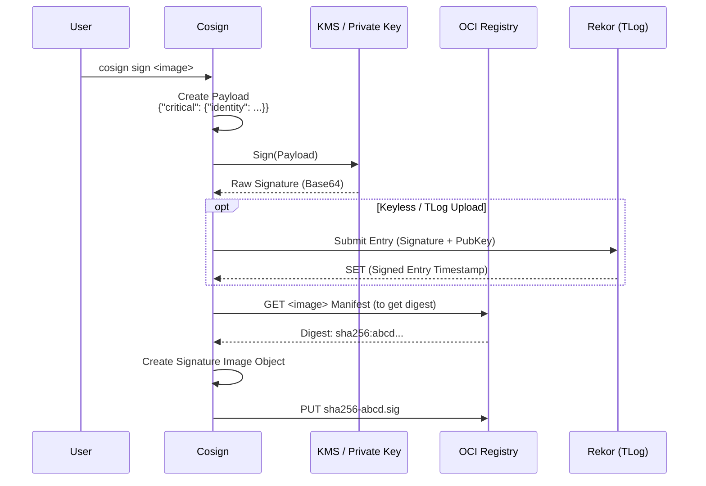

# Cosign Deep Dive: コンテナ署名の仕組みをコードから読み解く

ソフトウェアサプライチェーンセキュリティにおいて、今やデファクトスタンダードとなりつつある **Cosign** (Sigstore)。
「コンテナイメージに署名する」という行為が、具体的に裏側でどのようなデータ構造を作り、どのように検証されているのか。

今回は `sigstore/cosign` のソースコード（主に `pkg/cosign` や `cmd/cosign`）を読み解き、その魔法の裏側を視覚的に解説します。

## 1. Cosign のアーキテクチャ: OCI Registry as a Database

Cosign の最大の発明は、**「署名を保存するための特別なサーバーを用意せず、OCI レジストリそのものをデータベースとして使う」** という点にあります。

`pkg/oci` 周辺の実装を見ると、署名オブジェクトがどのように扱われているかが分かります。



Cosign は対象イメージの Digest (`sha256:abcd...`) を元に、決定論的なタグ名（`sha256-abcd.sig`）を生成し、そこに署名データを格納した特別な OCI アーティファクトを Push します。これにより、イメージと同じ場所に署名が「同居」することになります。

## 2. Signing Flow: 署名の生成プロセス

`cmd/cosign/cli/sign/sign.go` の `SignCmd` 関数が署名の起点です。
ここでは、単に秘密鍵でハッシュを暗号化するだけでなく、様々なメタデータ（Payload）が生成されます。

```go
// cmd/cosign/cli/sign/sign.go (概念コード)

func SignCmd(...) {
    // 1. Payload 生成
    // SimpleSigning Payload (Docker Image Digest などを含む JSON)
    payload := generatePayload(imageDigest)

    // 2. 署名 (Sign)
    // 秘密鍵、または Keyless (Fulcio) で署名
    signature := signer.Sign(payload)

    // 3. OCI アーティファクト作成
    // 署名と公開鍵(Keylessの場合)を含むレイヤーを作成
    sigLayer := static.NewSignature(signature, publicKey)

    // 4. アップロード (Push)
    // "sha256-digest.sig" タグでレジストリに Push
    remote.WriteSignature(repo, sigLayer)
    
    // 5. TLog (Rekor) への登録 (Keylessの場合)
    tlog.Upload(signature)
}
```

このフローを視覚化すると以下のようになります。



## 3. Verification Flow: 検証のロジック

検証ロジックは `pkg/cosign/verify.go` に集約されています。
`Verify` 関数は、単に署名が正しいかだけでなく、**「誰が」「いつ」** 署名したか（Identity）の検証も行います。

特に重要なのが `ClaimVerifier` です。

```mermaid
flowchart TD
    Start[cosign verify] --> Discover[Discover Signatures<br>(List tags sha256-*.sig)]
    Discover --> Fetch[Fetch Signature Layer]
    
    Fetch --> VerifySig{Verify Crypto Signature}
    VerifySig -- Invalid --> Discard[Discard]
    VerifySig -- Valid --> ExtractPayload[Extract Payload]
    
    ExtractPayload --> VerifyClaims{Verify Claims}
    
    subgraph "Claim Verification"
        VerifyClaims --> CheckDigest[Digest Matches Image?]
        VerifyClaims --> CheckIssuer[Issuer Matches? (OIDC)]
        VerifyClaims --> CheckSubject[Subject Matches? (Email)]
    end
    
    CheckDigest -- Yes --> CheckTLog{Verify Rekor Entry?}
    
    CheckTLog -- Valid --> Success[Verification Success]
    
    note[pkg/cosign/verify.go]
    VerifyClaims --- note
```

### コードで見る検証のポイント

- **Discovery**: `cosign.FindSignatures` 関数が、レジストリ上の `.sig` タグを検索します。
- **Bundle Verification**: Keyless 署名の場合、Rekor からの証明書チェーン（Bundle）の検証が `pkg/cosign/bundle` で行われます。ここではオフライン検証も考慮されています。
- **Rego Policy**: `CheckOpts` には OPA/Rego ポリシーを渡すこともでき、署名内容に対して複雑なポリシーチェックを行うことも可能です。

## 4. Keyless Signing (Fulcio & Rekor)

Cosign の真骨頂である Keyless Signing は、内部的には非常に複雑な PKI ダンスを行っています。
ソースコード上では `internal/pkg/cosign/fulcio` や `pkg/cosign/tlog.go` が担当しています。

1.  **OIDC 認証**: Google や GitHub でログインし、ID Token を取得。
2.  **証明書発行**: ID Token を Fulcio に送り、短命なクライアント証明書（Code Signing Certificate）を取得。
3.  **署名**: その証明書の秘密鍵（Ephemeral Key）で署名。
4.  **記録**: 証明書と署名を Rekor に記録し、改ざん不可能性を担保。

これにより、「秘密鍵の管理」という最大のペインポイントを解消しています。

## まとめ

Cosign のソースコードを読むと、それが単なる署名ツールではなく、**「既存のインフラ（OCI Registry, OIDC）」を巧みに利用した分散型の信頼基盤** であることが分かります。

- **Storage**: OCI Registry (Sidecar pattern)
- **Identity**: OIDC (Fulcio)
- **Audit**: Transparency Log (Rekor)

これらが `pkg/cosign` パッケージ内で綺麗に抽象化され、シンプルな CLI 体験を提供している点が、Cosign の設計の妙と言えるでしょう。

次回は、この署名技術が Kubernetes の Admission Controller (`policy-controller`) でどのように強制されているのか、その統合部分を深掘りします。
