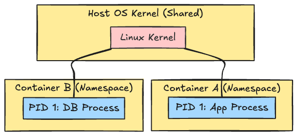
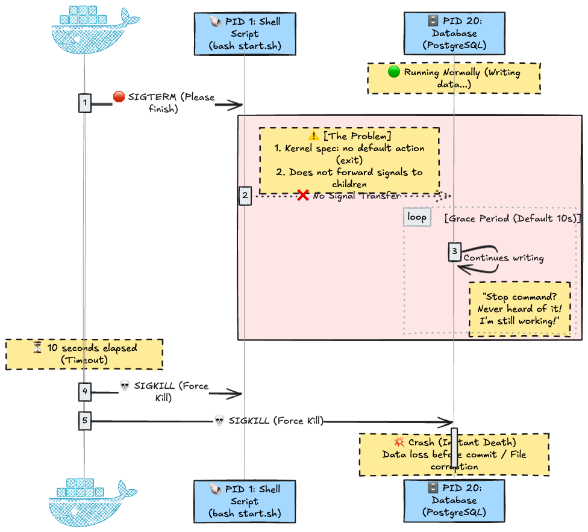
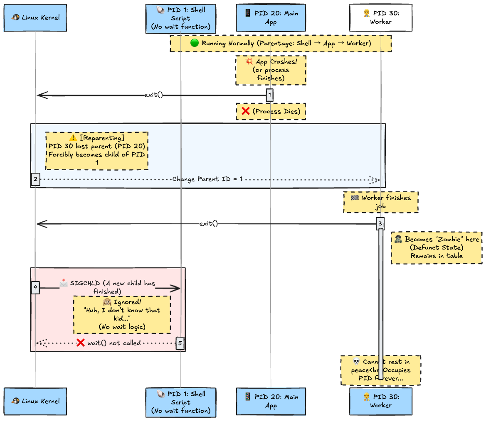
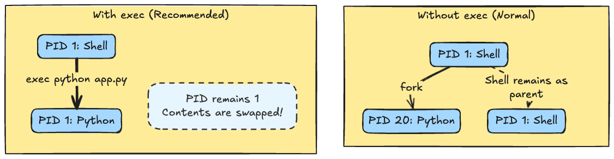

# Introduction

In the world of Docker and Kubernetes, **"One Container = One Process"** is considered an ironclad rule.

However, in development environments, there are moments when you want to break this rule for reasons such as "I want to run a backup cron job alongside the DB" or "I want to include a log forwarding agent." You often see quick-and-dirty hacks on the internet suggesting, "Just use a wrapper script to start them all together."

**That method is dangerous and obsolete.**

Adopting such a configuration in a production environment can lead to serious failures such as **data corruption, a massive accumulation of zombie processes, and failure to gracefully shutdown.**

This article carefully unravels the reasons why this rule must be observed, starting from the basic knowledge of Linux (PIDs, signals).

---

## 1. Prerequisites: Basics of Containers and Linux

Before diving into the main topic, let's clarify the "true nature of containers" and the "mechanisms of Linux," which are essential for understanding.

### Container = An Isolated "Just a Process"

Docker containers are often thought of as lightweight virtual machines (VMs), but the reality is quite different.

* **VM:** Virtualizes hardware, on top of which runs **another kernel (OS)**.
* **Container:** **Shares the host OS kernel** and is simply a **process** walled off by "Namespace" technology.

In other words, what happens inside a container strictly follows the host OS kernel rules (the laws of Linux).



### The 3 Iron Rules of Linux "Process Management"

The following three keywords are critical for understanding this article.

|        Term        |                                                                                                Explanation                                                                                                |
| :----------------: | :-------------------------------------------------------------------------------------------------------------------------------------------------------------------------------------------------------: |
|  **PID 1 (init)**  | The first process created when the system boots. The ancestor of all other processes. It has the special responsibility to **adopt "children without parents (orphan processes)" and mourn (Reap) them.** |
|     **Signal**     |                                            A command notification to a process. Examples include "Please terminate (SIGTERM)" and "Force terminate (SIGKILL)."                                            |
| **Zombie Process** |                        A state where processing has finished, but the process is waiting for its parent to acknowledge its death (exit status). It remains as an entry in memory.                         |

---

## 2. Anti-Pattern: The Trap of Wrapper Scripts

Here is the main issue.
A common mistake is setting a shell script (wrapper) like the one below as the `ENTRYPOINT` to forcefully launch multiple services (e.g., Django + PostgreSQL).

### Dangerous Configuration Example (`my_wrapper_script.sh`)

```bash
#!/bin/bash

# 1. Start Django in the background (&)
python3 manage.py runserver 0.0.0.0:8000 &

# 2. Start PostgreSQL in the background (&)
docker-entrypoint.sh postgres &

# 3. Wait for either to finish
# (The shell executing this wait command becomes PID 1 of the container)
wait -n

# Return the exit status
exit $?
```

At first glance, this seems to work, but it **should not be used in a production environment**. There are two reasons:

1. **Data corruption due to "Signal Ignoring"**
2. **System downtime due to "Zombie Proliferation"**

---

## 3. Deep Dive: The Tragedy of PID 1 and Signal Handling

Let's dig deeper into why the script above is dangerous, down to the level of Linux kernel behavior.

### Problem 1: Ignoring SIGTERM and Data Corruption via SIGKILL

When stopping a container (`docker stop`), Docker sends a polite command (`SIGTERM`) to **PID 1** of the container, asking it to "please finish."

#### Why is a shell script problematic?

1. **Kernel Special Case:** The Linux kernel gives special treatment to the PID 1 process: "**If signal handling is not explicitly written, signals are ignored**" (a safety mechanism to prevent accidental system crashes).
2. **Shell Specification:** Shells like `/bin/bash` **do not forward** received signals to **child processes (App or DB)**.

As a result, the following tragedy occurs:

1. Docker sends `SIGTERM`.
2. PID 1 (Shell) ignores it (or receives it but doesn't tell the child).
3. **The DB continues writing, unaware that a stop command has arrived.**
4. Docker times out (usually 10 seconds) and fires `SIGKILL` (Force Terminate).
5. The DB dies instantly, same as **pulling the power plug**, resulting in data corruption.



### Problem 2: Proliferation of Zombie Processes and PID Exhaustion

Next is the issue of "Zombie Processes."

#### Mechanism of Zombification

1. When a child dies (`exit`), it becomes a **"Zombie (a spirit holding only the exit status)."**
2. The parent calls `wait()` to receive that status (this is called **Reap**).
3. Only then does it completely vanish (rest in peace).

#### The Trap of "Adoption" in Shell Scripts

Normally, if a parent process dies first, the child process (orphan) is **adopted by PID 1**.
However, if a shell script is PID 1, it **"does not look after (wait for) anyone other than its direct children,"** so the adopted children remain zombies forever.

See the diagram below. The Worker (PID 30) generated by the App (PID 20) loses its parent due to an App crash, etc., and comes to PID 1 (Shell), but it is ignored.



#### Result: PID Exhaustion

Zombie processes themselves consume almost no memory, but they **consume "PIDs (numbers)."**
Since Linux has a PID limit (`pid_max`), if zombies proliferate too much, **no new processes (health checks, SSH connections, etc.) can be created**, and the container falls into dysfunction.

---

## 4. Solutions and Design Patterns

So, how can we avoid these problems and build robust containers?
Here are the current standard solutions, along with how they work (the "Why").

### Solution A: Use `exec` (For Single Processes)

If the purpose of the wrapper script is just preparation work like "dynamic environment variable configuration" or "generating config files," and you only run one app afterward, the solution is simple.

When starting the app at the end of the script, use **`exec`** instead of writing the command normally.

#### Prerequisite: The Difference Between `fork` and `exec` in Linux

When executing a new command in Linux, it usually follows a two-step procedure:

1. **fork()**: The parent process creates a copy (clone) of itself. The PID changes at this point (Parent: PID 1 → Child: PID 10).
2. **exec()**: The child process overwrites its own memory with the new program.

If you run a command in a normal shell script, the shell remains as it is and executes the command as a child process (fork). This is the cause of "Shell sitting at PID 1."

#### The Magic of `exec`: Process "Content Swapping"

On the other hand, if you use the shell built-in command `exec`, the shell does not `fork` (clone) but **overwrites its own memory area with the new program**.
In other words, imagine **the PID (jersey number) stays the same, but the player inside is swapped.**



#### Implementation Example

```bash
#!/bin/bash
# 1. Preparation (Executed as shell)
echo "Configuring environment..."
export MY_APP_ENV=production

# 2. Start App (Shell vanishes here, swapped with Python)
# Completely "replace" the shell process (PID 1) with the Python process
exec python app.py
```

As a result, the Python app itself promotes to PID 1, so it can directly receive `SIGTERM` signals from Docker.

---

### Solution B: Kubernetes Sidecar Container Feature

If you want to run a "Log Forwarding Agent" or "Auth Proxy" along with the "Main App," previously you had to stuff them into one container (wrapper script) or line up normal containers in a Pod.

However, using the **Sidecar Container** feature is now the standard way to go.

#### Prerequisite: Evolution of initContainers

Originally, Kubernetes `initContainers` had to **complete (Exit) before** the main container started (used for DB migrations, etc.).

However, with features standardized since Kubernetes v1.29 (End of 2023), by applying special settings to `initContainers`, it became possible to **"keep running alongside while the main container is running."**

#### Implementation Example: Sidecar Container

Specifying `restartPolicy: Always` is the key. With this, K8s recognizes it not as "for initialization" but as a "Sidecar (Auxiliary)."

```yaml
apiVersion: v1
kind: Pod
metadata:
  name: myapp
spec:
  # Sidecar (Auxiliary) Container
  # Starts before the main container and stays alive until the main container finishes
  initContainers:
  - name: log-agent
    image: logging-agent:latest
    restartPolicy: Always  # <--- This!
    # Previously this didn't exist, so we forcefully used wrappers
  
  # Main Container
  containers:
  - name: myapp
    image: myapp:latest
```

#### Why is this superior?

1. **Lifecycle Separation:** Even if the main app crashes, the sidecar (log forwarder, etc.) survives. Conversely, you can restart just the sidecar.
2. **Startup Order Guarantee:** The sidecar is guaranteed to complete startup **before** the main app. This prevents race conditions like "The app started, but log forwarding isn't ready."
3. **Termination Handling:** When the Pod stops, the sidecar stops **after** the main app has stopped. This prevents accidents like "The agent died before finishing the transfer of termination logs."

---

### Solution C: Distroless and Security

As the ultimate enforcement to "not write wrapper scripts," and also recommended from a security perspective, is the **Distroless** image.

#### Prerequisite: Inside a Container Image

General container images (based on `ubuntu` or `alpine`) contain package managers (apt, apk), shells (bash, sh), and basic UNIX commands (ls, cat). While convenient for development, these become **weapons for attackers** in production environments.

* **Attack Scenario:** If the app has a vulnerability and is breached, the attacker uses `/bin/bash` to explore the server and `curl` to download malware from the outside.

#### What is Distroless?

It is an image advocated by Google that contains "**only the minimum files (binary and dependent libraries) necessary to run the app, and does not even include a shell.**"

#### Why does this help "One Container, One Process"?

Distroless does not contain `/bin/sh`. In other words, **it is physically impossible to execute a shell script (wrapper) in the first place.**

```dockerfile
# Build Stage
FROM golang:1.25 as build
WORKDIR /go/src/app
COPY . .
RUN go build -o /go/bin/app

# Execution Stage (Distroless)
# Since there is no shell, CMD ["./script.sh"] results in an error!
FROM gcr.io/distroless/static-debian12
COPY --from=build /go/bin/app /
CMD ["/app"]
```

In secure container design, **"Adopting Distroless to force a state where the app must be launched directly as PID 1"** is considered the best practice from both security and architectural standpoints.

> **Supplement: How do I debug?**
> You might worry, "Isn't it trouble if there's no shell?" Currently, the method of **temporarily attaching a debug container (with a shell)** to a running Pod using the `kubectl debug` command is common. There is no need to keep a shell in the production container itself.

---

## 5. Other Important Trends

### Lazy Loading with eStargz / Nydus

The container image layer structure (OverlayFS2) hasn't changed, but image distribution methods have evolved.
Instead of the traditional "download all layers before starting," **Lazy Loading** using **eStargz** or **Nydus** is common. By fetching only necessary files on demand, even huge images can start in seconds.

### Standardization of Rootless Containers

PID 1 inside a container having `root` privileges remains a risk.
Currently, **Rootless Docker** and **Podman** have matured, and configurations where the container runtime itself runs with general user privileges, or where User Namespaces are utilized to map the root inside the container to a general user on the host, have become compliance standards for production environments.

---

## Conclusion

The "One Container, One Process" principle is not just manners; it is a survival strategy based on the mechanisms of the Linux kernel.

1. **Duty of PID 1:** Signal handling and Zombie Reaping are mandatory.
2. **Graceful Shutdown:** Via wrappers leads to `SIGKILL` (Force Kill) and breaks data.
3. **Modern Architecture:** Don't struggle with wrapper scripts; leverage **K8s Native Sidecar** and **Distroless** images to solve it at the architecture level.

Scripts built on "it just needs to work" are technical debt. Correctly understand the OS and platform mechanisms and design robust containers.
