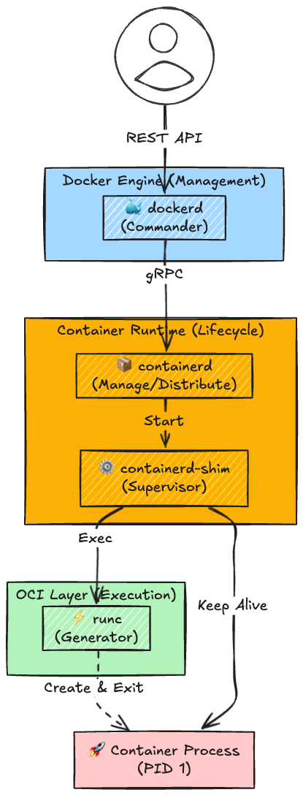
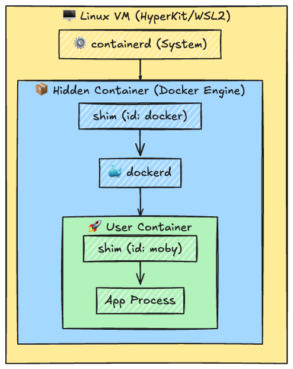
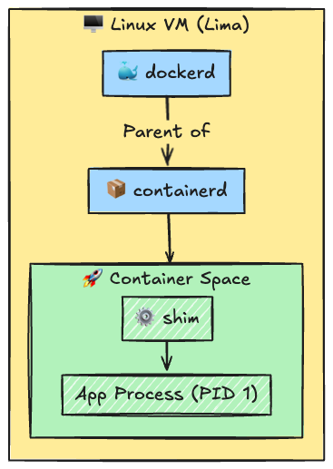
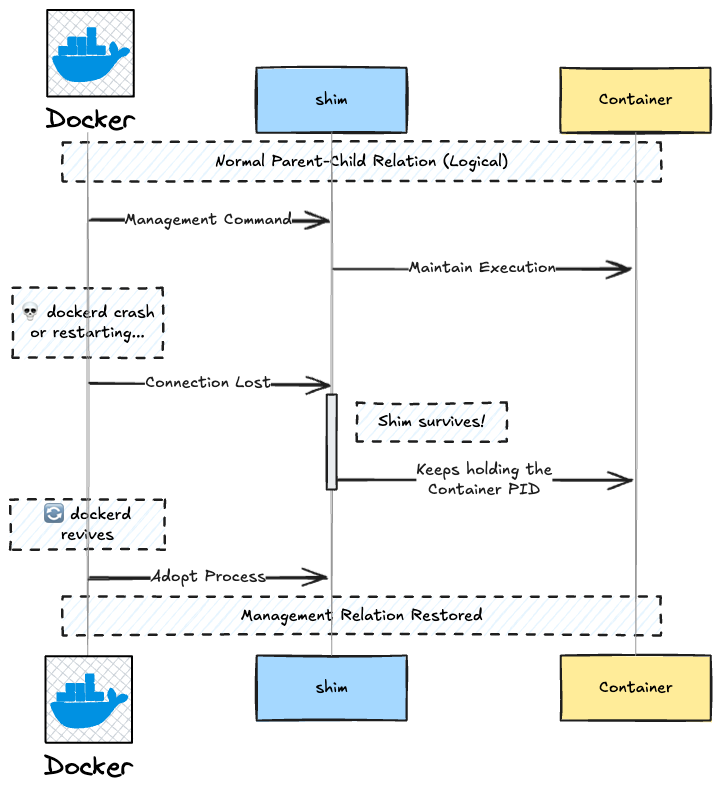
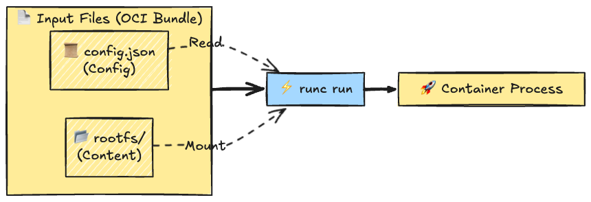
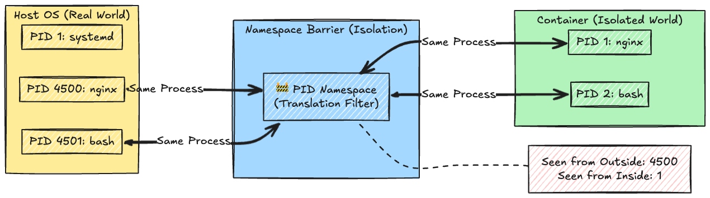
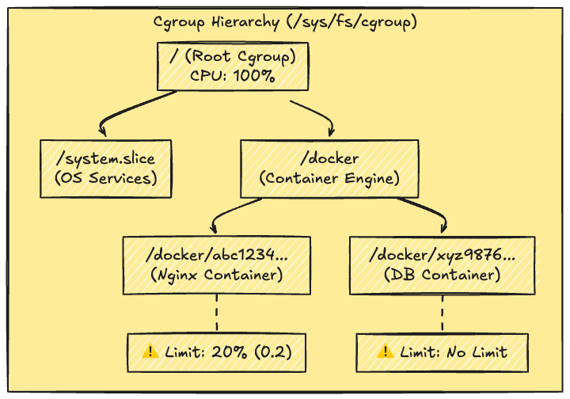
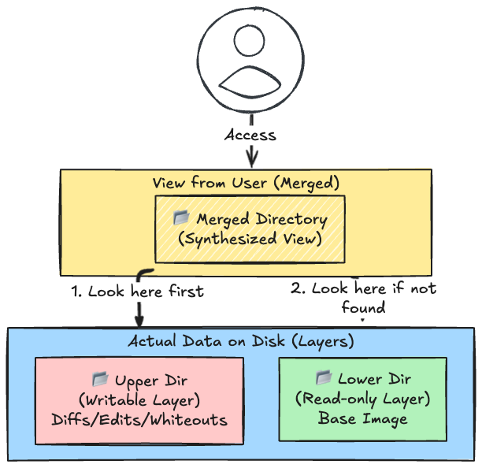
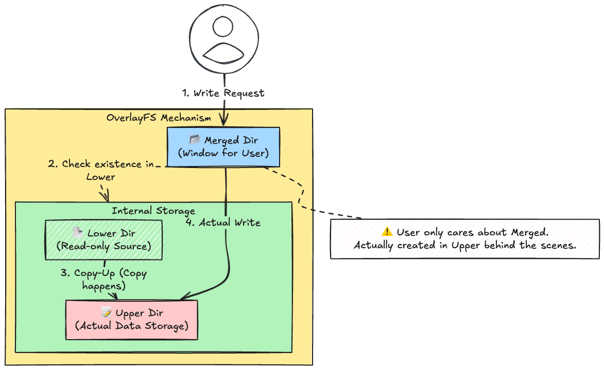

# Introduction

'I don't really get how Kubernetes or Docker work, but they sure are convenient.'

For a long time, I was comfortable with that mindset. They were just magical black boxes that solved problems. But I’ve decided to put an end to that era today.

Relying on abstraction without understanding the implementation is no longer an option for me. It's time to tear down the black box, stop relying on the 'magic,' and see what is truly happening inside the Linux kernel.

## 1. Grasping the Big Picture (Deconstructing Docker)

First, it is important to understand that modern Docker is not a monolithic application, but rather split into separate components based on their roles.

### Structure

Docker (Moby) is organized into the following hierarchical structure:

1. **Docker CLI / API:** User interface.
2. **dockerd:** Docker daemon. Accepts API requests and handles orchestration.
3. **containerd:** High-level container runtime. Manages images, container lifecycle (start/stop), storage, and networking.
4. **runc:** Low-level container runtime (OCI Runtime). Interacts directly with the Linux kernel to create container processes.

The logical call flow is as follows:



### Experiment

Now that we understand the logical structure, let's look at the actual processes. "Seeing is believing."
We will use a privileged container to peek into the process tree of the host side (VM side).

#### 1. Docker Desktop (Complex Configuration)

First, let's look at the processes in the Docker Desktop environment, which many people use.

```bash
$ docker run -it --rm --privileged --pid=host alpine ps aux | grep -E 'dockerd|containerd'
  782 root      0:01 /usr/bin/containerd # This manages the entire system of this VM
  ...
 1631 root      0:00 /usr/local/bin/dockerd --containerd /var/run/desktop-conta
 ...
```



To make it easier to manage as a product, Docker Desktop adopts a special configuration where **dockerd itself is managed as a container** (similar to Docker-in-Docker). This creates too much noise for learning the pure mechanics of Docker.

#### 2. Rancher Desktop (Standard Configuration)

For learning purposes, we will use **Rancher Desktop** (dockerd / moby mode), which is closer to a standard Linux configuration, to run the same experiment again.

```bash
$ docker run -it --rm --privileged --pid=host alpine sh -c "apk add --no-cache psmisc && pstree -T -p -a | grep -C 5 dockerd"
...
  |   `-dockerd,4373 --host=unix:///var/run/docker.sock ...
      # ^^^^
      # dockerd
  |       |-containerd,4392 --config /var/run/docker/containerd/containerd.toml
            # ^^^^^
            # containerd (Visible as a child process of dockerd)
...
  |-containerd-shim,4779 -namespace moby ...
  # ^^^^
  # containerd-shim (The direct parent of the container)
  |   `-sh,4804 -c apk add --no-cache psmisc ...
        # ^^^^
        # The actually running container process
```



This is much simpler and easier to understand. The following two important facts can be gathered from this:

1. **Relationship between dockerd and containerd**:
In this Rancher Desktop environment, `containerd` appears as a child process of `dockerd`.
(Depending on the environment or startup method (e.g., systemd), they might appear as parallel services, but logically, the relationship remains that `dockerd` sends commands to `containerd`.)
1. **Existence of the Shim**:
Looking at `pstree`, we can see that the parent of the container process (`sh` in the example above) is not `dockerd`, but **`containerd-shim`**.
This is the true identity of the "Live Restore" mechanism, which ensures containers don't crash even if dockerd is restarted. dockerd is merely the commander giving instructions; the one actually looking after the container is this `shim`.



## 2. Direct Operation of containerd

By manipulating `containerd` directly without going through Docker, we can experience how Docker acts as a "wrapper" for containerd.

### Tools to Learn

`containerd` has its own CLI tools.

1. **ctr:** A debugging CLI included with containerd. The feel is slightly different from Docker.
2. **nerdctl:** A tool developed to aim for Docker CLI compatibility (unofficial but the de facto standard for containerd).

### Experiment

#### Step 0: Enter the Virtual Machine (VM)

```bash
# 1. Start a privileged Alpine container to prepare for hijacking the VM shell
docker run -it --rm --privileged --pid=host alpine sh
# --- From here, we are inside the container ---
2. Install necessary tools
apk add --no-cache util-linux
# 3. Enter the namespace of the host's (VM's) PID 1 (init process)
nsenter -t 1 -m -u -n -i sh
# Verification (OK if hostname etc. are displayed)
hostname
```

#### Step 1: Check Current Status of containerd

Once inside the VM, you should be able to use the `ctr` command. First, let's check the "containerd world," distinct from Docker.

```bash
# Check version
ctr --version
# Check list of Namespaces
# They are separated, e.g., 'moby' for Docker, 'k8s.io' for Kubernetes
ctr namespaces list
# If not found, search for the socket
find / -name containerd.sock 2>/dev/null
# /run/docker/containerd/containerd.sock
ctr --address ctr --address /run/k3s/containerd/containerd.so namespaces list
ctr --address /run/docker/containerd/containerd.sock  namespaces list
# NAME LABELS
# moby
```

#### Step 2: Start a Container using ctr Command

Let's run a container using only containerd, without using Docker commands. This is essentially doing manually what Docker does behind the scenes.

```bash
# 1. Pull the image (Save location differs from docker pull)
# Specifying full path like library/alpine is safer
ctr --address /run/docker/containerd/containerd.sock images pull docker.io/library/alpine:latest
# 2. Check image list
ctr --address /run/docker/containerd/containerd.sock images list
# REF                             TYPE                                    DIGEST                                                                  SIZE    PLATFORMS                                                                                              LABELS
# docker.io/library/alpine:latest application/vnd.oci.image.index.v1+json sha256:865b95f46d98cf867a156fe4a135ad3fe50d2056aa3f25ed31662dff6da4eb62 4.0 MiB linux/386,linux/amd64,linux/arm/v6,linux/arm/v7,linux/arm64/v8,linux/ppc64le,linux/riscv64,linux/s390x -
# 3. Run the container
ctr --address /run/docker/containerd/containerd.sock run --rm -t docker.io/library/alpine:latest demo sh
id
# uid=0(root) gid=0(root) groups=0(root),1(bin),2(daemon),3(sys),4(adm),6(disk),10(wheel),11(floppy),20(dialout),26(tape),27(video)
exit
```

Point: Unlike `docker run`, you must specify the container ID (in the above case, `demo`) yourself. This shows how helpful Docker is.

#### Step 3: Peek at a Docker-created Container via ctr

Finally, let's confirm the relationship between Docker and containerd. We will verify that "Containers made with Docker are actually running on containerd."

```bash
# 1. On the Mac side (normal terminal), run a Docker container in the background.
docker run -d --name my-docker-nginx nginx:alpine
# 2. Enter the VM again using the procedure from Step 0 (run up to nsenter)
# 3. Inside the VM, look at the container list in the 'moby' namespace (Docker's management area).
# Specify namespace 'moby' to display list
ctr --address /run/docker/containerd/containerd.sock --namespace moby containers list
# CONTAINER                                                           IMAGE                              RUNTIME
# 0d02cdc559fe5a6288eb1003c0787e38d8fac2371fea5b1fdf3123c92dbd2d2b    docker.io/library/alpine:latest    io.containerd.runc.v2
# b3971fb24f69f25713cd72dfd1afb786ddeacf9cc0da9fe3f66662f5133bda67    docker.io/library/nginx:alpine     io.containerd.runc.v2
```

You should see the container ID corresponding to `my-docker-nginx` that you started earlier on the Mac side.
This allows you to experience that "Docker is the window for the user, while the entity managing it is containerd."

## 3. OCI (Open Container Initiative) and runc

containerd handles the "management" of containers, but it delegates the "creation" of containers to `runc`. Here we will understand the OCI standards.

### Concept: What is OCI?

Container technology used to be proprietary to Docker Inc., but the OCI (Open Container Initiative) was established for standardization. Two important specifications are defined here:

1. **Image Spec**: Specification for container images (file system).
2. **Runtime Spec**: Specification for how to run the container (configuration file `config.json`).

`runc` is the reference implementation compliant with this "Runtime Spec". Docker also uses this internally. In other words, even without Docker Engine, **if you have a "configuration file" and a "file system", you can start a container using runc**.



### Experiment

We will continue working inside the VM (`lima-rancher-desktop`, etc.).

### Step 1: Prepare Working Directory

First, create a clean space for the experiment.

```bash
# Create working directory
mkdir -p /tmp/runc-demo
cd /tmp/runc-demo
```

### Step 2: Prepare Root Filesystem (rootfs)

We will prepare the files (OS directory structure) that will become the contents of the container.
Creating it from scratch is hard, so we will export a Docker image and reuse it.

```bash
# 1. Only "create" a busybox container with Docker (do not start it)
docker create --name temp-busybox busybox
# 2. Export the container contents with tar and extract to rootfs directory
mkdir rootfs
docker export temp-busybox | tar -C rootfs -xvf -
# 3. Remove the used container
docker rm temp-busybox
# Verify: You should see directories that look like a normal Linux
ls rootfs/
# bin    dev    etc    home   lib    lib64  proc   root   sys    tmp    usr    var
```

Now we have the "Body of the container (File System)".

### Step 3: Generate OCI Runtime Spec (config.json)

Next, we create the "Soul of the container (Configuration File)".
It is important to generate this in **Rootless mode (restricted permission mode)**. Generating it normally might conflict with the Cgroup (resource limiting function) of the development environment (Linux on VM, etc.) and cause errors.

```bash
# Generate OCI spec template (Recommend --rootless to avoid trouble)
runc spec --rootless

# Default might make filesystem Read-Only, so modify to allow writing
sed -i 's/"readonly": true/"readonly": false/' config.json

# Verify
ls config.json
```

This `config.json` contains information such as "what command to run," "what to do with environment variables," "where the root directory is," etc.

### Step 4: Start Container with runc

Preparations are complete. Start the container using the runc command.
*Note: runc reads config.json and rootfs from the current directory by default.*

```bash
# Start container (Name ID 'my-runc-container')
runc run my-runc-container

# --- From here inside the container ---
# Prompt changes, you are now inside the container
hostname
# => runc

ls /
# => You should see the contents of rootfs prepared earlier

exit
# --- End container ---
```

Through this experiment, we understood that the actual entity of a container is **nothing more than a set of a "Configuration File (config.json)" and a "File System (rootfs)"**. High-level runtimes like Docker are just automatically generating these files on behalf of the user.

**Even if you encounter `Cgroup` related errors during this `runc` execution, don't worry about it. It just means "resource limit settings didn't match the environment."**

More importantly, **"What exactly is runc doing to the kernel?"** Next, let's touch the Linux kernel features directly.

## 4. Linux Kernel Features (The True Identity of Containers)

We have touched `runc` so far, but ultimately, a container runtime is just a **"wrapper that bundles Linux kernel features to be easier to use."**

Container technology is supported mainly by the following three kernel features. If you understand these, you can create a "manual container" without Docker.

1. **Namespaces:** Isolation (Making things invisible)
2. **Cgroups (Control Groups):** Limitation (Preventing overuse)
3. **Union Filesystems (OverlayFS):** Layering (Saving efficiently)

### 4-1. Namespaces (Isolation)

Namespaces are a feature that **"isolates and shows system resources"** to a process. It is like a "wall that blocks the view of the next room."
Typical Namespaces include:

* **PID Namespace:** Isolates process numbers (Becomes PID 1 inside the container).
* **UTS Namespace:** Isolates hostnames.
* **Mount Namespace:** Isolates mount points (how the file system looks).
* **Network Namespace:** Isolates network interfaces (IP addresses, etc.).

#### Experiment: Enter "Manual Container" with unshare

Using the `unshare` command, you can execute a program (shell) with specific Namespaces separated. This is the **smallest unit of a container**.

##### Step 1: Preparation (Enter VM)

(If you have exited the VM, enter the VM shell again using steps like `docker run --privileged ... nsenter ...`)

##### Step 2: Start Isolated Shell

The following command creates new "PID", "UTS (hostname)", and "Mount" Namespaces and starts `sh` inside them.

```bash
# --fork: Start as a new process
# --pid: Isolate PID space
# --mount-proc: Auto-mount /proc (to make ps command work)
# --uts: Isolate hostname space
unshare --fork --pid --mount-proc --uts sh

# --- From here, it is an isolated world ---
```

##### Step 3: Verify Isolation

```bash
# 1. Check Process ID
# Normally PID is in the thousands, but here it should be "1".
# The shell you are running now is the "God (PID 1)" of this world.
ps aux
# PID   USER     TIME  COMMAND
#    1 root      0:00 sh
#    2 root      0:00 ps aux

# 2. Hostname Change Experiment
# Try changing the hostname
hostname my-secret-container
hostname
# -> my-secret-container

# 3. Check impact on outside
# Open another terminal or exit temporarily to check,
# and you will see the outside world (VM) hostname has not changed.
exit
hostname
# lima-rancher-desktop
```



With this, we succeeded in "Isolating Process and Hostname" without using Docker.

### 4-2. Cgroups (Control Groups / Limitation)

If Namespaces are "Isolation," Cgroups are **"Limitation."**
It sets an upper limit on resources for a process group so that it doesn't use up 100% of the CPU or use infinite memory.

The entity of Cgroups is the file system under `/sys/fs/cgroup/`. By writing numerical values here, we instruct limits to the kernel.



#### Experiment: Peek at Docker-created Cgroup

Since configuring Cgroup manually depends heavily on the environment, here we will observe **"how Docker applies limits behind the scenes."**

##### Step 1: Start a Limited Container

Start a container in the background with CPU usage limited to **20% (0.2)**.

```bash
# Limit with --cpus 0.2
docker run -d --name limited-nginx --cpus 0.2 nginx:alpine
```

##### Step 2: Go find the Cgroup setting value

Look for the configuration file for this container located inside `/sys/fs/cgroup` on Linux.
(*Note: The path may differ slightly depending on the environment, but it can generally be found with the following steps*)

```bash
# Get full container ID
ID=$(docker inspect -f '{{.Id}}' limited-nginx)
echo $ID

# Find Cgroup config file and view contents
# (For Cgroup v2)
find /sys/fs/cgroup -name "cpu.max" | grep $ID
# Show contents of found file
cat "/sys/fs/cgroup/docker/$ID/cpu.max"
# 20000 100000
```

If the output is something like `20000 100000`, it is correct.
This is a command to the kernel saying "Out of 100,000 microseconds (total period), allow CPU usage of only 20,000 microseconds (20%)."

Docker's option `--cpus 0.2` is ultimately converted into this **writing to a text file**.

### 4-3. Union Filesystems (OverlayFS)

This is the true identity of "Docker Images."

Since copying a huge OS image every time is inefficient, a technology is used to **overlay a "writable layer" on top of a "read-only layer"**. This is called Union Filesystem, and **OverlayFS** is mainly used in Linux.

* **LowerDir:** The base read-only layer (Docker Image).
* **UpperDir:** The layer that saves changes (Writing during container execution).
* **Merged:** The synthesized directory visible to the user.

#### Experiment: Manually Mount OverlayFS

We will actually overlay directories and verify the behavior of **"Copy-on-Write"**.

##### Step 1: Create Experiment Directories

```bash
# Create working space for OverlayFS experiment
mkdir -p /tmp/overlay-demo
cd /tmp/overlay-demo

# Create 4 required directories
mkdir lower upper work merged
```

##### Step 2: Create "Base Image"

Create a file in the `lower` directory (intended to be read-only).

```bash
echo "I am Base Image" > lower/base.txt
```

##### Step 3: Mount with OverlayFS (Combine)

Use the `mount` command to overlay these.

```bash
# Combine lower (bottom) and upper (top) and mount to merged
mount -t overlay overlay -o lowerdir=lower,upperdir=upper,workdir=work merged
```



##### Step 4: Verify Behavior

1. **Is it synthesized?**

Looking at the `merged` directory, you can see the file that was in `lower`.

    ```bash
    ls merged/
    # base.txt
    ```

2. **What happens if we rewrite the file?**

    Rewrite the file inside `merged`.

    ```bash
    echo "Modified in Container" >> merged/base.txt
    cat merged/base.txt
    # I am Base Image
    # Modified in Container
    ```

3. **What is the reality? (Copy-on-Write)**

Check `lower` (which should be read-only) and `upper` (for saving diffs).

    ```bash
    # lower (base) is unchanged!
    cat lower/base.txt
    # I am Base Image

    # A copy of the modified file has been created in upper (diff layer)!
    cat upper/base.txt
    # I am Base Image
    # Modified in Container
    ```

In OverlayFS, "Diff" refers not to "Changed parts (lines or characters)" but to "The changed file itself (File unit)".



Even if you modify files inside the container, the original image (Lower) remains clean. Only the modified files are copied and saved to the Upper layer (Container layer). This is why Docker containers start fast and are disposable.

## Conclusion

We've successfully peeled back every layer of the Docker onion. What started as a monolithic 'magic box' turned out to be a clean chain of command: `dockerd` talks to `containerd`, which instructs `runc`, which finally speaks to the Linux Kernel to set up Namespaces and Cgroups.

Now that we know `containerd` and the `shim` are the real workhorses, the relationship between Kubernetes and Docker starts to make a lot more sense. It’s not just about 'running containers' anymore; it’s about standards and architecture.

This deep dive has only fueled my curiosity further. How exactly did the industry drift from Docker to Kubernetes? What is the messy history behind their breakup and the rise of OCI? I think that’s exactly what I need to investigate next."
