# Introduction

While ChatGPT and various AI coding assistants have become widespread as personal tools, AI is now being embedded into enterprise systems as an autonomous actor. Calling APIs on behalf of users, reading databases, writing to external systems — this is the AI agent.

The critical questions become: **"Who is this agent?"** and **"What is it allowed to do?"**

When human users access systems, they authenticate with passwords or SSO and receive tokens. But AI agents run continuously, span multiple services, and may invoke other agents. The traditional "human-centric" authentication and authorization model simply doesn't fit.

Yet in practice, organizations are independently developing their own solutions to this challenge. Many reinvent the wheel without awareness of existing standards, resulting in incompatible implementations and ballooning integration costs.

In March 2026, the IETF Internet-Draft **`draft-klrc-aiagent-auth-00`** was published to address this head-on. Co-authored by engineers from Defakto Security, AWS, Zscaler, and Ping Identity, this document doesn't propose new protocols — instead, it concretely demonstrates how to compose existing standards, serving two purposes:

1. **Consolidation of prior art**: Show how far existing protocols can cover agent authentication and authorization
2. **Gap identification**: Clarify where new standardization efforts are needed

This article walks through the draft top to bottom, organizing the complete picture of the AI agent authentication and authorization framework.

---

## Prerequisites

Here's a quick glossary of concepts referenced throughout this article.

| Term                     | Brief Explanation                                                                                                               |
| :----------------------- | :------------------------------------------------------------------------------------------------------------------------------ |
| **OAuth 2.0**            | A delegated authorization framework for applications to access resources on behalf of users. Issues and validates access tokens |
| **JWT (JSON Web Token)** | A token format for exchanging signed JSON claims (attribute information)                                                        |
| **mTLS (Mutual TLS)**    | Standard TLS only has the server present a certificate; mTLS has the client present one too, enabling mutual authentication     |
| **X.509 Certificate**    | A digital certificate binding a public key to owner information, signed by a Certificate Authority (CA)                         |
| **Workload**             | A unit of software running on a server — containers, microservices, batch jobs, etc.                                            |

---

## What Is an AI Agent? — Agents as Workloads

The draft starts with a simple definition:

> An Agent is a workload that iteratively interacts with a Large Language Model (LLM) and a set of Tools, Services and Resources.

An AI agent is "a workload that repeatedly operates on an LLM and a set of tools." Fundamentally no different from a batch job or microservice. Therefore, existing best practices for workload authentication and authorization can be applied directly — this is the draft's foundational position.

The concrete operational model looks like this:

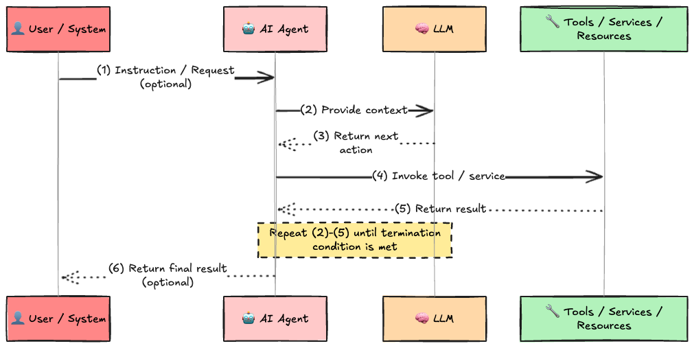

Within this loop, every time the agent accesses `Tools / Services / Resources`, it must prove "who it is" and obtain authorization for "what it may do." When acting under user delegation, it must also preserve the user's context. Tool endpoints may themselves be implemented by other AI agents, requiring agent-to-agent authentication as well.

---

## Agent Identity Management System (AIMS)

The draft calls the mechanism supporting agent authentication and authorization the **Agent Identity Management System (AIMS)**. This is not a specific product or protocol — it's a conceptual model representing "the set of required functions." It may be implemented by a single component or distributed across multiple systems such as identity providers, attestation services, authorization servers, and policy engines.

The AIMS structure consists of a central stack and two cross-cutting elements: Policy and Compliance.

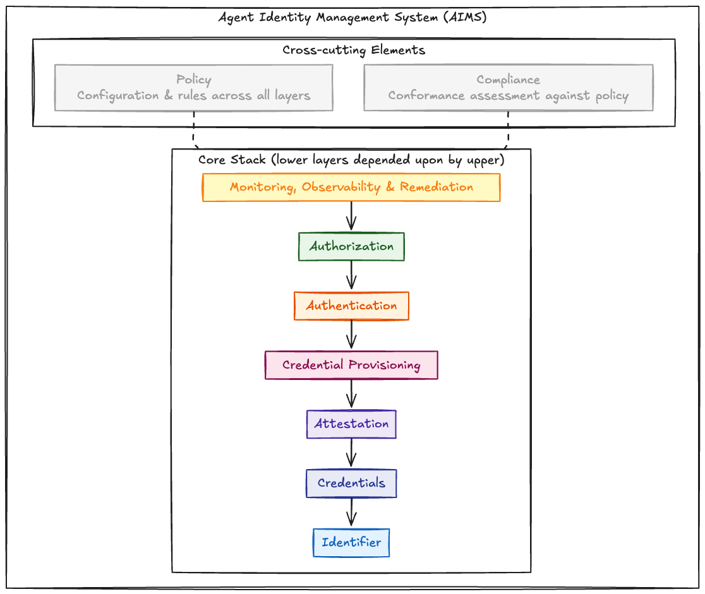

Upper layers depend on the guarantees provided by lower layers. Authentication cannot function without identifiers and credentials; authorization is meaningless without authentication. Policy defines the operating parameters for all layers, and Compliance evaluates adherence to those parameters.

Let's walk through each component in order.

---

## Identifier (Agent Identifier)

The foundation is "a unique ID for the agent."

The draft adopts the **WIMSE identifier** as the primary identifier. WIMSE is a specification being developed by an IETF working group for "Workload Identity in Multi-System Environments," and identifiers take URI form. This URI uniquely identifies a workload within a trust domain, and authorization decisions, delegation, and audit logs all pivot on this ID. It must remain stable for the lifetime of the workload identity.

The operationally mature implementation is **SPIFFE (Secure Production Identity Framework for Everyone)**. The SPIFFE identifier (SPIFFE ID) is an implementation of the WIMSE identifier model, taking the following URI form:

```
spiffe://trust-domain.example/path/to/agent
```

An agent MUST be assigned exactly one WIMSE identifier, which MAY be a SPIFFE ID.

---

## Credentials (Agent Credentials)

Having an identifier alone is meaningless unless you can cryptographically prove that the communicating agent actually controls it. That's the role of credentials.

Credentials MUST provide a **cryptographic binding** between the agent identifier and a private key. The credential formats recognized by the draft are:

| Format                            | Description                                                                              |
| :-------------------------------- | :--------------------------------------------------------------------------------------- |
| **X.509 Certificate**             | The standard certificate used in TLS. The base format for SPIFFE SVIDs                   |
| **Workload Identity Token (WIT)** | A JWT-based workload ID defined by the WIMSE specification. High affinity with HTTP APIs |
| **SPIFFE SVID**                   | SPIFFE's identity credential (three forms: X.509-SVID, JWT-SVID, WIT-SVID)               |

Key principles:

- **Credentials should be short-lived** — They MUST include an explicit expiration time, minimizing the risk window from credential theft. Short-lived credentials also serve as an alternative to explicit revocation mechanisms
- **Hardware protection recommended** — Protecting private keys with TPMs, secure enclaves, or platform security modules reduces key exfiltration risk (not required for interoperability)
- **Static API keys are an anti-pattern** — No cryptographic binding, no identity conveyance, typically long-lived, operationally difficult to rotate. Unsuitable for agent identity

When compatibility with existing environments is needed, **OAuth 2.0 Token Exchange (RFC 8693)** can be used to convert primary credentials into secondary credentials of a different format (credential exchange).

---

## Attestation (Agent Attestation)

Before issuing credentials, the agent must first prove "what it is" and "under what conditions it's operating." This is attestation. In human terms, it's analogous to presenting a driver's license or identity documents before opening a bank account.

Attestation evidence feeds into the credential issuance process, determining whether a credential is issued, what type, and what attributes it contains.

Available mechanisms include:

| Attestation Mechanism           | Example                                           |
| :------------------------------ | :------------------------------------------------ |
| Hardware-based                  | TEE (Trusted Execution Environment) evidence      |
| Software integrity verification | Binary hash validation                            |
| Platform / orchestration layer  | Kubernetes Projected Service Account Token (PSAT) |
| Supply-chain provenance         | Build pipeline origin information                 |
| Operator assertions             | Declarations by operations staff                  |

In higher-risk scenarios, multiple attestation mechanisms can be combined (multi-attestation). The choice depends on the deployment environment and acceptable risk level.

In SPIFFE, an attestation component collects workload execution context (where the workload is running, platform identity attributes, etc.), the issuer verifies it, then binds the workload to a SPIFFE identifier and issues an SVID.

---

## Credential Provisioning

Once attestation is complete, credentials are actually delivered to the agent. This is provisioning, consisting of two phases:

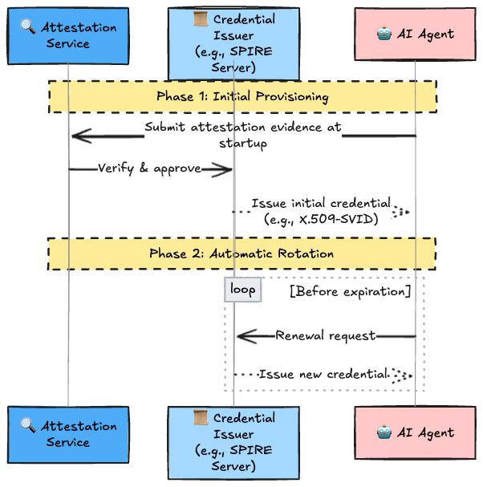

The key point is **automatic rotation**. When using short-lived credentials, automatic renewal before expiration is essential. SPIFFE achieves this transparently to the agent, also binding ephemeral key material with each credential, further reducing the risk of long-lived key compromise.

Unlike static secrets, agent credentials are dynamically provisioned and intentionally short-lived. This eliminates the operational burden of manual expiration management and limits the impact of credential compromise.

---

## Authentication (Agent Authentication)

Authentication is the process by which a credentialed agent proves "who it is" to a counterpart system. Following the WIMSE architecture, the draft specifies two levels: **transport layer** and **application layer**. Many deployments use a combination of both.

### Transport Layer Authentication: mTLS

The simplest method is **mTLS (Mutual TLS)**. In standard TLS, only the server presents a certificate; in mTLS, the client (agent) also presents one, and both sides verify each other.

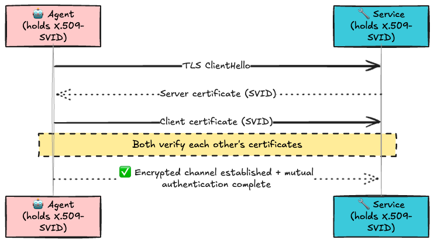

When paired with short-lived workload identities, mTLS provides strong channel binding and cryptographic proof of private key possession. It's widely used in service mesh architectures like Istio and Linkerd.

**Limitations:** In architectures with intermediaries such as proxies, API gateways, load balancers, or protocol translators, TLS sessions are terminated and re-established at those points. The end-to-end continuity of transport-layer identity is broken, making it difficult to bind application-layer actions to transport-layer credentials. Similar issues arise in serverless platforms and multi-tenant edge environments.

### Application Layer Authentication

When transport-layer authentication is unavailable or unreliable, authentication occurs at the application layer. Being transport-independent, end-to-end identity is preserved even through proxies and load balancers. WIMSE defines two mechanisms.

#### WIMSE Workload Proof Token (WPT)

WPT implements "Proof of Possession" — proving the agent holds the private key — in JWT form. Unlike bearer tokens (usable by anyone who holds them), WPTs are bound to a specific message context.

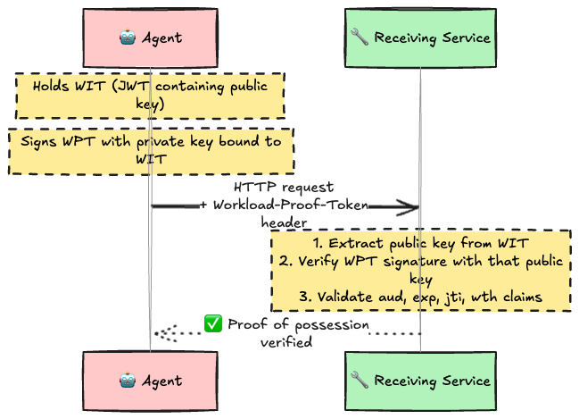

WPT is designed to be **protocol-agnostic**. Currently, an HTTP binding (`Workload-Proof-Token` header) is defined, but the core format is protocol-independent, making it applicable to asynchronous protocols like Kafka and gRPC.

#### HTTP Message Signatures

The other mechanism WIMSE defines is application-layer authentication based on RFC 9421 (HTTP Message Signatures). By signing HTTP request components including method, path, Content-Digest, and the WIT itself, it simultaneously provides **message integrity and sender proof**. Optional response signing is also supported.

### Application Layer Authentication Limitations

Unlike transport-layer authentication, application-layer authentication does not inherently provide channel binding to the underlying secure transport. Therefore, the **risk of message relay or replay** must be considered if tokens or signed messages are accepted outside their intended context. Mitigations include short token lifetimes, audience restrictions, nonce/unique identifier checks, and binding to specific request or transaction parameters.

---

## Authorization (Agent Authorization)

If authentication proves "who," authorization determines "what is allowed." The draft positions **OAuth 2.0** as the central framework for agent authorization.

### OAuth Role Assignment

In OAuth 2.0, the agent functions as an OAuth client, while LLMs and tools function as resource servers.

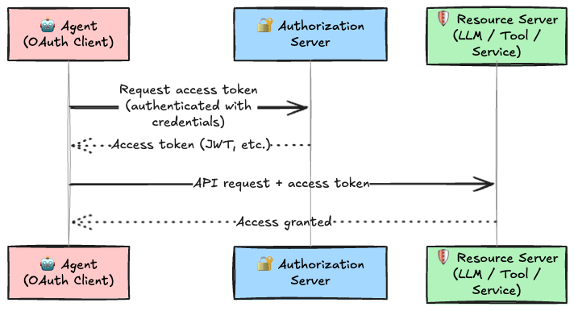

### Access Token Structure

Access tokens are often JWT-formatted (RFC 9068) and include the following claims:

| Claim       | Meaning                                           |
| :---------- | :------------------------------------------------ |
| `client_id` | The agent's own identifier                        |
| `sub`       | User/system identifier (when acting on behalf of) |
| `aud`       | Target resource identifier                        |
| `scope`     | Authorized access scope                           |

Resource servers use these claims in combination with policy-based (PBAC), attribute-based (ABAC), role-based (RBAC), or other authorization systems to enforce access control.

JWT access tokens can be validated directly by resource servers. For opaque tokens (formats opaque to the resource server), **OAuth 2.0 Token Introspection (RFC 7662)** is used to query the authorization server for token validity and attributes. From a privacy standpoint, opaque token + introspection is recommended when claim minimization is required.

### Three Authorization Scenarios

There are three patterns for how agents obtain tokens.

#### Scenario 1: User Delegates Authorization

Uses the **Authorization Code Grant** (OAuth 2.0 Section 4.1). The user authenticates to the authorization server via browser and explicitly approves access permissions for the agent. The resulting access token represents "delegation from user to agent."

#### Scenario 2: Agent Obtains Its Own Authorization

The agent obtains a token on its own behalf without user involvement. Uses **Client Credentials Grant** (OAuth 2.0 Section 4.4) or **JWT Authorization Grant** (RFC 7523). With Client Credentials Grant, the authentication mechanisms described in the Authentication section are used — not static, long-lived client secrets.

#### Scenario 3: Agent Accessed by Other Agents/Systems

The agent itself acts as an OAuth resource server. The caller (a batch job or another agent) obtains an access token from the authorization server and presents it to the agent.

## OAuth 2.0 Security Best Practices

RFC 9700 (OAuth 2.0 Security Best Current Practice) applies to access token requests and usage.

---

## Transaction Tokens: Safe Propagation Within Microservices

When agents or tools are implemented as collections of microservices, passing the received access token along internal component chains is dangerous. Access tokens typically have broad scope usable across multiple transactions, so if leaked from logs or crash dumps, an attacker could invoke different transactions or modify parameters to execute unauthorized requests.

The draft recommends **Transaction Tokens** (`draft-ietf-oauth-transaction-tokens`) for this purpose.

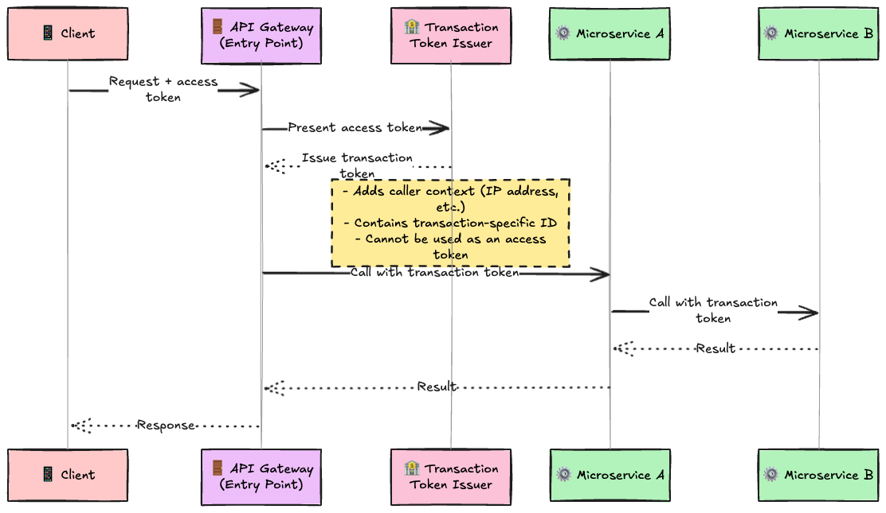

A transaction token is a **downscoped token bound to a specific transaction**. It cannot be used with a different transaction or modified parameters. It's also short-lived. Additionally, a transaction token can be used with OAuth 2.0 Token Exchange (RFC 8693) to obtain an access token for another service.

---

## Tool-to-Service Access

Tools provide interfaces to underlying services and resources. Authorization considerations apply here as well.

- Access to tools can be controlled by OAuth and augmented by policy-based, attribute-based, role-based, or other authorization systems
- When tools are composed of microservices, transaction tokens reduce risk as described above
- Tool-to-service/resource access can similarly be controlled through OAuth, using Token Exchange to convert to appropriate access tokens
- When a tool needs to access a resource protected by a different authorization server, Identity Chaining (described below) can be used

> **Anti-pattern:** Tools MUST NOT forward access tokens received from agents directly to services or resources. This increases the risk of credential theft and lateral attacks.

---

## Cross-Domain Access: Spanning Multiple Authorization Servers

Real-world agents frequently access services managed by different organizations and clouds, each protected by separate authorization servers.

The primary mechanism the draft recommends is **OAuth Identity and Authorization Chaining Across Domains** (`draft-ietf-oauth-identity-chaining`).

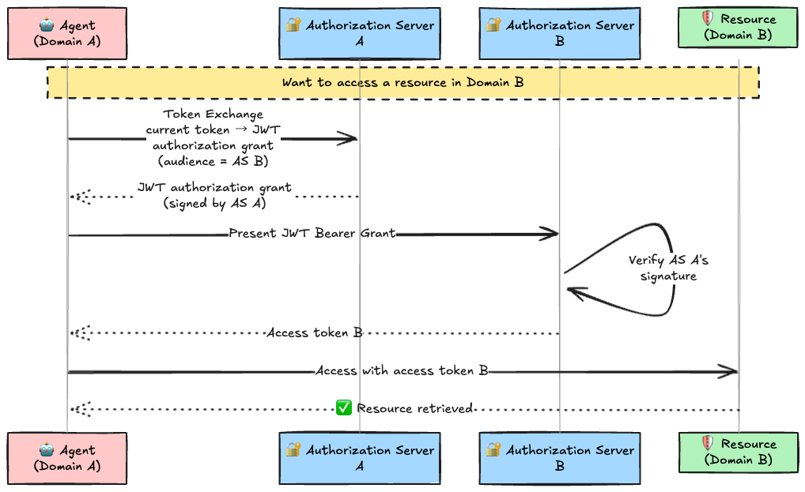

An alternative is the **Identity Assertion JWT Authorization Grant** (`draft-ietf-oauth-identity-assertion-authz-grant`). This is optimized for cases where OpenID Connect ID tokens or SAML assertions are available — if all authorization servers trust the identity provider, access tokens can be obtained without user re-authentication. It's particularly effective for simplifying authorization delegation across multiple SaaS offerings in enterprise environments.

---

## Human in the Loop: When User Confirmation Is Required

When an agent requests elevated privileges, the authorization server may determine that explicit user confirmation is needed. The authorization server either declines the request or obtains additional authorization from the user. The mechanism for this is **OpenID Connect CIBA (Client-Initiated Backchannel Authentication)**.

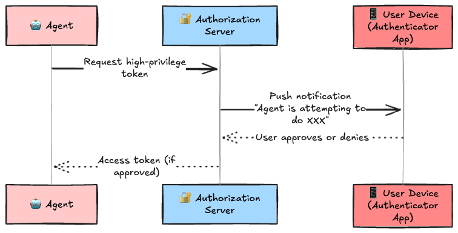

CIBA performs an out-of-band interaction, obtaining user approval without exposing credentials to the agent.

Two important principles:

1. **Local UI confirmation ≠ authorization**: Patterns like the Model Context Protocol (MCP), where agents request user confirmation during task execution, exist. However, pressing "OK" in the agent's UI alone does not constitute authorization. It **MUST be bound to a verifiable authorization grant issued by the authorization server**
2. **Open challenge**: CIBA itself is designed for client-initiation flows and doesn't map well to cases requiring user confirmation mid-execution. Additional specification work may be needed

---

## Privacy Considerations

Authorization tokens may contain user identifiers, agent identifiers, audience restrictions, transaction details, and contextual attributes. The draft requires the following for privacy protection:

- **Minimize** disclosure of personally identifiable information (PII) and sensitive information in tokens (SHOULD)
- Prefer audience-restricted and short-lived tokens
- Use **opaque tokens + introspection** when claim minimization is required (SHOULD)
- Agents SHOULD request only the **minimum scopes necessary** to complete a task
- Resource servers SHOULD log **token identifiers or hashes** rather than full tokens
- When propagating authorization context across services, use **downscoped tokens such as transaction tokens** to reduce correlation and replay risk (SHOULD)
- User identity information delegated to agents **MUST NOT be exposed to unrelated services**

---

## OAuth 2.0 Discovery: Adapting to Dynamic Environments

In dynamic agent deployments — ephemeral workloads, multi-tenant services, frequently changing endpoint topologies — OAuth discovery mechanisms are more effective than static configuration.

| Discovery Type                     | Specification                                                                                                                         | Purpose                                                                                                                                                            |
| :--------------------------------- | :------------------------------------------------------------------------------------------------------------------------------------ | :----------------------------------------------------------------------------------------------------------------------------------------------------------------- |
| **Authorization Server Discovery** | OAuth 2.0 Authorization Server Metadata (RFC 8414) / OpenID Connect Discovery                                                         | Agents dynamically retrieve authorization server endpoints, supported grant types, client authentication methods, signing keys (jwks_uri), etc.                    |
| **Resource Server Discovery**      | OAuth 2.0 Protected Resource Metadata (RFC 9728)                                                                                      | Agents (and tools) dynamically discover resource identifiers and the authorization servers protecting them. Works with dynamically deployed or relocated resources |
| **Client Discovery**               | OAuth Client ID Metadata Document (`draft-ietf-oauth-client-id-metadata-document`) / OAuth 2.0 Dynamic Client Registration (RFC 7591) | Authorization servers and policy systems retrieve client metadata (redirect URIs, display info, etc.) for agents/tools/systems without prior registration          |

---

## Monitoring, Observability, and Remediation

Agents operate autonomously. Therefore, continuous recording and monitoring of their activities is essential. The draft positions this as **a security control, not merely an operational feature**.

### Required Audit Log Items

| Item                                        | Description                                     |
| :------------------------------------------ | :---------------------------------------------- |
| Authenticated agent identifier              | Which agent acted                               |
| Delegated subject (user/system)             | On whose behalf it acted                        |
| Resource or tool accessed                   | What was accessed                               |
| Action requested and authorization decision | What was attempted and whether it was permitted |
| Timestamp and request correlation ID        | When, in which transaction                      |
| Attestation or risk state                   | At what trust level it operated                 |
| Remediation or revocation events and cause  | What changed and what happened as a result      |

Audit records MUST be **tamper-evident** and retained according to the deployment's security policy.

Monitoring systems should correlate events across agents, tools, services, resources, and LLMs to detect misuse patterns such as replay, confused deputy attacks, privilege escalation, or unexpected action sequences. Implementations should enable operators to reconstruct the complete execution chain of an agent task, including delegated authority, intermediate calls, and resulting actions across service boundaries.

### Real-Time Signal Response

**OpenID Shared Signals Framework (SSF)** enables real-time reception of **CAEP (Continuous Access Evaluation Profile)** and **RISC (Risk Incident Sharing and Coordination)** events.

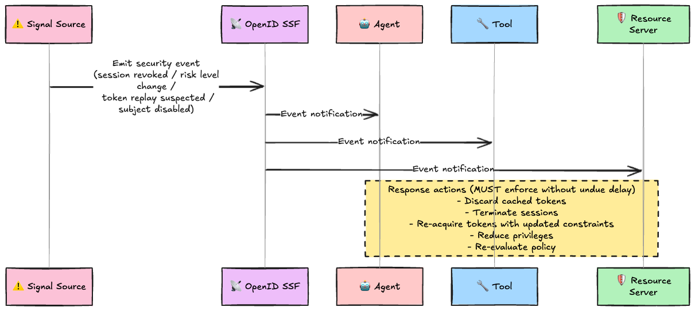

Revoked or downgraded authorization MUST be enforced without undue delay. Invalidated tokens and cached authorization decisions MUST NOT continue to be used after a revocation or risk notification is received.

---

## Policy and Compliance

### Policy

The configuration and runtime parameters across all layers — identifiers, credentials, attestation, provisioning, authentication, authorization, and monitoring — collectively constitute the authentication and authorization policy.

The draft does not standardize the policy model or document format, as these are highly dependent on deployment, risk model, governance, regulation, and operational constraints. Implementations may use any suitable policy-as-code format (e.g., JSON/YAML), provided it is versioned, reviewable, and supports consistent evaluation across the end-to-end flow.

### Compliance

Compliance for agent-based systems should be assessed by auditing observed behavior and recorded evidence (logs, signals, authorization decisions) against policy. Since compliance criteria vary by deployment, organization, industry, and jurisdiction, they are out of scope for this framework, though strong observability and accountable governance are recommended.

---

## Framework Overview

Combining all the layers discussed, the complete AI agent authentication and authorization framework looks like this:

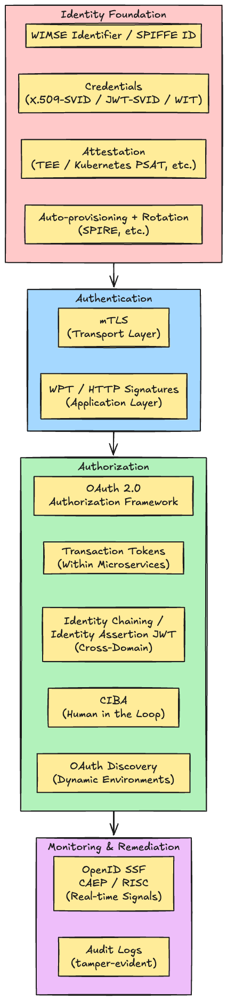

---

## Conclusion

The message of `draft-klrc-aiagent-auth-00` is consistent throughout:

**"No new authentication protocol is needed specifically for AI agents. Properly composing existing standards is sufficient."**

Here's a summary of the standards used and their roles:

| Standard                                  | Role                                                    |
| :---------------------------------------- | :------------------------------------------------------ |
| **WIMSE / SPIFFE**                        | Defines agent identifier and credential formats         |
| **X.509 / JWT (WIT/SVID)**                | Cryptographically verifiable credential artifacts       |
| **mTLS**                                  | Transport-layer mutual authentication                   |
| **WIMSE WPT / HTTP Signatures**           | Application-layer proof of possession                   |
| **OAuth 2.0 (RFC 6749)**                  | Delegated authorization framework                       |
| **OAuth JWT Profile (RFC 9068)**          | Standard format for JWT access tokens                   |
| **OAuth Token Introspection (RFC 7662)**  | Validation of opaque tokens                             |
| **OAuth Token Exchange (RFC 8693)**       | Credential conversion and token exchange                |
| **OAuth Security BCP (RFC 9700)**         | Security best practices                                 |
| **Transaction Tokens**                    | Safe token propagation within microservices             |
| **Identity Chaining**                     | Authorization chains across multiple domains            |
| **Identity Assertion JWT Grant**          | Cross-domain authorization based on identity assertions |
| **OpenID CIBA**                           | Human-in-the-loop authorization flow                    |
| **OpenID SSF / CAEP / RISC**              | Real-time security signal sharing                       |
| **OAuth Server/Resource/Client Metadata** | Discovery in dynamic environments                       |

As AI agents become deeply embedded in enterprise core systems, the importance of explicitly controlling "who the agent is and what it may do" is only growing. This draft is both a starting point and a foundation — not only consolidating existing standards but also identifying gaps where future standardization is needed.

---

## References

- [draft-klrc-aiagent-auth-00](https://datatracker.ietf.org/doc/draft-klrc-aiagent-auth/)
- [WIMSE Architecture (draft-ietf-wimse-arch-07)](https://datatracker.ietf.org/doc/html/draft-ietf-wimse-arch-07)
- [WIMSE Workload Credentials (draft-ietf-wimse-workload-creds-00)](https://datatracker.ietf.org/doc/html/draft-ietf-wimse-workload-creds-00)
- [WIMSE Workload Proof Token (draft-ietf-wimse-wpt-00)](https://datatracker.ietf.org/doc/html/draft-ietf-wimse-wpt-00)
- [WIMSE HTTP Signatures (draft-ietf-wimse-http-signature-02)](https://datatracker.ietf.org/doc/html/draft-ietf-wimse-http-signature-02)
- [SPIFFE](https://spiffe.io/)
- [RFC 6749: OAuth 2.0 Authorization Framework](https://www.rfc-editor.org/rfc/rfc6749)
- [RFC 7523: JWT Profile for OAuth 2.0 Client Authentication and Authorization Grants](https://www.rfc-editor.org/rfc/rfc7523)
- [RFC 7591: OAuth 2.0 Dynamic Client Registration](https://www.rfc-editor.org/rfc/rfc7591)
- [RFC 7662: OAuth 2.0 Token Introspection](https://www.rfc-editor.org/rfc/rfc7662)
- [RFC 8414: OAuth 2.0 Authorization Server Metadata](https://www.rfc-editor.org/rfc/rfc8414)
- [RFC 8693: OAuth 2.0 Token Exchange](https://www.rfc-editor.org/rfc/rfc8693)
- [RFC 9068: JWT Profile for OAuth 2.0 Access Tokens](https://www.rfc-editor.org/rfc/rfc9068)
- [RFC 9421: HTTP Message Signatures](https://www.rfc-editor.org/rfc/rfc9421)
- [RFC 9700: OAuth 2.0 Security Best Current Practice](https://www.rfc-editor.org/rfc/rfc9700)
- [RFC 9728: OAuth 2.0 Protected Resource Metadata](https://www.rfc-editor.org/rfc/rfc9728)
- [draft-ietf-oauth-identity-chaining-08](https://datatracker.ietf.org/doc/html/draft-ietf-oauth-identity-chaining-08)
- [draft-ietf-oauth-identity-assertion-authz-grant-01](https://datatracker.ietf.org/doc/html/draft-ietf-oauth-identity-assertion-authz-grant-01)
- [draft-ietf-oauth-transaction-tokens-07](https://datatracker.ietf.org/doc/html/draft-ietf-oauth-transaction-tokens-07)
- [draft-ietf-oauth-client-id-metadata-document-01](https://datatracker.ietf.org/doc/html/draft-ietf-oauth-client-id-metadata-document-01)
- [OpenID CIBA](https://openid.net/specs/openid-client-initiated-backchannel-authentication-core-1_0.html)
- [OpenID SSF](https://openid.net/specs/openid-sharedsignals-framework-1_0-final.html)
- [OpenID CAEP](https://openid.net/specs/openid-caep-1_0-final.html)
- [OpenID RISC](https://openid.net/specs/openid-risc-1_0-final.html)
- [Model Context Protocol (MCP)](https://modelcontextprotocol.io/specification)
