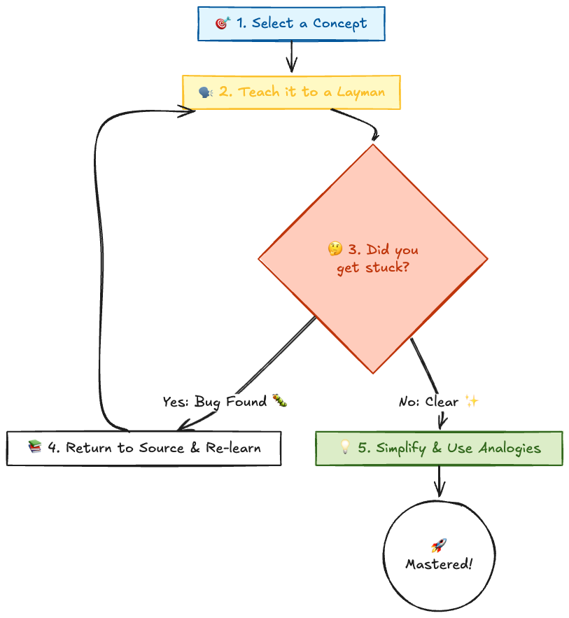

# Introduction

"I fixed this error by pasting it into ChatGPT."
"Copilot wrote this code, so it should work."

In 2026, we live in an era where it is easier than ever in human history to "pretend to be smart."
However, this is merely **"renting knowledge."** Borrowed knowledge cannot be applied, is useless during complex troubleshooting, and above all, **it isn't fun.**

> **"The first principle is that you must not fool yourself — and you are the easiest person to fool."**
> — *Richard Feynman*

This quote from Nobel laureate physicist Richard Feynman serves as a warning for the Generative AI era.
In this article, I will redefine the Feynman Technique as a "survival strategy for the AI era" and explain the thought process to thoroughly destroy the **"Illusion of Competence."**

---

## 1. The Algorithm: 4 Steps of the Feynman Technique

This isn't just a study method; it is a **debugging technique for finding "bugs in your understanding."**



1. **Select:** Choose the concept you want to learn (e.g., "Rust Lifetimes").
2. **Teach:** Explain it in your own words, without using jargon.
3. **Identify Gaps:** The moment you think, "Wait, how does this connect again?"—that is the limit of your understanding (the bug).
4. **Simplify:** Fix the bug, then polish your explanation with even simpler metaphors and analogies.

---

## 2. Why It Works (Cognitive Science Approach)

"Just reading" and "explaining" utilize the brain in fundamentally different ways.

|         Mode         |                     Brain Activity                      |           Result           |
| :------------------: | :-----------------------------------------------------: | :------------------------: |
|   **Reading**    |        Passive input. Info flows right to left.         |     **Low Retention**      |
| **Explaining** | **Search, Retrieve, Construct.** (Desirable Difficulty) | **Strong Neural Circuits** |

### Active Recall

When reading a textbook or documentation, your brain is "Passive."
However, when you try to explain something, your brain performs the heavy lifting of **"searching, retrieving, and constructing"** information from your memory warehouse. This load is what strengthens neural circuits.

### Elaborative Interrogation

By asking yourself "Why is this the case?", you connect fragmented knowledge into a network.
When asked "What is friction?", Feynman didn't just give a definition. He dove into the root of the phenomenon: *"Rough surfaces bumping into each other... atoms jiggling... converting into heat."*
He didn't settle for **"Labels"**; he chased the **"Mechanism."**

---

## 3. The 2026 Version: AI is Your "First Reader"

In the writing process, AI becomes the ultimate **"Reviewer."**
Instead of asking AI to write for you, have it read your draft and point out holes in your logic.

### Use Case: Stress Testing Your Outline

Let's say you're planning an article explaining "Docker Layer Architecture."
Before you start writing, throw this at your AI:

```markdown
🤖 Prompt:
"I am planning to write an article explaining Docker's layer structure
using the analogy of 'stacking transparent animation cels.'

Are there any technical edge cases that this analogy fails to explain,
or points where readers might misunderstand?
Please critique this ruthlessly."
```

The AI might point out aspects your analogy misses, such as "file deletion (whiteout files)" or the "cost of Copy-on-Write (CoW)."
This accelerates the **"Discovery of Gaps"** and raises the quality of your article by a tier.

---

## 4. Hands-On: Writing about "Eventual Consistency"

Let's try writing an explanation of "Eventual Consistency" as if we were posting it to dev.to.
The target audience is a "Junior Engineer new to Databases." Can you explain it without using jargon like the CAP theorem?

### ❌ Bad Example (Wiki Copy-Paste)

> "Eventual consistency is a consistency model used in distributed computing to achieve high availability that informally guarantees that, if no new updates are made to a given data item, eventually all accesses to that item will return the last updated value."

👉️ *Result: The reader thinks "Huh? (I don't get it)" and closes the tab.*

### ✅ Good Example (Feynman Style)

> "Imagine the **'Like' button** on a social media app.
> If Person A in Tokyo presses 'Like', it doesn't immediately show up on Person B's phone in Brazil, right?
> This is because it takes time for data to travel across the vast ocean of the Internet.
> However, if you wait a few seconds (or however long the system needs), it will definitely appear.
> **'It might be different right now, but in the end, everyone sees the same result.'** This is Eventual Consistency."

If you can break it down this far, the reader will think "Aha!", and you will gain the confidence that you have "fully understood" the concept.

---

## 5. Warning: Do Not Contribute to "Digital Pollution"

Finally, there is one crucial rule.
While it's great to have AI review your work...

> **🛑 PLEASE DO NOT copy and paste the text generated by AI directly into your article.**

Those are not your words, and they are not proof of your understanding.
If the internet becomes flooded with "plausible articles written by AI," search noise will increase, creating a disadvantage for all engineers.

Publish only the **"words you squeezed out of your own head after struggling and being grilled by AI."**
That "scar of struggle" is the originality that resonates with readers.

---

## Conclusion

It is easy to ask AI a question and get an answer. But that keeps you trapped in the "Illusion of Competence."

The most powerful learning method is **"Writing a technical article on dev.to."**
The constraint of "writing so that it can be understood from top to bottom" places a strong load on your brain. Logical leaps and ambiguous understanding are exposed the moment you try to turn them into sentences.

* Asking AI = **Renting Knowledge**
* Writing an Article = **Owning Knowledge**

Can you write an article about the technology you learned today without relying on AI?
If your pen stops, that is the signal that "real learning" is about to begin.

### References

* [Feynman's Learning Technique](https://fs.blog/feynman-technique/)
* [Make It Stick: The Science of Successful Learning](https://www.amazon.com/Make-It-Stick-Successful-Learning/dp/0674729013)
