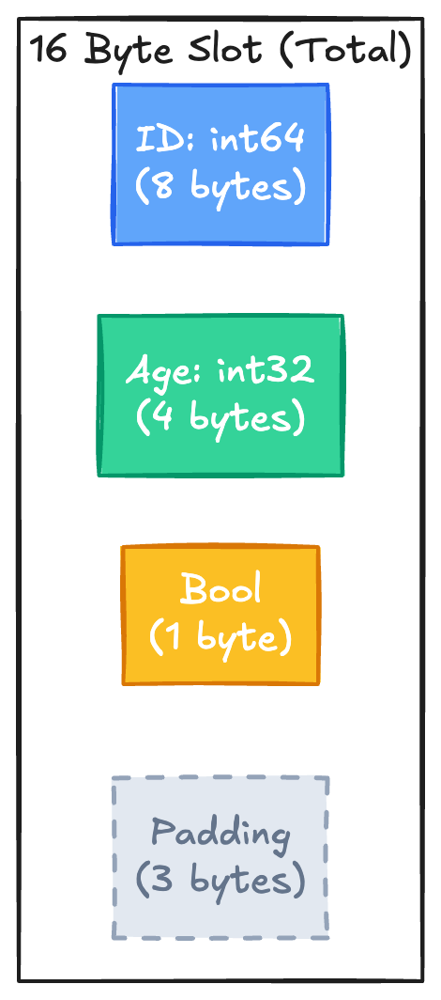
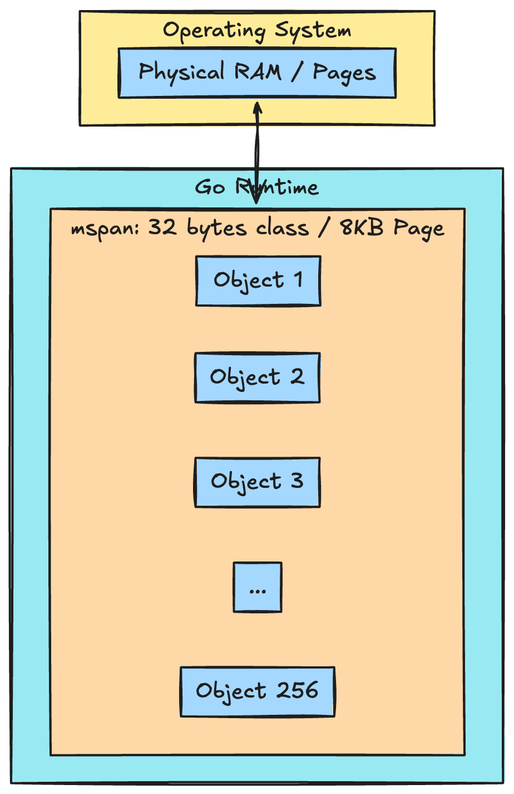
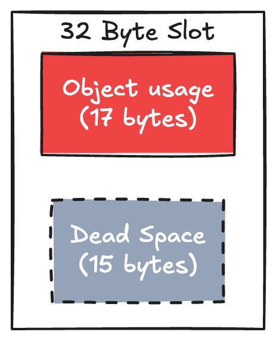
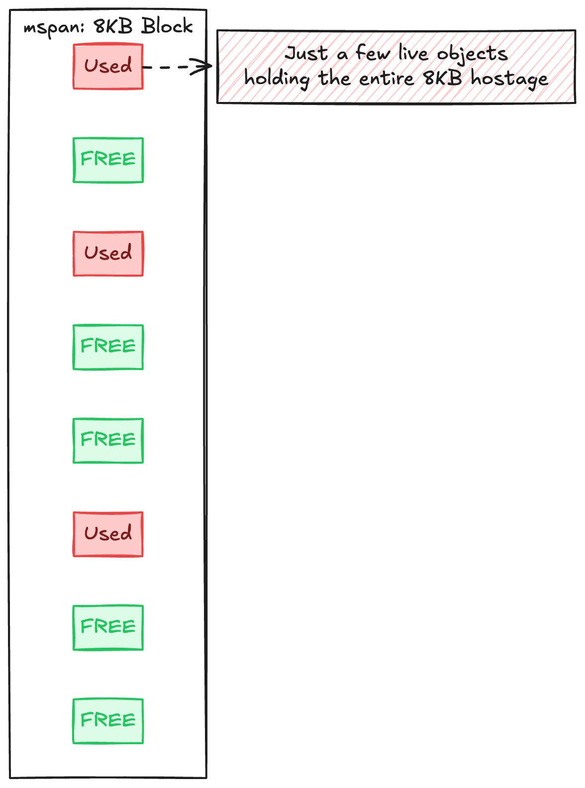
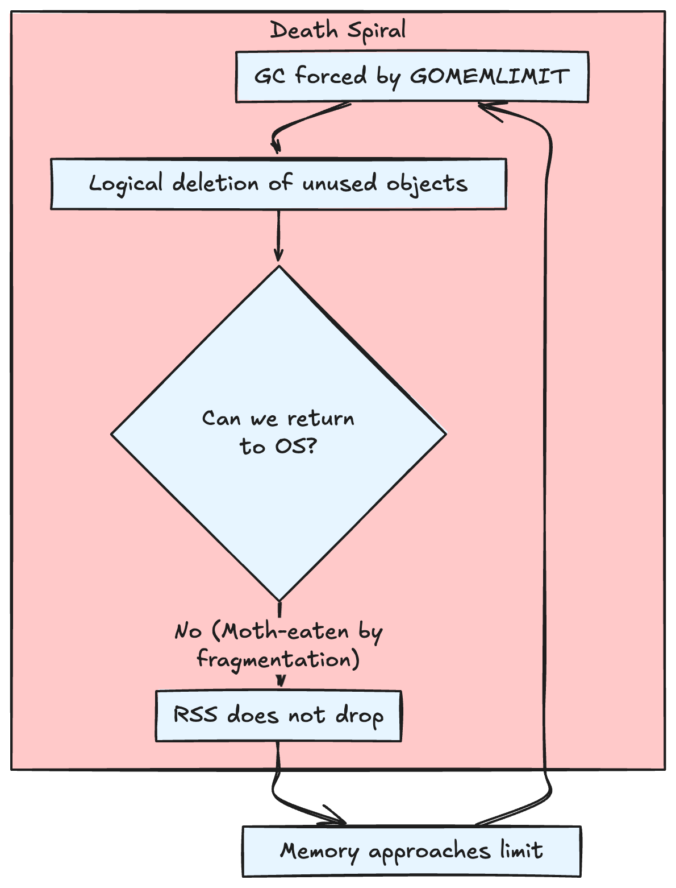
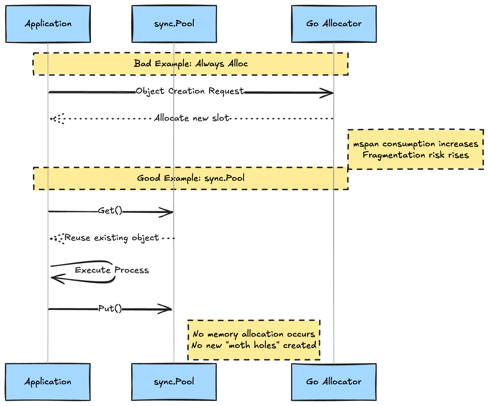
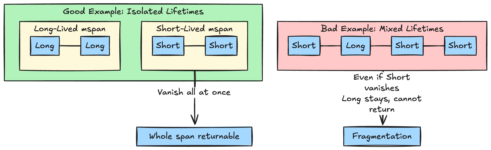

# Introduction

It is 2026. Several years have passed since `GOMEMLIMIT` was introduced in Go 1.19, and we have acquired the technique of "running the GC according to container limits." However, even if this setting becomes fully automated in the future, there remains a "true final boss" that cannot be defeated by configuration alone.

That boss is **Heap Fragmentation**.

No matter how strictly you set limits, or how aggressively you run the GC, memory that **"physically cannot be returned to the OS"** continues to squat inside the heap. This is the horror of fragmentation.

* "I set `GOMEMLIMIT`, but RSS (actual memory) broke through the limit and got OOM-Killed."
* "There are few live objects, yet memory usage remains high while the heap is practically empty."

This article dissects the mechanism of "fragmentation" that nullifies the runtime's desperate efforts, and explores strategies to defend against it.

---

## 1. Understanding Go's Allocator: mspans and Objects

The shortest route to understanding Go's allocator is to grasp the relationship between memory as an **"Apartment (mspan)"**, **"Rooms (Slots)"**, and the **"Residents (Objects)"** living there.

### The True Nature of "Objects" in Go

Specifically, the "objects" that occupy heap memory in Go are data chunks such as:

* **Structs**: Data entities with aligned fields.
* **Slices / Maps**: Buckets or arrays storing elements.
* **Interfaces / Channels / Closures**: Control structures managed by the runtime.

These exist as byte sequences that fit into "one room (slot)" within an "apartment" prepared for each size class.

### Appearance in Memory: Alignment and Padding

Objects are placed at "well-rounded positions" so the CPU can access them efficiently (memory alignment). This creates unintentional empty space (padding).



For example, the `User` struct above has a total data size of 13 bytes, but to align with an 8-byte multiple (word boundary), 3 bytes of padding are added to the end, treating it as a **16-byte object**.

### mspan as a Management Unit

* **Slot**: The "room" where the object is actually stored (e.g., 16 bytes, 32 bytes).
* **mspan**: An "apartment" bundling hundreds of slots of the same size (usually 8KB+). This is also the **unit of return to the OS**.



---

## 2. Internal Fragmentation

The first problem is **Internal Fragmentation**. This refers to the "wasted whitespace" born inside an allocated "room (slot)."

For example, if you try to allocate a 17-byte object, it won't fit in a "16-byte room," so Go assigns it to the next available "32-byte room." At this point, the difference of 15 bytes becomes **dead space used by no one**.



When this happens with millions or tens of millions of objects, it births "ghost memory" on the scale of gigabytes.

---

## 3. External Fragmentation: The Hostage Apartment

More serious is **External Fragmentation**. This is a phenomenon where empty slots (rooms) are scattered throughout an `mspan` (apartment), making it impossible to return the entire apartment to the OS.

### Why can't we return it if even one object is alive?

The minimum unit by which the OS (like Linux) reclaims memory is usually a **4KB "Page"**. Go's `mspan` is constructed by bundling multiple such pages.

Go's Scavenger attempts to find and return "completely empty pages" within an `mspan`, but if fragmentation is severe, that effort is in vain. In other words, **"as long as residents (live objects) are scattered throughout the apartment (mspan), we cannot surrender the land to the OS."**



---

## 4. GOMEMLIMIT: It Tries, But It's Not a Silver Bullet

It is necessary to understand how `GOMEMLIMIT` behaves in a fragmented environment. This is an environment variable introduced in Go 1.19 that sets a "soft limit (target)" for memory usage.

### The Limit is Just a "Signal to Clean"

When memory usage approaches the limit, `GOMEMLIMIT` orders the runtime: "Hey, clean up (GC) more!" However, this has two major limitations.

1. **It cannot save you from leaks**: "Live objects" with remaining references cannot be deleted by the GC.
2. **It is powerless against fragmentation**: Even if the GC runs and Mark & Sweeps objects, if **physically sparse `mspans` remain**, the usage on the OS side (RSS) will not drop.

### The Conclusion: "Agonizing Death" While Trying to Obey Limits

If you set `GOMEMLIMIT` strictly in a state of severe fragmentation or insufficient capacity planning, you fall into the worst-case scenario (GC Thrashing).



The runtime fires GC repeatedly trying to return "unreturnable memory," **devouring CPU while memory remains unchanged.** Automatic detection can prevent this "immediate death by misconfiguration," but it is not magic that cures "structural defects (fragmentation)."

---

## 5. Diagnosis: Exposing Fragmentation with Numbers

Here is a diagnostic flow to turn the vague anxiety of "memory is high" into conviction. Check the following three metrics from `runtime.MemStats` or the `pprof` heap profile exposed by the Go runtime.

### 1. Heap Utilization

The most straightforward metric is the **divergence between "actually used memory" and "allocated memory."**

* **`HeapAlloc`**: The total amount of living objects (logical value).
* **`HeapInuse`**: The total amount of `mspans` containing at least one living object (close to physical allocation).

```text
Fragmentation Rate = (HeapInuse - HeapAlloc) / HeapInuse
```

**Diagnostic Criteria:**

* **10%〜20%**: Normal. This is an unavoidable gap due to size class design.
* **Over 50%**: **Dangerous.** Half of your memory is occupied by "padding" or "empty slots."

### 2. Investigation by Size Class via pprof

You can identify which object sizes are inviting fragmentation using `pprof`.

```bash
# Get heap profile
go tool pprof http://localhost:6060/debug/pprof/heap
```

### 3. Divergence from OS (RSS vs HeapInuse)

If the GC and Scavenger are working hard but memory seen by the OS (RSS) doesn't drop:

* **`HeapSys`**: Total memory Go has obtained from the OS.
* **`HeapReleased`**: Memory returned to the OS.

If `HeapSys - HeapReleased` roughly matches the memory usage on your dashboard, and it is significantly larger than `HeapAlloc`, that is proof that **"fragmented memory you want to return but can't"** is occupying OS pages.

---

## 6. 2026 Defense Strategies: "Defending" Against Fragmentation

### 1. "Suppressing New Allocations" with sync.Pool

The most certain way to prevent fragmentation is to reduce the number of times new memory is requested from the allocator (`mallocgc`). `sync.Pool` pools objects on the application side for reuse instead of passing them to the GC.



**Why this works:**
If the number of times the Go allocator cuts out new `mspans` decreases, you physically lower the probabilistic risk of "one object surviving and continuing to occupy a page." In high-traffic environments, reusing objects with `sync.Pool` is not just for speed, but a mandatory tactic to **"avoid burying memory landmines (fragmentation)."**

### 2. Struct Alignment: "Just Fit" for Size Classes

Go's allocator works within fixed frames called "size classes."

**Countermeasure**: Simply arranging fields in "descending order of size (int64 -> int32 -> bool)" minimizes padding. As of 2026, it is standard practice to run the `fieldalignment` (golang.org/x/tools/go/analysis/passes/fieldalignment) checker in CI to automatically suggest the optimal order.

### 3. Isolation by Object "Lifetime"

The biggest cause of External Fragmentation is **mixing "objects that should vanish quickly" and "objects that stay forever" in the same mspan**.



Specific "isolation" measures practiced in high-load systems in 2026 include:

#### 1. Isolation via "Pointer-less Maps"

In Go maps, if neither the key nor the value contains a pointer (e.g., `map[int]int`), the runtime assigns that area to a **`noscan` mspan** (an area that doesn't need scanning).

* **GC Mechanism**: Normally, the GC follows pointers to scan objects, but `noscan` areas are excluded from this target.
* **Effect**: This not only lowers GC load but effectively **physically isolates "objects containing pointers (likely to have complex lifespans)" from "non-pointer objects (simple data)" into separate `mspans`.** This prevents the propagation of fragmentation.

#### 2. "Self-Management" via Giant Byte Slices

This is the method used by libraries like `BigCache`. Instead of creating millions of small objects, you create one giant `[]byte` (a chunk of raw data containing no pointers).

* **Effect**: To the GC, this looks like just "one giant wall that doesn't need to be looked inside." Compressing millions of searches into "just one" physically contains the risk of fragmentation.

#### 3. Association via IDs (Indices)

Instead of connecting structs with pointers (`*User`), reference them by ID (`int64`, etc.).

* **Effect**: By intentionally severing the "search route" known as a pointer, you stop the GC chain at the Leaf (terminal). Keeping the mechanism for release when no longer referenced, while **minimizing the "house search (scan) effort during cleanup,"** is the ironclad configuration of 2026.

---

## Conclusion

Go's memory management is not magic. Behind it lie physical limitations called "size classes."

1. **Internal Fragmentation**: Waste occurs in the gaps of size classes.
2. **External Fragmentation**: A single surviving object prevents the surrounding empty land from being returned to the OS.

When you get an alert that "memory usage is high," instead of simply raising `GOMEMLIMIT`, look at the `heap` profile with `pprof` and observe "which size class is holding how much waste."

You should be able to see the figure of the Go runtime desperately solving puzzles on the other side of physical memory.

## References

* [Go Memory Management - Official Documentation](https://go.dev/doc/gc-guide)
* [A Guide to the Go Garbage Collector](https://tip.golang.org/doc/gc-guide)
* [TCMalloc: Thread-Caching Malloc](https://google.github.io/tcmalloc/design.html)
