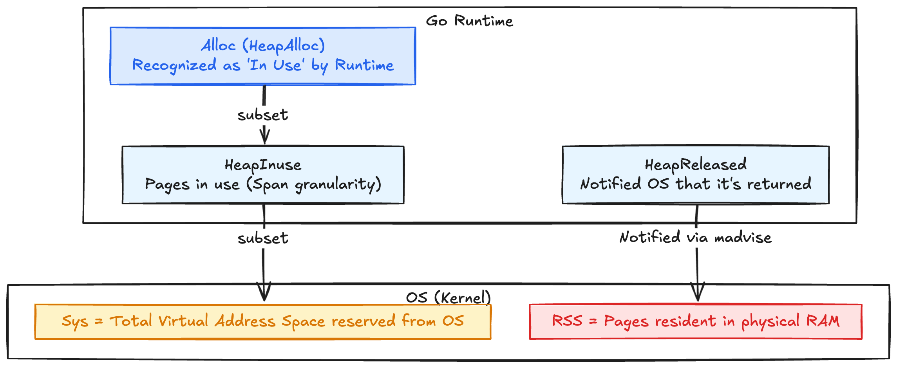
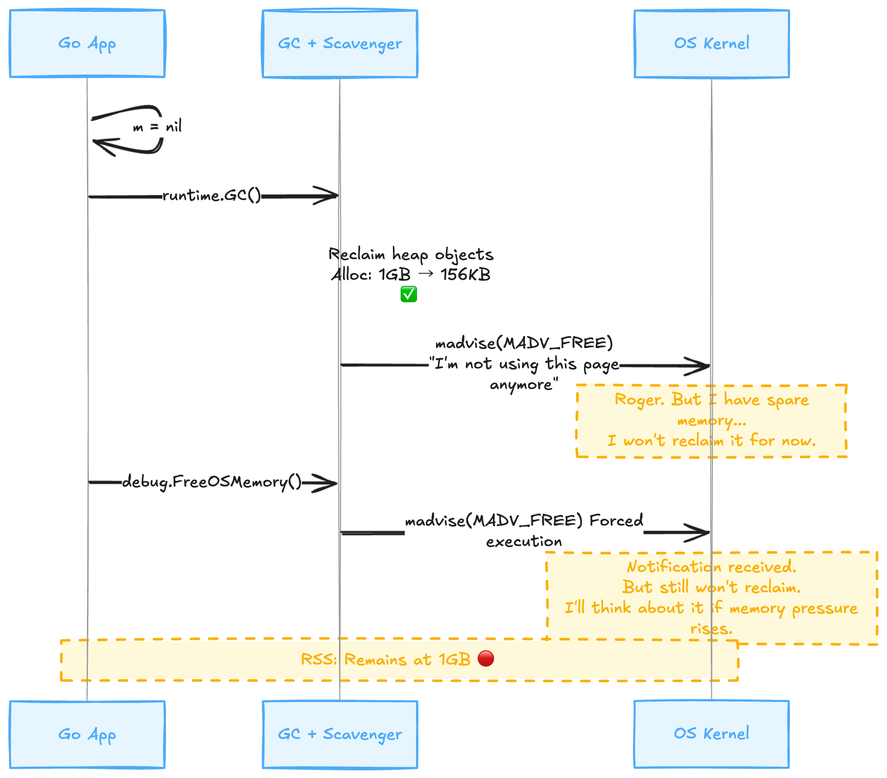
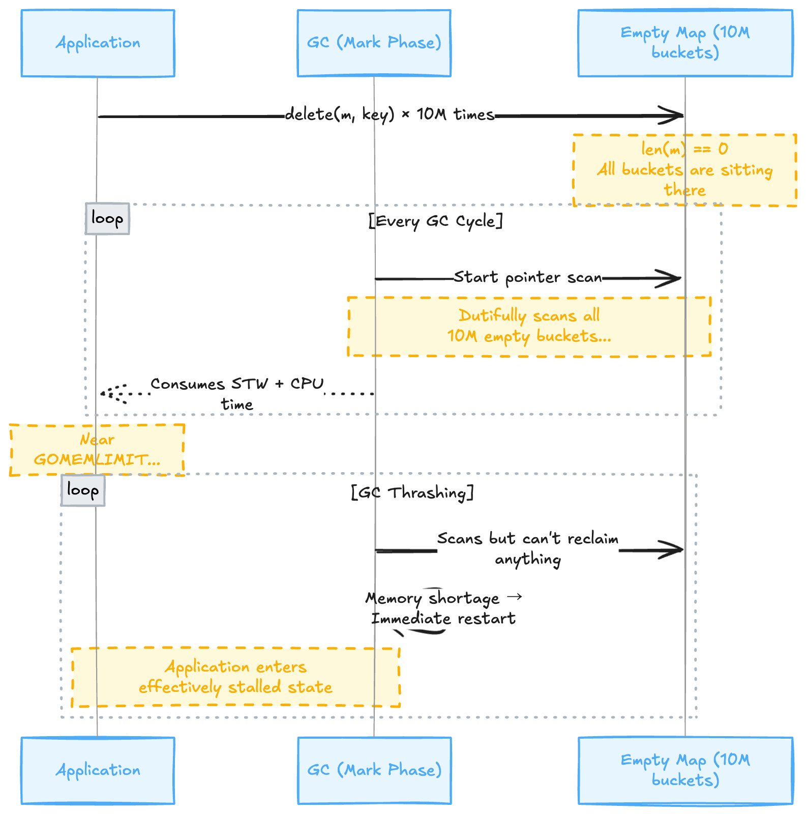

## Introduction

"Go maps don't return memory even after you `delete` elements."

If you are a Go engineer, you've probably heard this at least once. The official Issue [#20135](https://github.com/golang/go/issues/20135) has been Open since 2017. The internet is flooded with articles claiming, "I got an OOM because of Maps."

I believed it, too. But then, a question arose.

**"Really? Did you actually measure it?"**

To be honest, I had just taken other people's articles at face value. In 2026, using the Go 1.25 environment, I decided to measure it with my own hands—so I wrote a benchmark. The results were **completely different from what I imagined**.

---

## Prerequisites: Go's 3 Memory Metrics

First, when we say "memory doesn't return," what does "memory" refer to? Go has multiple metrics, and **discussions won't align unless we distinguish between them**.



|       Metric       |                                Meaning                                |   Keyword    |
| :----------------: | :-------------------------------------------------------------------: | :----------: |
|    **`Alloc`**     |             Heap bytes the runtime recognizes as "in use"             |  **In Use**  |
|  **`HeapInuse`**   |                   Heap pages in use (in span units)                   |  **In Use**  |
|     **`Sys`**      |           Total virtual address space reserved from the OS            | **Reserved** |
| **`HeapReleased`** |            Bytes notified to the OS as "no longer in use"             | **Notified** |
|      **RSS**       | Pages from reserved virtual memory currently resident in physical RAM | **Resident** |

The memory usage visible on K8s dashboards or `docker stats` is **RSS**. This distinction will be important later.

---

## 1. Testing the Myth First

A simple benchmark: Insert 1 million items of a 1KB struct into a Map, `delete` all of them, and then set `m = nil`.

```go
type HugeStruct struct {
    data [1024]byte // 1KB
}

func main() {
    m := make(map[int]HugeStruct)
    for i := 0; i < 1_000_000; i++ {
        m[i] = HugeStruct{}
    }
    printMemStats("After inserting 1M items")

    for k := range m {
        delete(m, k)
    }
    printMemStats("After deleting all")

    m = nil
    printMemStats("After m = nil")
}
```

Executed on macOS, fetching RSS from `mach_task_basic_info` (Go 1.25 / arm64):

```text
[Initial          ] Alloc:      131 KB  |  Sys:     7954 KB  |  RSS:     5296 KB
[After 1M Inserts ] Alloc:  1055465 KB  |  Sys:  1088280 KB  |  RSS:  1087872 KB
[After All Delete ] Alloc:      156 KB  |  Sys:  1088280 KB  |  RSS:  1087872 KB
[After m=nil + GC ] Alloc:      156 KB  |  Sys:  1088664 KB  |  RSS:  1088144 KB
[After FreeOSMem  ] Alloc:      156 KB  |  Sys:  1088664 KB  |  RSS:  1088224 KB
```

### Discovery 1: Alloc Decreased Normally

**Alloc after `delete`: 156 KB**. 1GB → 156KB. **A 99.98% decrease.**

"Maps don't return memory after delete"? **It returned.** The Go runtime's `Alloc` (heap usage) has returned to almost zero.

However, there is a theoretical concern related to **"Struct Size"**.

> **The 128-byte Boundary Theory**: In Go maps, if the key or value exceeds 128 bytes, it is not stored directly in the bucket but stored as a pointer.
> "If it's a large value stored as a pointer, Alloc decreases. But if it's a small value (e.g., `int64`) that gets inlined, wouldn't the bucket itself remain, meaning Alloc wouldn't even decrease?"

I verified this valid point. The result: **Even with a 128-byte struct or int64, Alloc decreased by over 99%.**

```text
[128 bytes (Inline) 1M items] Insert Alloc: 295MB → Delete Alloc: 137KB
[129 bytes (Pointer) 1M items] Insert Alloc: 177MB → Delete Alloc: 148KB
[int64 (8 bytes) 1M items]    Insert Alloc:  37MB → Delete Alloc: 148KB
```

At least in Go 1.25, even if values are inlined, Alloc seems to decrease this much.

**Observation: Optimization to `mapclear**`
When you write `for k := range m { delete(m, k) }` like in this benchmark code, the Go compiler may optimize this into a specific function call called `runtime.mapclear`. Since this function clears the map in bulk, bucket memory reuse or release might have been performed efficiently.

**However, don't let your guard down.**
In actual applications (like caches) where you "delete 1 item at a time," this optimization does not apply, and the phenomenon where empty slots in buckets become fragmented (**Fragmentation**) and memory remains stuck can still occur. It is too early to assume "it's safe because it decreased in the benchmark."

If you want certainty, `m = nil` (or re-creation) described later remains the strongest solution.

### Discovery 2: What Didn't Return Was RSS

RSS went from 1,087,872 KB → 1,088,224 KB. **It didn't budge an inch.** Even after `m = nil` or calling `debug.FreeOSMemory()`, it remained at 1GB.
(*Note: This is the behavior on macOS. Linux behavior is described later.*)

**The main reason for feeling "memory didn't return" was not the Map bucket residue (Alloc), but the RSS staying high.**

---

## 2. Does the Bucket Structure Really Remain?

"Wait, isn't the problem that the bucket structure remains after `delete`?"

That is correct. Let's measure a bit more precisely. I separated the measurement before and after GC to see the residual amount of the bucket structure:

```text
[After 1M inserts                 ] Alloc:  1037051 KB  |  HeapInuse:  1037704 KB
[After all delete (GC executed)   ] Alloc:    37052 KB  |  HeapInuse:    37720 KB
[After m = nil                    ] Alloc:      143 KB  |  HeapInuse:      480 KB
```

**37,052 KB (≈37MB) remains.** This is the true identity of "Maps don't shrink." The skeletal structure of the buckets/tables for 1 million items (metadata, control bytes, empty slot frames) is not released by `delete`.

But think about it calmly. **37MB / 1GB = 3.6%**.

And with `m = nil`, it drops to 143 KB. **It is completely released.**

### Confirmation with 4 Comparison Patterns

"Hasn't this improved with SwissMap (Go 1.24+)?" "Does it decrease if I use pointers?" I measured these too. I switched to Classic Map using `GOEXPERIMENT=noswissmap` for comparison:

|                  | SwissMap Value (Direct) | SwissMap Pointer | Classic Value (Direct) | Classic Pointer |
| :--------------: | :---------------------: | :--------------: | :--------------------: | :-------------: |
|   Insert Alloc   |      1,037,051 KB       |   1,037,033 KB   |      1,039,310 KB      |  1,039,304 KB   |
| **Delete Alloc** |      **37,052 KB**      |  **37,034 KB**   |     **39,311 KB**      |  **39,306 KB**  |
|   m=nil Alloc    |         143 KB          |      142 KB      |         143 KB         |     138 KB      |
|  Sys (Constant)  |      1,088,408 KB       |   1,092,248 KB   |      1,095,896 KB      |  1,095,896 KB   |

**Almost the same across all patterns.** Whether it's SwissMap or Classic Map, direct value or pointer, the residue is ~37MB. And `m = nil` clears everything.

---

## 3. Checking the Source Code: What is delete doing?

To back up the actual measurements, let's look at the source code.

### Classic Map: `runtime/map.go` (Go 1.23)

```go
// runtime/map.go - Excerpt from mapdelete function
e := add(unsafe.Pointer(b), dataOffset+abi.MapBucketCount*uintptr(t.KeySize)+i*uintptr(t.ValueSize))
if t.IndirectElem() {
    *(*unsafe.Pointer)(e) = nil
} else if t.Elem.Pointers() {
    memclrHasPointers(e, t.Elem.Size_)
} else {
    memclrNoHeapPointers(e, t.Elem.Size_)
}
b.tophash[i] = emptyOne
```

The value in the slot is zero-filled, and the `tophash` is marked as "empty". **The bucket itself is not released.** However, since the zero-filled data can be reclaimed by GC, `Alloc` decreases.

### SwissMap: `internal/runtime/maps/table.go` (Go 1.24+)

```go
// internal/runtime/maps/table.go - Excerpt from Delete method
if g.ctrls().matchEmpty() != 0 {
    g.ctrls().set(i, ctrlEmpty)
    t.growthLeft++
} else {
    g.ctrls().set(i, ctrlDeleted)  // Tombstone
}
```

The design philosophy is the same. Memory release for the table is not performed at all.

**In other words, "Maps don't shrink" accurately means "The number of buckets/tables does not decrease with `delete`."** The data itself is reclaimed by GC. Only the skeleton remains.

---

## 4. Why Not Shrink Buckets Automatically?

The Go team chose this design for three reasons:

**1. O(1) Predictability**: Shrinking requires rehashing (relocating all elements). If this potentially runs on every `delete`, tail latency becomes unstable.

**2. Iterator Safety**: Go's specification allows `delete` during a `for range` loop, which is incompatible with a design that automatically relocates memory in the background.

**3. Hysteresis**: If you inserted a large amount of data once, it's highly likely similar data will come again. This avoids thrashing where Shrink → Grow repeats.

These are rational design decisions, and the ~37MB residue is **intended behavior**.

---

## 5. The Real Problem: RSS Won't Return No Matter What

This is the main topic. The **truly serious problem** revealed by actual measurement is not the Map, but **RSS**.

```text
[After 1M inserts ] Alloc:  1055465 KB  |  RSS:  1087872 KB
[After m=nil + GC ] Alloc:      156 KB  |  RSS:  1088144 KB  ← Alloc is 0 but RSS is 1GB
[After FreeOSMem  ] Alloc:      156 KB  |  RSS:  1088224 KB  ← No change!
```

**Even if the Go runtime recognizes "I'm not using this anymore," the OS does not reclaim the physical memory.**

### Mechanism



Go's scavenger notifies the OS that "this page is no longer needed." However, the behavior of this notification (`madvise`) depends on the OS and settings.

### Linux (Production) vs macOS (Verification)

| Environment | Default Behavior | RSS Movement |
| --- | --- | --- |
| **Linux (Go 1.16+)** | `MADV_DONTNEED` | **Drops immediately ✅** |
| **macOS / Local** | Equivalent to `MADV_FREE` | **Does not drop ❌** |
| `GODEBUG=madvdontneed=1` | `MADV_DONTNEED` | Drops immediately ✅ |

Since Go 1.16, `MADV_DONTNEED` has become the default on Linux, so RSS **drops straightforwardly**.

In other words, panic over `docker stats` or Activity Monitor on local (macOS) showing "RSS isn't dropping! Memory leak!" is premature. **In production (Linux), it is highly likely to drop properly.**

**This is not a Map-specific issue.** The same thing happens if you reserve 1GB of `[]byte` and set it to `nil` (on macOS, etc.). It is a structural gap between Go runtime memory management and OS virtual memory management.

---

## 6. So What Should You Worry About?

### What you don't need to worry about

* **"Maps not shrinking" itself**: Residue after delete is ~37MB. Immediately resolved with `m = nil`.
* **Alloc not decreasing**: Proven false by measurement. Decreases by over 96%.
* **Classic Map vs SwissMap difference**: Residue amount is almost the same.
* **Value Direct vs Pointer difference**: Residue amount is almost the same.

### What you should worry about

**1. GC Thrashing (GOMEMLIMIT Environment)**

The ~37MB bucket structure remaining after delete is a "live object" to the GC. If this sits near the `GOMEMLIMIT`:



|      State       |     Heap Usage     |               GC Decision                |      Result      |
| :--------------: | :----------------: | :--------------------------------------: | :--------------: |
|      Normal      | 50% of GOMEMLIMIT  |          GC at normal frequency          |    No problem    |
| Huge Map Sitting | 95% of GOMEMLIMIT  |          **Run GC constantly**           | CPU stolen by GC |
| New alloc occurs | Exceeds GOMEMLIMIT | **Cannot reclaim even with repeated GC** |     OOM Risk     |

Countermeasure: Don't just settle for `delete`; pass the whole bucket to GC with `m = nil`.

**2. RSS-based OOM Kill (K8s Environment)**

The OOM Killer in K8s looks at RSS. Even if `Alloc: 0` inside Go, if RSS is 1GB, it hits the Pod memory limit and gets killed.

Countermeasure: Set `GOMEMLIMIT` to 80% of the Pod memory limit and actively run the scavenger. However, there is no guarantee that RSS will drop immediately.

---

## 7. Practical Workarounds

Workarounds with effects confirmed by actual measurement:

### 1. Re-make the map (Most reliable)

```go
m = nil
runtime.GC()
m = make(map[K]V, estimatedSize)
```

```text
[After 1M inserts ] Alloc:  1055524 KB
[After m=nil + GC ] Alloc:      142 KB  ← Completely resolved ✅
[Re-make + 100 ins] Alloc:      246 KB
```

### 2. Eviction (Copy only living elements)

```go
newMap := make(map[K]V, len(m))
for k, v := range m {
    newMap[k] = v
}
m = nil
m = newMap
runtime.GC()
```

```text
[Reduced to 100 via delete + GC] Alloc:    37188 KB  ← 37MB residue
[Eviction (Copy to new Map)    ] Alloc:      142 KB  ← Resolved ✅
```

### 3. debug.FreeOSMemory() (Immediate effect on Linux)

```go
debug.FreeOSMemory()
```

```text
[After GC         ] HeapReleased:      464 KB
[After FreeOSMem  ] HeapReleased:  1055808 KB  ← "Returned" according to Go Runtime ✅
                    RSS (macOS):   1088224 KB  ← RSS Unchanged 🔴
                    RSS (Linux):      6592 KB  ← RSS Drastically Reduced ✅
```

It works dramatically on Linux (Production). If alerts for memory pressure occur frequently, periodic execution is worth considering. However, it consumes CPU, so do not abuse it.

---

## Conclusion

"Go Maps don't shrink"—Summary of results verifying this myth with actual measurements.

|                Myth                |       Measurement Result        |         Verdict         |
| :--------------------------------: | :-----------------------------: | :---------------------: |
| Memory doesn't return after delete |    Alloc decreases by 99.98%    |        ❌ False         |
|      Bucket structure remains      | 37MB remains (3.6% of original) |     ⚠️ Half True      |
|       Improved with SwissMap       |   Almost same as Classic Map    |        ❌ False         |
|      Pointers make it lighter      |    Difference is nearly zero    |        ❌ False         |
|       Released with m = nil        |       Completely released       |         ✅ True         |
|          RSS doesn't drop          |   Remains 1GB no matter what    | ✅ **The Real Problem** |

**96% of the phenomenon called "Maps don't shrink" was caused not by Map-specific issues, but by the Go runtime's overall RSS management specifications.**

What you should truly worry about is not the Map, but the design where the Go process does not return virtual address space once `mmap`ed to the OS, and the OS behavior where `madvise(MADV_FREE)` does not immediately lower RSS. The Map is merely a victim standing out by chance.

**What you can do right now**: Check the heap with `go tool pprof -inuse_space`, and if you find a huge Map, re-create it with `m = nil`. That is sufficient. There is no need to complicate your design out of fear for 37MB of bucket residue.
