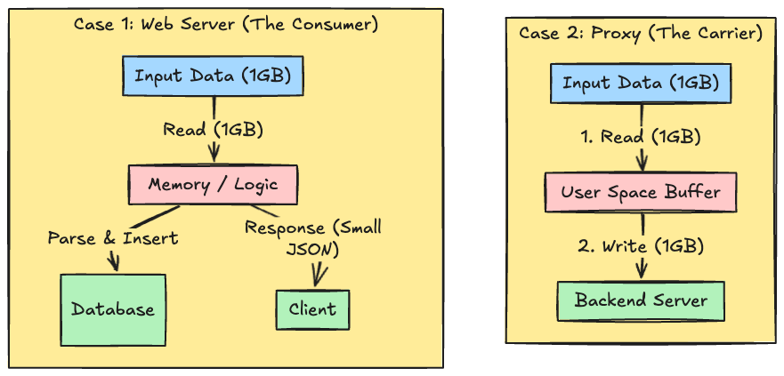
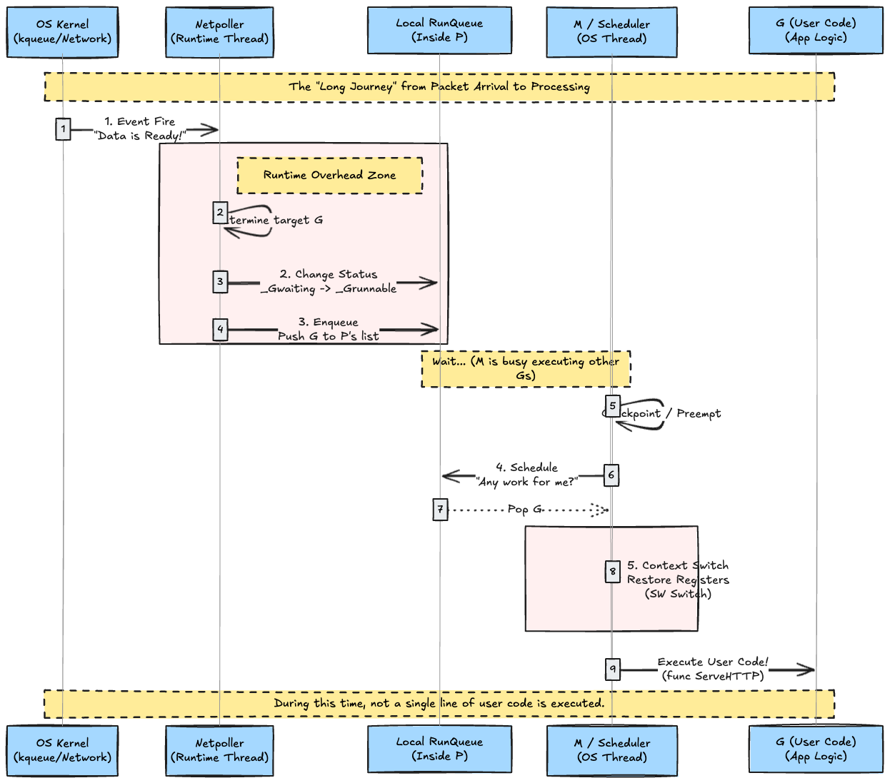
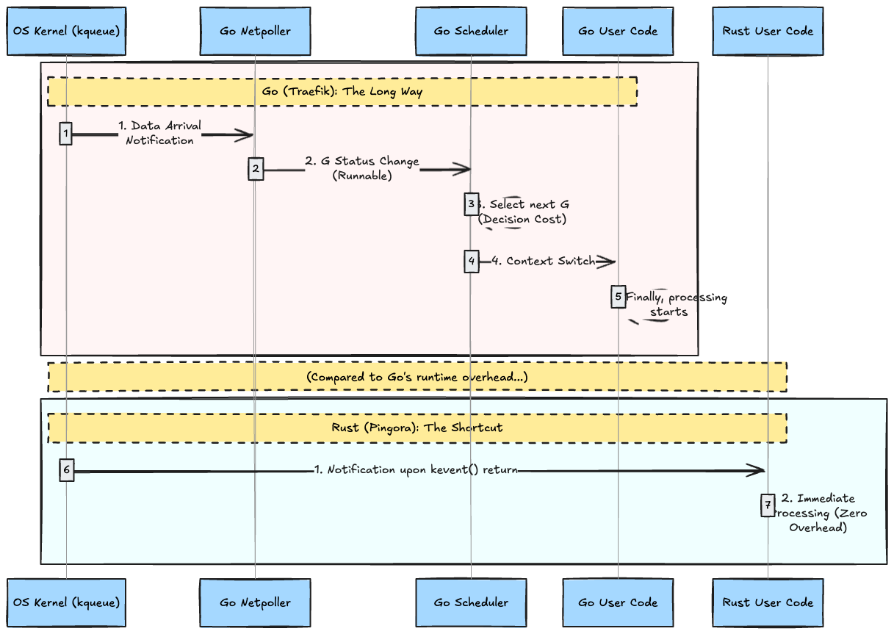

# Introduction

## 1. The Rise of Go and the Hard Reality of Proxies

### 1.1 The "Cloud Native Standard" Dream Won by Go

Since the 2010s, Go has dominated the world of backend development, especially microservices and cloud-native tools. Docker, Kubernetes, Terraform, Prometheus—most of the software underpinning modern infrastructure is written in Go.

The primary reason for this lies in the ideal of **"Democratization of Concurrency"** that Go presented.

* **The Goroutine Revolution**:
    With Goroutines, which are far lighter than OS threads (starting with a stack size of just a few KB), developers gained a simple and intuitive programming model: "allocate one concurrent process per request."
* **Efficient I/O Waiting with Netpoller**:
    The Go runtime internally possesses a "Netpoller" that highly wraps OS event notification mechanisms (epoll or kqueue). This allows the Go runtime (scheduler) to immediately context switch to another Goroutine when one enters a network I/O wait state, without blocking the OS thread.

"For Web servers where massive I/O waits occur, Go provides the highest throughput with low cognitive load and implementation cost." This is the **Go Ideal** that we engineers have believed in for years, and which has been proven in many fields.

However, when we ask "Why do copy operations and context switches become a problem in reverse proxies (i.e., why do they increase)?", the answer reveals a structural inefficiency: **"Data wastefully passes through user space (the Go world)."**

I want to convey the sense of futility in "bringing luggage into Go's room (memory) only to immediately take it back out, just to move it from right to left."

### 1.2 The Reality Seen in the "Specialized Task" of Reverse Proxies

However, in the domain of Reverse Proxies (Edge Proxies), which specialize in specific network tasks, the "cost" behind this ideal has begun to manifest at a non-negligible level.

Web servers and reverse proxies differ fundamentally in how they "face" I/O.

* **The Web Server's Job**:
  * Receives a request, queries a DB, executes business logic, and returns a result. Here, "computation" or "waiting (for DB response)" is the main actor. The cost of I/O processing per request is negligible compared to the execution time of complex business logic, so Go's runtime overhead is relatively ignored.
* **The Reverse Proxy's Job**:
  * Reads a massive stream of bytes from Socket A and immediately writes it out to Socket B.
  * Here, **"Data Transfer itself"** is the main actor. Ideally, data should move within the kernel for maximum speed. However, to perform tasks like header parsing as an application, data is copied once from **"Kernel Space" to "User Space (Go Heap)"**, and then returned to Kernel Space.

Due to this structure, the following costs accumulate with every packet:

1. **Increased Memory Copy**: Wasteful data copying between Kernel Buffer ⇄ Go Memory Area (Slice).
2. **Frequent Context Switches**: Round trips between User Mode and Kernel Mode generated by every `read`/`write` system call.
3. **Go Runtime Tax**: As long as data is placed in user space, it becomes a **target for GC (Garbage Collection) surveillance**. The Go runtime continues to pay memory management costs for data that is merely passing through.

For a proxy, any processing other than this "Cost of Movement" is pure overhead. Since there is almost no computational processing, most CPU time is wasted on this "loading and unloading of data"—this is the reality faced by Go proxies under high load.

### 1.3 When the "Magical Runtime" Becomes a Structural Wall

The generous support provided by Go creates the following **divergence from reality** in "extreme data transfer fighting for every microsecond," such as in proxies.

1. **Scheduler Intervention (Limits of M:N Scheduling)**:
    1. When assigning a Goroutine to an OS thread, the Go Runtime Scheduler, acting as a "Middle Manager," always intervenes. Compared to models like C++ or Rust where threads are mapped 1:1 to OS threads (eliminating context switches), the judgment cost of this middle manager weighs heavily in a world of hundreds of thousands of requests per second.
2. **Micro-noise from Garbage Collection (GC)**:
    1. Go's GC is extremely excellent, but it is not zero. It scans the heap, chases references, and organizes memory. This background processing structurally hinders the stability of latency, which is most critical in a reverse proxy.
3. **Memory Copy via Abstraction**:
    1. Go's standard library is abstracted for ease of use, but this sometimes causes unnecessary buffer copies. In contrast, Rust's **Pingora** or C++'s **Envoy** implement "Zero Copy" by directly manipulating memory pointers, achieving a dimension of transfer efficiency that Go cannot reach.
    2. In Go, even casting `[]byte` to `string` triggers a copy (unless `unsafe` is used).

---

## 2. The Physics of Scheduling: Goroutine (M:N) vs OS Event Loop (kqueue)

The biggest factor determining reverse proxy performance is not the raw hardware performance, but boils down to one point: **"How to connect notifications from the OS kernel to the application processing code with the fewest number of instructions."**

### 2.1 Go's "M:P:G" Model: The Cost of Flexible Middle Management

The Go runtime manages concurrency using three entities: **G (Goroutine)**, **M (Machine/OS Thread)**, and **P (Processor/Context)**.

#### Steps from Packet Arrival to Processing Start

When processing a network request in Go, physically, the following relay occurs:

1. **Netpoller Detection**: The OS (macOS) `kqueue` detects data arrival.
2. **Making G Runnable**: The `netpoller` thread transitions the **G** waiting for the socket from `_Gwaiting` to `_Grunnable`.
3. **Queueing to P**: The executable **G** is placed into the local run queue of some **P** (Logical Processor). (However, if that P is processing another heavy G, a wait occurs).
4. **Scheduler Activation**: When **M** (OS Thread) reaches a point where it can interrupt the current task (preemption or function boundary), the Go scheduler intervenes and selects the next **G** to run from the queue.
5. **Register Restoration**: The stack information and registers of the selected **G** are loaded into **M**, and finally, user code is executed.

This process is called "User Space Context Switch." While far faster (hundreds of nanoseconds) than an OS thread switch (several microseconds), the fact remains: **"Hundreds to thousands of CPU cycles are consumed without executing a single instruction of user logic."**

### 2.2 Rust/C++ Event Loop: The Physics of Direct Connection

In contrast, the native event loop (1-thread-per-core) model adopted by Pingora, Envoy, Nginx, etc., eliminates these "intermediate steps" to the extreme.

#### Steps from Packet Arrival to Processing Start

1. **Direct kqueue Reference**: The worker thread (OS thread) is sleeping on the `kevent()` system call.
2. **Immediate Return**: When data arrives, the kernel wakes up the worker thread.
3. **Direct Call**: Immediately after returning from `kevent()`, the application code retrieves the socket ID directly from the event structure and calls the `read()` function (handler).

There is no heavy runtime scheduler judgment like "Which Goroutine should I run?", no stack swapping, and no state transition management. **"Kernel notification arrived → Function called."** It is the shortest path, physically impossible to shorten further.

Finally, let's visually compare the "distance from packet arrival to processing start" between Go and Rust. It is obvious how many procedures Go on the left steps through, versus how "directly connected" Rust on the right is.

---

## 3. The Cost of Memory: GC Stop-The-World vs Rust's Deterministic Dropping

In evaluating reverse proxy performance, **"Latency Stability (Elimination of Jitter)"** is more important than Throughput (requests per second).

### 3.1 Go's Garbage Collection: The Fate of Batch Cleaning

Go employs a highly advanced GC algorithm called "Concurrent Mark and Sweep."

#### 3.1.1 The Moment of Stop-The-World (STW)

Go's GC generates **STW**, which stops all threads for a very short time at the start and end of marking.

* For a proxy handling 100,000 requests per second (10 microseconds per request), **a 0.5ms stop means forcefully making 50 arriving requests wait**. This is the true identity of P99 latency "spikes."

#### 3.1.2 Performance Degradation due to Write Barrier

While GC is running in the background, a constraint called **"Write Barrier"** is imposed on the application (user code). Every time a memory pointer is rewritten, check code is implicitly executed, continuing to consume minute amounts of CPU.

Even more terrifying is Mark Assist. If the memory allocation pace is fast, the Go runtime forces executing Goroutines to participate in GC work. In other words, a customer (Goroutine) currently processing a request is suddenly handed a broom and told to clean the floor, further worsening tail latency.

### 3.2 Rust's Deterministic Dropping: Cleaning on the Spot

In contrast, the concept of GC does not exist in Rust.

#### 3.2.1 No Scanning, No Stopping

* **Deterministic Dropping**: The moment a variable goes out of scope, an instruction to free that memory (destructor) is inserted at compile time.
* **Zero Background Tasks**: Since there is no concept of "cleaning up later in a batch," the program never stops arbitrarily during execution, nor does scanning run in the background stealing CPU.

---

## 4. The Journey of Data: Zero-Copy Implementation and What Go's `io.Copy` Really Does

### 4.1 The Journey of Data: The "4 Copies" of Standard I/O

1. **NIC → Kernel Buffer**: Transfer via DMA.
2. **Kernel Buffer → User Buffer**: Copy to user space via `read()`.
3. **User Buffer → Kernel Buffer**: Return to kernel space via `write()`.
4. **Kernel Buffer → NIC**: Send out via DMA.

Of these, **2 and 3, the round trip between "Kernel Space ↔ User Space,"** consume memory bandwidth most fiercely.

### 4.2 Go's `io.Copy`: The "Buffer" Behind Convenience

When you call `io.Copy(dst, src)` in Go, a fixed **32KB** buffer is allocated internally, and `Read` and `Write` are repeated in a loop. While Go has paths like `Splice` (Linux specific), avoiding this "copy to user space" is impossible when modifying headers as a proxy.

### 4.3 "Zero Copy" and "Minimal Copy" Pursued by Rust/C++

* **`splice` / `sendfile`**: Connect file descriptors directly within the kernel.
* **Buffer Pool / Arena**: Reuse memory to eliminate allocation.
* **Pass by Reference**: Instead of copying data, pass only pointer information.
* `writev` (`Scatter`/`Gather`): Do not combine header and body in memory (copy), but pass a list pointing to "location of header" and "location of body" to the kernel for transmission.

---

## 5. Architecture Analysis — Design Philosophies of the Big Four

| Product     | Language | Thread Model      | Characteristics                                      |
| :---------- | :------- | :---------------- | :--------------------------------------------------- |
| **Nginx**   | C        | Master/Worker     | Asynchronous Event-driven. Extremely low memory usage.|
| **Envoy**   | C++      | Thread-local      | Modern L7 Proxy. Powerful filter chain.              |
| **Traefik** | Go       | Goroutine-per-req | Cloud-native. Strong dynamic configuration changes.  |
| **Pingora** | Rust     | Multi-threaded    | Built by Cloudflare. Safety and HTTP/3 optimization. |

---

## 6. Experiment

We measured benchmarks for each reverse proxy using the following repository:

* [kanywst/reverse-proxy-benchmark](https://github.com/kanywst/reverse-proxy-benchmark)

Executed on MacBook Pro M1 Max.

The values below combine the **Max Throughput** (from `./scripts/bench_perf.sh`) and **Resource Usage** (from `./scripts/bench_resources.sh`) to give a complete picture.

|    Proxy    | Max Requests/Sec | Transfer/Sec | Avg CPU (Total) | Avg RSS (Total) |
| :---------: | :--------------: | :----------: | :-------------: | :-------------: |
|  **Nginx**  |    **54,826**    | **7.79 MB**  |       80%       |  **11.97 MB**   |
|  **Envoy**  |      37,637      |   5.46 MB    |      383%       |    43.30 MB     |
| **Pingora** |      30,991      |   3.75 MB    |       77%       |    19.60 MB     |
| **Traefik** |      8,603       |   8.39 MB    |       0%*       |    60.96 MB     |

\* *Traefik's CPU usage remains elusive under this monitoring method, likely due to ephemeral processes or specific Go runtime behaviors on macOS, but resource consumption is generally higher.*

## Conclusion

- **Nginx** remains the efficiency king, delivering the highest throughput with the lowest memory footprint. Its architecture, refined over decades, proves that C is still unmatched for raw event-loop performance.
- **Envoy** scales well across multiple cores (high CPU usage) to deliver strong performance, but is heavier on resources. This is the trade-off for its rich feature set and observability.
- **Pingora** offers a balanced profile, with good performance and reasonable resource usage, sitting between Nginx and Envoy. It shows the promise of Rust: high performance with memory safety.
- **Traefik** prioritizes features and ease of use over raw throughput in this specific "hello world" benchmark scenario. The Go runtime overhead, as discussed, plays a significant role here. It is excellent for usability, but for raw packet-pushing power, the specialized runtimes win.
