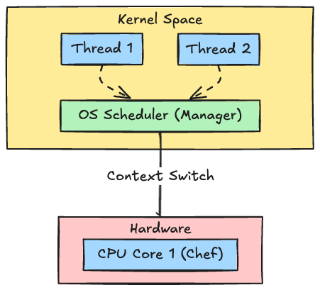
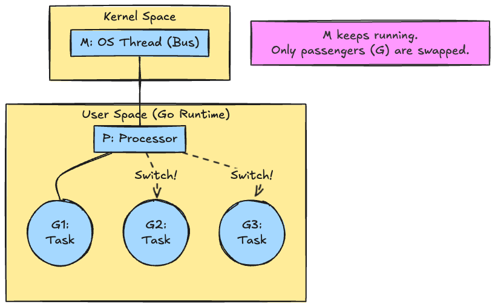
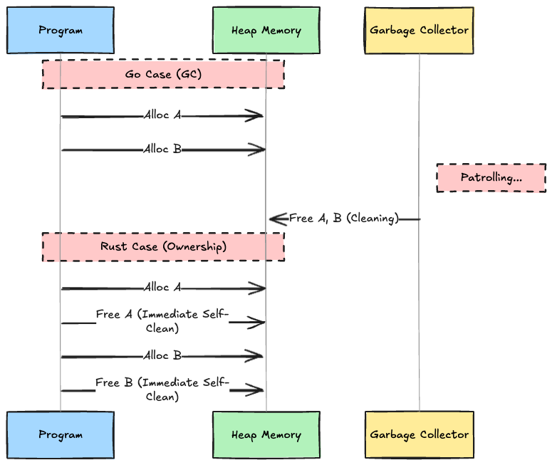
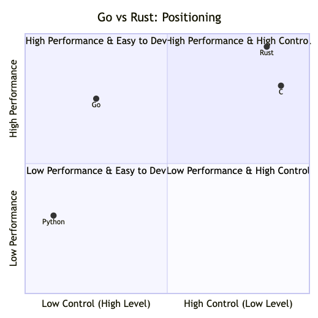

# Introduction

"Go is great for concurrency" and "Rust is memory-safe and fast."
These are common phrases, but can you explain **"Why?"** from an OS-level perspective?

In this article, we won't just look at syntax. We'll dissect these two languages from a **Computer Science** viewpoint: OS kernels, CPU registers, and memory management. Armed with this foundational knowledge, we'll verify the strategies of Go and Rust through real benchmark code.

## OS Threads and the CPU

Before comparing the languages, let's review how a "program" actually runs on hardware. Understanding this makes the differences between Go and Rust look like "necessity" rather than "magic."

### 1. Kernel Space and User Space (Kitchen vs. Dining Room)

Inside a computer, there is a strict hierarchy.

* **Kernel Space**:
  * This is the **Kitchen**. It's a privileged area that directly handles "ingredients" (hardware) like the CPU, memory, and disks. Only the OS (the chef) can issue commands here.
* **User Space**:
  * This is the **Dining Room**. Our programs (Go or Rust code) live here. They cannot touch the hardware directly. If they want something, they must place an "order" (System Call) to the Kitchen (Kernel).

### 2. CPU Cores and OS Threads (Chefs and Order Slips)

A **CPU Core** is a **Chef**. Modern PCs usually have 8 to 16 chefs.
An **OS Thread** is an **Order Slip (Task)**.

The OS Scheduler (the manager) assigns a vast number of order slips to the limited number of chefs at high speed.



### 3. Why is a "Context Switch" Heavy?

When the OS switches from Thread A to Thread B, a **Context Switch** occurs.
You might have heard "it's heavy because it happens in Kernel Space," and that's true. Specifically, it involves two major costs:

1. **Mode Transition Cost (User ⇔ Kernel)**:
    * Stopping a user program and switching to privileged mode (Kernel) requires passing through CPU protection layers. It’s like going through "Customs"—it takes time.
2. **Memory Space Switching (TLB Flush)**:
    * When the thread changes, the "map" (Page Table) of the memory the CPU is looking at may change. This clears the CPU's "memory" (TLB cache), causing a massive drop in efficiency immediately after the switch.

### The Nightmare of the C10K Problem

The **"C10K Problem" (10,000 Concurrent Clients)** that once shook the web industry was caused by exactly this. Even if a server had enough specs, creating 10,000 threads meant the CPU spent all its time on "switching work" rather than actually processing requests.

## Round 1: Concurrency

How do Go and Rust approach this "Weight of OS Threads" (the C10K problem)?

### Go: Living in "User Space" (G-M-P Model)

Go thought: "OS Threads (M) are too heavy. Why not create our own lightweight threads in User Space?" These are **Goroutines (G)**.

#### Question: How can Goroutines run without going to the Kernel?

You might think, "Doesn't using the hardware (CPU) require Kernel permission (OS Threads)?"
Exactly. That's why Go **"paints many Goroutines (G) onto a few OS Threads (M)."**

* **M (OS Thread)**: Has a permanent passport to Kernel Space. Go only prepares a few of these.
* **G (Goroutine)**: No passport. It hitches a ride on the "M bus."

The Go Runtime (in User Space) swaps passengers (G) on the M bus at high speed. Since this swap happens **entirely in User Space**, there is no "Customs check" (Mode Transition) or "Map update" (TLB Flush). This is why Goroutines are lightning fast.



#### Theory: Netpoller and I/O Wait

Why is Go said to be advantageous when there's a lot of "I/O Wait" (waiting for DBs or APIs)?

Normally, when an OS thread performs I/O, it **Blocks (waits)** until completion. The OS Scheduler then performs a context switch to another thread to keep the CPU busy. If this happens tens of thousands of times, the overhead is staggering.

Go uses a mechanism called the **Netpoller**.
When a Goroutine performs I/O, the Go Runtime registers it with the OS's asynchronous I/O features (like `epoll` on Linux or `kqueue` on macOS) and pauses (Parks) that Goroutine. **The OS thread itself does not block**; it immediately moves on to execute another Goroutine.

This avoids heavy OS-level context switches and keeps processing moving with lightweight switches inside User Space.

### Benchmark: Spawning 100k Concurrent Tasks

Let's measure the time it takes to spawn 100,000 tasks and wait for them to finish.

#### Hands-on

You can copy and run the following code in your environment.

**Go (`concurrency.go`)**

```go
package main

import (
	"fmt"
	"sync"
	time "time"
)

func main() {
	start := time.Now()
	var wg sync.WaitGroup
	count := 100000 // 100k goroutines

	wg.Add(count)
	for i := 0; i < count; i++ {
		go func() {
			defer wg.Done()
			time.Sleep(1 * time.Nanosecond) // Simulate work
		}()
	}
	wg.Wait()
	fmt.Printf("Go: Spawning %d goroutines took %v\n", count, time.Since(start))
}
```

**Rust (`concurrency.rs`)**

```rust
use std::thread;
use std::time::Instant;

fn main() {
    let start = Instant::now();
    // Spawning 100k OS threads in Rust might crash due to OS limits (ulimit).
    // We use 10k here for comparison.
    let count = 10000; 
    let mut handles = vec![];

    println!("Starting to spawn {} threads...", count);

    for _ in 0..count {
        let handle = thread::spawn(|| {
            // Do nothing
        });
        handles.push(handle);
    }

    for handle in handles {
        handle.join().unwrap();
    }

    println!("Rust: Spawning {} threads took {:?}", count, start.elapsed());
}
```

**Execution Commands:**

```bash
# Go
go run concurrency.go

# Rust
rustc -O concurrency.rs && ./concurrency
```

#### Result (My Environment)

Here are the actual measurements from my environment (macOS 15.2 / M2 Max).

| Language | Task Count | Execution Time | Time per Task (Approx) |
| :--- | :--- | :--- | :--- |
| **Go** | 100,000 | **40.4 ms** | 0.0004 ms |
| **Rust** | 10,000 | **781.1 ms** | 0.0781 ms |

**Analysis**:
Even though Go is handling 10x the tasks, the total time is about 1/20th of Rust's. In terms of efficiency per task, **Go is about 195x faster**. This numerically proves how specialized the G-M-P model is for "task spawning and switching."

## Round 2: Memory Management (GC vs. Ownership)

Next is the eternal challenge of programming languages: memory management. Let's compare this to "Clearing tables in a restaurant."

### Go: Garbage Collection (The Cleaning Staff)

Go's approach is to hire **"Dedicated Cleaning Staff (GC)."**
Customers (programs) leave their dirty dishes (unneeded memory) on the table and leave. The cleaning staff periodically patrols the hall, checks "Oh, this customer is gone," and cleans up.

* **Pro**: Programmers can focus on "cooking" (coding) without worrying about cleaning.
* **Con**: The cleaning staff moving around reduces the shop's overall efficiency. During busy times, they might shout, **"Everyone stop! I need to clear everything at once!"** (Stop The World), pausing the program.

### Rust: Ownership (Self-Service)

Rust's approach is **"Complete Self-Service."**
There is a strict rule called **Ownership**: "When a customer leaves (exits the scope), they MUST execute the code to clear their own dishes." This is enforced by the compiler.

* **Pro**: No cleaning staff means zero wasted movement during business hours. Memory usage is always at a minimum.
* **Con**: Customers (programmers) must strictly follow the cleaning rules, which can be tough to learn (fighting the borrow checker).



### Benchmark: 10 Million Allocations & Frees

We will allocate a 1KB struct on the Heap 10 million times and immediately discard it.

#### Hands-on

**Go (`memory.go`)**
We force Heap allocation to bypass Go compiler's escape analysis optimization (stack allocation).

```go
package main

import (
	"fmt"
	runtime "runtime"
	time "time"
)

type Payload struct {
	data [1024]byte
}

var Sink *Payload // Force escape to heap

func main() {
	count := 10_000_000 
	start := time.Now()
	
	for i := 0; i < count; i++ {
		p := &Payload{}
		Sink = p 
	}

	var m runtime.MemStats
	runtime.ReadMemStats(&m)
	
	fmt.Printf("Go: Allocations took %v\n", time.Since(start))
	fmt.Printf("Go: NumGC = %v\n", m.NumGC)
}
```

**Rust (`memory.rs`)**
Using `Box::new` for Heap allocation.

```rust
use std::time::Instant;

#[allow(dead_code)]
struct Payload {
    data: [u8; 1024],
}

impl Payload {
    fn new() -> Self {
        Self { data: [0; 1024] }
    }
}

fn main() {
    let count = 10_000_000;
    let start = Instant::now();

    for _ in 0..count {
        let _p = Box::new(Payload::new()); 
        // Scope end: Immediate drop (free)
    }

    println!("Rust: Allocations took {:?}", start.elapsed());
}
```

**Execution Commands:**

```bash
# Go
go run memory.go

# Rust
rustc -O memory.rs && ./memory
```

#### Result (My Environment)

| Language | Task | Execution Time | Note |
| :--- | :--- | :--- | :--- |
| **Go** | 10M Alloc/Free | **1.18 sec** | GC Runs: **3137 times** |
| **Rust** | 10M Alloc/Free | **14.0 ms** | No GC (Immediate RAII Free) |

**Analysis**:
This is the **Overhead of GC**. Go is fast at allocation itself, but the "Cleaning (GC)" running in the background takes up most of the execution time. Rust frees memory the moment it goes out of scope, so there is zero wasted wait time. The difference is **about 84x**.

## Round 3: Data Processing and SIMD (Computation)

Finally, let's talk about pure CPU power. The secret weapon here is **SIMD (Single Instruction, Multiple Data).**

### Theory: Calculating 1-by-1 vs. 4-at-once

Imagine you want to add `+1` to an array `[1, 2, 3, 4]`.

* **Scalar (Standard)**:
    1. Calculate `1+1` → Save
    2. Calculate `2+1` → Save ... (Repeat 4 times)
* **SIMD (Vector)**:
    1. Load `[1, 2, 3, 4]` into a register at once.
    2. Command: **"Add +1 to everyone!"**
    3. `[2, 3, 4, 5]` is finished instantly.

Rust (via LLVM) is excellent at this SIMD optimization. Go, prioritizing safety (like bounds checking), may not always perform such aggressive optimizations.

### Benchmark: Sum of 100 Million Integers

#### Hands-on

**Go (`computation.go`)**

```go
package main

import (
	"fmt"
	time "time"
)

func main() {
	size := 100000000
	data := make([]int, size)
	for i := 0; i < size; i++ { data[i] = i }

	start := time.Now()
	sum := 0
	for _, v := range data {
		sum += v
	}

	fmt.Printf("Go: Sum %d in %v\n", sum, time.Since(start))
}
```

**Rust (`computation.rs`)**

```rust
use std::time::Instant;

fn main() {
    let size = 100000000;
    let mut data = vec![0; size];
    for i in 0..size { data[i] = i; }

    let start = Instant::now();
    let sum: usize = data.iter().sum();

    println!("Rust: Sum {} in {:?}", sum, start.elapsed());
}
```

**Execution Commands:**

```bash
# Go
go run computation.go

# Rust
rustc -C opt-level=3 computation.rs && ./computation
```

#### Result (My Environment)

| Language | Task | Execution Time | Note |
| :--- | :--- | :--- | :--- |
| **Go** | 100M Integers Sum | **99.1 ms** | Simple `for-range` loop |
| **Rust** | 100M Integers Sum | **28.5 ms** | `iter().sum()` (SIMD Optimized) |

**Analysis**:
Rust is **about 3.5x faster**. Go is fast enough, but Rust (LLVM) goes a step further by utilizing special CPU instructions (Vector operations).

## Conclusion

Based on our findings, here is a logical way to choose between the two.

### 1. Positioning: Abstraction vs. Control

Mapping them on the axes of "Abstraction (Ease of Development)" and "Hardware Control (Raw Performance)" reveals a clear distinction.



* **Rust (Top-Right)**: **High Control, High Performance.** The "Ultimate Craftsman's Tool" that provides C-level control while maintaining safety.
* **Go (Top-Left)**: **High Performance, High Abstraction.** A "High-Performance Mass-Production Machine" where you focus on logic and let the runtime handle the hardware.

### 2. Why that Choice?

#### Case A: Web API / Microservices

👉 **Recommended: Go**

* **Why?**: The bottleneck of web apps is usually **Network I/O**, not CPU.
* **Reasoning**: Go's Netpoller prevents OS threads from blocking during I/O. Developers get massive scalability without writing complex asynchronous code (`async/await`). It's the perfect balance of "Team velocity" and "Runtime performance."

#### Case B: Data Infrastructure / Core Logic / Embedded

👉 **Recommended: Rust**

* **Why?**: Here, **CPU cycles** and **Memory efficiency** are everything.
* **Reasoning**: In scenarios where a 1-second GC pause is unacceptable or where you're processing terabytes of data, Rust's zero-cost abstractions and SIMD optimizations become essential.

#### Case C: CLI Tools

👉 **Verdict: Case-by-Case**

* **Go (gh, docker, fzf)**:
  * If the tool mainly "coordinates" OS/Network (APIs, processes), choose Go. It has a rich library ecosystem and excellent cross-compilation.
* **Rust (ripgrep, bat, fd)**:
  * If the tool is about "local computation" (grep, file walking), choose Rust. Rust also tends to have faster **Cold Start** times (Go has runtime initialization), making it better for tools that finish in a fraction of a second.

Is your project facing **"I/O Multiplexing"** challenges or **"CPU/Memory Optimization"** limits?
The answer to that question is your answer for which language to choose.
