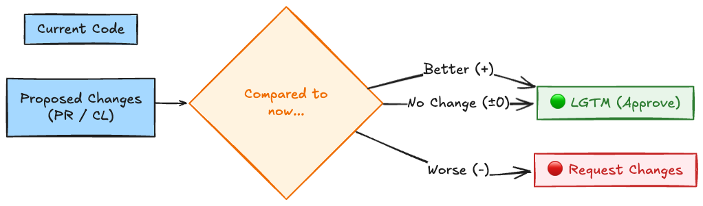

# Introduction

For engineers, code reviews occupy a significant portion of daily work. However, many struggle with questions like, "How granular should I get?", "Where is the line between personal preference and a bug?", or "Why is the review process stalling our development?"

**[Google's Engineering Practices documentation](https://google.github.io/eng-practices/)** provides clear, battle-tested answers to these issues. This article explains the "Code Review Standards" practiced by one of the world's top engineering organizations, adapted for common development workflows like GitHub.

> **Terminology Note**: At Google, a Pull Request (PR) is called a **CL (Change List)**. This article uses PR/CL interchangeably for clarity.

## 1. The True Purpose of Code Review

Google defines the purpose of code review with a single, clear mission:

> **"The primary purpose of code review is to ensure that the overall code health of Google’s codebase improves over time."**
> — [The Standard of Code Review](https://google.github.io/eng-practices/review/reviewer/standard.html)

The key takeaway here is that they are not seeking **"Perfect Code."**

### Why Perfection is Not the Goal

If a code change is "not perfect, but better than the current state," it should be approved. Even if a reviewer sees room for further improvement, as long as the current change doesn't degrade code health, they can leave comments for future consideration and still grant **LGTM (Looks Good To Me)**. This pragmatic compromise is the secret to maximizing development speed.

## 2. What to Look for in a Review

Reviewers shouldn't just skim the code; they should evaluate it based on the following priorities:

1. **Design**: Is the overall architecture sound and well-integrated?
2. **Functionality**: Does it behave as the author intended and provide value to the user?
3. **Complexity**: Is the code simple? Is there "clever code" that others won't be able to understand?
4. **Tests**: Are there correct, maintainable unit tests?
5. **Naming**: Did the author choose clear, descriptive names?
6. **Comments**: Do comments explain **"Why"** instead of just "What"?

> Reference: [What to look for in a code review](https://google.github.io/eng-practices/review/reviewer/looking-for.html)

### Important Note: Personal Preferences

Google's guidelines explicitly state that **for personal preferences without a technical basis, the reviewer should defer to the author’s judgment.** A reviewer should never impose their own coding style on others.

## 3. Speed of Code Review

Google places extreme importance on review speed. This is because **delays in code review decrease the productivity of the entire team exponentially.**

* **The One-Business-Day Rule**: Reviewers should aim to provide their first response within one business day (ideally by the following morning).
* **Interrupt vs. Focus**: You don't need to break your deep focus to respond immediately. Instead, treat reviews as a **top priority** during natural breaks (e.g., after a task or returning from lunch).
* **The Cost of "Slow Reviews"**: The longer a review takes, the more the author forgets the context, leading to high context-switching costs during the fix phase.

> Reference: [Speed of Code Reviews](https://google.github.io/eng-practices/review/reviewer/speed.html)

## 4. Respectful Communication

Review is not "criticism"; it is "collaboration."

* **Review the Code, Not the Person**: Instead of "You wrote this poorly," say "This function feels complex because..."
* **Provide the "Why"**: Don't just demand a fix; explain why it’s necessary (e.g., performance, future extensibility).
* **Nit (Nitpick)**: Use the `Nit:` label for minor suggestions that aren't mandatory but would be "nice to have." This reduces the psychological burden on the author.

> Reference: [How to write code review comments](https://google.github.io/eng-practices/review/reviewer/comments.html)

## Conclusion

Google’s code review culture is built on **"Rejecting Perfectionism"** and **"Balancing Speed and Quality."**

* If it’s better than the current state, **Approve it.**
* Respond to reviews within **one business day.**
* Maintain **Respect** and treat reviews as an opportunity for mentorship.

By adopting these practices, you can eliminate the frustration of stalled development and build a culture where everyone grows the codebase together.
