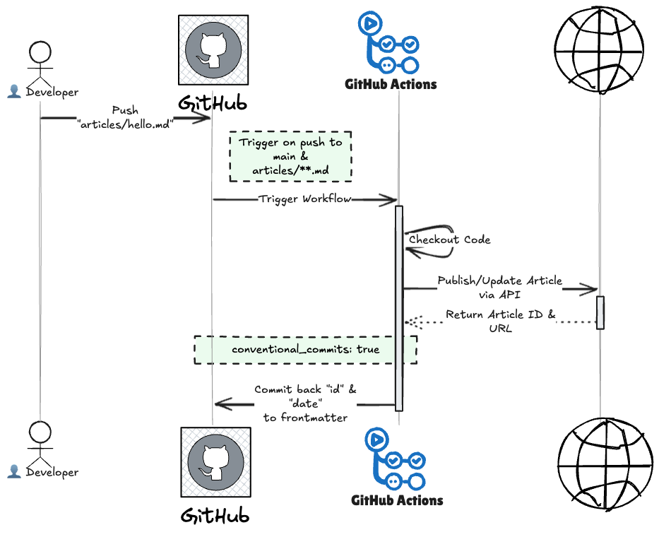

# Introduction

As software engineers, we spend a significant amount of our time in the terminal and code editors. We love version control, we love automation, and we love plain text. So, why should our blogging experience be any different?

This is my first post managed entirely through a **GitOps workflow**. Instead of using the web editor, I'm writing this in Markdown locally, committing it to a Git repository, and letting automation handle the rest.

## Why this approach?

There are a few key reasons why I decided to switch to this workflow:

1. **Version Control**: I have a complete history of my edits. I can branch, experiment with drafts, and merge when ready.
2. **Local Environment**: I can use my favorite editor (VS Code, Neovim, etc.) with all my snippets and linters.
3. **Offline Editing**: I don't need an internet connection to write.
4. **Backup**: My articles are stored safely in a repository, not just on a third-party platform.

## How it works

The setup is surprisingly simple. Here is the workflow visualization:



I have a GitHub Actions workflow that listens for changes in my `articles/` directory. You can find the complete source for this setup in my repository: [kanywst/dev.to.kanywst](https://github.com/kanywst/dev.to.kanywst).

```yaml
on:
  push:
    paths:
      - 'articles/**/*.md'
```

When I push a new Markdown file with `published: true` in the frontmatter, the action uses the Dev.to API to publish it automatically. If I make edits later, the action updates the existing post.

## Conclusion

This small bit of automation reduces friction and makes writing feel more like... well, coding. If you are interested in setting this up for yourself, check out the [publish-devto](https://github.com/sinedied/publish-devto) GitHub Action.

Happy coding (and writing)!
