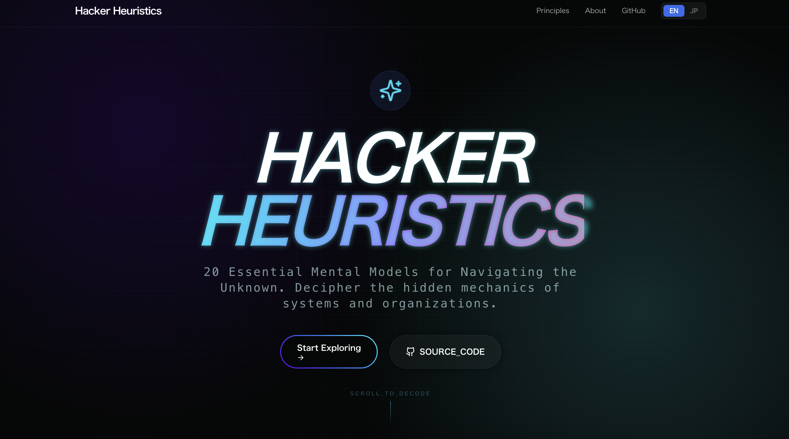
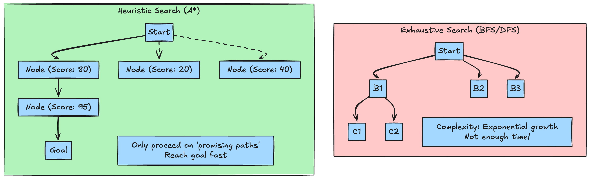

# Introduction

It is 2026. The systems we handle have grown beyond the limits of what any single human can fully comprehend.
With AI-generated code becoming the norm and the volume of codebase we manage exploding, if we chase "perfect architecture," "100% test coverage," or "mathematically optimal resource allocation," our budget and time will run out long before release.

This is where **"Heuristics"** become an engineer's most powerful weapon.
These are not strictly "correct" answers, but **"pragmatically 'good enough' answers"** derived from experience that allow us to arrive at a solution instantly.

I became interested in these heuristics and compiled them below.

* [Hacker Heuristics](https://kanywst.github.io/hacker-heuristics/)
* [Github](https://github.com/kanywst/hacker-heuristics)

---

## 1. Search & Algorithm Heuristics

When facing problems where computational complexity explodes, we use a shortcut called an "Evaluation Function."

### A* Search (Guided by Evaluation Functions)

When looking for a goal in a maze, we don't check every single path. We prioritize checking the "paths that look like they lead towards the goal."

### Greedy Algorithm

Give up on "predicting the entire future" and repeatedly choose "the best option for this specific moment."

* **Application**: Cloud resource scaling. The **Kubernetes HPA (Horizontal Pod Autoscaler)** is fundamentally based on this greedy approach. The rule "load went up recently, so add a Pod for now" is far more robust in operations than trying to perform strict cost calculations based on future predictions.

---

## 2. System Design Heuristics: Fighting Complexity

Architects internalize the following principles to the level of "intuition" to make immediate trade-off decisions.

### CAP Theorem Intuition

> "Network Partition (P) is inevitable. Therefore, decide right now whether to sacrifice Consistency (C) or Availability (A)."

In distributed systems, satisfying all three is mathematically impossible. This heuristic of "resignation" drastically shortens design time.

### Conway's Law

> "Any organization that designs a system... will inevitably produce a design whose structure is a copy of the organization's communication structure."

* **Practice**: When defining microservice boundaries, look at where the conversation stops between teams before seeking the technical optimum. Aligning the organizational chart with service boundaries is the design with the least friction.

### The Law of Caching (Locality of Reference)

> "If the frequency of data reads is overwhelmingly higher than writes, cache it without hesitation."

In most cases, placing a Redis layer is a faster way to reach a "good enough solution" than spending time optimizing complex queries.

### Gall's Law

> "A complex system that works is invariably found to have evolved from a simple system that worked."

* **Practice**: Do not build massive microservices from the start. First, build a monolith as the "minimum unit that works correctly," and evolve from there.

---

## 3. Code & Refactoring Heuristics

### Chesterton's Fence

> "Do not remove a fence until you know why it was put up in the first place."

* **Practice**: When you find a validation logic that makes no sense, do not delete it immediately. It is a safe heuristic to hold off on changes until you discover the "defensive reason" the original engineer placed it there.

### Rule of Three

> "Do not rush to abstract (commonize) code until you have written it three times."

Premature abstraction makes future changes difficult. Tolerate copy-paste up to the third time, and only commonize when the shared structure turns into a certainty.
This aligns with the **Go** proverb: **"A little copying is better than a little dependency."**

---

## 4. Debugging & Operations Heuristics

### Occam's Razor

> "Entities should not be multiplied beyond necessity." (The simplest explanation is usually the correct one.)

When facing a mysterious failure, before suspecting a "kernel bug" or a "zero-day vulnerability," suspect a "recent config change" or a "simple typo." The simplest cause is usually the culprit.

### Pareto Principle (80/20 Rule)

> "80% of performance issues arise from 20% of the code."

Optimizing every function is a waste of time. The most efficient heuristic is to identify the top few hotspots with `pprof` and hammer only those.

---

## 5. UX Design Heuristics: Reducing Cognitive Load

Even in 2026, Nielsen's principles remain the North Star for engineers designing interfaces.

### Visibility of System Status

> "The system should always keep users informed about what is going on, through appropriate feedback within a reasonable time."

* **Practice**: When running heavy asynchronous processing, don't just show text saying `Processing...`; display a progress bar or a skeleton screen. Do not give the user the anxiety that "the system might be frozen."

### Match between System and the Real World

> "The system should speak the users' language, with words, phrases and concepts familiar to the user, rather than system-oriented terms."

* **Practice**: Do not display `Error 500: Internal Server Error`. Translate it into human language like: `We are having trouble connecting right now. Please try again in a few minutes.`

### Error Prevention

> "Even better than good error messages is a careful design which prevents a problem from occurring in the first place."

* **Practice**: Instead of showing an error when a user selects a past date, make past dates unselectable (grayed out) on the calendar. Build a mechanism that prevents wrong operations from the start.

---

## 6. Decision Making Heuristics: Avoiding the Mud

### Bikeshedding (Law of Triviality)

> "People argue passionately about trivial things (the color of the bike shed) but stay silent on complex things (the design of a nuclear plant)."

* **Practice**: Stop spending an hour reviewing the number of spaces in the code. Force the conversation back to the core architecture that everyone is avoiding because it's difficult.

### Yak Shaving

> "A series of small tasks that must be performed before the project can progress to the next step."

If you start "optimizing container image size" for the sake of "developing a new feature," ask yourself: "Am I currently moving toward my original goal?"

---

## Conclusion

Heuristics are not a compromise on quality; they are a **"survival strategy to focus limited resources on truly important problems."**

In 2026, an era where information noise continues to increase, engineers are not required to "know everything."
What is required is the power to possess a **"catalog of intuition" that says "for this case, that principle should work,"** and to confidently select the shortcut.

If you have other interesting or favorite heuristics, please let me know in the comments.
