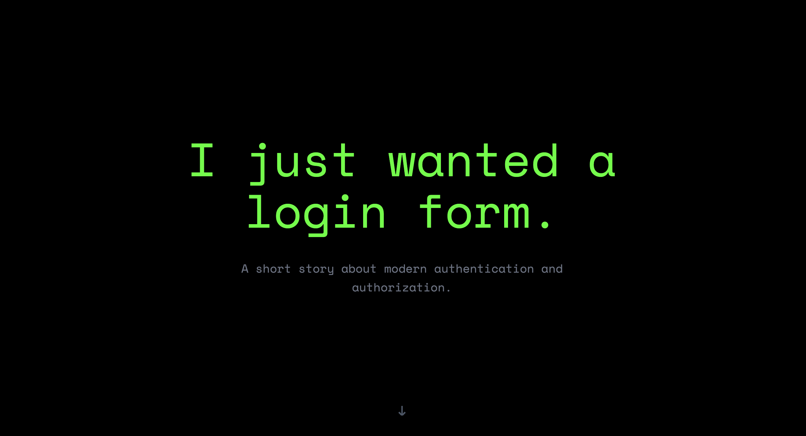

# Introduction

Although we group them under "Authentication and Authorization," these fields cover various domains and technologies and are extremely complex.

I am personally involved in developing products related to authentication and authorization, and I get a headache every time I have to define requirements.
For a personal web app development project, a "simple login form with just an ID and password" should be sufficient.

But what is the reality?
Before I knew it, I was scouring OAuth 2.0 RFCs, drawing OIDC flow diagrams, fighting with SAML XML, and debugging OPA (Open Policy Agent) Rego language...

I developed a joke site called **"I just wanted a login form."** to express the "grotesquely complex swamp" that modern Authentication and Authorization systems harbor, incorporating satire and humor.

## The "Chaos"

This site is built as a React SPA and visualizes the "excessive authentication requirements" that modern developers face.

* **Endless Social Logins:** A wall of buttons covering everything from major providers to minor ones.
* **Overly Strict Password Policies:** Validation that won't forgive you even if you use "uppercase, lowercase, numbers, and symbols."
* **SAML / SSO / Enterprise Features:** Mockups of enterprise features that are absolutely unnecessary for personal development.

These are all answers from the modern ecosystem to the pure desire of "I just want to let users log in."

## Inspiration

This project was developed with great inspiration and ideas from [YOU JUST NEED POSTGRES](https://youjustneedpostgres.com/). If that is an antithesis to "DB complexity," this is a scream regarding "Auth complexity."

## Links

For those who want to actually experience this "swamp," click here.

* **Site:** [kanywst.github.io](https://kanywst.github.io/)
* **GitHub Repository:** [github.com/kanywst/kanywst.github.io](https://github.com/kanywst/kanywst.github.io)

## Conclusion

The site's footer is inscribed with a heartfelt message from the developer (me).

> "Made with frustration by a security developer. Please don't ask me about Auth."

It shows just how much of a tech stack an engineer who "just wanted to make a login form" or "was just interested in authentication/authorization" is forced to learn, leading to despair.
The next time someone tells you, "Just make a simple login feature," please remember this site and activate your self-defense instincts.

(By the way, to be honest, the field of authentication and authorization is very deep, and learning it is a lot of fun. I intend to continue developing while soaking in this swamp.)
