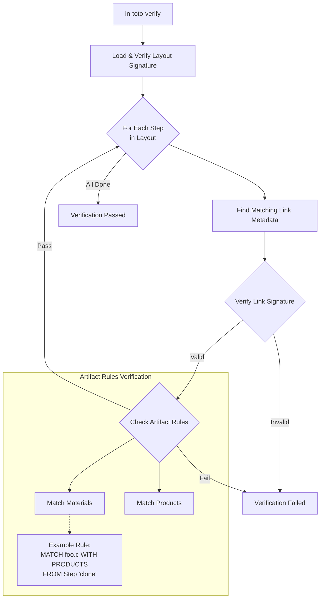

# in-toto Deep Dive: ソフトウェアサプライチェーンの「地図」と「証拠」

昨今のセキュリティインシデントの多くは、開発者が書いたコードそのものではなく、ビルドパイプラインや配布プロセス（サプライチェーン）への攻撃によるものです。
**in-toto** は、このサプライチェーン全体を保護するためのフレームワークであり、CNCF の Graduated Project です。

今回は、in-toto の Python リファレンス実装 (`in-toto/in-toto`) を読み解き、そのコアコンセプトである **Layout (地図)** と **Link (証拠)** がどのように機能しているのかを解説します。

## 1. in-toto の世界観: Layout vs Link

in-toto のアーキテクチャは、**「プロジェクト管理者が定義する理想（Layout）」** と **「実際に作業者が行った事実（Link）」** を照らし合わせるというモデルに基づいています。

```mermaid
graph TD
    %% Styling
    classDef layout fill:#e1f5fe,stroke:#01579b,stroke-width:2px;
    classDef link fill:#fff9c4,stroke:#fbc02d,stroke-width:2px;
    classDef verify fill:#f3e5f5,stroke:#7b1fa2,stroke-width:2px;

    subgraph "Project Owner (Root of Trust)"
        Layout[Layout<br>(The Map)]:::layout
    end

    subgraph "Functionaries (Workers)"
        Link1[Link: Clone<br>(Evidence)]:::link
        Link2[Link: Build<br>(Evidence)]:::link
        Link3[Link: Test<br>(Evidence)]:::link
    end
    
    subgraph "Client / Verifier"
        Verify{Verify}:::verify
    end

    Layout --> Verify
    Link1 --> Verify
    Link2 --> Verify
    Link3 --> Verify
    
    Layout -.->|Defines Steps & Public Keys| Link1
```

### Layout (models/layout.py)
「誰が（Functionary）」「何を（Step）」「どのような順序で（Rules）」行うべきかを定義した署名付き JSON ファイルです。
ソースコード上では `Layout` クラスとして定義され、`Step` や `Inspection` のリストを持ちます。

### Link (models/link.py)
各工程の担当者が作業を行った際に生成するメタデータです。
「入力ファイル（Materials）」と「出力ファイル（Products）」のハッシュ値、実行したコマンド、環境情報などが記録されます。

## 2. Execution Flow: 証拠の作成 (in-toto-run)

開発者がビルドやテストを行う際、`in-toto-run` コマンドで実際のコマンドをラップします。
`in_toto/runlib.py` がその中心的な実装です。

```python
# in_toto/runlib.py (概念コード)

def in_toto_run(step_name, material_list, product_list, command, key):
    # 1. Record Materials (Before)
    # コマンド実行前のファイル状態をハッシュ化して記録
    materials = record_artifacts(material_list)

    # 2. Execute Command
    # 実際のコマンド (e.g., "make build") をサブプロセスで実行
    subprocess.call(command)

    # 3. Record Products (After)
    # コマンド実行後のファイル状態をハッシュ化して記録
    products = record_artifacts(product_list)

    # 4. Create Link Metadata
    link = Link(name=step_name, materials=materials, products=products, ...)
    
    # 5. Sign and Dump
    # 担当者の秘密鍵で署名し、ファイル (.link) として保存
    link.sign(key)
    link.dump()
```

このプロセスにより、**「どのファイルを使って、どのコマンドを実行し、何が生成されたか」** が改ざん不可能な状態で記録されます。

## 3. Verification Flow: 整合性の検証 (in-toto-verify)

最終成果物の利用者は、Layout と一連の Link を集め、`in-toto-verify` を実行します。
`in_toto/verifylib.py` の `in_toto_verify` 関数が検証ロジックの本体です。



### Artifact Rules (rulelib.py)
in-toto の最も強力な機能の一つが「Artifact Rules」です。
例えば、「ビルド工程の入力ファイル（Materials）は、クローン工程の出力ファイル（Products）と一致していなければならない」といったルールを Layout に記述できます。

これにより、**「正規のソースコードからビルドされたこと」** を数学的に証明できます。もし途中でソースコードが改ざんされていれば、ハッシュ値が一致せず検証に失敗します。

## 4. Inspections: 監査の自動化

Layout には `Step` だけでなく `Inspection` も定義できます。
これは検証時（Verify 時）に実行されるコマンドです。

例えば、「生成されたバイナリに対して `untar` を実行し、中身の構造をチェックする」といった処理を定義できます。
`verifylib.py` は、Link の検証が終わった後、定義された Inspection を順次実行し、その結果（戻り値）をチェックします。

## まとめ

in-toto は、単一の署名ツール（GPG や Cosign）とは異なり、**パイプライン全体の整合性を保証する** ためのシステムです。

- **Runlib**: 作業の前後でファイルシステムのスナップショットを撮り、証拠（Link）を残す。
- **Verifylib**: 地図（Layout）に従って証拠をつなぎ合わせ、鎖（Chain）が切れていないか確認する。

このモデルは、SLSA (Supply-chain Levels for Software Artifacts) のようなセキュリティ標準の実装基盤としても広く使われています。
次回は、この in-toto の考え方を Kubernetes 上で実現する **Tekton Chains** について解説します。
