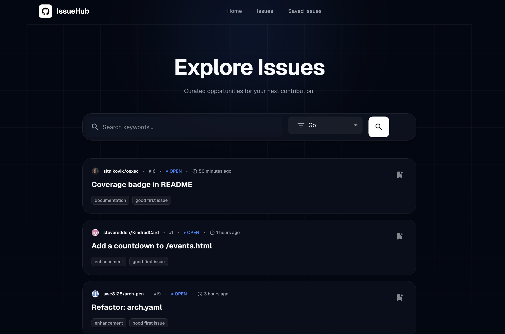

# Introduction

Let's be real—you want to contribute to Open Source Software (OSS), don't you? You've seen those legendary developers with their green-filled GitHub graphs, and you admire that world. You want to be a part of it. You want to give back to the tools you use every day.

But then, reality hits. **"Where do I even start?"**

The codebase is massive, the issues are intimidating, and you feel like you're drowning in a sea of complexity. You've heard people say, "Just look for a 'good first issue' label," but manually hunting through thousands of repositories is a nightmare. It's frustrating, and it's exactly where most people give up before they even write their first line of code for an OSS project.

That's exactly why I built **IssueHub**.

I wanted to create a "compass" for developers like us—the ones who have the passion but are lost in the vast ocean of GitHub. IssueHub is designed to aggregate those entry-level opportunities and serve them to you on a silver platter, so you can stop searching and start contributing.

👉 **Check it out here:** [https://kanywst.github.io/IssueHub](https://kanywst.github.io/IssueHub)

## Links

- **GitHub Repository:** [github.com/kanywst/IssueHub](https://github.com/kanywst/IssueHub)

---

## Tech Stack

I chose a modern, lightweight stack to ensure a great developer experience and high performance without the overhead of complex backend infrastructure. The application follows a **Zero-Server Architecture**:

- **Framework**: **Next.js 15** (App Router, Static Export)
- **Language**: **TypeScript** & **React 19**
- **Styling**: **Material UI v7** & **Tailwind CSS v4** (Industrial Dark / Technical Noir)
- **Data Fetching**: **React Query** (TanStack Query v5)
- **API Integration**: **Octokit** (GitHub Public API)
- **Deployment**: **GitHub Pages** (via GitHub Actions)
- **Testing**: **Playwright** (E2E Testing)

By leveraging Next.js Static Exports and the GitHub API directly from the client, IssueHub runs entirely in the browser. No databases to maintain, no servers to crash—just pure, fast static content.

---

## Conclusion

IssueHub is more than just a tool; it's a "compass" for beginners navigating the vast ocean of open source. My goal is to use this platform to achieve my first contribution and help thousands of others do the same.

The best part? **It's live right now.** Since the architecture is static, it's hosted for free on GitHub Pages.

👉 **Check it out here:** [https://kanywst.github.io/IssueHub](https://kanywst.github.io/IssueHub)

Please give it a try and let me know what you think in the comments! If you like the project, I would appreciate a star on GitHub.
