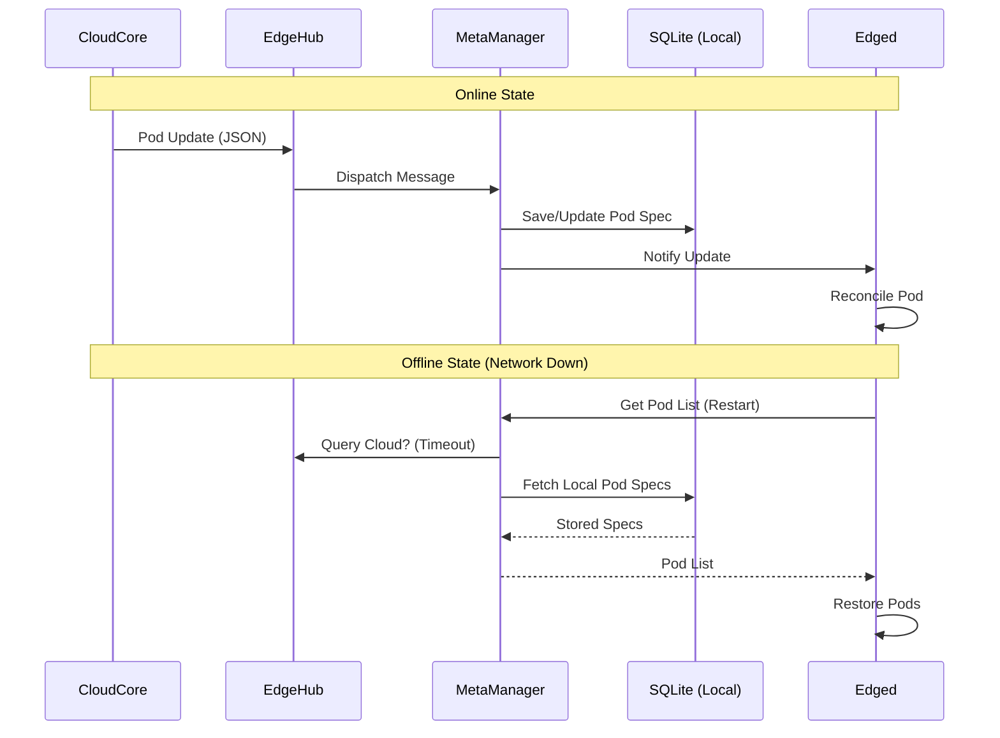

# KubeEdge Deep Dive: Kubernetes をエッジの最前線へ

IoT デバイスや工場内のサーバーなど、ネットワークが不安定でリソースが限られた環境（エッジ）で Kubernetes を使いたい。
そんな要望に応えるのが **KubeEdge** です。

今回は、KubeEdge のソースコード（`kubeedge/cloud` および `kubeedge/edge`）を読み解き、なぜ KubeEdge が「切れても動く」のか、その仕組みを解説します。

## 1. CloudCore vs EdgeCore: 非対称なアーキテクチャ

KubeEdge は、クラウド側に置く **CloudCore** と、エッジノードで動く **EdgeCore** の2つに分かれています。

```mermaid
graph LR
    %% Styling
    classDef cloud fill:#e1f5fe,stroke:#01579b,stroke-width:2px;
    classDef edge fill:#fff9c4,stroke:#fbc02d,stroke-width:2px;
    classDef k8s fill:#f3e5f5,stroke:#7b1fa2,stroke-width:2px;

    subgraph "Cloud (Kubernetes Cluster)"
        API[Kube API Server]:::k8s
        CloudCore[CloudCore]:::cloud
        
        API <-->|Watch/Update| CloudCore
    end

    subgraph "Edge (IoT Device / Gateway)"
        EdgeCore[EdgeCore]:::edge
        Pod[Pod]:::edge
        Device[Device (MQTT)]:::edge
        
        EdgeCore --> Pod
        EdgeCore <--> Device
    end

    CloudCore <===>|WebSocket / QUIC| EdgeCore
```

この通信路（CloudHub - EdgeHub）が KubeEdge の生命線ですが、KubeEdge の真価は「通信が切れた後」にあります。

## 2. Edged: 軽量化された Kubelet

EdgeCore の中には **Edged** と呼ばれるモジュールがあります。これは Kubernetes の Kubelet を軽量化したものです。
`kubeedge/edge/pkg/edged/edged.go` を見ると、Kubelet のコードを一部再利用しつつ、不要な機能（In-tree Cloud Provider連携など）を削ぎ落としていることが分かります。

```go
// kubeedge/edge/pkg/edged/edged.go

type edged struct {
    // Kubelet のコア機能を内包
    KubeletServer  *kubeletoptions.KubeletServer
    // ...
}
```

これにより、メモリリソースの限られたエッジデバイスでも Pod を起動することができます。

## 3. MetaManager: オフライン自律動作の鍵

なぜ KubeEdge はクラウドと切断されても Pod を維持できるのか？
その答えは **MetaManager** とローカル DB (SQLite) にあります。



`kubeedge/edge/pkg/metamanager` の実装を見ると、MetaManager は CloudCore から受け取ったメタデータ（Pod, ConfigMap, Secret）をすべてローカルの SQLite に保存しています。
Edged は API Server ではなく、この MetaManager に問い合わせを行うため、ネットワークが切断されていても、デバイスの再起動後ですら Pod を復元できるのです。

## 4. DeviceTwin: IoT デバイスとの連携

KubeEdge は単にコンテナを動かすだけでなく、**DeviceTwin** と呼ばれる仕組みで IoT デバイスの状態（MQTT メッセージなど）を Kubernetes リソース（Device CRD）として管理できます。

これにより、「エアコンの設定温度を 25℃ にする」という操作を、Kubernetes のマニフェストを `kubectl apply` するだけで実現できます。

## まとめ

KubeEdge は、Kubernetes を「データセンターの外」に持ち出すための工夫の塊です。

- **WebSocket/QUIC**: NAT を越えてつながる堅牢なトンネル。
- **MetaManager**: ネットワーク切断を前提としたローカルキャッシュ戦略。
- **Edged**: エッジ向けにダイエットした Kubelet。

これにより、自動運転車、スマートファクトリー、洋上の風力発電所など、従来 Kubernetes が届かなかった場所でもコンテナオーケストレーションが可能になります。
