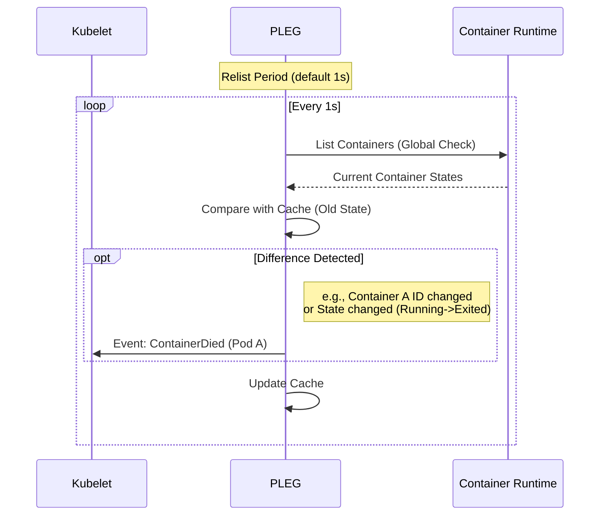

# Kubelet Deep Dive: Nodeの「脳」を解剖する

Kubernetes クラスタにおいて、実際にコンテナを起動・停止し、Node の状態を管理しているのは **Kubelet** です。
API Server が「司令塔」だとすれば、Kubelet は現場の「指揮官」であり、Node の脳とも言える重要なコンポーネントです。

今回は、Kubernetes のソースコード（主に `pkg/kubelet` 配下）を読み解き、Kubelet がどのように Pod を管理しているのか、その内部実装を視覚的に解説します。

## 1. Kubelet の全体像 (Architecture)

Kubelet の役割はシンプルに言えば **「PodSpec（あるべき姿）と Node 上のコンテナ（現在の姿）を一致させること」** です。
しかし、その内部は非同期なイベントループと多数のマネージャーで構成された複雑なシステムです。

以下の図は、Kubelet の中心的なコンポーネント間のデータフローを示しています。

```mermaid
graph TD
    %% Styling
    classDef control fill:#e1f5fe,stroke:#01579b,stroke-width:2px;
    classDef worker fill:#fff9c4,stroke:#fbc02d,stroke-width:2px;
    classDef external fill:#f3e5f5,stroke:#7b1fa2,stroke-width:2px,stroke-dasharray: 5 5;

    subgraph "External"
        APIServer[API Server]:::external
        CRI[Container Runtime<br>(containerd/CRI-O)]:::external
    end

    subgraph "Kubelet (pkg/kubelet)"
        SyncLoop(("SyncLoop<br>(The Heart)")):::control
        PLEG[PLEG<br>(Pod Lifecycle Event Generator)]:::control
        PodCfg[PodConfig<br>(Config Source)]:::control
        
        subgraph "Pod Workers"
            Worker1[Pod Worker 1]:::worker
            Worker2[Pod Worker 2]:::worker
            SyncPod[SyncPod<br>(Reconciliation Logic)]:::worker
        end
        
        ProbeManager[Probe Manager]:::control
        StatusManager[Status Manager]:::control
    end

    %% Flows
    APIServer -- "Watch Pods" --> PodCfg
    PodCfg -- "ADD/UPDATE/DELETE" --> SyncLoop
    
    CRI -- "List/Inspect Containers" --> PLEG
    PLEG -- "Container Died/Started" --> SyncLoop
    
    SyncLoop -- "Dispatch Work" --> Worker1
    SyncLoop -- "Dispatch Work" --> Worker2
    
    Worker1 --> SyncPod
    
    SyncPod -- "Create/Kill Containers" --> CRI
    SyncPod -- "Update Status" --> StatusManager
    
    ProbeManager -- "Liveness/Readiness Failure" --> SyncLoop
    StatusManager -- "Update Pod Status" --> APIServer
```

## 2. SyncLoop: Kubelet の心臓部

Kubelet のメインプロセスは `Run()` メソッドから始まりますが、その核心にあるのは `SyncLoop` です。
`pkg/kubelet/kubelet.go` にあるこのループは、様々なチャネルからのイベントを待ち受け、適切なアクション（主に `PodWorker` へのディスパッチ）を行います。

```go
// pkg/kubelet/kubelet.go (概念コード)

func (kl *Kubelet) SyncLoop(updates <-chan kubetypes.PodUpdate, handler SyncHandler) {
    for {
        select {
        case u := <-updates:
            // 1. Config Update (API Serverからの変更通知)
            handler.HandlePodUpdates(u.Pods)
            
        case e := <-plegCh:
            // 2. PLEG Event (コンテナが死んだ、始まったなどの通知)
            handler.HandlePodSyncs(e)
            
        case <-syncCh:
            // 3. Housekeeping (定期的な再同期)
            // 時間経過でズレがないか確認
            
        case <-probeCh:
            // 4. Probes (Liveness/Startup Probeの失敗)
            handler.HandlePodSyncs(u)
        }
    }
}
```

この「無限ループ」が止まると、Kubelet は新しい変更に反応できなくなります（Node NotReady などの原因になります）。

## 3. PLEG: ポーリング地獄からの解放

昔の Kubelet は、全コンテナの状態を確認するために常にコンテナランタイム（Docker 等）をポーリングしていました。これは CPU 負荷が高く、非効率でした。
そこで導入されたのが **PLEG (Pod Lifecycle Event Generator)** です。

`pkg/kubelet/pleg/pleg.go` を見ると、PLEG は「前回の状態」と「現在の状態」を比較し、差分だけをイベントとして `SyncLoop` に送っていることがわかります。



これにより、Kubelet は「何か起きた時だけ」詳細な処理を行えばよくなり、効率が劇的に向上しました。

## 4. SyncPod: 実際の処理を行うワーカー

`SyncLoop` がイベントを受け取ると、それは `PodWorker` に渡され、最終的に `SyncPod` メソッド (`pkg/kubelet/kubelet.go`) が実行されます。
ここが「宣言的設定」の終着点であり、実際のコンテナ操作が行われる場所です。

`SyncPod` の処理フローは以下のようになっています。この関数は **冪等（Idempotent）** に設計されており、何度呼ばれても正しい状態に収束するようになっています。

```mermaid
flowchart TD
    Start[SyncPod Called] --> Step1[Calculate Pod Status]
    Step1 --> Step2{SandBox Ready?}
    
    Step2 -- No --> CreateSandbox[Create Pod Sandbox<br>(Pause Container)]
    Step2 -- Yes --> Step3
    CreateSandbox --> Step3
    
    Step3[Compute Actions]
    note[Diff Spec vs Status]
    Step3 --- note
    
    Step3 --> Actions{Actions Needed?}
    
    Actions -- Kill --> KillContainer[Kill Unwanted Containers]
    Actions -- Create --> PullImage[Pull Image]
    PullImage --> StartContainer[Start New Containers]
    
    Actions -- No Change --> UpdateStatus[Update Status Manager]
    KillContainer --> UpdateStatus
    StartContainer --> UpdateStatus
    
    UpdateStatus --> End[Done]
```

### コードで見る SyncPod の要点

ソースコード上のコメントにも、そのワークフローが明確に記されています（`pkg/kubelet/kubelet.go`）。

1.  **Status Calculation**: まず `generateAPIPodStatus` で「今の Pod の状態」を作ります。
2.  **Admissions**: Node のリソース不足などで Pod を拒否すべきかチェックします。
3.  **Network/Sandbox**: Pod のネットワーク名前空間（Sandbox）がなければ作成します。
4.  **Containers**: `kl.containerRuntime.SyncPod` を呼び出し、CRI を通じてコンテナの作成・削除を行います。

## まとめ

Kubelet は巨大な一枚岩のプログラムに見えますが、内部はきれいに分業されています。

1.  **SyncLoop**: 全体のイベントコーディネーター。
2.  **PLEG**: 変化を敏感に察知するセンサー。
3.  **PodWorkers (SyncPod)**: 実際に手を動かす作業員。

この構造を理解していると、例えば「Pod が Terminating から進まない（Worker が詰まっている？）」「ステータス反映が遅い（PLEG の遅延？）」といったトラブルシューティングの解像度が上がります。

次回は、Kubelet がどのように **CNI (Container Network Interface)** と連携して IP アドレスを割り当てているのか、その深層に迫ります。
