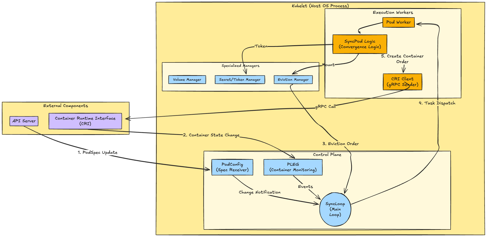
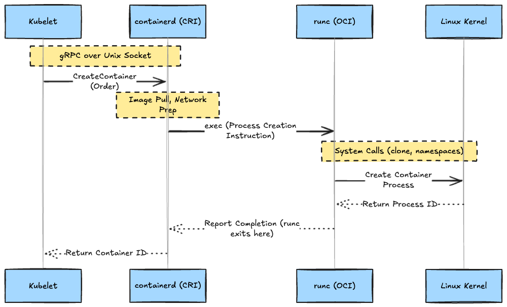
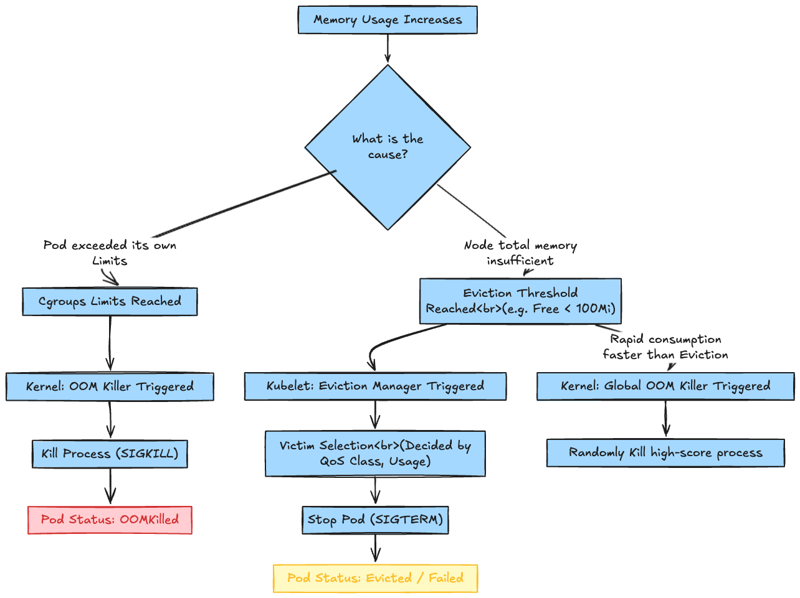
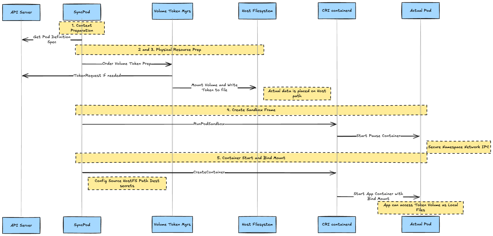

# Introduction

In a Kubernetes cluster, it is the **Kubelet** that actually starts/stops containers and manages the state of the Node.
If the API Server is the "Command Tower," the Kubelet is the "Field Commander" residing on each Node, acting as the most critical component—the brain of the Node.

In this article, we will take a deep dive into the internal implementation of how Kubelet behaves on the host OS, its **coordination with runtimes like CRI/OCI**, and how it executes **Eviction—an autonomous defense measure** when a Node falls into crisis.

---

## 1. The Reality and Execution Environment of Kubelet

Kubelet is not a container running inside a Pod, but a **standalone binary running directly on the Node's OS**.

### Bare Metal/VM vs Kind (Kubernetes IN Docker)

In many environments, it is started as a service by the OS's `systemd`. However, `kind`, which is popular for development environments, takes a slightly special structure. Understanding this makes the true nature of "containers" clearer.

* **Standard Environment (VM/Bare Metal)**: The host OS's `systemd` manages `/usr/bin/kubelet` directly.
* **Kind Environment**: The "Node" itself is a Docker container. Inside this "Node Container," `systemd` (PID 1) runs pseudo-ly, and `kubelet` is started as its child process.

A Node where Kubelet has stopped is determined as `NotReady` by the control plane and is excluded from new workload assignments.

---

## 2. Multifaceted Missions as a Field Supervisor

Kubelet's job isn't just matching the actual containers (reality) to the `PodSpec` (ideal state) obtained from the API Server. It executes the following missions continuously and autonomously using specialized managers:

1. **Pod Lifecycle Management**: Controls everything from Pod creation to deletion via the `SyncPod` logic.
2. **Storage Bridge**: The `VolumeManager` mounts external storage to the host, making it available for containers.
3. **Secret Delivery**: `TokenManager` and `SecretManager` acquire ServiceAccount Tokens or Secrets and inject them appropriately.
4. **Regular Status Reporting**: Pushes Node resource usage and Pod health status to the API Server.
5. **Health Check Execution**: Directly executes Liveness/Readiness Probes and attempts restarts if abnormalities are found.
6. **Node Self-Defense**: Forcibly evicts Pods (Eviction) at resource limits to prevent a total Node crash.

---

## 3. Kubelet Overall Architecture

Inside Kubelet is a highly asynchronous system where multiple specialized units (Managers) coordinate around a central event loop called `SyncLoop`.

The following diagram represents the flow of information and the boundaries of responsibility.

---

## 4. CRI and OCI: The Hierarchical Structure of Container Startup

When Kubelet commands "Create a container," there is a clear division of roles (hierarchy) behind the scenes. Explaining without using the word "Docker," it looks like this:

1. **CRI (Container Runtime Interface)**: The **"Language (Protocol)"** for Kubelet to issue commands.
2. **containerd (CRI Runtime)**: The **"High-level Runtime"** that receives commands and manages Image Pulls, etc.
3. **runc (OCI Runtime)**: The **"Low-level Runtime"** that talks to the Kernel to actually create processes.

It acts as a relay where Kubelet instructs `containerd`, and `containerd` triggers `runc`.

---

## 5. Node's Autonomous Defense: Eviction vs OOM Killer

The most confusing part of Kubernetes memory management is **"Eviction"** vs **"OOM Killer"**.
The perpetrators and triggers are completely different.

### Summary of Differences

|     Feature     |       Eviction (Node-pressure Eviction)        |        OOM Killer (Cgroup / Global)        |
| :-------------: | :--------------------------------------------: | :----------------------------------------: |
| **Perpetrator** |           **Kubelet** (The Manager)            | **Linux Kernel** (The Police/Executioner)  |
|   **Timing**    |   When entering the danger zone (Threshold)    | When completely exhausted / Limit exceeded |
|  **Behavior**   |     **Terminates Pods** to make them leave     |  **Immediately Kills Process (SIGKILL)**   |
|   **Purpose**   | Preventive measure to stop the Node from dying | Enforcement to protect OS or Cgroup limits |

### Logic Flow: The Road to Pod Death

There are two main patterns why a Pod dies from memory shortage: "Violation of its own contract (Limits)" or "Crisis of the entire Node".

Kubelet strives to maintain Node health by performing "organized eviction" (Eviction) before the "merciless execution" (OOM Killer) takes place.

---

## 6. SyncPod: Concrete Steps of Declarative Convergence

Finally, let's look at the flow of `SyncPod` where Kubelet actually starts a Pod. This is where Token injection and Volume mounting happen.

1. **Context Preparation**: Get the latest Pod definition from the API Server.
2. **Volume Mount**: Instruct `VolumeManager` to stand by with necessary storage mounted on the Host OS.
3. **Secret/ConfigMap Preparation**: `TokenManager` gets the Token from the API Server and places it as a file in a directory on the Host OS.
4. **Sandbox Creation**: First, create the "Pause" container (RunPodSandbox) which acts as the frame. Namespaces and Networks are created at this time.
5. **Container Startup**:
   * **Bind Mount** the Token or Volume prepared on the Host to the path inside the container (`/var/run/secrets/...`).
   * This allows the app inside the container to read the Token as if it were a local file.

---

## Conclusion

Kubelet is not merely an agent, but a complex autonomous control system.

1. **Entity**: A process on the Host OS (or a process inside the container in the case of Kind).
2. **Translation**: Hierarchically uses CRI (containerd) and OCI (runc) to realize containers.
3. **Defense**: Commands orderly withdrawal via Eviction before the Kernel's OOM Killer triggers.

When troubleshooting "Why did the Pod die? (OOMKilled or Evicted)" or "Why can't the Volume mount?", imagining this "brain" of the Kubelet is essential.
