# Introduction

Kubernetes networking revolves around the abstraction of "Service," but behind it lies historical context and evolution for scalability.
Especially the transition from **Endpoints** to **EndpointSlice** is critically important for large-scale cluster operations.

**Resource Map**

First, let's look at the overall resource relationship diagram. You can see how new and old resources (Endpoints / EndpointSlice) and external communication (Ingress / Gateway) are connected around the Service.

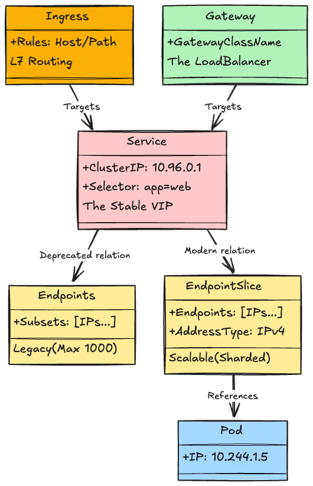

---

## 1. Service & Endpoints (The Foundation)

Before diving into Service implementation, let's clarify the boundary of **"when is a Service needed, and when is it not?"** There exists a "localhost boundary" here.

### The "Localhost" Boundary

A Kubernetes Pod is **"a collection of containers sharing a single IP address (shared Network Namespace)."**
Therefore, the communication method changes fundamentally depending on whether the partner is "inside the same Pod" or "in another Pod."

#### Case A: Container to Container (Inside Pod)

**→ Service is NOT needed.**
Containers within the same Pod (e.g., Web App and Log Collector Sidecar) can recognize each other's ports via `localhost`. This is the same sensation as separate processes communicating inside a PC.

#### Case B: Pod to Pod

**→ Service (Fixed IP) IS needed.**
Once you step out of a Pod, it is a world of fluctuating IPs. Since the partner Pod's IP changes with every restart, a "fixed destination (Service)" is needed to track it.

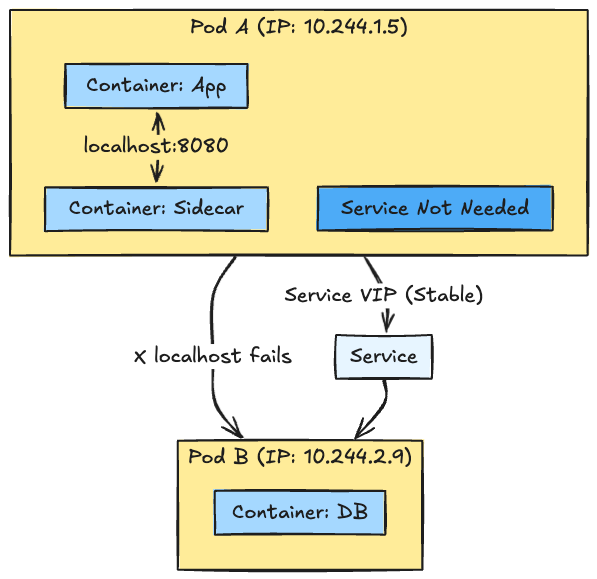

The **Service** acts as the bridge to cross this "Pod boundary," and the controller works behind the scenes to build that bridge.

### Service Selectors logic

How the Service selects the destination (Pod) to distribute traffic to is simple but powerful.
The Service manages "Label Selectors," not "IP addresses."

Let's look at the actual YAML. The binding happens automatically when the Service's `spec.selector` matches the Pod's `metadata.labels`.

```yaml
# 1. Service Definition
apiVersion: v1
kind: Service
metadata:
  name: my-svc
spec:
  selector:
    app: web  # <-- Key and value here...
  ports:
    - port: 80

---
# 2. Pod Definition
apiVersion: v1
kind: Pod
metadata:
  name: web-1
  labels:
    app: web  # <-- Matches label here
spec:
  containers:
    - name: nginx
      image: nginx
```

This relationship is illustrated below.

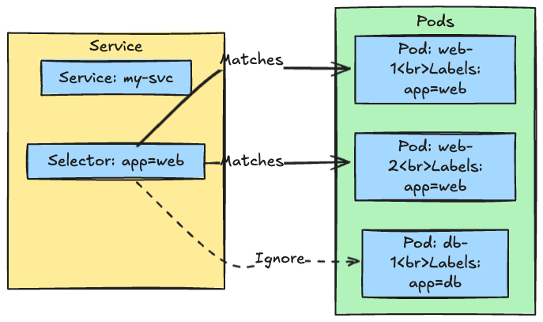

The Controller (EndpointSlice Controller) constantly watches Pods matching this Selector and writes their IP addresses into the backend resource (EndpointSlice), which serves as a "roster."

### ClusterIP Allocation

The ClusterIP assigned during Service creation is managed by the **Bitmap Allocator** in the API Server's `ipallocator` package.
This treats the CIDR range (e.g., 10.96.0.0/12) as a huge bitmap to find and secure free IPs at high speed.

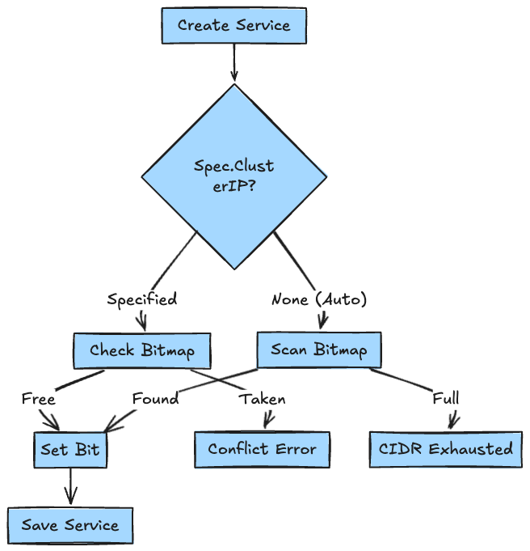

ClusterIP allocation is done in memory (and on the Bitmap snapshot in etcd) before writing to etcd, ensuring atomic reservation without duplication.

### Legacy Implementation: Endpoints

Historically, the **Endpoints** resource managed the Service's backend IP list. However, this had a major issue.

#### Deep Dive: Endpoints 1000 Limit

`kubernetes/pkg/controller/endpoint/endpoints_controller.go` defines a shocking constant:

```go
// kubernetes/pkg/controller/endpoint/endpoints_controller.go

const (
    // maxCapacity represents the maximum number of addresses that should be
    // stored in an Endpoints resource.
    maxCapacity = 1000

    // truncated is a possible value for `endpoints.kubernetes.io/over-capacity` annotation
    truncated = "truncated"
)

```

When Pods tied to a single Service exceed 1000, the Endpoints controller truncates the list and adds the `endpoints.kubernetes.io/over-capacity: truncated` annotation.
This not only causes traffic loss to some Pods but also causes the Endpoints object itself to become too huge, triggering **"Update Spikes"** where several MBs of data are broadcast to kube-proxy on all Nodes upon every update.

---

## 2. EndpointSlice (The Evolution)

To solve the Endpoints problem mentioned above, **EndpointSlice** was introduced. It is the standard for modern Kubernetes.

### EndpointSlice Overview

`pkg/controller/endpointslice/endpointslice_controller.go` splits and manages the backend IP list into multiple Slices (fragments).

* **Sharding**: Defaults to a maximum of 100 endpoints per slice (`maxEndpointsPerSlice`).
* **Efficiency**: Even if one Pod is added, only the small Slice containing that Pod is updated. Traffic to all nodes is drastically reduced.

#### Sync Logic

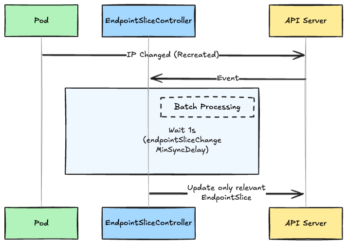

### EndpointSlice Mirroring

During the transition period, old `Endpoints` resources and new `EndpointSlice` resources need to coexist.
This is realized by the **EndpointSliceMirroring Controller** (`pkg/controller/endpointslicemirroring`).

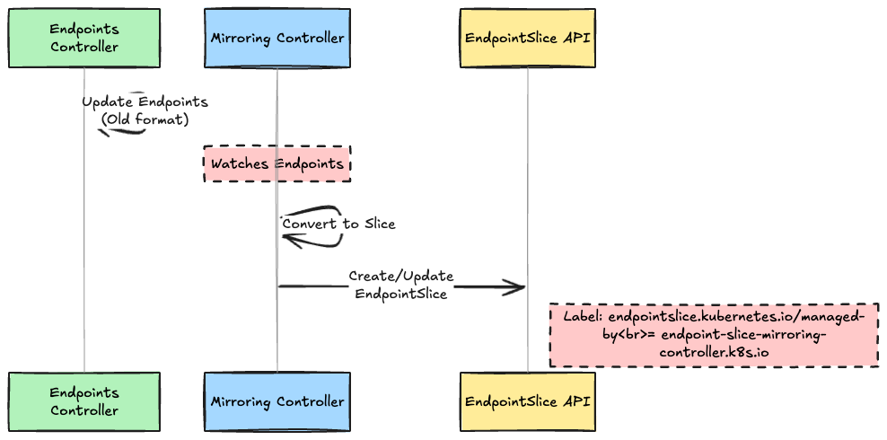

Even if your custom controller only creates old `Endpoints` resources, this mirroring controller automatically generates `EndpointSlice`.

### EndpointSlice Termination

What happens to the EndpointSlice when a Pod enters the `Terminating` state (deleted but process still running)?
There is `includeTerminating` logic in `pkg/controller/endpointslice/endpointslice_controller.go`.

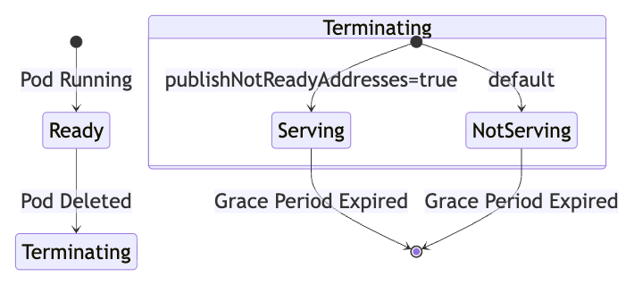

By default, `serving: false` is set the moment deletion starts, cutting it off from the load balancer. However, if `publishNotReadyAddresses: true` is set, the Terminating Pod continues to process requests.

### Topology Aware Hints

**Topology Aware Hints** answers the demand to "reduce communication costs" and "lower latency" in cloud environments.
The `topologycache` inside the EndpointSlice controller calculates which Zone (Availability Zone) the Pod is in and embeds hints into the EndpointSlice.

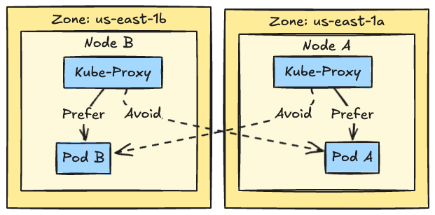

This allows Kube-Proxy to prioritize routing to "Pods in the same zone as itself."

### Lifecycle & Data Plane

The actors are all here. Now, let's organize the entire process from Service creation to packet flow.

#### Control Plane: Service Creation

The flow from running `kubectl create service` until the node actually accepts communication.
The important point is that **Kube-Proxy does not look at the Service resource (often)**. Modern Kube-Proxy mainly watches **EndpointSlice**.

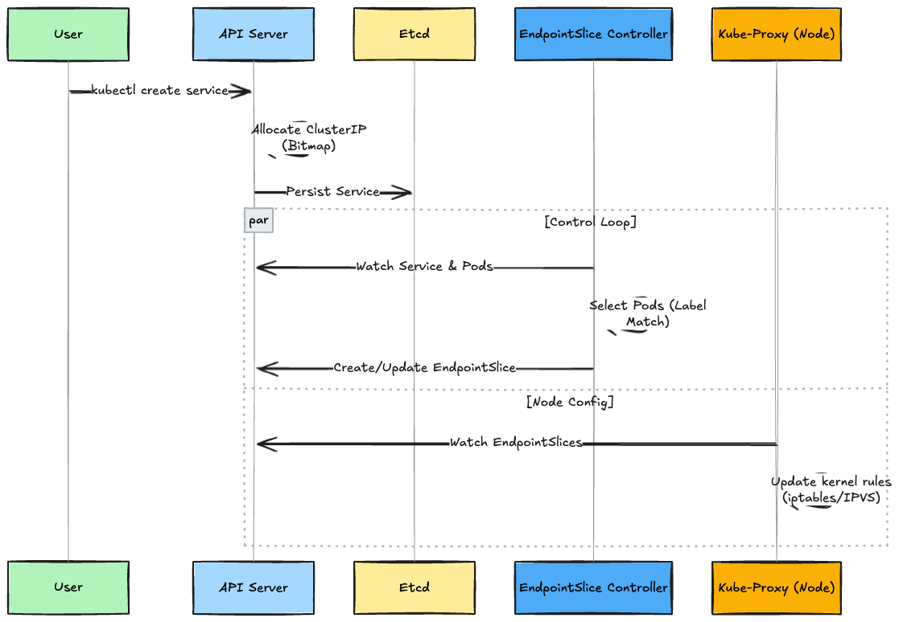

#### Data Plane: Request Flow

What happens when actually sending a packet from Pod A to the Service (ClusterIP)?
The protagonist here is the Linux Kernel (Netfilter). The entity of the Service is not a process, but **DNAT rules in iptables (or IPVS)**.

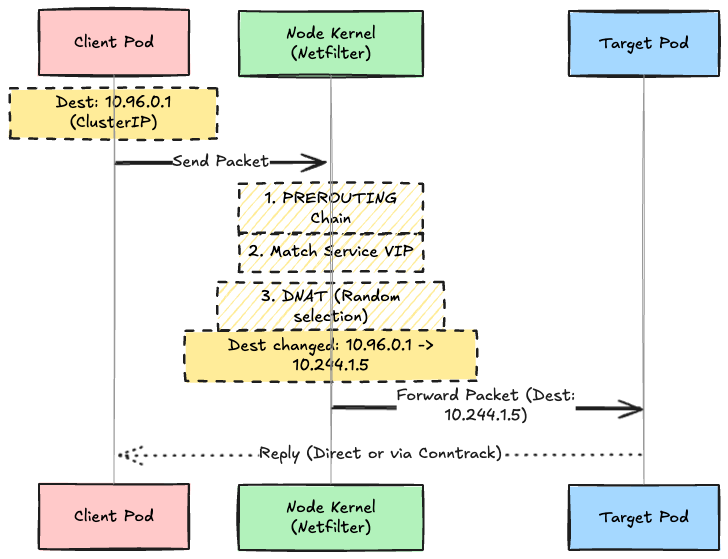

This "Probabilistic DNAT (Destination NAT)" is the true identity of Service load balancing in Kubernetes.

---

## 3. External Traffic & Security Deep Dive

Service and EndpointSlice are internal cluster plumbing, but external connections and security have specific "implementation barriers." Here we dig deep into what the controllers are doing behind the scenes, not just definitions.

### Ingress (`ing`)

Ingress is the resource most misunderstood by beginners. 90% of "I made an Ingress but can't connect" troubles are caused by the **absence of an Ingress Controller**.

#### Control Plane: The Config Generator

The Ingress resource itself is just "configuration data (YAML)." The **Ingress Controller** (e.g., `ingress-nginx`) monitors and actuates this.
Its true identity is a **loop process that watches the Kubernetes API, rewrites `nginx.conf`, and keeps reloading**.

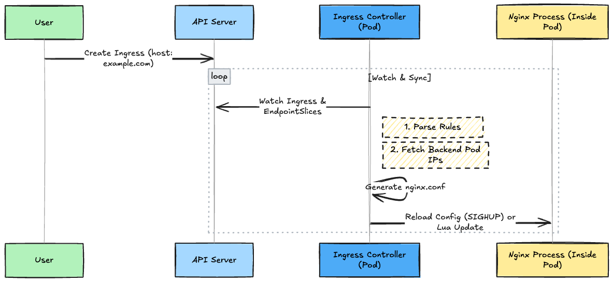

#### Data Plane: Bypassing Service IP

An interesting behavior in Ingress Controller implementation is **bypassing the Service IP (ClusterIP)** for performance.

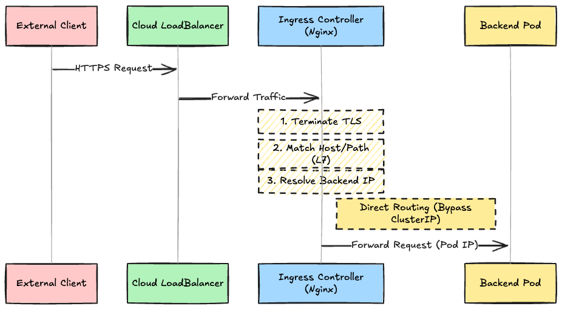

`ingress-nginx` refers to the Service resource to find backends, but in the actual routing configuration, it writes the **raw Pod IPs obtained from EndpointSlice**, not the Service ClusterIP. This avoids iptables DNAT overhead and allows it to control L7 features like Session Affinity itself.

:::note
**Q: If bypassing ClusterIP, is the Service resource unnecessary?**

A: **No, it is absolutely necessary.**
When Ingress sends packets, it doesn't pass through the ClusterIP itself, but the Service is used for **Target Discovery (identifying which Pods to send to)**.
The Ingress controller looks at the `Service` resource to check the label selector, and from there traces the `EndpointSlice` to find Pod IPs. In short, Service is not used as a "communication path," but is essential as an "index of the roster."
:::

#### Sample YAML: Ingress

```yaml
apiVersion: networking.k8s.io/v1
kind: Ingress
metadata:
  name: example-ingress
spec:
  rules:
  - host: example.com
    http:
      paths:
      - path: /
        pathType: Prefix
        backend:
          service:
            name: my-svc  # <--- Specify Service here (for Discovery)
            port:
              number: 80
```

### Gateway API (`gtw`)

Gateway API, the evolved version of Ingress, claims **separation of Infrastructure (Gateway) and Application (Route)** as the biggest structural difference, but from an implementation perspective, the standardization of **"Dynamic Provisioning of Data Plane"** is revolutionary.

#### Control Plane: Infrastructure Provisioning

In the Ingress era, you had to install the controller (Nginx, etc.) beforehand, but in many Gateway API implementations (especially cloud provider ones), resource creation triggers **actual infrastructure creation**.

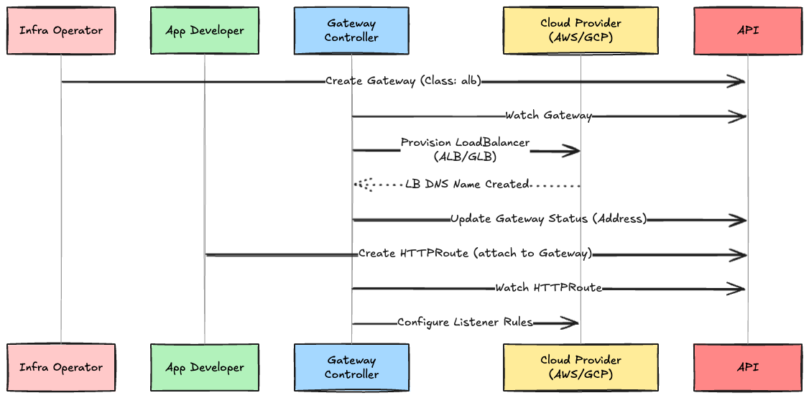

This enables a cloud-native experience where "just writing config (YAML) makes AWS ALB or GCP GLB spring into existence."

#### Data Plane: Structured Routing

Data Plane behavior is similar to Ingress, but advanced features (Header Modification, Traffic Splitting) are defined as standard.

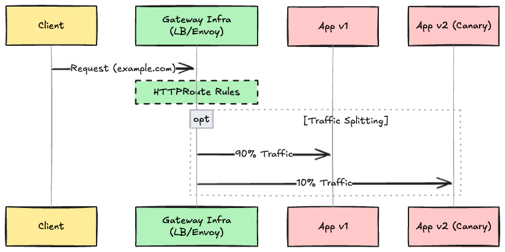

#### Sample YAML: Gateway API

In Gateway API, resources are split between Infrastructure Admins and App Developers.

```yaml
# 1. Gateway (by Infrastructure Admin)
# Define the LoadBalancer itself
apiVersion: gateway.networking.k8s.io/v1
kind: Gateway
metadata:
  name: my-gateway
spec:
  gatewayClassName: example-gateway-class
  listeners:
  - name: http
    port: 80
    protocol: HTTP

---
# 2. HTTPRoute (by App Developer)
# Define routing rules and attach to Gateway
apiVersion: gateway.networking.k8s.io/v1
kind: HTTPRoute
metadata:
  name: my-route
spec:
  parentRefs:
  - name: my-gateway  # <--- Specify which Gateway to use
  rules:
  - matches:
    - path:
        type: PathPrefix
        value: /
    backendRefs:
    - name: my-svc      # <--- Service (Roster) is still needed here
      port: 80
```

### NetworkPolicy: CNI Plugin's Responsibility

NetworkPolicy is also a resource that the API Server "just saves."
This implementation responsibility is thrown entirely to the **CNI (Container Network Interface) Plugin**.

#### Control & Data Plane

Implementation methods differ completely depending on the CNI.

1. **Iptables (Calico, etc.)**:
Controls packet allow/deny using Linux `iptables` or `ipset`. Performance may degrade if rules and tables become bloated.
2. **eBPF (Cilium, etc.)**:
Directly hooks socket communication and packet flow within a kernel space sandbox (eBPF). Bypassing iptables makes it high-speed even in large-scale environments, and enables low-overhead filtering not only for L3/L4 but also L7 (HTTP methods, etc.).

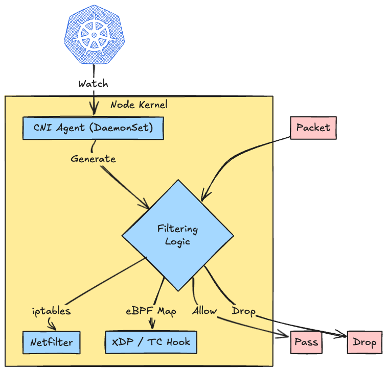

"Which CNI to select" is synonymous with choosing the performance characteristics of this security implementation, not just connectivity.

---

## Summary

* **Localhost Boundary**: Containers within the same Pod can communicate via `localhost`. Service is not needed.
* **Service Necessity**: Pod-to-Pod communication requires a fixed destination (Service) because IPs fluctuate.
* **EndpointSlice**: The modern standard backend. The controller watches Pod labels behind the scenes and manages the list scalably.
* **External & Security**: Ingress bypasses Service, and NetworkPolicy implementation is handled by the CNI.
