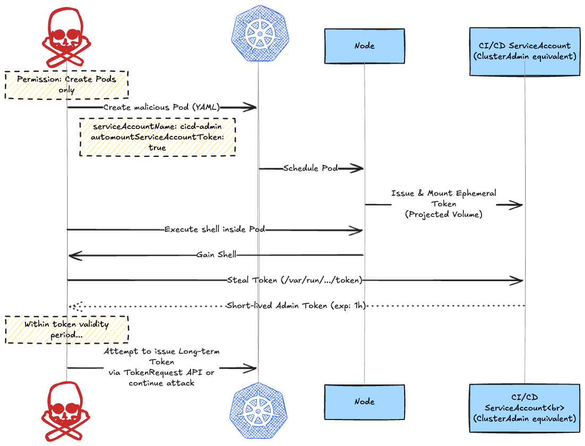
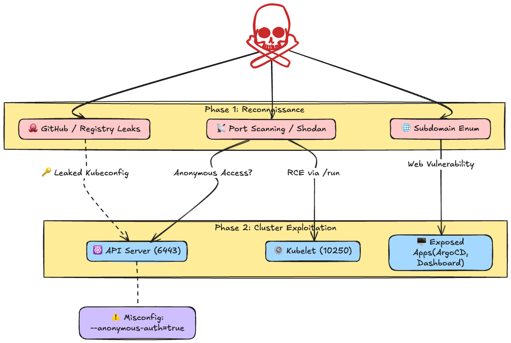
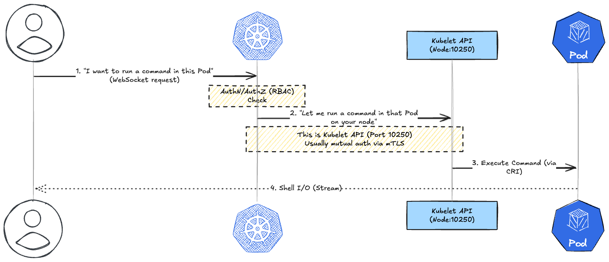
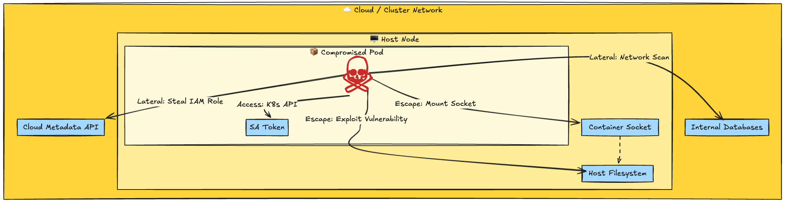

# Introdcution

As of 2026, with Kubernetes having matured as the standard infrastructure foundation, attackers' methods have also become more sophisticated.
Simple mistakes like "Dashboard exposed to everyone" have decreased; instead, attacks exploiting **RBAC complexity**, **short-term token abuse**, and the **Supply Chain** are increasing.

In this article, I will explain "Kubernetes Penetration Testing Methodologies" based on the latest threat trends, divided into three phases.

1. **RBAC Misconfiguration**: Privilege Escalation in the Era of Bound Tokens
2. **Remote Attacks**: External Intrusion Vectors and Supply Chain
3. **Insider Threats**: Container Escape and Cloud Metadata Attacks

---

## 1. RBAC Misconfiguration: The Pitfalls of Permissions

Since Kubernetes v1.24, Secret-based persistent tokens are no longer automatically generated, and **Bound Service Account Tokens (Projected Volume)** have become the standard.
While this has improved security, the fact remains that "Pod creation privileges" are dangerous.

### Attack Scenario: Privilege Escalation Using Short-Lived Tokens

An attacker creates a Pod mounting a privileged ServiceAccount and attempts to issue a token for persistence by calling the **TokenRequest API** from within that Pod.

### Key Check Items

* **`create pods/ephemeralcontainers`**: Can the user create privileged Pods for privilege escalation?
* **`impersonate`**: Authority to impersonate other users or groups.
* **`bind/escalate` (Roles)**: Authority to create RoleBindings to escalate one's own privileges.
* **Legacy Secret Remnants**: Are there any non-expiring static ServiceAccount token Secrets remaining in upgraded legacy clusters?

---

## 2. Remote Attacks: External Intrusion

For external attacks (Black-box testing), in addition to API Server misconfigurations, weaknesses in development tools and the supply chain are targeted.

### Major Attack Vectors

1. **API Server (6443)**: Permission for `system:anonymous` access. This is a common misconfiguration, especially in test environments.
2. **Kubelet API (10250)**: Is authentication (`--anonymous-auth=true`) mistakenly enabled? This allows arbitrary code execution via the `run` command.

    

3. **Exposure of Peripheral Tools**: Are management interfaces like ArgoCD, Prometheus, or Kubernetes Dashboard exposed to the internet?
4. **Supply Chain**: Are `kubeconfig` files or CI/CD credentials leaked in public repositories?

---

## 3. Insider Threats: Threats from Within

If an attacker successfully infiltrates a Pod via a Web application vulnerability (e.g., RCE) (Grey-box testing), the next goal is "Node Escape."

### Container Breakout and Lateral Movement

### Internal Reconnaissance Checklist

1. **Privileged Containers**: Containers with `privileged: true` or `CAP_SYS_ADMIN` have full access to host devices.
2. **Container Socket Mount**: If `/var/run/docker.sock` or `/run/containerd/containerd.sock` is mounted, the attacker can launch arbitrary containers on the host.
3. **Kernel/Runtime Vulnerabilities**: Are there known vulnerabilities in the host OS kernel version or container runtime (e.g., runc)?
4. **Cloud Metadata (IMDS)**: Can the attacker bypass token requirements to access the AWS (IMDSv2) or GCP metadata server and steal the Node's IAM Role?

---

## Summary: The Importance of Modern Defense

Attackers in 2026 are not just performing simple port scans; they are well-versed in Kubernetes specifications (RBAC, Token, Admission Control).

Defenders need to combine the following measures:

* **Validating Admission Policy (VAP)**: Block the creation of privileged Pods using native policy management via CEL language.
* **Least Privilege**: Grant only minimum necessary privileges to ServiceAccounts and default to `automountServiceAccountToken: false`.
* **Runtime Security**: Use eBPF-based tools like Tetragon or Falco to detect abnormal system calls and process launches at runtime.

Kubernetes security is not a "configuration" but a "continuous process."
Regular penetration testing and configuration auditing are the final fortress protecting the cluster.
