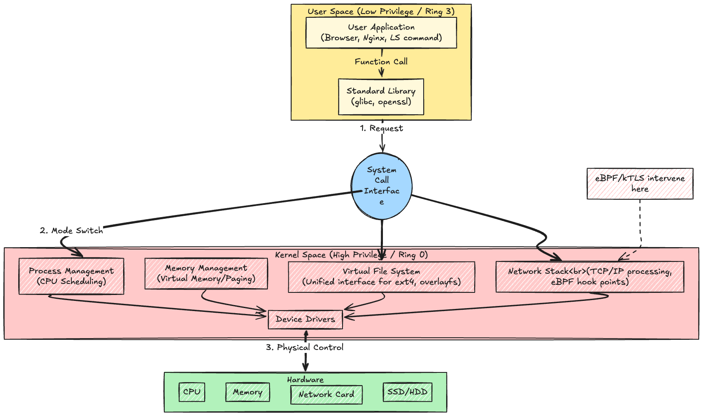
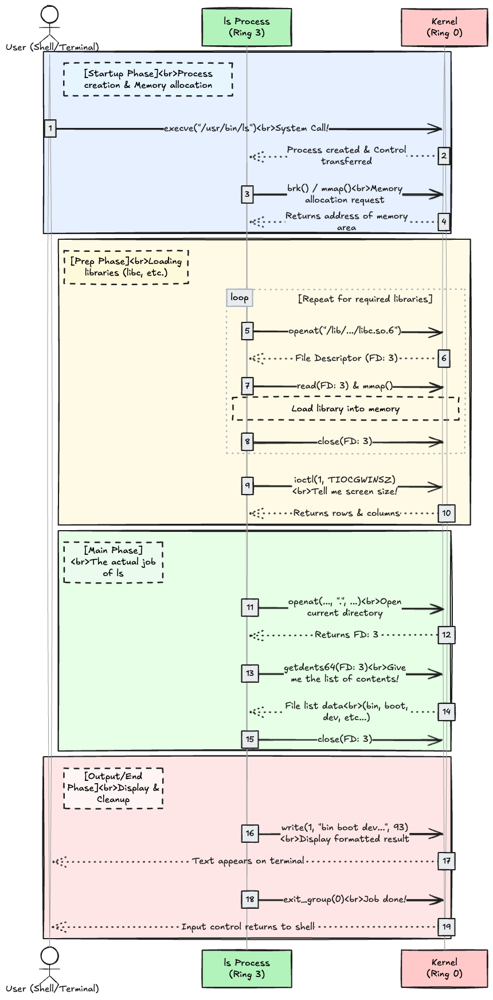
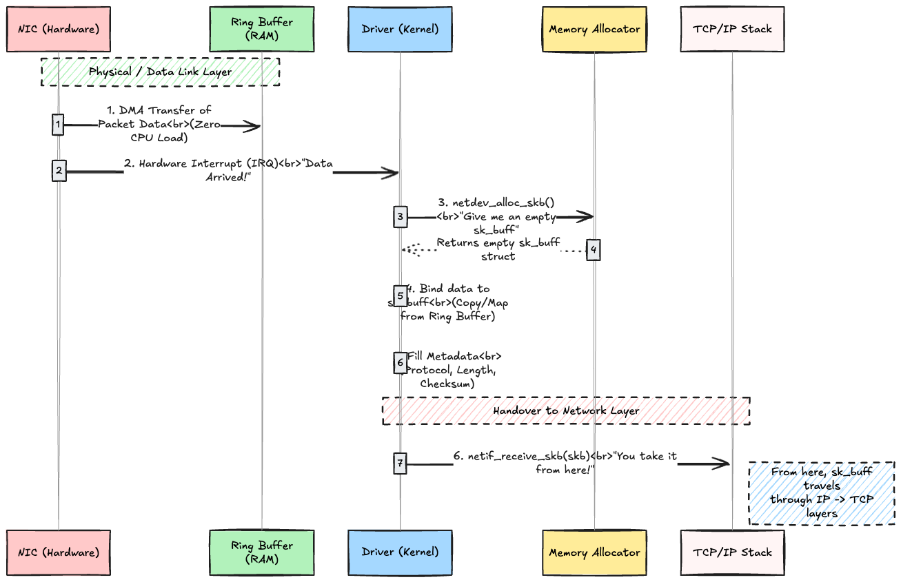

# Introduction

In the world of cloud-native technologies and high-performance computing, understanding what happens under the hood of the Linux operating system is becoming increasingly important. Technologies like eBPF and kTLS are revolutionizing how we interact with the kernel, but to truly grasp their power, we must first understand the fundamental structures they interact with.

As I began learning eBPF and kTLS, I realized I needed to understand the kernel's foundation first. This article explores the basic architecture of the Linux kernel, the boundary between user space and kernel space, and traces the journey of a network packet through the system. We will also touch upon where modern technologies like XDP and TC allow us to intervene in this process.

## 1. Understanding the Basic Structure and "Boundaries" of the Linux Kernel

In a nutshell, the Linux kernel is **"a program that abstracts hardware resources (disk, network, memory, process management, etc.) and manages/provides them to applications."**

Let's examine how programs interact with the kernel.

### 1-1. User Space vs. Kernel Space

The Linux system is broadly divided into **User Space** (where applications live) and **Kernel Space** (the core of the OS).



### 1-2. CPU Protection Rings

To understand the kernel's basic structure, you also need to know about CPU protection rings.

**CPU Protection Rings** are a **"hierarchical security system"** built into the CPU hardware.

The OS (Linux) uses this CPU feature to isolate the kernel from user applications.

Simply put, it's the difference between **"privileges that kill the entire PC if they malfunction (Ring 0)"** and **"privileges that only crash the application if they malfunction (Ring 3)."**

#### 1-2-1. How the Rings Work (Ring 0 to Ring 3)

The CPU has four levels, from 0 to 3, but Linux (and Windows) typically uses only the **two ends of the spectrum**.

* **Ring 0 (Kernel Mode / Privileged Mode)**
* **Inhabitants:** Linux Kernel (Device Drivers, Memory Management, etc.)
* **Privileges:** **Omnipotent.**
* Can execute all CPU instructions.
* Direct access to all physical memory, hard disks, NICs, and other hardware.
* **Risk:** A bug here causes the entire PC to freeze or reboot spontaneously (Kernel Panic / Blue Screen of Death).

* **Ring 3 (User Mode / Non-Privileged Mode)**
* **Inhabitants:** User applications (Web Browser, `ls` command, your Python code, etc.)
* **Privileges:** **Restricted.**
* Direct access to hardware is prohibited.
* Peeking into arbitrary memory is prohibited.
* Actions like "reading a file" must be requested from Ring 0 via system calls.
* **Risk:** A bug here only results in the application being "forcefully terminated," leaving the OS itself unharmed.

#### 1-2-2. Why Separate Them?

If everything ran in Ring 0, a browser crash would take down the entire OS with it. There is a wall to **"protect the core of the system (Kernel) from untrusted code (Applications)."**

> [!TIP]
> **Switching between Ring 3 and Ring 0 (Context Switch) is a "heavy" operation for the CPU.**

### Experiment

Let's see this in action.

```bash
# Start an Ubuntu environment and enter bash
# --cap-add=SYS_PTRACE : Permission to trace system calls (strace)
docker run --rm -it --cap-add=SYS_PTRACE ubuntu:22.04 bash
```

```bash
# Install strace
# strace is a command that outputs the system calls issued by a program and the signals it receives
apt-get update && apt-get install -y strace
```

```bash
# Display system calls issued by the ls command
strace ls
```

You will see an incredibly long log output.

```bash
execve("/usr/bin/ls", ["ls"], 0x7ff...) = 0  <-- 1. Process Execution Start
mmap(NULL, 8192, ...) = 0x7f...              <-- 2. Memory Allocation (Request to Memory Mgmt)
openat(AT_FDCWD, ".", O_RDONLY|...) = 3      <-- 3. Open Directory (Request to VFS)
getdents64(3, /* 15 entries */, 32768) = 480 <-- 4. Read Directory Contents
write(1, "bin\ndev\netc\n...", 12) = 12      <-- 5. Output to Screen (Device Control)
close(1) = 0
```

To understand these logs, we need to understand system calls.

### 1-3. System Calls

A **System Call** is an **API (window)** through which an application (like the `ls` command) asks the OS kernel (privileged mode) to "manipulate hardware," "give me memory," or "open a file."

Let's look at the important system calls following the flow of the log we just output.

First, preparations are made to execute the `ls` command.

* **`execve`**: **"Program Execution"**
  * `execve("/usr/bin/ls", ...)`
  * **Meaning:** Asking the kernel to "replace the contents of the current process with the program `/usr/bin/ls` and execute it." This is where it all begins.
* **`brk` / `mmap`**: **"Memory Allocation"**
  * `mmap(NULL, 8192, ...)`
  * **Meaning:** A request saying, "I need memory for work, please lend me some free memory space."
  * `brk` is an older method and `mmap` is newer, but both are used for memory management.

The `ls` command doesn't run alone; it requires shared libraries (like DLLs in Windows).

* **`openat`**: **"Open File"**
  * `openat(..., "/lib/aarch64-linux-gnu/libc.so.6", ...)`
  * **Meaning:** Trying to open the "Standard C Library (libc)" that `ls` depends on.
  * The return value `= 3` is called a **File Descriptor (FD)**, which is a "reference number for the opened file."
* **`read`**: **"Read File"**
  * `read(3, "\177ELF...", 832)`
  * **Meaning:** Reading the contents of the file just opened (FD: 3). `\177ELF` is the header signature of a Linux executable file (ELF file).
* **`close`**: **"Close File"**
  * `close(3)`
  * **Meaning:** Finished reading, so closing the file (FD: 3). Well-behaved programs always do this.

Before the main program runs, security settings are checked.

* **`mprotect`**: **"Memory Protection"**
  * **Meaning:** Instructing the kernel, "This memory area contains program code, so make it 'Read-Only' so I don't accidentally write to it," enhancing security.
* **`statfs`**: **"Get File System Information"**
  * `statfs("/sys/fs/selinux", ...)`
  * **Meaning:** Checking if the security feature (SELinux) is enabled, but resulting in an error `ENOENT` (No such file or directory). This is common behavior inside Docker containers.

From here on is the actual job of the `ls` command.

* **`ioctl`**: **"Device Control"**
  * `ioctl(1, TIOCGWINSZ, ...)`
  * **Meaning:** Asking for the size (rows and columns) of the output destination (terminal screen). This determines how many columns to use for displaying filenames.
* **`openat`**: **"Open Directory"**
  * `openat(..., ".", ...)`
  * **Meaning:** Opening the current directory (`.`).
* **`getdents64`**: **"Get Directory Entries"**
  * **Meaning:** **This is the core of `ls`.** It retrieves the list of files (names, inode numbers, etc.) inside the opened directory.
  * In the log, you can see filenames like `bin boot dev etc ...`.

Finally, the retrieved information is displayed on the screen, and the process ends.

* **`write`**: **"Write (Output)"**
  * `write(1, "bin boot dev...", 93)`
  * **Meaning:** Writing the formatted file list to **Standard Output (FD: 1)**. This displays the text on your terminal.
* **`exit_group`**: **"Process Termination"**
  * **Meaning:** Telling the kernel, "Job done, terminate the process and reclaim all resources like memory."

#### Relationship with CPU Protection Rings

The "system calls" we saw in `strace` are the procedures for **"Jumping (Escalating)" from Ring 3 to Ring 0**.

1. **Ring 3:** App: "I want to write to the hard disk (I can't do it myself)."
2. **System Call Trigger:** Triggers an "interrupt" to the CPU.
3. **CPU:** "Oh, a request from Ring 3. **Switching mode to Ring 0.**"
4. **Ring 0:** Kernel performs the writing operation on behalf of the app.
5. **CPU:** "Done. **Returning to Ring 3.**"
6. **Ring 3:** App: "Thanks (Resuming processing)."



Although we used the `ls` command as an example, whenever an application accesses hardware resources (disk, network, memory, process management, etc.), it must always request the kernel via system calls.

Conversely, processes that are completed entirely within user space do not need to call the kernel:

* Arithmetic operations (1 + 1, etc.)
* Logical operations
* Data manipulation within the same stack memory

## 2. The Linux Network Stack

To understand the Linux kernel more deeply, let's examine the "path" a packet takes in Linux.

### 2-1. Shifting Your Mindset

The "network" we usually think about and the "kernel network" operate on entirely different layers.

* **User Perspective**
  * **Concerns:** IP addresses, port numbers, routing, TCP handshakes.
  * **Commands:** `ping`, `curl`, `netstat`.
  * **Viewpoint:** "Will the package reach the destination?"
* **Linux Kernel Perspective**
  * **Concerns:** Memory allocation, electrical signal conversion, CPU interrupt processing.
  * **Keywords:** `sk_buff`, Driver, DMA, Ring Buffer.
  * **Viewpoint:** **"How do we efficiently cycle the CPU/Memory to handle packets?"**

In other words, it's not just about whether network communication happens; you have to be conscious of how memory is allocated, how signals are converted, and how CPU interrupts occur to realize that communication.

Inside the Linux kernel, packets are held (memory allocated) in a structure called `sk_buff`.

Understanding how this is generated and passed from the driver to the TCP/IP stack is the first step to understanding networking in the Linux kernel.

### 2-2. Packet Flow

The story begins when a packet arrives at the NIC.

1. When the NIC receives a packet, it writes the data directly to a predetermined location in main memory (Ring Buffer) via DMA, **without going through the CPU**.
2. The NIC triggers an **Interrupt** to the CPU, saying "Data is here!" The CPU suspends its current processing and starts the NIC driver processing.
3. The driver (software) starts running, and this is where `sk_buff` is generated.
4. The driver requests the kernel's memory management function: "Give me one `sk_buff` box!" (e.g., `netdev_alloc_skb` function).
5. It copies the data from the Ring Buffer to the allocated `sk_buff` (or reassigns the pointer).
6. It writes information like "Protocol is Ethernet" and "Length is 1500 bytes" into the `sk_buff`'s management area (metadata).
7. The driver uses the `netif_receive_skb()` function to toss the completed `sk_buff` up to the TCP/IP stack (protocol layer). From here on, it leaves the driver's hands.



Despite being inside the Linux kernel, there are technologies that allow us to send user-written programs into the "sanctuary" of the kernel to intervene. The execution foundation for this is **eBPF**, and the intervention points are **XDP (eXpress Data Path)** and **TC (Traffic Control)**.

Although we won't implement them this time, let's investigate XDP and TC to prepare for understanding eBPF in the future.

### 2-3. About XDP (eXpress Data Path) and TC (Traffic Control)

#### 2-3-1. XDP (eXpress Data Path)

XDP is a high-performance packet processing framework integrated into the Linux kernel network driver layer.

**Technical Features:**

* **Execution Timing:** Executed immediately after the NIC driver receives a packet and DMA transfer is complete (interrupt context). This is **before** the kernel performs memory allocation for the `sk_buff` structure.
* **Data Structure:** Handles a lightweight structure called `xdp_md` (and `xdp_buff`) instead of `sk_buff`. This provides direct access to raw packet data (byte arrays in physical memory).
* **Operation:** An eBPF program inspects the packet and returns one of the five "action codes" to immediately determine the packet's fate.

**Main Action Codes:**

1. **`XDP_DROP`**: Immediately drops the packet. Since memory allocation costs become zero, it provides the strongest performance for DDoS mitigation.
2. **`XDP_PASS`**: Passes the packet to the kernel's network stack (normal processing). This is where `sk_buff` is generated for the first time.
3. **`XDP_TX`**: Immediately sends the packet back out of the receiving NIC (hairpin routing). Used in load balancers.
4. **`XDP_REDIRECT`**: Bypasses transfer to another NIC, CPU, or `AF_XDP` socket (user space).
5. **`XDP_ABORTED`**: Drop on program error (exception handling).

**Primary Uses:** DDoS defense, L4 load balancing, firewalls.

#### 2-3-2. TC (Traffic Control)

TC is a subsystem within the Linux kernel network stack that handles packet scheduling (transmission order control), shaping (bandwidth limiting), and policing (classification). eBPF can hook into this TC layer.

**Technical Features:**

* **Execution Timing:**
  * **Ingress (Receive):** Immediately after `sk_buff` is generated and before entering the protocol stack (between L2 and L3).
  * **Egress (Transmit):** Immediately before being passed to the driver after protocol stack processing is finished.
* **Data Structure:** Handles the `sk_buff` structure. This allows access not only to packet contents but also to kernel-attached metadata (ingress interface index, cgroup info, socket info, etc.).
* **Operation:** Can manipulate packets based on richer information compared to XDP. Operations that are difficult in XDP, like "packet rewriting (including size changes)" or "header addition/removal (encapsulation)," can be easily performed.

**Difference from XDP:**
TC's eBPF hook (`cls_bpf`) is much faster than standard mechanisms like iptables, but because `sk_buff` memory allocation has already occurred, it is inferior to XDP in pure throughput performance. However, a major feature is the ability to control the "transmit side (Egress)," which XDP lacks.

**Primary Uses:** Container networking (CNI plugins), advanced packet filtering, bandwidth control, pre-processing for L7 load balancing.

#### Comparison

| Feature | XDP (eXpress Data Path) | TC (Traffic Control) |
| --- | --- | --- |
| **Intervention Point** | NIC Driver Layer (Lowest Level) | Network Stack Layer (Middle Layer) |
| **Data Structure** | `xdp_md` (Raw Data) | `sk_buff` (With Metadata) |
| **Memory Allocation** | **Before** (Pre-cost) | **After** (Post-cost) |
| **Direction** | Ingress Only* | Ingress / Egress |
| **Modification** | Limited (Packet length change is hard) | Flexible (Header add/remove possible) |
| **Performance** | Fastest | High Speed (Slower than XDP) |

> [!TIP]
> XDP is primarily for Ingress, but immediate transmission is possible using `XDP_TX`. However, it cannot capture packets sent from the application itself.

## Conclusion

In this deep dive, we've peeled back the layers of the Linux kernel to reveal what actually happens when we run commands or send data over a network. We learned:

1. **The Kernel is the Manager**: It abstracts hardware and protects the system via Ring 0/3 separation.
2. **System Calls are the Gateway**: Tools like `strace` reveal the constant conversation between apps and the kernel.
3. **The "Factory" Mindset**: Understanding kernel networking requires shifting focus from "IP addresses" to "sk_buffs and DMA."
4. **eBPF is the Revolution**: XDP and TC allow us to safely inject custom logic into this high-speed factory floor, with XDP acting at the raw material stage and TC at the packaged stage.

Understanding these low-level mechanics is crucial for debugging performance issues and leveraging modern cloud-native tools effectively.

**What's next?**

Based on these learnings, the next step is to investigate **eBPF** and **kTLS** in depth to understand how we can programmatically extend and optimize this architecture.
