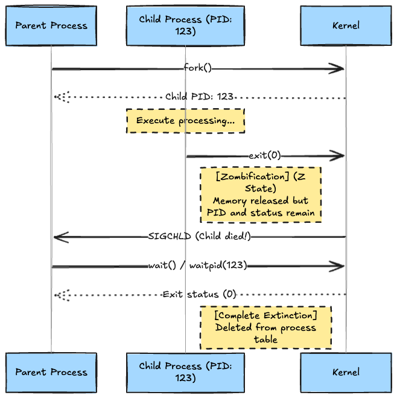
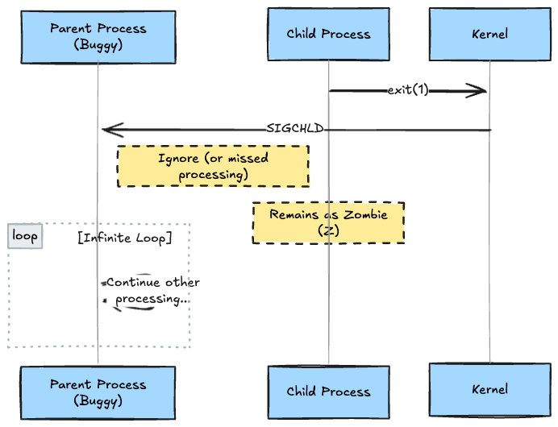
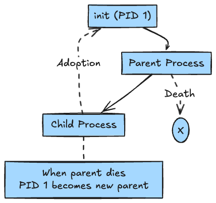

# Introduction

When you type `ps aux`, have you ever found the eerie letter **"Z"** in the STAT column?
Or have you ever encountered a "PID limit reached" error while investigating a `CrashLoopBackOff` on a Kubernetes Pod?

These are all the work of **"Zombie Processes."**
They consume neither memory nor CPU, but they cling to the precious resource known as a **"Process ID (PID),"** wandering the system unable to rest in peace.

In this article, we will unravel why processes turn into zombies after death, and how modern mechanisms like "Subreaper" and Go's `os/exec` mourn (reap) them, at the system call level.

---

## 1. The Identity of Zombie Processes: Why do "Corpses" Remain?

In Linux, even when a process `exit()`s and terminates, it does not disappear immediately.
The kernel retains minimal information (PID, exit status, CPU usage time, etc.) in the process table until the parent process comes to check, "For what reason did that guy die?"

This state of **"dead but awaiting reporting to the parent"** is the zombie process.

### Normal Life Cycle

If the parent calls `wait()`, the zombie rests in peace (disappears).



> **Syscall Memo**:
> * `wait()`: Blocks and waits for any one child process to terminate.
> * `waitpid()`: A high-functionality version that can specify a PID or perform non-blocking checks with the `WNOHANG` option.

---

## 2. Scenarios Where Zombies Multiply: Child Neglect

The problem arises when the parent process does not call `wait()`.
If the parent continues to ignore the `SIGCHLD` signal due to a bug in the program (e.g., missing signal handler implementation), the child process will remain a zombie forever.



### PID Exhaustion by cgroup

In the past, the system's `pid_max` (default 32,768) was the upper limit, but in the container era (Kubernetes), **PID limits at the cgroup (Control Groups) level** are mainstream.
When the `pids.max` set in the Pod definition is reached, the container falls into a state where it "cannot Fork" (Resource Temporarily Unavailable), even if the host itself has capacity. A massive outbreak of zombies easily causes this.

> A Linux kernel feature that limits and isolates resource usage, such as CPU and memory, for a process group. (This is the reality of "resource limits" in Docker and Kubernetes.)

---

## 3. Orphan Processes and the Mercy of init (and Subreaper)

So, what happens if the parent process that spawned the zombie dies itself?

### Collection by Init Process (PID 1)

Children who have lost their parents (orphan processes) are forcibly adopted by the **init process (PID 1)**. Init processes like systemd automatically call `wait()` when an adopted process dies, allowing it to rest in peace.



### Child Subreaper

Sometimes, tracing back to PID 1 is too far.
Since Linux 3.4, using the system call `prctl(PR_SET_CHILD_SUBREAPER)`, an arbitrary process can declare, **"I will take custody of orphans under this hierarchy."**

Docker, containerd, and Chrome's process management use this feature to collect orphan processes under their own management without burdening PID 1 (systemd).

---

## 4. Implementation Patterns to Avoid/Clear Zombies

### Pattern A: Honestly wait (Basic)

Call `waitpid(-1, &status, WNOHANG)` in a loop within the `SIGCHLD` signal handler to collect all dead children.

### Pattern B: Double Fork

**Usage:** When the parent process **intentionally wants to escape** the duty of managing child processes (daemonization, etc.).

1. **Parent:** Spawns a child and immediately `wait`s for it.
2. **Child:** Spawns a grandchild (actual processing) and immediately `exit`s.
3. **Grandchild:** Becomes an "orphan" because the parent (child process) died, and is immediately adopted by init (or Subreaper).

> **Note:** Doing this in a service managed by systemd (`Type=simple`) will cause systemd to lose track of the main process. Use manual daemonization only when necessary.

### Pattern C: Tini in Containers (Solving PID 1 Problem)

When an app runs as PID 1 in a Docker container, default signal handling may not work, and `wait` might not be performed properly. It is a standard practice to use `tini` or `dumb-init` as the entry point.

---

## 5. Language Deep Dive: Go `os/exec` Concealment and Traps

The Go language `os/exec` package allows for very convenient execution of external commands, but behind that convenience, the `wait` system call is concealed.

### Behind `cmd.Run()`

The most common `cmd.Run()` method internally executes the following two steps:

1. **`Start()`**: Issues `fork` (clone) and `exec` to start the process.
2. **`Wait()`**: Blocks until the process terminates, and releases resources after termination.

```go
// Simplified internal logic image of cmd.Run()
func (c *Cmd) Run() error {
    if err := c.Start(); err != nil { // Internally clone + execve
        return err
    }
    return c.Wait() // Calls wait4 system call here!
}
```

In this case, `Wait()` is reliably called, so zombie processes do not occur.

### The Trap: Using only `cmd.Start()`

If you call only `cmd.Start()` for asynchronous processing and forget `cmd.Wait()`, **the child process will become a zombie and remain as long as the Go program is running.**

```go
// 💀 Zombie generation code
func spawnAndForget() {
    cmd := exec.Command("sleep", "1")
    cmd.Start() 
    // Not calling Wait()!
    // 1 second later, the sleep command becomes a zombie (Z),
    // and remains until this Go program terminates.
}
```

Go's Garbage Collection (GC) might collect the `cmd` struct in memory, but **it will not collect the process status (zombie) on the OS.**
If using `Start()`, you have the responsibility to explicitly call `Wait()`, for example in a separate goroutine.

```go
// ✅ Correct async execution
func spawnAsync() {
    cmd := exec.Command("sleep", "1")
    if err := cmd.Start(); err != nil {
        return
    }

    // Wait for collection in a goroutine
    go func() {
        cmd.Wait() // wait4 is called here, and the zombie rests in peace
    }()
}
```

### What is happening at the low layer?

In a Linux environment, `cmd.Wait()` ultimately calls `syscall.Wait4`. This receives the exit status from the kernel and stores it in the `ProcessState` struct.

While the Go runtime handles signals skillfully, for individual external command execution, the design requires developers to explicitly issue the `wait` system call via the `Wait` method.

---

## Conclusion

The existence of zombie processes is a specification, not a bug, but leaving them unattended is a "child neglect" bug.

In 2026 troubleshooting, it is required not only to use the `ps` command but also to monitor "who is skipping `wait`" or "which container is about to reach the PID limit" using `bpftrace`. Trace the process tree (`pstree -p`), identify the parent process failing to fulfill its responsibilities, and fix it.
