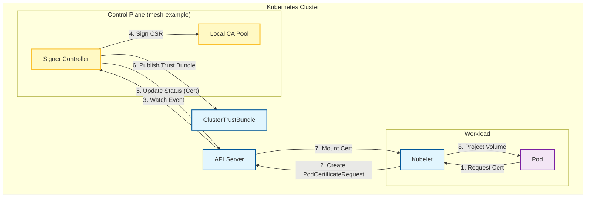

# Kubernetes Pod Certificates Deep Dive: mesh-example で学ぶ次世代 mTLS

Kubernetes における mTLS (相互TLS)実装は、これまで cert-manager や Istio などのサードパーティツールに依存していました。
しかし、現在進行中の KEP (Kubernetes Enhancement Proposal) である **Pod Certificates** が標準化されれば、Kubernetes ネイティブな方法で Pod に証明書を発行できるようになります。

今回は、そのリファレンス実装の一つである `mesh-example` を読み解き、次世代の mTLS がどのようなアーキテクチャで動くのかを解説します。

## 1. mesh-example のアーキテクチャ

このプロジェクトは、Kubernetes の新しい API リソース `PodCertificateRequest` を監視し、証明書を発行する **Custom Controller** のサンプル実装です。



### 主要コンポーネント

1.  **Signer Controller (`cmd/meshtool`)**:
    *   `PodCertificateRequest` を Watch するメインループ。
    *   指定された Signer Name (例: `row-major.net/spiffe`) に応じて処理を振り分けます。
2.  **Signer Implementations (`lib/`)**:
    *   `servicednssigner`: Service 名 (`mysvc.ns.svc`) を SAN に持つ証明書を発行。
    *   `spiffesigner`: SPIFFE ID (`spiffe://domain/ns/...`) を持つ証明書を発行。
3.  **Local CA (`lib/localca`)**:
    *   メモリ上（または Secret）で CA 鍵を管理し、実際の署名を行います。

## 2. Pod Certificates の発行フロー

従来の `CertificateSigningRequest` (CSR) API との違いは、**「Kubelet が Pod のために代理でリクエストする」** 点にあります。Pod 自体は秘密鍵を作らず、Kubelet が鍵ペアを生成し、証明書取得後に Pod のボリュームとしてマウントします。

### コードで見る処理の流れ (`lib/signercontroller/signercontroller.go`)

```go
// 概念コード

func (c *Controller) sync(key string) {
    // 1. Fetch Request
    pcr, _ := c.pcrLister.Get(key)
    
    // 2. Check Signer Name
    if pcr.Spec.SignerName != c.handler.SignerName() {
        return // 担当外
    }
    
    // 3. Verify & Sign
    // Podの同一性確認などはKubeletが保証するため、ここではポリシーチェックを行う
    certs, err := c.handler.MakeCert(ctx, notBefore, notAfter, pcr)
    
    // 4. Update Status
    pcr.Status.Certificate = certs
    c.kc.CertificatesV1alpha1().PodCertificateRequests().UpdateStatus(ctx, pcr, ...)
}
```

## 3. Trust Distribution: 信頼の配布

証明書を発行するだけでは mTLS は成立しません。相手の証明書を検証するための「ルート CA 証明書」を全 Pod に配る必要があります。
これを解決するのが **ClusterTrustBundle (CTB)** です。

mesh-example は、自身が管理する CA 証明書を `ClusterTrustBundle` リソースとして公開します。Pod は `volumeMounts` でこの CTB を参照するだけで、最新の CA 証明書を自動的に読み込むことができます。

## 4. Mac での動作確認手順 (Hands-on)

Mac 上で Docker と Kind を使って、この次世代機能を体験してみましょう。

### 前提条件
- Docker Desktop for Mac
- Go 1.23+
- Kind (`brew install kind`)
- Kubectl (`brew install kubectl`)

### 手順

1.  **リポジトリのクローン**
    ```bash
    git clone https://github.com/ahmedtd/mesh-example.git
    cd mesh-example
    ```

2.  **Kind クラスタの作成**
    Feature Gate を有効にする必要があるため、専用の設定ファイルを使います。
    ```bash
    kind create cluster --image=kindest/node:v1.32.0 --config=kind/kind-config.yaml
    ```
    ※ K8s のバージョンは適宜最新のものに合わせてください（v1.34+ が推奨されますが、alpha 機能として v1.32 でも試せる場合があります）。

3.  **コントローラーのデプロイ**
    ```bash
    kubectl apply -f controller-manifests
    ```
    この時点では、コントローラーは CA 鍵がないためクラッシュループします（正常です）。

4.  **CA の初期化**
    Go のツールを使って CA 鍵を生成し、Secret として登録します。
    ```bash
    # Service DNS 用 CA
    go run ./cmd/meshtool make-ca-pool-secret \
      --namespace mesh-controller \
      --name service-dns-ca-pool \
      --ca-id 1

    # SPIFFE 用 CA
    go run ./cmd/meshtool make-ca-pool-secret \
      --namespace mesh-controller \
      --name spiffe-ca-pool \
      --ca-id 1
    ```
    これでコントローラーが正常に起動します。

5.  **サンプルアプリのデプロイ**
    ```bash
    kubectl apply -f example-manifests/
    ```

6.  **動作確認**
    クライアント Pod のログを見て、mTLS 接続が成功しているか確認します。
    ```bash
    kubectl logs -n service-dns-unauth-client -l app=client -f
    ```
    成功していれば、サーバーからのレスポンス（Hello World 的なもの）が表示されます。

## まとめ

mesh-example は、Kubernetes の未来の姿を映し出す鏡です。
サイドカープロキシ（Istio 等）を使わずに、Kubelet と API Server だけで強力な mTLS 基盤が整う時代がすぐそこまで来ています。

- **PodCertificateRequest**: Kubelet が鍵管理を代行。
- **ClusterTrustBundle**: ルート CA 配布の標準化。

これらが普及すれば、アプリケーション開発者は「証明書の更新」や「鍵のローテーション」といった苦痛から解放されるでしょう。
