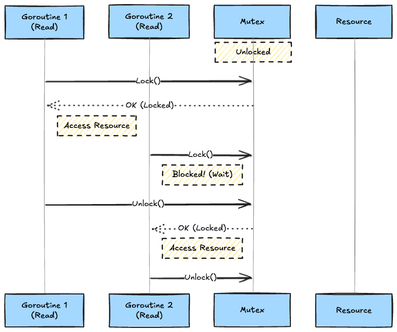
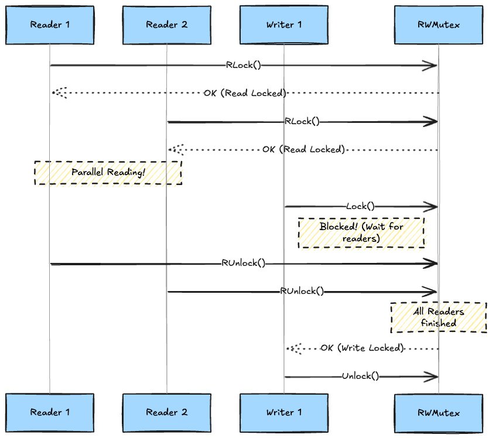

# Introduction

When writing concurrent code in Go, have you ever hesitated between `sync.Mutex` and `sync.RWMutex` to protect a shared map or resource?

"If reads (Get) outnumber writes (Set), `RWMutex` is faster."

This is a widely known rule of thumb, and in many cases, it’s true. But are you choosing `RWMutex` without a second thought? It is not a strictly superior version of `Mutex`. There are clear trade-offs, and there are specific **scenarios where you should NOT use RWMutex**.

In this article, we’ll dissect the behavior of these two locking primitives through conceptual diagrams and real-world benchmarks.

## Prerequisites: Why do we need locks? (Race Conditions 101)

When multiple Goroutines try to read and write to the same memory location (like a variable or a map) simultaneously, data corruption occurs, or the program might panic. This is called a **Data Race**.

To prevent this, we need "Locking" (Mutual Exclusion). We create a rule: "While someone is using this, no one else can touch it." The Go `sync` package provides several ways to implement this rule.

## Concepts: Visualizing the Mechanism

First, let's understand how each lock behaves using Mermaid diagrams.

### Mutex: The Exclusive Lock

`sync.Mutex` is simple. Only **one person** can enter the room (critical section) at a time. It doesn't matter if they are reading or writing.



It's simple, but even if many Goroutines just want to "read" a value, they have to wait in line. This feels inefficient.

### RWMutex: The Reader-Writer Lock

`sync.RWMutex` follows the rule: **"Any number of people can read simultaneously. But when someone wants to write, everyone else must stay out."**



This ensures that read requests don't get bottlenecked. Great!
However, this complex control comes with a "hidden cost."

## Under the Hood: Go's Implementation

Why isn't `RWMutex` always faster? The answer lies in the `sync` package source code.

### The Cost of sync.Mutex

`sync.Mutex` is highly optimized. In an uncontended case (no competition), its cost is essentially a **single atomic integer operation (CAS: Compare-And-Swap)**. It's extremely lightweight.

### The Cost of sync.RWMutex

On the other hand, `sync.RWMutex` needs to manage more state:

1. Current number of readers (Reader Count)
2. Number of waiting writers (Writer Waiting)
3. **An internal sync.Mutex** (to synchronize writers)

This means `RWMutex` has more management overhead than `Mutex`. Even a simple `RLock` involves atomic operations on counters, which can lead to cache line contention under heavy load.

## Hands-on: Benchmark Showdown

Let's look at the evidence. We’ll run a benchmark on a Mac to compare them.

### The Benchmark Code

We implement two thread-safe maps, one using `sync.Mutex` and the other using `sync.RWMutex`, and measure performance across different read/write ratios.

```go
package main

import (
	"fmt"
	"sync"
	time "time"
)

const (
	numOps       = 1_000_000 // Total operations per test
	numGoroutines = 100       // Concurrency level
)

type SafeMap interface {
	Get(key int) int
	Set(key int, value int)
	Name() string
}

type MutexMap struct {
	mu   sync.Mutex
	data map[int]int
}

func (m *MutexMap) Get(key int) int {
	m.mu.Lock()
	defer m.mu.Unlock()
	return m.data[key]
}

func (m *MutexMap) Set(key int, value int) {
	m.mu.Lock()
	defer m.mu.Unlock()
	m.data[key] = value
}

func (m *MutexMap) Name() string { return "sync.Mutex  " }

type RWMutexMap struct {
	mu   sync.RWMutex
	data map[int]int
}

func (m *RWMutexMap) Get(key int) int {
	m.mu.RLock()
	defer m.mu.RUnlock()
	return m.data[key]
}

func (m *RWMutexMap) Set(key int, value int) {
	m.mu.Lock()
	defer m.mu.Unlock()
	m.data[key] = value
}

func (m *RWMutexMap) Name() string { return "sync.RWMutex" }

func benchmark(m SafeMap, readRatio float64) time.Duration {
	var wg sync.WaitGroup
	start := time.Now()
	opsPerGoroutine := numOps / numGoroutines

	for i := 0; i < numGoroutines; i++ {
		wg.Add(1)
		go func() {
			defer wg.Done()
			for j := 0; j < opsPerGoroutine; j++ {
				isRead := (float64(j%100) / 100.0) < readRatio
				if isRead {
					m.Get(j % 100)
				} else {
					m.Set(j%100, j)
				}
			}
		}()
	}
	wg.Wait()
	return time.Since(start)
}

func main() {
	scenarios := []struct {
		name  string
		ratio float64
	}{
		{"Read Heavy", 0.99},
		{"Balanced", 0.50},
		{"Write Heavy", 0.01},
	}

	for _, s := range scenarios {
		fmt.Printf("\n--- Scenario: %s (Read Ratio: %.0f%%) ---", s.name, s.ratio*100)
		m1 := &MutexMap{data: make(map[int]int)}
		fmt.Printf("%s: %v\n", m1.Name(), benchmark(m1, s.ratio))
		m2 := &RWMutexMap{data: make(map[int]int)}
		fmt.Printf("%s: %v\n", m2.Name(), benchmark(m2, s.ratio))
	}
}
```

### Results (Reference values on Mac M2)

#### Scenario 1: Read Heavy (99% Read / 1% Write)

A typical use case, like a web server cache.

```text
sync.Mutex  : 113.51ms
sync.RWMutex: 58.03ms
Winner: sync.RWMutex (1.96x faster)
```

**Result**: `RWMutex` wins by a landslide. The benefits of parallel reading far outweigh the internal overhead.

#### Scenario 2: Balanced (50% Read / 50% Write)

```text
sync.Mutex  : 103.01ms
sync.RWMutex: 91.88ms
Winner: sync.RWMutex (1.12x faster)
```

**Result**: `RWMutex` wins by a small margin. As write frequency increases, `RWMutex` behaves more like a heavy `Mutex` because writers block readers.

#### Scenario 3: Write Heavy (1% Read / 99% Write)

```text
sync.Mutex  : 120.94ms
sync.RWMutex: 118.88ms
Winner: sync.RWMutex (1.02x faster)
```

**Result**: In theory, `Mutex` should be slightly faster here because `RWMutex.Lock()` internally calls `Mutex.Lock()` plus additional overhead. Under heavy load, the difference becomes negligible.

### ⚠️ The Hidden Trap: Recursive RLock Deadlocks

"If the performance is similar, why not just use `RWMutex` anyway?"

Be careful. `sync.RWMutex` has a fatal trap that `sync.Mutex` doesn't: **Deadlock via recursive RLock**.

Go's `RWMutex` implementation uses **Writer Priority** to prevent writer starvation. This means if a write request comes in, all subsequent `RLock` requests are blocked until the writer finishes.

This leads to the following deadlock:

```go
func (c *Cache) Get(key string) string {
    c.mu.RLock()         // 1. Acquire Read Lock
    defer c.mu.RUnlock()
    
    return c.getInternal(key) 
}

func (c *Cache) getInternal(key string) string {
    c.mu.RLock()         // 3. THIS CAN DEADLOCK!
    defer c.mu.RUnlock()
    return c.data[key]
}
```

1. **Goroutine A** calls `Get()` and acquires an `RLock`.
2. **Goroutine B** calls `Lock()` (Write). Since A holds an `RLock`, B waits. However, B is now at the front of the queue, so **new `RLock` requests are now blocked**.
3. **Goroutine A** calls `getInternal()`, which tries to acquire another `RLock`.
4. **Deadlock!**
   - Goroutine A is waiting for the 2nd `RLock` (blocked by Goroutine B).
   - Goroutine B is waiting for Goroutine A's 1st `RLock` to finish.

`sync.RWMutex` is **not reentrant**. "Brain-dead" usage of `RWMutex` can easily lead to this bug in large codebases. Using `sync.Mutex` (which is also not reentrant) makes this kind of design flaw much more obvious earlier in development.

## Conclusion

1. **Default to `sync.Mutex`**
   - The code is simpler.
   - No need to worry about read/write ratios.
   - For most web apps, the performance difference is not perceivable by humans.

2. **Use `sync.RWMutex` only when...**
   - You have confirmed that **reads are overwhelmingly dominant** (90%+).
   - Your **critical section is long**. If you are doing heavy searching or large data copies inside the lock, the benefit of parallel reading becomes significant.

3. **Mind the Writer Priority**
   - Remember that frequent writes will block all readers. `RWMutex` is not a magic bullet for all concurrency problems.
