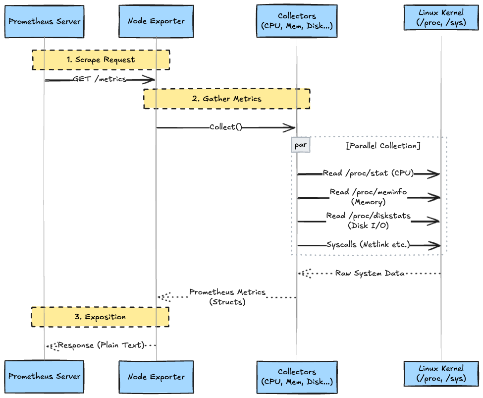
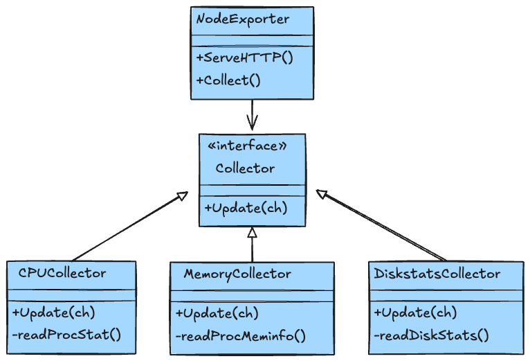

# Introduction

Many engineers think, "I want to monitor my system, so I'll just install Node Exporter." But have you ever stopped to consider **what this binary is actually doing**?

Node Exporter doesn't use magic. It is simply a **"translator"** that takes information exposed by the Linux kernel and converts it into a format that Prometheus can understand.

In this article, I will explain the internal architecture of Node Exporter, specifically the Collector mechanism and its interaction with the kernel, using diagrams (Mermaid).

---

## 1. Architecture Overview

Node Exporter's role is very simple. It receives an HTTP GET request (`/metrics`) from the Prometheus server and returns the system's health status at that exact moment in text format.

### The Flow of Metrics



The key point is that Node Exporter itself is **stateless**. It doesn't remember "the CPU usage from one minute ago." It simply reads the current values from `/proc/stat` the moment Prometheus comes to fetch them.

### What is the Prometheus Format?

What Node Exporter ultimately returns is not binary data, but **human-readable text data**. This is called the "Prometheus Exposition Format."

The structure is very simple: a list of **"metric_name{labels} value"**.

**Before: Linux Kernel (`/proc/loadavg`)**

```text
0.02 0.04 0.00 1/157 28941

```

*(By itself, it's hard to tell what these values represent.)*

**After: Node Exporter (`/metrics`)**

```text
# HELP node_load1 1m load average.
# TYPE node_load1 gauge
node_load1 0.02
```

*(Meaningful names and type information are added, making it interpretable by Prometheus.)*

---

## 2. Deep Dive: Collectors

The internals of Node Exporter consist of a collection of modules called **Collectors**. When you run `node_exporter --help`, you'll see a massive list of flags; these are used to enable or disable specific Collectors.

### Inside Major Collectors

Most Collectors are built simply to parse the Linux virtual filesystem (`/proc`, `/sys`).

#### CPU Collector (`cpu`)

* **Source**: `/proc/stat`
* **Metric**: `node_cpu_seconds_total`
* **Mechanism**: The kernel maintains CPU usage time per CPU, categorized by modes like "USER," "NICE," "SYSTEM," and "IDLE." Node Exporter outputs these as counters. The actual calculation (e.g., using `rate()`) is the job of Prometheus.

#### Memory Collector (`meminfo`)

* **Source**: `/proc/meminfo`
* **Metric**: `node_memory_MemTotal_bytes`, `node_memory_MemAvailable_bytes`, etc.
* **Mechanism**: It parses the contents of `/proc/meminfo` and converts them into bytes.

#### Filesystem Collector (`filesystem`)

* **Source**: `statfs` system call
* **Metric**: `node_filesystem_size_bytes`, `node_filesystem_free_bytes`
* **Mechanism**: It issues system calls for each mounted filesystem to retrieve capacity and Inode information. Note that if an NFS mount hangs, this Collector might also hang and cause a timeout.



---

## 3. The Power of "Textfile Collector"

If the standard Collectors aren't enough, do you need to write Go code and rebuild? No, that's where the **Textfile Collector** comes in.

This is a simple yet powerful feature that "takes the contents of `.prom` files located in a specific directory and returns them directly to Prometheus."

### Use Cases

* **Cron Job Results**: Success/failure of backup scripts (`my_backup_last_run_timestamp`).
* **Package Versions**: Number of pending updates for `apt` or `yum`.
* **Hardware-Specific Info**: RAID controller status or other metrics not supported by default.

### Architecture of Textfile Collector


**Important**: Writing to the `.prom` file must be done **atomically**. If Node Exporter reads a file while it is being written, it might send corrupted data to Prometheus.

```bash
# ❌️ Bad Practice
echo "my_metric 1" > /var/lib/node_exporter/my.prom

# ✅️ Good Practice (Atomic Rename)
echo "my_metric 1" > /var/lib/node_exporter/my.prom.tmp
mv /var/lib/node_exporter/my.prom.tmp /var/lib/node_exporter/my.prom
```

The short answer is: **"They don't conflict (they coexist)."**

Since their roles are distinct, it is common to **run both** on the same server.

### 1. Differences in Role

* **Node Exporter**: A tool to monitor **"Infrastructure (OS)."**
  * CPU, Memory, Disk usage, Network traffic, etc.
  * Visualizes information held by the Linux kernel.
* **JSON Exporter**: A tool to monitor **"Application Internals (Data)."**
  * Business metrics returned by APIs (user count, sales, inventory, etc.).
  * Parses application-specific JSON data that Node Exporter cannot reach.

### 2. Architectural Differences

There is no technical collision as they use different default ports.

* **Node Exporter**: Port `9100` (Default)
* **JSON Exporter**: Port `7979` (Default)

In your Prometheus configuration (`prometheus.yml`), you register them as separate targets:

```yaml
scrape_configs:
  - job_name: 'node'
    static_configs:
      - targets: ['localhost:9100']  # Node Exporter (OS Monitoring)

  - job_name: 'json'
    static_configs:
      - targets: ['localhost:7979']  # JSON Exporter (App Data Monitoring)
```

### 3. The Only Overlap: Textfile Collector

A choice (and potential overlap) only arises when deciding **how to pass JSON data to Prometheus**: via a script that writes to a file for Node Exporter, or via JSON Exporter.

|  Comparison   |    A. Textfile Collector (Node Exporter)    |                  B. JSON Exporter                  |
| :-----------: | :-----------------------------------------: | :------------------------------------------------: |
| **Mechanism** | cron + jq command -> generates `.prom` file  |      Persistent process fetches JSON via HTTP      |
|   **Pros**    |    No need for a new persistent process.    |      Configured via YAML; no scripts needed.       |
|   **Cons**    | Shell script management/locking is tedious. |         One more daemon/process to manage.         |
| **Best For**  |   Simple values, monitoring local files.    | Complex JSON structures, monitoring external APIs. |

---

### Advanced Usage: Turning Application Metrics into Metrics

When you want to monitor application-specific metrics (e.g., `{"active_users": 150}`), there are two main approaches.

#### Pattern 1: Textfile Collector

For simple numeric values, it's easy to convert them to Prometheus format using a shell script and let Node Exporter read them.

```bash
# Extract value from JSON and output to .prom file (read by Node Exporter)
echo "app_active_users $(cat app_status.json | jq '.active_users')" > /var/lib/node_exporter/metrics.prom
```

#### Pattern 2: JSON Exporter

If the JSON structure is complex or you want to monitor API endpoints directly, I recommend using **`json_exporter`**. Since its port does not conflict with Node Exporter, you can use them together for advanced application monitoring.

**Example config.yml:**

```yaml
metrics:
  - name: app_active_users
    path: "{ .active_users }"
    help: "Active users count from JSON source"
    type: gauge
```

**Selection Criteria:**

* **Node Exporter**: For OS metrics or simple custom metrics.
* **JSON Exporter**: For parsing structured JSON data or monitoring external APIs.

---

## 4. Hands-on: Testing on Mac (via Multipass)

For Mac users who think, "I get it, but I don't have a Linux machine handy," let's use **Multipass** to see how `/proc` values actually turn into metrics.

While you can run Node Exporter directly on Mac, the macOS (Darwin) kernel doesn't have `/proc`, making it unsuitable for exploring the Linux-specific behaviors (CPU, meminfo, filesystem collectors) discussed here.

### Step 1: Prepare the Linux Environment

Spin up a lightweight Ubuntu VM instantly.

```bash
# Install Multipass (if not already installed)
brew install --cask multipass

# Launch Ubuntu instance
multipass launch --name node-exp-test
multipass shell node-exp-test
```

### Step 2: Run Node Exporter

Install and start Node Exporter and Json Exporter inside the VM.

```bash
# Node Exporter
sudo apt update
sudo apt install -y prometheus-node-exporter

# Json Exporter
wget https://github.com/prometheus-community/json_exporter/releases/download/v0.7.0/json_exporter-0.7.0.linux-arm64.tar.gz
tar xvfz json_exporter-0.7.0.linux-arm64.tar.gz
# Setup config
cat <<EOF > json_exporter_config.yml
metrics:
  - name: app_active_users
    path: "{ .active_users }"
    help: "Dummy Application Active Users"
    type: gauge
EOF
./json_exporter-0.7.0.linux-arm64/json_exporter --config.file json_exporter_config.yml &
```

### Step 3: Verify Metrics

Open another terminal and hit the metrics endpoint from outside the VM (from your Mac).

```bash
VM_IP=$(multipass info node-exp-test | grep IPv4 | awk '{print $2}')

# Fetch metrics
## Node Exporter
curl http://$VM_IP:9100/metrics
## Json Exporter
curl http://$VM_IP:7979/metrics
```

Now you should see raw CPU counters pulled straight from a real Linux kernel (`/proc/stat`). Don't forget to run `multipass stop node-exp-test` when you're finished.

---

## Summary

Node Exporter is a reliable interpreter that translates the Linux kernel's `/proc` and `/sys` into the language of Prometheus (Metrics format).

1. **Simple & Stateless**: It holds no state and fetches fresh data from the kernel for every request.
2. **Format Translation**: It converts cryptic kernel data into simple text format (`Key Value`).
3. **Extensible**: Using the Textfile Collector, you can easily turn JSON logs or batch process results into metrics.

The next time a "High CPU Usage" alert sounds, being able to visualize how Node Exporter pulled those numbers from `/proc/stat` will raise the resolution of your troubleshooting by a whole level.
