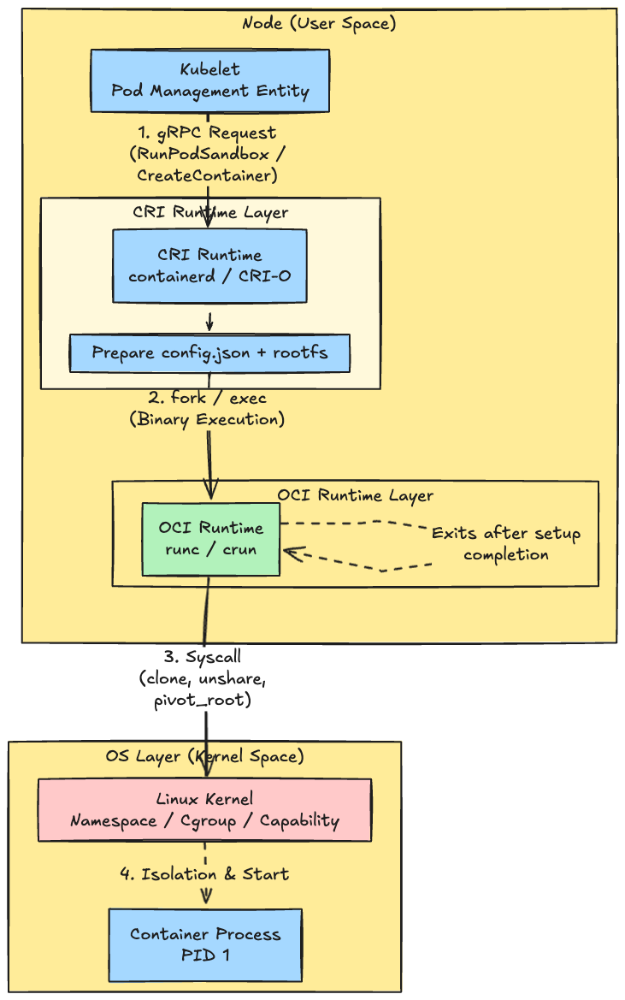

# Introduction

**"Wait, what exactly is the difference between OCI Runtime and CRI again?"**

Have you ever found yourself asking this?

These two are **distinctly different. Their hierarchies and roles are completely separate.**

In a nutshell: **CRI is the "API (Interface) for Kubernetes to issue commands,"** whereas **OCI Runtime is the "execution binary that actually manipulates the kernel to create containers."**

I would like to explain the background of **"why these two are separated (and what issues led to this split)."**

---

## 1. Background and Issues: Why do we need two?

In the past, Docker handled everything (image building, execution, and management). However, for Kubernetes, this was too monolithic and created an **issue** of excessive dependency on Docker.

To address this, a **solution** was adopted to separate responsibilities into the following two stages:

1. **Standardization of "How to run a container (Low-level)"**
   * This covers the parts close to the OS and hardware. This was standardized as the **OCI (Open Container Initiative) Runtime**.
2. **Standardization of "How to connect with Kubernetes (High-level)"**
   * This covers the part that receives commands from Kubelet. This was defined as the **CRI (Container Runtime Interface)**.

---

### 2. Roles and Differences

#### CRI (Container Runtime Interface)

* **Layer**: High-Level Runtime (Interface with Kubernetes)
* **Role**: **"The Orchestration Gateway"**
  * Receives commands via gRPC from Kubelet (e.g., "Create a Pod," "Pull an image").
  * Manages images, sets up networking (invoking CNI), and manages the container lifecycle.
* **Implementation Examples**:
  * `containerd` (via CRI plugin)
  * `CRI-O`
* **Who it talks to**: Talks to Kubelet above, and the OCI Runtime below.

> Tip: What about Docker? Docker Engine itself is not CRI-compliant. Historically, Kubernetes used a bridge called dockershim to communicate with Docker. Modern Kubernetes bypasses the Docker daemon entirely and talks directly to containerd (the CRI runtime running inside Docker).

#### OCI Runtime

* **Layer**: Low-Level Runtime (Interface with the Kernel)
* **Role**: **"The Execution Craftsman"**
* Based on the `config.json` and `rootfs` (file system) passed from the CRI runtime, it actually spawns the container process.
* It directly invokes Linux kernel features (Namespaces, Cgroups, Capabilities, etc.) to create the isolated environment.
* In many cases, once the process is launched, it finishes its role and exits.
* **Implementation Examples**:
  * `runc` (The standard)
  * `crun` (Written in C)
  * `youki` (Written in Rust)
  * `gVisor` (Sandbox)
  * `Kata Containers` (VM-based)
  * `runwasi` (WebAssembly)
  * `Kuasar` (Multi-sandbox)
* **Who it talks to**: Talks to the CRI Runtime above, and the Linux Kernel below.

---

### 3. Actual Process Flow (Call Sequence)

When Kubernetes creates a Pod, a "bucket brigade" (relay) occurs as follows:

1. **Kubelet**
   * Decides "I want to create a Pod" and sends a command via CRI.
   * `CreateContainerRequest` (gRPC)
2. **CRI Runtime** (`containerd` or `CRI-O`)
   * Receives the request and pulls the image if it doesn't exist.
   * Generates the JSON configuration file and prepares to invoke the OCI Runtime.
3. **OCI Runtime** (`runc`, etc.)
   * Example of the actual command invoked: `runc create ...`
   * Calls system calls like `clone()` etc., sets up Namespaces, and isolates the process.
4. **Linux Kernel**
   * The process starts within the isolated space.

**What is config.json (OCI Bundle)?**

In the flow diagram, the `config.json` that the CRI Runtime passes to the OCI Runtime is essentially the **"Physical Blueprint of the Container."**

Kubernetes YAML (manifests) are highly abstract, but the OCI Runtime doesn't understand them. Therefore, the CRI Runtime converts the YAML into "concrete parameters that the Kernel can understand."

Specifically, it contains settings such as:

* **Namespaces**: Which namespaces (PID, Network, Mount, etc.) to create newly or share with the host.
* **Cgroups**: Concrete numerical values for resource limits, such as memory limits (in bytes) or CPU shares.
* **Rootfs**: Where the container's file system is located.
* **Capabilities**: Privileges granted to the process (e.g., `CAP_NET_BIND_SERVICE`).
* **Mounts**: How to mount host directories like `/sys` or `/proc`.

In other words, the abstract wish "I want to create a Pod with 1GiB of memory" is written down into a **physical order form** that says "Set `memory.limit_in_bytes` to `1073741824`"—this is what `config.json` is.

### Summary

* **CRI**: The **"Interpreter"** for talking to Kubelet (Interface/Protocol).
* **OCI Runtime**: The **"Tool"** that actually uses kernel features to build containers (Binary).

When you are running `kubectl` commands during normal operations, you are looking at the CRI world (whether the container exists or not). However, when troubleshooting low-layer issues like "Why isn't the process isolated?" or "The cgroup looks weird," you will be looking at the behavior of the OCI Runtime.
