# Introduction

In previous articles, we decoded RFC 6749 (OAuth 2.0), RFC 6750 (Bearer Token), and RFC 8705 (mTLS). You probably understand how the "authorization" mechanism of OAuth 2.0 works by now.

But do you ever wonder about these questions?

- "Can OAuth 2.0 be used for authentication? Or can it not?"
- "What is the difference between an ID Token and an Access Token?"
- "What exactly happens when you add `scope=openid`?"
- "What does the UserInfo Endpoint return?"

Simply having experience "implementing Google Login" is not enough to understand the design philosophy of OIDC. Implementing authentication without reading the specification invites security holes like Token Substitution Attacks and Replay Attacks.

In this article, we will read through the **OpenID Connect Core 1.0** (hereafter referred to as OIDC Core) based on the original specification and fundamentally understand the essence of OIDC. Let me give you the conclusion first: OIDC is not "a mechanism that adds authentication to OAuth 2.0". To be exact, it is **a mechanism that standardizes the delivery of the authentication results performed by an OP (OpenID Provider) to an RP (Relying Party) in the form of a verifiable ID Token.** Authentication itself is performed by the OP. OIDC standardizes how that result is communicated.

---

## Scope of This Article

First, let's map out where OIDC Core is positioned among the RFCs of OAuth 2.0 and OIDC.

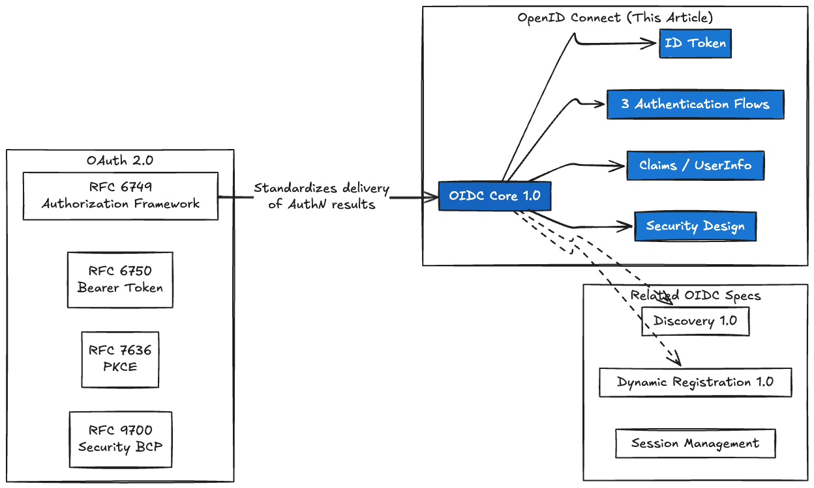

While OAuth 2.0 defines "how to obtain an access token," OIDC Core defines **"a mechanism to deliver the authentication result performed by the OP (i.e., who the end-user is) to the RP as a signed ID Token."** Again, OIDC itself does not perform authentication. The OP does. OIDC standardizes the delivery method of its result.

As a prerequisite, I will proceed on the assumption that you understand the Authorization Code Grant flow of OAuth 2.0. If you don't, please read the RFC 6749 article first.

---

## 1. OAuth 2.0 Does Not Have "Authentication"

### 1.1 The Difference Between Authentication and Authorization

This distinction is the most important part of understanding OIDC.

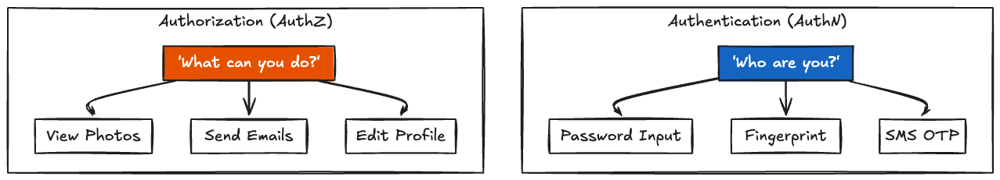

| Concept            | The Question                | The Result                             | Protocol      |
| ------------------ | --------------------------- | -------------------------------------- | ------------- |
| **Authentication** | Who are you?                | The user's identity is verified        | **OIDC**      |
| **Authorization**  | What are you allowed to do? | Access rights to resources are granted | **OAuth 2.0** |

### 1.2 What is Missing in OAuth 2.0 Alone?

RFC 6749 is an "authorization" framework. It defines the mechanism for accessing APIs using Access Tokens, but it **does not define a standard way to convey "who the user is".**

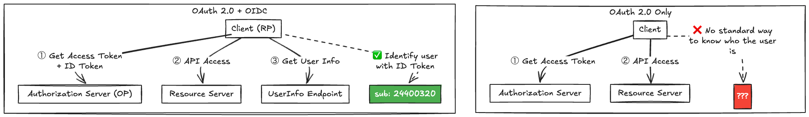

You might think, "But can't I just get user information by calling `/userinfo` with an Access Token?" That is an API uniquely implemented by each provider, not a standardized mechanism. If the response format of `/userinfo` were completely different across Google, Facebook, and GitHub, supporting multiple providers would be hell.

What OIDC Core defined is **a mechanism to deliver the authentication results performed by an OP to an RP as a standardized, verifiable token (ID Token)**. Authentication is done by the OP, and OIDC standardizes the transmission of its result. This distinction is crucial.

---

## 2. OIDC Overview — Actors and Protocol Flow

### 2.1 Terminology Mapping

OIDC extends and uses the terminology of OAuth 2.0. To avoid confusion, let's map them out here.

| OAuth 2.0 Term             | OIDC Term                   | Description                                            |
| -------------------------- | --------------------------- | ------------------------------------------------------ |
| **Client**                 | **Relying Party (RP)**      | An application requiring user authentication           |
| **Authorization Server**   | **OpenID Provider (OP)**    | Authenticates the user and issues an ID Token          |
| **Authorization Request**  | **Authentication Request**  | An authorization request containing `scope=openid`     |
| **Authorization Response** | **Authentication Response** | A response containing an ID Token                      |
| —                          | **ID Token**                | A JWT containing Claims about the authentication event |
| —                          | **UserInfo Endpoint**       | A protected resource that returns user information     |

### 2.2 Protocol Flow Overview

Let's look more closely at the abstract flow described in OIDC Core §1.3.

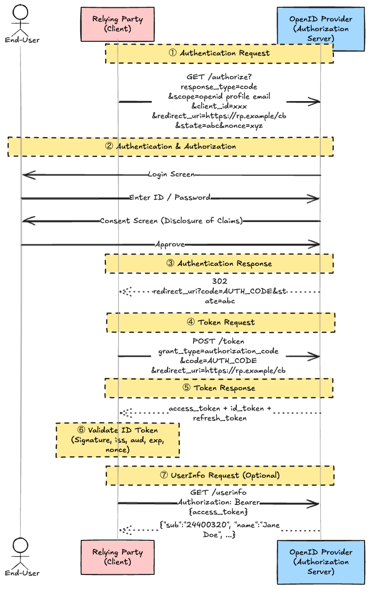

The key point is **`scope=openid`**. If this is included, the OAuth 2.0 request is treated as an OIDC Authentication Request. If not included, it's just a regular OAuth 2.0 Authorization Request.

> OIDC Core §3.1.2.1: OpenID Connect requests MUST contain the `openid` scope value. If the `openid` scope value is not present, the behavior is entirely unspecified.

---

## 3. ID Token — The Core of OIDC

The ID Token is the most important data structure that OIDC added to OAuth 2.0. It expresses "who the user is" and "when and how they were authenticated" as a verifiable JWT.

### 3.1 Difference Between ID Token and Access Token

Many people confuse these two, so let's clarify them here.

| Characteristic        | ID Token                        | Access Token                    |
| --------------------- | ------------------------------- | ------------------------------- |
| **Format**            | JWT (MUST)                      | Undefined (JWT or opaque)       |
| **Who it belongs to** | Verified and consumed by the RP | Verified by the Resource Server |
| **Primary Use**       | User identity verification      | API Access                      |
| **Where to send**     | Nowhere (kept by RP)            | Sent to the Resource Server     |
| **Signature**         | Required (JWS)                  | Depends on the specs            |

> ⚠️ Do NOT use an ID Token as an API access token. The ID Token is strictly for telling the RP "who the user is" and is not meant to be shown to the Resource Server.

### 3.2 ID Token Claims

Let's look at the ID Token Claims defined in OIDC Core §2.

```json
{
  "iss": "https://accounts.google.com",
  "sub": "24400320",
  "aud": "s6BhdRkqt3",
  "exp": 1311281970,
  "iat": 1311280970,
  "auth_time": 1311280969,
  "nonce": "n-0S6_WzA2Mj",
  "acr": "urn:mace:incommon:iap:silver",
  "amr": ["pwd", "otp"],
  "azp": "s6BhdRkqt3"
}
```

Organizing the meaning of each Claim:

| Claim         | REQUIRED/OPTIONAL | Description                                                                                         |
| ------------- | ----------------- | --------------------------------------------------------------------------------------------------- |
| **iss**       | REQUIRED          | Issuer Identifier of the OP. HTTPS URL                                                              |
| **sub**       | REQUIRED          | Subject Identifier. Locally unique and never reassigned within the Issuer. Max 255 chars            |
| **aud**       | REQUIRED          | Audience(s) this ID Token is intended for (RP's `client_id`). Array is allowed                      |
| **exp**       | REQUIRED          | Expiration time on or after which the ID Token MUST NOT be accepted (Unix Timestamp)                |
| **iat**       | REQUIRED          | Time at which the JWT was issued (Unix Timestamp)                                                   |
| **auth_time** | Conditional       | Time when the End-User authentication occurred. REQUIRED if `max_age` was requested                 |
| **nonce**     | Conditional       | Used to mitigate replay attacks. Contains the `nonce` value sent in the Auth Request                |
| **acr**       | OPTIONAL          | Authentication Context Class Reference (strength level of authentication)                           |
| **amr**       | OPTIONAL          | Authentication Methods References (e.g., `pwd`, `otp`, `fpt`)                                       |
| **azp**       | OPTIONAL          | Authorized party (the party to which the ID Token was issued). Used in specific extension scenarios |

### 3.3 nonce — Mitigating Replay Attacks

`nonce` is easily confused with `state` in OAuth 2.0, but they protect against different things.

| Parameter | Protects Against        | Included In                                  | Verification Timing         |
| --------- | ----------------------- | -------------------------------------------- | --------------------------- |
| `state`   | CSRF Attacks            | Query/Fragment of the Authorization Response | Upon receiving the callback |
| `nonce`   | ID Token Replay Attacks | Claims inside the ID Token                   | During ID Token validation  |

How `nonce` works:

1. The RP generates a random `nonce` and stores it in the session.
2. The RP includes `nonce=xyz` in the Authentication Request.
3. The OP returns the ID Token with `"nonce": "xyz"` in its Claims.
4. The RP matches the `nonce` Claim in the ID Token against the value saved in the session.

Even if an attacker reuses an old ID Token, it can be detected because the `nonce` will not match the current session.

### 3.4 ID Token Signature and Encryption

OIDC Core §2 mandates the following regarding the protection of ID Tokens:

- ID Tokens **MUST be signed** using JWS.
- Encryption is OPTIONAL. If encrypted, the order MUST be "sign then encrypt" (Nested JWT).
- The default `alg` is `RS256`.
- `alg=none` is ONLY allowed if the ID Token is received directly from the Token Endpoint via the Authorization Code Flow, AND explicitly requested during Client Registration.

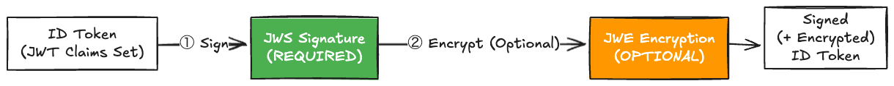

---

## 4. The 3 Authentication Flows

OIDC Core defines three authentication flows. Which one to use is determined by the `response_type` parameter.

### 4.1 Flow Decision Tree

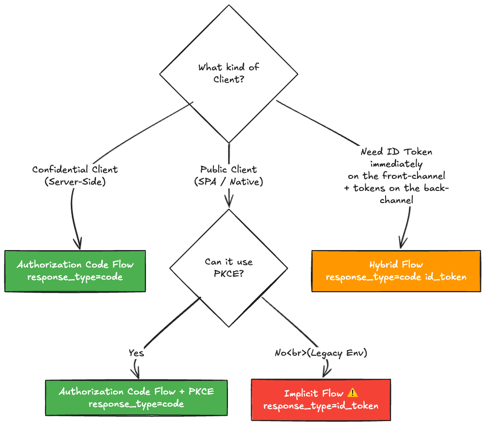

### 4.2 Flow Comparison Table

Organizing the abstract properties table from OIDC Core §3.

| Characteristic                      | Authorization Code Flow | Implicit Flow                 | Hybrid Flow                                            |
| ----------------------------------- | ----------------------- | ----------------------------- | ------------------------------------------------------ |
| `response_type`                     | `code`                  | `id_token` / `id_token token` | `code id_token` / `code token` / `code id_token token` |
| Where tokens are returned from      | Token Endpoint only     | Authorization Endpoint only   | Both                                                   |
| Tokens not revealed to User Agent   | ✅                       | ❌                             | ❌ (Partially)                                          |
| Client can be authenticated         | ✅                       | ❌                             | ✅                                                      |
| Refresh Token possible              | ✅                       | ❌                             | ✅                                                      |
| Communication in one round trip     | ❌                       | ✅                             | ❌                                                      |
| Most communication server-to-server | ✅                       | ❌                             | Varies                                                 |

### 4.3 Authorization Code Flow (Recommended ✅)

The most secure and recommended flow. All tokens are returned from the Token Endpoint (back-channel).

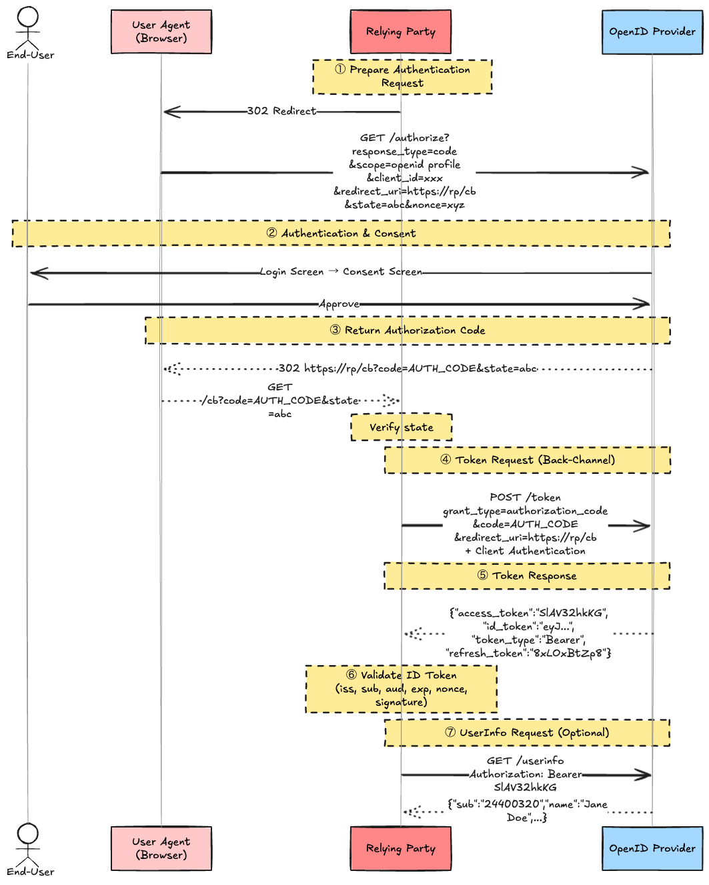

Security benefits of the Authorization Code Flow:

- **Access Token is not passed to the User Agent** — The Token Endpoint operates over the back-channel (server-to-server communication), so tokens won't leak in browser history or referrers.
- **Client Authentication is possible** — Confidential Clients can naturally authenticate themselves with `client_secret` or mTLS at the Token Endpoint.
- **TLS Protects the ID Token** — Since it is received directly from the Token Endpoint over HTTPS, Issuer validation via TLS is possible (in some profiles, signature verification may even be skipped).

### 4.4 Implicit Flow (Deprecated ⚠️)

All tokens are returned directly from the Authorization Endpoint. The Token Endpoint is not used.

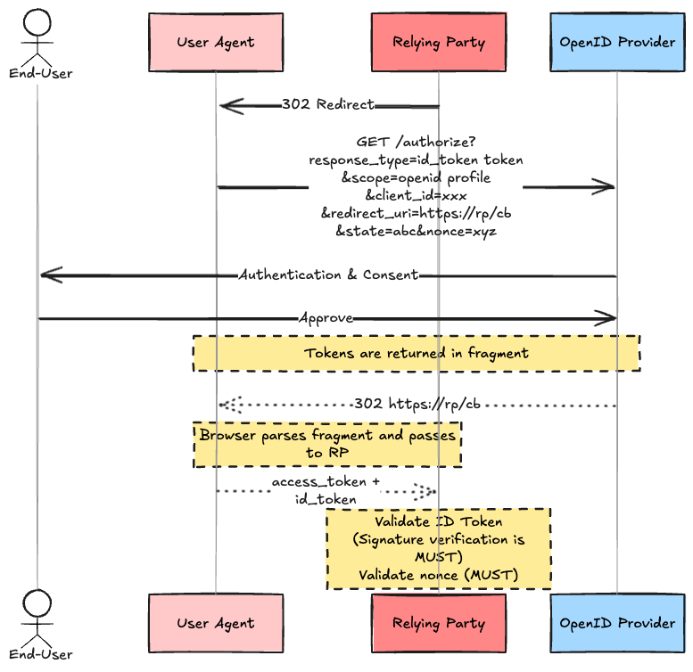

> ⚠️ The Implicit Flow is being omitted in OAuth 2.1. Do NOT use it for new implementations. Use the Authorization Code Flow + PKCE instead.

Problems with the Implicit Flow:

1. **Tokens expose in the URI Fragment** — High risk of leakage through browser history or referrers.
2. **Client Authentication is not possible** — Since the Token Endpoint is not used, the OP cannot authenticate the RP.
3. **No Refresh Tokens** — Explicitly prohibited by the spec.
4. **Signature verification is MUST** — Because the token arrives through the front-channel (not over a direct TLS connection to the Token Endpoint), the ID Token's signature MUST always be verified.

However, if using the Implicit Flow with `response_type=id_token` (NO Access Token), only the ID Token is returned. In this case, there is no risk of Access Token leakage.

### 4.5 Hybrid Flow

Tokens are returned from both the Authorization Endpoint and the Token Endpoint. It is a "hybrid" of the Authorization Code Flow and the Implicit Flow.

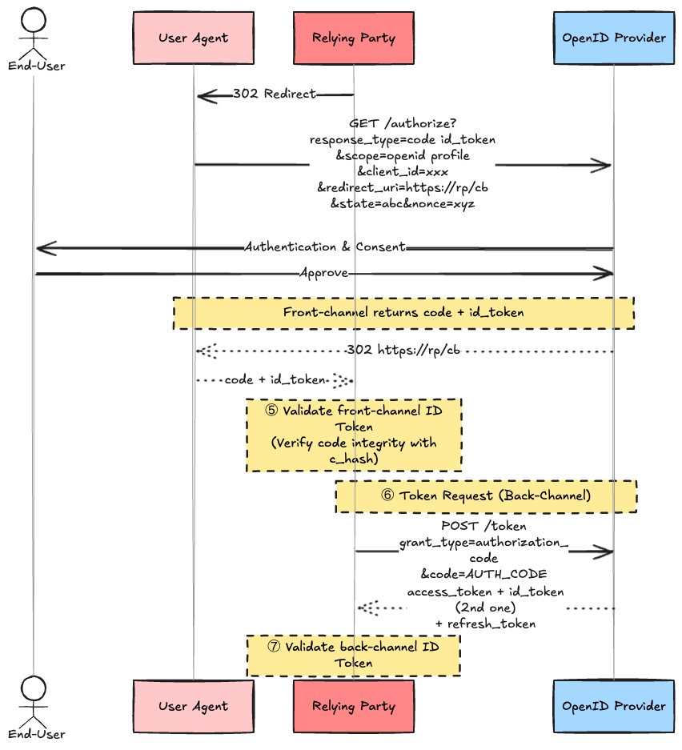

The reason the Hybrid Flow exists is for **combining an excellent UX with security**.

The front-end (SPA or Native App) can immediately inspect the ID Token the moment it returns from the redirect, instantly identify "who logged in," and render the screen without waiting for the back-end. Afterwards, the `code` is used in the background to safely fetch the Access Token.

You might wonder, "If both `code` and `id_token` are returned via the browser, isn't it dangerous if an attacker swapped out just the `code`?" However, the OP generates **both the `code` and the `id_token` at the exact same moment** and returns them together. To prove the integrity of the accompanying `code`, the OP embeds a `c_hash` (explained below) inside the ID Token. The RP verifies the ID Token's signature and matches its `c_hash` against the received `code`. This mechanism ensures that it is safe to proceed to the next back-channel request.

`response_type` combinations and tokens returned in Hybrid Flow:

| `response_type`       | From Authorization Endpoint    | From Token Endpoint     |
| --------------------- | ------------------------------ | ----------------------- |
| `code id_token`       | code + id_token                | access_token + id_token |
| `code token`          | code + access_token            | access_token + id_token |
| `code id_token token` | code + id_token + access_token | access_token + id_token |

Claims unique to the Hybrid Flow:

- **`c_hash`** — Hash of the Authorization Code. Included in the ID Token to detect unauthorized tampering of the auth code.
- **`at_hash`** — Hash of the Access Token. Included in the ID Token to detect unauthorized tampering of the access token.

The calculation method is as follows: **The SHA-256 hash is calculated in full, and only its LEFT HALF (128 bits) is then base64url encoded.** It doesn't stop the hashing algorithm halfway through; it is a truncation of the full 256-bit output.

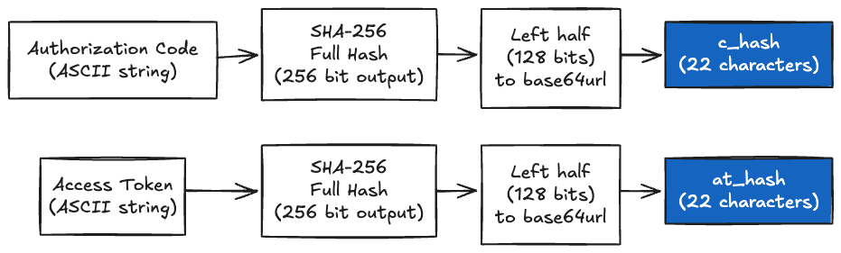

Why use only the half (22 chars) instead of the full hash (43 chars)? The reason is **to reduce the size of the ID Token**. The ID Token is a JWT that can be transported in URL fragments, and URLs have length limits. Security-wise, 128 bits is perfectly sufficient; a Preimage Attack requires 2^128 operations (equivalent safety to AES-128). Since the purpose of `at_hash` / `c_hash` is integrity checking (tamper detection), they do not need to be universally unique identifiers, making 128-bit collision resistance more than enough.

---

## 5. Claims — Requesting User Information

OIDC represents "user information" as **Claims**. A Claim literally means an "assertion". While it might sound synonymous to a "JWT field," there is a reason it is called a "Claim" and not a "field." It carries the nuance of **"The OP is claiming that this is true (= which might not necessarily be an absolute fact)."**

For example, `"email": "jane@example.com"` means "The OP *claims* that this person's email is jane@example.com." Whether the OP actually verified that email ownership is indicated by another Claim entirely (`email_verified`). Also, Claims exist not only inside the JWT (ID Token) but also in the JSON response of the UserInfo Endpoint. "Claims" is an abstract concept of assertions about an entity, not something exclusive to JWT formatting.

There are two ways to request Claims.

### 5.1 Requesting Claims using Scope

By passing values in the `scope` parameter, you can request specific sets of Claims.

```http
GET /authorize?response_type=code
  &scope=openid profile email phone address
  &client_id=xxx
  &redirect_uri=https://rp/cb
```

| scope value | Claims Returned                                                                                                                                                                  |
| ----------- | -------------------------------------------------------------------------------------------------------------------------------------------------------------------------------- |
| **openid**  | `sub` (REQUIRED. Without this, it's not an OIDC request)                                                                                                                         |
| **profile** | `name`, `family_name`, `given_name`, `middle_name`, `nickname`, `preferred_username`, `profile`, `picture`, `website`, `gender`, `birthdate`, `zoneinfo`, `locale`, `updated_at` |
| **email**   | `email`, `email_verified`                                                                                                                                                        |
| **phone**   | `phone_number`, `phone_number_verified`                                                                                                                                          |
| **address** | `address` (JSON Object)                                                                                                                                                          |

> Any Claims requested via scope are treated as **Voluntary Claims**. The OP may choose not to return some or all of them for privacy reasons.

### 5.2 the "claims" parameter for individual requests

If you need more granular control, you can use the `claims` parameter. This is appended as a URL-encoded JSON object in the URL query string of the **Authentication Request (the initial redirect to the Authorization Endpoint)**. You can specify whether an individual Claim is Essential or Voluntary.

```json
{
  "userinfo": {
    "given_name": {"essential": true},
    "email": {"essential": true},
    "picture": null
  },
  "id_token": {
    "auth_time": {"essential": true},
    "acr": {"values": ["urn:mace:incommon:iap:silver"]}
  }
}
```

- `"essential": true` — The RP considers this Claim essential. The OP should return it if at all possible.
- `null` — Requested as a Voluntary Claim.
- `"values"` — Requests specific values (e.g., specifying an ACR level).

### 5.3 Where are the scope-requested Claims returned from?

When you request `name` or `email` via `scope=openid profile email`, where do you actually fetch them from? That depends on whether an Access Token is issued or not.

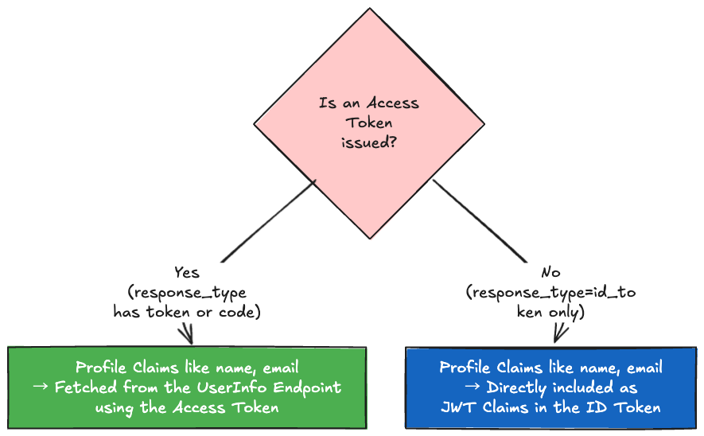

If there is no Access Token, the RP cannot call the UserInfo Endpoint, so the requested Claims must naturally go inside the ID Token. If there is an Access Token, the OIDC design paradigm is to keep the ID Token strictly for delivering authentication metadata (`iss`, `sub`, `aud`), and to fetch all the detailed profile information from the UserInfo Endpoint.

---

## 6. UserInfo Endpoint

The UserInfo Endpoint is the OIDC standard API that returns user information upon presenting an Access Token.

"Why go out of the way to have a UserInfo Endpoint instead of completing everything with just the ID Token?" The reason is **to prevent ID Token bloat (Fat Tokens)**. If you jam a long picture URL, a detailed physical address (`address` JSON), and numerous authorization roles all into the ID Token, the payload will hit URL length limits when transported over a URL fragment during the Hybrid Flow.

Therefore, the ID Token is designed to securely pack just the bare-minimum backbone (the certificate of who, when, and how authentication happened: `sub`, `iss`, `aud`, `sig`, `nonce`). The "meat" of the profile (the Claims) is then fetched separately, in bulk, and safely over a back-channel API call from the UserInfo Endpoint using an Access Token. It is a division of labor.

### 6.1 Request and Response

```http
GET /userinfo HTTP/1.1
Host: server.example.com
Authorization: Bearer SlAV32hkKG
```

```json
HTTP/1.1 200 OK
Content-Type: application/json

{
  "sub": "248289761001",
  "name": "Jane Doe",
  "given_name": "Jane",
  "family_name": "Doe",
  "preferred_username": "j.doe",
  "email": "janedoe@example.com",
  "picture": "http://example.com/janedoe/me.jpg"
}
```

### 6.2 Key Rules of UserInfo

| Rule                       | Description                                                                                                             |
| -------------------------- | ----------------------------------------------------------------------------------------------------------------------- |
| **`sub` is MUST**          | The UserInfo Response MUST contain the `sub` Claim                                                                      |
| **`sub` Matching is MUST** | The RP MUST verify that the `sub` in UserInfo exactly matches the `sub` in the ID Token (Token Substitution Mitigation) |
| **TLS is MUST**            | Communication with the UserInfo Endpoint MUST use HTTPS                                                                 |
| **Security Profiles**      | The response can be JSON, Signed JWT, or Encrypted JWT                                                                  |
| **CORS Recommended**       | It SHOULD support CORS for browser-based clients                                                                        |

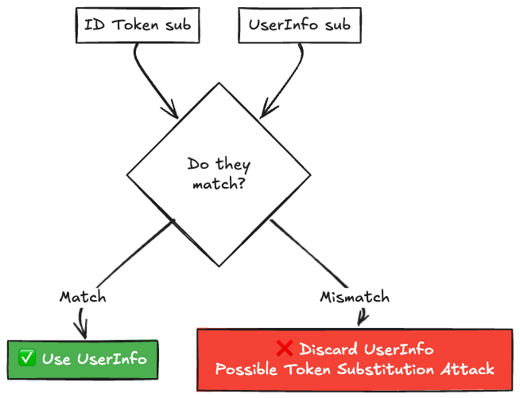

> ⚠️ If the `sub` claim of the ID Token and the UserInfo do not match, **you MUST NOT use that UserInfo response.** This is the primary countermeasure against the Token Substitution Attack (§16.11). Even if an attacker swaps the Access Token with one belonging to another user, matching the `sub` against your trusted ID Token will detect it instantly.

---

## 7. ID Token Validation Steps

The ID Token validation steps defined in OIDC Core §3.1.3.7 are the absolute linchpin of security. Skipping these steps leads directly to vulnerabilities.

| Step            | What to Validate                                             | Risk if Failed                        |
| --------------- | ------------------------------------------------------------ | ------------------------------------- |
| **① Decrypt**   | Reject if it isn't encrypted despite an encryption agreement | Information Disclosure of Claims      |
| **② iss**       | Is the issuer a trusted OP?                                  | Issuer Spoofing                       |
| **③ aud**       | Is this token meant for me?                                  | Token Misuse                          |
| **④ azp**       | Validate authorized party during extension cases             | Interception                          |
| **⑤ Signature** | Has the token been tampered with?                            | Token Manufacture                     |
| **⑥ exp**       | Is it within the expiration time?                            | Expired Token Reuse                   |
| **⑦ iat**       | Is the issue time reasonable?                                | Reuse of old tokens                   |
| **⑧ nonce**     | Is it a replay attack?                                       | Replay Attack                         |
| **⑨ acr**       | Is the AuthN strength adequate?                              | High privilege access with weak AuthN |
| **⑩ auth_time** | Was the AuthN recent?                                        | Session Fixation                      |

---

### 8.1 prompt — Controlling Authentication and Consent

| Value            | Behavior                                                                                     |
| ---------------- | -------------------------------------------------------------------------------------------- |
| `none`           | MUST NOT display any AuthN or consent UI. Return `login_required` error if no session exists |
| `login`          | MUST force the user to re-authenticate                                                       |
| `consent`        | MUST prompt for consent even if previously granted                                           |
| `select_account` | Prompt an account selection screen                                                           |

`prompt=none` serves a critical use case. RP uses it in the background (typically an iframe) to ask the OP, "Is this user still logged in?" (Silent Authentication Check).

### 8.2 max_age — Controlling Authentication Freshness

Specifying `max_age=3600` tells the OP, "Force a re-authentication if more than 1 hour has elapsed since the last time the user actively authenticated." `max_age=0` is practically identical to `prompt=login`, forcing an immediate re-auth.

If `max_age` is requested, the OP is **REQUIRED** to include the `auth_time` Claim in the ID Token.

### 8.3 OIDC Specific Error Codes

OIDC Core defines additional error codes to supplement OAuth 2.0.

| Error Code                   | Trigger Condition                                |
| ---------------------------- | ------------------------------------------------ |
| `interaction_required`       | `prompt=none`, but user interaction is required  |
| `login_required`             | `prompt=none`, but authentication is required    |
| `account_selection_required` | `prompt=none`, but account selection is required |
| `consent_required`           | `prompt=none`, but consent is required           |
| `invalid_request_uri`        | The `request_uri` parameter is invalid           |
| `invalid_request_object`     | The JWT in the `request` parameter is invalid    |
| `request_not_supported`      | OP does not support the `request` parameter      |
| `request_uri_not_supported`  | OP does not support the `request_uri` parameter  |

---

## 9. Subject Identifier Types

OIDC Core §8 defines two approaches OP can use to assign identifiers (`sub` Claims) to End-Users.

| Strategy     | Characteristics                     | Privacy                                                    |
| ------------ | ----------------------------------- | ---------------------------------------------------------- |
| **public**   | Provides the same `sub` to all RPs  | ❌ Low (RPs can easily track and correlate the user)        |
| **pairwise** | Provides a unique `sub` for each RP | ✅ High (Impossible to track the user across different RPs) |

Pairwise is also known as a **Pairwise Pseudonymous Identifier (PPID)**. Even if "RP-A" and "RP-B" compare the `sub` for the same physical user, the strings will not match, preventing cross-domain tracking.

---

## 10. Security Considerations (OIDC Core §16)

OIDC Core §16 outlines OIDC semantic threats above and beyond the underlying OAuth 2.0 framework.

| Threat                    | Description                                                 | Mitigation                                           |
| ------------------------- | ----------------------------------------------------------- | ---------------------------------------------------- |
| **Token Substitution**    | Attacker swaps an Access Token to fetch another user's info | Validate `sub` in ID Token against `sub` in UserInfo |
| **Server Masquerading**   | A malicious OP issues a token                               | Validate `iss` + Verify TLS Certificate              |
| **ID Token Replay**       | Reusing a previously intercepted ID Token                   | Validate `nonce` + Validate `exp`                    |
| **Token Manufacture**     | Forging a fake ID Token                                     | Verify JWS Signature                                 |
| **Implicit Flow Threats** | Tokens leaking from URI Fragments                           | Migrate to Authorization Code Flow + PKCE            |
| **HTTP 307 Redirect**     | POST body transfers during 307 redirects                    | Strictly use HTTP 302 or 303                         |
| **Timing Attack**         | Information leak through cryptographic execution time       | Use constant-time comparison algorithms              |

---

## 11. Related Specifications Map

OIDC Core does not work effectively in a vacuum. Production deployments usually require these adjacent specifications.

| Specification                     | Short Description                                                                           |
| --------------------------------- | ------------------------------------------------------------------------------------------- |
| **OIDC Discovery 1.0**            | Publishes OP configurations (endpoints, algs) at `/.well-known/openid-configuration`        |
| **OIDC Dynamic Registration 1.0** | Allows RPs to dynamically register their Client at the OP                                   |
| **OIDC Session Management 1.0**   | Allows RP to monitor and synchronize the login state with the OP                            |
| **OIDC Front-Channel Logout 1.0** | Cross-domain Single Logout via hidden iframe rendering                                      |
| **OIDC Back-Channel Logout 1.0**  | Single Logout via direct server-to-server POST notifications                                |
| **OIDC RP-Initiated Logout 1.0**  | Mechanism allowing the RP to initiate a global logout sequence                              |
| **FAPI 2.0**                      | A hardened security profile targeting Financial APIs (A strict wrapper over OIDC+OAuth 2.0) |

---

## Conclusion

The essence of OIDC Core 1.0 can be summarized in three points.

1. **OIDC does not "add authentication." It is a mechanism that delivers the result of an authentication performed by the OP to an RP as a signed, tamper-safe ID Token.**
2. **The ID Token contains the "who (`sub`)", "when (`auth_time`)", and "how (`amr`)". It has an entirely different responsibility compared to an Access Token.**
3. **Failing to validate the ID Token guarantees you will get hit by Token Substitution or Replay Attacks. The 10 validation steps cannot be skipped.**

Never settle for "Wait, it successfully logged me into Google, so my code is fine." Verify the `iss`, check the `aud`, and match your `nonce`.

If OAuth 2.0 is the "Framework for Delegating Resource Access Rights," OIDC is the "Mechanism for Delivering the OP's Authentication Result as a Standardized, Verifiable Token." Do not conflate Authorization and Authentication. Internalizing this is the starting point of understanding OIDC.

## References

- [OpenID Connect Core 1.0](https://openid.net/specs/openid-connect-core-1_0.html)
- [OpenID Connect Discovery 1.0](https://openid.net/specs/openid-connect-discovery-1_0.html)
- [OpenID Connect Dynamic Client Registration 1.0](https://openid.net/specs/openid-connect-registration-1_0.html)
- [RFC 6749 - The OAuth 2.0 Authorization Framework](https://datatracker.ietf.org/doc/html/rfc6749)
- [RFC 6750 - Bearer Token Usage](https://datatracker.ietf.org/doc/html/rfc6750)
- [RFC 7636 - PKCE](https://datatracker.ietf.org/doc/html/rfc7636)
- [RFC 7519 - JSON Web Token (JWT)](https://datatracker.ietf.org/doc/html/rfc7519)
- [RFC 7515 - JSON Web Signature (JWS)](https://datatracker.ietf.org/doc/html/rfc7515)
- [OAuth 2.1 Draft](https://datatracker.ietf.org/doc/draft-ietf-oauth-v2-1/)
