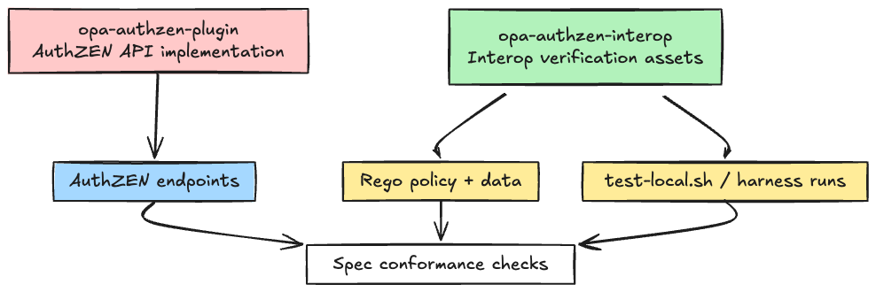
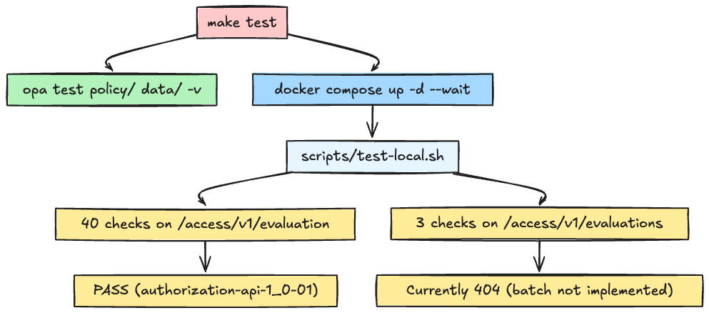

# Introduction

In my earlier post, [I Built an OPA Plugin That Turns It Into an AuthZEN-Compatible PDP](https://dev.to/kanywst/i-built-an-opa-plugin-that-turns-it-into-an-authzen-compatible-pdp-i81), I covered how I added AuthZEN API support (`POST /access/v1/evaluation`) directly to OPA.

When I looked at the interop results page, I saw multiple projects already validating on the same scenario.  
That became the main reason I started this repo: **I wanted to put my implementation on the same field and verify it there too.**

So I built `opa-authzen-interop`.

Repo: [https://github.com/kanywst/opa-authzen-interop](https://github.com/kanywst/opa-authzen-interop)

---

## What This Article Covers

1. Why I separated an interop-focused repo from the plugin repo  
2. How other projects are participating in OpenID AuthZEN interop  
3. Where `opa-authzen-interop` stands today and what comes next  

The article assumes basic familiarity with `PDP/PEP` and the `AuthZEN Authorization API`.

---

## Why A Separate Repo

`opa-authzen-plugin` is responsible for one thing: **implementing the AuthZEN API in OPA**.  
`interop` is responsible for something different: **locking scenario-specific policy/data/tests and validating compatibility**.

If both live in one repo, the boundary between product implementation and spec-validation tests gets blurry.



In short: `plugin` is product code, `interop` is verification infrastructure.

---

## Are Other Projects Doing Interop Too?

Yes, absolutely.

According to the official [AuthZEN Interop Introduction](https://authzen-interop.net/docs/intro/), seven formal interop events were organized from June 2024 through December 2025.

On the Todo 1.1 (`authorization-api-1_0-02`) results pages, OPA appears alongside Cerbos, Topaz, OpenFGA, Aserto, Axiomatics, WSO2, and others.

One concrete public implementation example:

- [aserto-dev/authzen-topaz-proxy](https://github.com/aserto-dev/authzen-topaz-proxy)

So this “interop-focused verification repo” approach is not unique to my project; it's already a practical pattern in the ecosystem. I aligned with that approach and split out verification assets for `opa-authzen-plugin`.

---

## Current Status (as of April 5, 2026)

Based on the `opa-authzen-interop` README:

- `authorization-api-1_0-01` (single evaluation): 40/40 PASS
- `POST /access/v1/evaluations` (batch): not implemented yet, returns 404

So there is still a clear gap.

At the same time, the official OPA interop results page for Todo 1.1 already shows `authorization-api-1_0-02` runs.  
That makes the next goal straightforward: **stabilize `1_0-02` support in my own repo as well**.

---

## Next Action

The next three steps are clear:

1. Implement `POST /access/v1/evaluations` in `opa-authzen-plugin`  
2. Make `opa-authzen-interop` green for `authorization-api-1_0-02`  
3. Add interop tests to CI so regressions are caught at PR time  

Longer-term, as interop scenarios evolve, Search/IdP paths (`/access/v1/search/*`) should also become tracking targets.

---

## Authorization Model In The Todo Scenario

The Todo scenario is “5 users × 5 actions”.

| Action            | admin (Rick) | editor (Morty, Summer) | viewer (Beth, Jerry) |
| ----------------- | :----------: | :--------------------: | :------------------: |
| `can_read_user`   |    allow     |         allow          |        allow         |
| `can_read_todos`  |    allow     |         allow          |        allow         |
| `can_create_todo` |    allow     |         allow          |         deny         |
| `can_update_todo` | allow (any)  |    allow (own only)    |         deny         |
| `can_delete_todo` | allow (any)  |    allow (own only)    |         deny         |

In Rego, `input.subject.id` is mapped through `data.users`, roles are evaluated, and ownership-scoped actions check `ownerID`.

```rego
# can_create_todo: allow for admin or editor roles
allow if {
  input.action.name == "can_create_todo"
  some role in user.roles
  role in {"admin", "editor"}
}

# can_update_todo: editor can update only their own todos
allow if {
  input.action.name == "can_update_todo"
  "editor" in user.roles
  input.resource.properties.ownerID == user.email
}
```

---

## How To Run

Shortest path:

```bash
make test
```

If you want to run the official harness directly:

```bash
make up

git clone https://github.com/openid/authzen.git
cd authzen/interop/authzen-todo-backend
yarn install && yarn build
yarn test http://localhost:8181 authorization-api-1_0-01 console
```

`make test` flow:



---

## Final Note (Issue / PR)

There are still many parts I need to improve. If you spot anything, feedback would really help.

- Bug reports: [Issue](https://github.com/kanywst/opa-authzen-interop/issues/new/choose) with reproducible steps
- Spec mismatches: [Issue](https://github.com/kanywst/opa-authzen-interop/issues/new/choose) with the relevant scenario URL
- Improvements / implementation changes: [Pull Request](https://github.com/kanywst/opa-authzen-interop/pulls)

`evaluations` support is still in progress, so suggestions and fixes are both very welcome.

---

## Links

- `opa-authzen-interop` (this repo): [https://github.com/kanywst/opa-authzen-interop](https://github.com/kanywst/opa-authzen-interop)
- `opa-authzen-plugin`: [https://github.com/kanywst/opa-authzen-plugin](https://github.com/kanywst/opa-authzen-plugin)
- AuthZEN Interop Introduction: [https://authzen-interop.net/docs/intro/](https://authzen-interop.net/docs/intro/)
- Todo 1.1 payload spec: [https://authzen-interop.net/docs/scenarios/todo-1.1/](https://authzen-interop.net/docs/scenarios/todo-1.1/)
- OPA interop results (Todo 1.1): [https://authzen-interop.net/docs/scenarios/todo-1.1/results/opa](https://authzen-interop.net/docs/scenarios/todo-1.1/results/opa)
- Topaz interop proxy code: [https://github.com/aserto-dev/authzen-topaz-proxy](https://github.com/aserto-dev/authzen-topaz-proxy)
