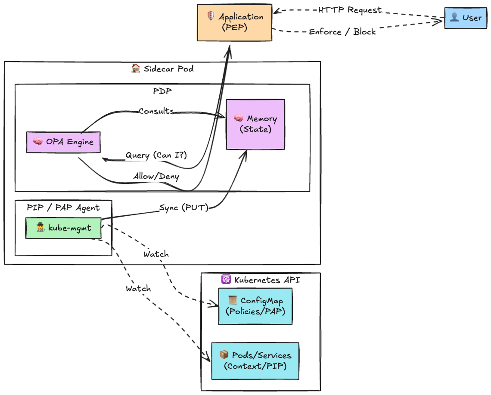
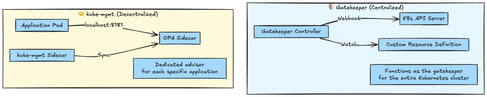
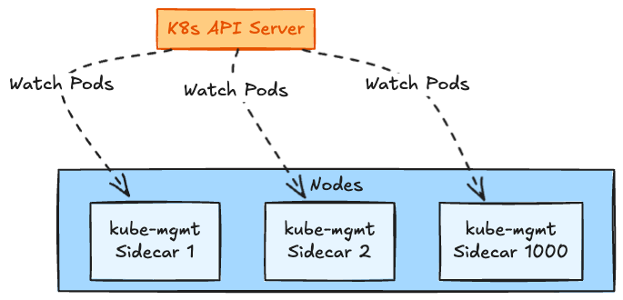
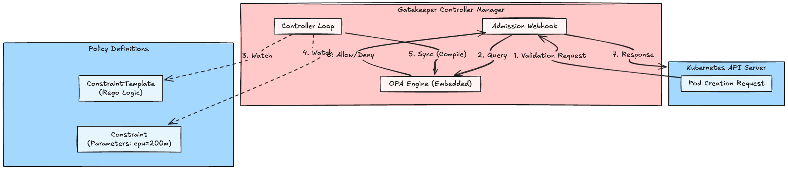

# Introduction

When we talk about "policy management" in the Kubernetes world, **OPA (Open Policy Agent)** is the first thing that comes to mind.
However, OPA itself is beautifully simple. In a nutshell, it's just **"a function that takes JSON as input and returns JSON as output."**

* **Input**: Data like "User A wants to buy Item B"
* **Rule**: Logic like "If there is inventory, allow it" (written in Rego)
* **Output**: "Allow" or "Deny"

OPA isn't exclusive to Kubernetes. You can use it for Linux, SSH, or your own custom applications.
This is because OPA **knows absolutely nothing about the current state of the world (like what's happening inside Kubernetes).**

Enter the star of the show: **kube-mgmt**.
This is the **"dedicated runner (Sidecar)"** that tirelessly fetches information from the Kubernetes world and feeds it to the isolated, oblivious OPA.

In this article, we'll take a massive, 500+ line deep dive into this incredibly versatile pattern—often overshadowed by Gatekeeper—exploring its internal implementation and production-grade operational nuances.

<!-- SECT1_END -->

## 1. Conceptual Diagram: The Relationship Between OPA and kube-mgmt

First, let's look at how OPA and kube-mgmt collaborate and divide their responsibilities. If we map them to standard access control terminology (like XACML/ABAC architecture), their roles become crystal clear.

### OPA: The PDP (Policy Decision Point)

OPA acts as the brain that evaluates requests against predefined policies to render a decision (Allow or Deny). However, as a pure PDP, it is entirely stateless and unaware of the outside world (the current state of Kubernetes). It only knows what is explicitly fed into its memory or provided in the evaluation request.

### kube-mgmt: The PIP / PAP Agent

Sitting right alongside OPA, `kube-mgmt` acts as a **PIP (Policy Information Point)** to feed environmental context, and as an agent for the **PAP (Policy Administration Point)** to fetch the policies themselves. It constantly monitors the outside world (the Kubernetes API). Whenever a new policy is deployed (ConfigMap) or the state of the world changes (Pod status updates), it immediately synchronizes that data into OPA's memory so the PDP has everything it needs.



1. **Watch**: `kube-mgmt` continuously monitors the Kubernetes API.
2. **Sync**: If there are changes, it pushes the data securely into OPA's memory via PUT requests (PIP/PAP role).
3. **Decide**: When an application (the **PEP: Policy Enforcement Point**) intercepts a user request, it queries the PDP (OPA). OPA uses the latest information in its memory to make an instantaneous, stateless decision, and the PEP enforces it.

<!-- SECT2_END -->

## 2. Deep Dive: Inside kube-mgmt

There is no magic in `kube-mgmt`. Under the hood, it's implemented using the standard Kubernetes **Controller pattern**.

### 2-1. Policy Sync

By default, `kube-mgmt` watches for ConfigMaps labeled with `openpolicyagent.org/policy=rego`.

* **Detection**: When a ConfigMap is created or updated, it reads the contents of the `data` field (the Rego code).
* **Translation**: It hits OPA's REST API (`PUT /v1/policies/<id>`) and registers the Rego code.
* **Error Handling**: If there is a syntax error in the Rego code, it writes the error details into the ConfigMap's `status` (annotation). This allows users to simply run `kubectl describe configmap` to figure out what went wrong.

### 2-2. Data Sync

You can sync not just policies, but also raw JSON data (e.g., a list of permissions per user).
This targets ConfigMaps labeled with `openpolicyagent.org/data=opa`.

* **Path Mapping**: The data is mapped to OPA's `PUT /v1/data/<path>`.
* **Structure**: The exact data structure inside the ConfigMap becomes the data structure inside OPA.

### 2-3. Kubernetes Resource Replication

This is its most powerful feature. By specifying the `--replicate=<group>/<version>/<kind>` flag, you instruct it to mirror specific Kubernetes resources directly into OPA's memory.

* **Mechanism**: It utilizes Kubernetes' `SharedInformer` to receive resource change events (Add/Update/Delete).
* **Storage Location**: The data is stored under OPA's `data.kubernetes.<kind>` path.
  * Example: `data.kubernetes.pods.default.my-pod`
* **Use Case**: This unlocks the ability to write **context-oriented policies**, such as "allow access only if the requesting Pod belongs to the same Namespace and has a specific label."
* **Permissions (RBAC)**: Since it needs to fetch and watch Kubernetes resources, the `kube-mgmt` Execution Pod (ServiceAccount) **must** be bound to a ClusterRole that grants `get`, `list`, and `watch` permissions for the target resources.

> [!WARNING]
> If you forget the RBAC configurations, `kube-mgmt` will spit out permission errors in its logs, and the resources will simply refuse to sync into OPA's memory.

<!-- SECT3_END -->

## 3. OPA Internal Architecture: The Secret to Blazing Fast Decisions

Let's look at why OPA is so incredibly fast.

### 3-1. In-Memory Store (Radix Tree)

OPA holds all of its data (policies and JSON data) entirely in memory.
This data is stored in a highly optimized structure known as a **Radix Tree**.

* **Search**: Lookups via path paths (e.g., `data.example.allow`) are as fast as, or even faster than, standard hash maps.
* **Sharing**: By sharing parent nodes, it heavily suppresses memory consumption for overlapping paths.

### 3-2. Compiler & Evaluation

Policies written in Rego are not simply interpreted line-by-line at runtime.
During the load phase, they are parsed into an **AST (Abstract Syntax Tree)**, and then further compiled into an **Intermediate Representation**.

1. **Parse**: Converts the Rego string into an AST.
2. **Compile**: Resolves references, checks types, and builds evaluation indexes.
3. **Evaluate**: When a request (Input) arrives, it applies the pre-compiled rules.

This lethal combination of "Ahead-of-Time Compilation" and an "In-Memory Store" is what allows OPA to consistently deliver response times measured in single-digit milliseconds or less.

<!-- SECT4_END -->

## 4. Deep Dive: The Critical Differences from Gatekeeper

"But we have Gatekeeper now, right?" You are absolutely correct.
However, looking at the architectural differences makes their respective "sweet spots" glaringly obvious.



### Architectural Comparison Table

|            Feature             |                     kube-mgmt (Sidecar)                      |                Gatekeeper (Controller)                 |
| :----------------------------: | :----------------------------------------------------------: | :----------------------------------------------------: |
|    **Deployment Location**     |              Deployed as a sidecar in each Pod               |      A single centralized controller cluster-wide      |
|     **Policy Definition**      |                     ConfigMap (Raw Rego)                     |                CRD (ConstraintTemplate)                |
|      **Primary Use Case**      |      **Application Authorization** (Microservice Authz)      |  **K8s Admission Control** (Deployment Restrictions)   |
|     **Communication Path**     |               `localhost` (Ultra-low latency)                |               Webhook (Over the network)               |
| **Scalability Considerations** | Resource consumption scales linearly with the number of Pods | Beware of load concentration on the central controller |
|    **Data Synchronization**    |         Can selectively sync only the necessary data         |  May require caching the entire dataset in some cases  |

While Gatekeeper exists to "protect Kubernetes," `kube-mgmt` remains arguably the strongest option when your goal is to have **"your application externalize its policy decisions."**

<!-- SECT5_END -->

## 5. Introduction to Rego: The World of "Allow IF..."

Let's take a closer look at Rego, the beating heart of OPA.
Rego is fundamentally a **"query language for data."** It's somewhat similar to SQL, but immensely powerful for hierarchical data like JSON.

### Basic Syntax

```rego
package example

import rego.v1

default allow := false

# Multiple conditions (AND)
allow if {
    input.method == "GET"
    input.user == "admin"
}

# Another set of conditions (OR)
allow if {
    input.method == "POST"
    input.user == "superuser"
}
```

* Conditions written inside the same `allow if { ... }` block form an **AND** condition (all must be satisfied).
* Writing multiple `allow if { ... }` blocks creates an **OR** condition (satisfying any single block is enough).

### Data Referencing

Data synced by `kube-mgmt` can be referenced through the global `data` variable.

```rego
# A rule that checks data.kubernetes.pods
# and "allows if the Pod is in the same Namespace"
allow if {
    # The Pod name provided in the input
    target_pod_name := input.target_pod

    # Lookup the Pod from the in-memory list
    pod := data.kubernetes.pods[input.namespace][target_pod_name]

    # Condition check
    pod.metadata.labels.app == "trusted-app"
}
```

This ability to seamlessly **embed "the current state of the cluster" into your policy conditions** is the true essence of the OPA + kube-mgmt combination.

<!-- SECT6_END -->

## 6. Hands-on: Running it with Kind

Now, let's actually run OPA and kube-mgmt in a local Kind (Kubernetes in Docker) environment on a Mac.

### Step 0: Preparation and RBAC Setup

Create a Kind cluster and a dedicated Namespace for OPA.
We will also set up a ServiceAccount and ClusterRole so that `kube-mgmt` can legally Watch and List various resources within the cluster.

```bash
# Create the cluster
kind create cluster --name opa-test

# Create the Namespace (The scope kube-mgmt will watch)
kubectl create namespace opa-policy

# Create Permissions (RBAC)
cat <<EOF > rbac.yaml
apiVersion: v1
kind: ServiceAccount
metadata:
  name: opa-sa
  namespace: opa-policy
---
apiVersion: rbac.authorization.k8s.io/v1
kind: ClusterRole
metadata:
  name: opa-replicate-role
rules:
- apiGroups: [""]
  resources: ["configmaps"]           # For Policy/Data Sync
  verbs: ["get", "list", "watch", "update", "patch"]
- apiGroups: [""]
  resources: ["pods", "namespaces"]   # For Resource Sync (Replication)
  verbs: ["get", "list", "watch"]
---
apiVersion: rbac.authorization.k8s.io/v1
kind: ClusterRoleBinding
metadata:
  name: opa-replicate-binding
roleRef:
  apiGroup: rbac.authorization.k8s.io
  kind: ClusterRole
  name: opa-replicate-role
subjects:
- kind: ServiceAccount
  name: opa-sa
  namespace: opa-policy
EOF

kubectl apply -f rbac.yaml
```

### Step 1: Pod Definition (opa.yaml)

Let's create a Pod where "OPA" and "kube-mgmt" happily co-exist.

```yaml
cat <<EOF > opa.yaml
apiVersion: v1
kind: Pod
metadata:
  name: opa-sidecar-demo
  labels:
    app: opa
spec:
  serviceAccountName: opa-sa  # (Added) Assign the created permissions
  containers:
  # 1. The Star: OPA (Listening on port 8181)
  - name: opa
    image: openpolicyagent/opa:latest
    args:
    - "run"
    - "--server"
    - "--addr=localhost:8181"
    ports:
    - containerPort: 8181

  # 2. The Supporting Role: kube-mgmt (Watches K8s and tells OPA)
  - name: kube-mgmt
    image: openpolicyagent/kube-mgmt:0.11
    args:
    - "--policies=opa-policy"       # Watch ConfigMaps in this namespace
    - "--opa-url=http://localhost:8181/v1"
    - "--replicate=v1/pods"         # (Added) Sync Pod info into OPA
    - "--replicate=v1/namespaces"   # (Added) Sync Namespace info too
EOF

kubectl apply -f opa.yaml
```

### Step 2: Policy Definition (policy.yaml)

Let's write some Rego into a ConfigMap. The `openpolicyagent.org/policy: rego` label acts as the signal shouting, "Hey, this is a rule for OPA!"

```yaml
cat <<EOF > policy.yaml
kind: ConfigMap
apiVersion: v1
metadata:
  name: example-policy
  namespace: opa-policy # The Namespace watched by kube-mgmt
  labels:
    openpolicyagent.org/policy: rego
data:
  main.rego: |
    package example

    import rego.v1

    default allow := false

    # Allow if the user is "admin"
    allow if {
        input.user == "admin"
    }
EOF

kubectl apply -f policy.yaml
```

### Step 3: Verification

By now, `kube-mgmt` should have detected the ConfigMap and injected the policy into OPA.
Let's query OPA from our local machine to confirm.

```bash
# Expose it locally via port-forwarding
kubectl port-forward opa-sidecar-demo 8181:8181 &
PID=$!

# Wait a moment
sleep 2

echo "--- Test 1: Guest User ---"
# Case: Should be denied (user: guest)
curl -X POST http://localhost:8181/v1/data/example/allow \
  -d '{"input": {"user": "guest"}}'
# Expected Result: {"result": false}

echo "<br>--- Test 2: Admin User ---"
# Case: Should be allowed (user: admin)
curl -X POST http://localhost:8181/v1/data/example/allow \
  -d '{"input": {"user": "admin"}}'
# Expected Result: {"result": true}

# Cleanup
kill $PID
```

### Step 4: Dynamic Policy Updates

Let's verify that simply rewriting the ConfigMap reflects the policy changes immediately, without requiring a Pod restart.

```bash
# Rewrite the policy to "allow even if it's a guest"
kubectl patch configmap example-policy -n opa-policy --type merge -p '{"data":{"main.rego":"package example\n\nimport rego.v1\n\ndefault allow := true"}}'

# Re-verify (Changes should be immediate)
kubectl port-forward opa-sidecar-demo 8181:8181 &
PID=$!
sleep 2

echo "--- Test 3: Guest User (After Update) ---"
curl -X POST http://localhost:8181/v1/data/example/allow \
  -d '{"input": {"user": "guest"}}'
# Expected Result: {"result": true}

kill $PID
```

### Step 5: Verifying Cluster Information Sync (Replication)

Thanks to the `--replicate=v1/pods` argument we added to the Pod definition in Step 1, clustered Pod information should now be synchronized inside OPA. Let's inspect this directly.
Inside OPA's memory, this data is expanded along the path `data.kubernetes.<resource_plural>.<namespace>.<name>`.

```bash
# Port-forward again
kubectl port-forward opa-sidecar-demo 8181:8181 &
PID=$!
sleep 2

echo "--- Test 4: Replicated Pods ---"
# Fetch Pod info directly from OPA
# The .result object will contain all the metadata and status of the opa-sidecar-demo Pod
curl -s http://localhost:8181/v1/data/kubernetes/pods/opa-policy/opa-sidecar-demo | jq .

kill $PID
```

Using this feature, you can easily implement policy evaluations grounded in the actual state of K8s, such as: **"Does the requested destination Pod actually possess the expected labels (e.g., `app=backend`)?"**

### Step 6: Another Superpower: Static Data Sync (JSON Data)

As a somewhat hidden (yet critically important) feature, `kube-mgmt` can also sync **pure JSON data** from a ConfigMap directly into OPA.
This is perfect for injecting data like role mappings or IP blocklists—things that "might change dynamically but should be decoupled from the policy logic itself."
The key is to use the label `openpolicyagent.org/data=opa` (not `policy=rego`).

```bash
cat <<EOF > data.yaml
kind: ConfigMap
apiVersion: v1
metadata:
  name: role-data
  namespace: opa-policy
  labels:
    # This is crucial! The label instructing data sync
    openpolicyagent.org/data: opa
data:
  roles.json: |
    {
      "alice": ["admin", "developer"],
      "bob": ["developer", "tester"]
    }
EOF

kubectl apply -f data.yaml

# Wait a moment for it to reflect
sleep 2

# The path will be data.<configmap_namespace>.<configmap_name>.<key>
kubectl port-forward opa-sidecar-demo 8181:8181 &
PID=$!
sleep 2

echo "--- Test 5: Static JSON Data Sync ---"
# Fetch Alice's roles
curl -s http://localhost:8181/v1/data/opa-policy/role-data/roles.json/alice | jq .
# Expected Output:
# {
#   "result": [
#     "admin",
#     "developer"
#   ]
# }

kill $PID
```

Because you can inject configuration values dynamically from the outside without hardcoding them into your Rego, your operational flexibility skyrockets.

<!-- SECT7_END -->

<!-- SECT7_END -->

## 7. Production Readiness: The Pitfalls and Scaling Walls of kube-mgmt

"Has anyone actually ever used `kube-mgmt` for deployment control (Admission Control)?" you might ask.
Truth be told, before Gatekeeper entered the scene (during the Kubernetes 1.7–1.13 era), **registering a pod containing "OPA + kube-mgmt sidecar" directly into a `ValidatingWebhookConfiguration` to perform Admission Control was the official standard pattern and top-tier architecture of its time.**

However, in the context of "Kubernetes deployment control," why did Gatekeeper become the modern standard instead of them?
The answer lies in several "scalability walls" one hits when operating this Sidecar/ConfigMap pattern with the heavy responsibility of protecting an entire cluster in a large-scale production environment.

### 7-1. The In-Memory Trap (Memory Exhaustion and OOMKills)

OPA's strength is its overwhelming evaluation speed, achieved by holding all data in memory as a Radix Tree. However, the flip side is that **the memory consumption of OPA running inside a Pod is directly proportional to the amount of data synced.**

* **The Problem**: Imagine enabling `--replicate=v1/pods` across all Namespaces in a massive cluster (e.g., 1,000 nodes, 30,000 Pods).
* **The Result**: What is supposed to be a tiny sidecar snuggling up to each application now hoards metadata for *every single Pod in the cluster*. Consequently, a single sidecar demands hundreds of megabytes to several gigabytes of memory. Once it hits its limit, it faces a merciless storm of **OOMKilled** errors.
* **The Mitigation**: It is an **absolute requirement** to keep replicated resources to the bare minimum and heavily utilize `--replicate-ignore-namespaces` to exclude unnecessary Namespaces (like `kube-system`) from being watched.

### 7-2. A "Legal DDoS Attack" on the API Server (Watch Connection Load)

`kube-mgmt` utilizes the Kubernetes API Server's `Watch` API to detect changes.



* **The Problem**: A microservice scales out, deploying 1,000 Pods equipped with kube-mgmt. Suddenly, **1,000 persistent connections (Watches) are established** against the API Server.
* **The Result**: Every time the cluster state changes slightly (e.g., a single Pod is created), the API Server must broadcast the event to 1,000 clients. This violently consumes the API Server's CPU and network bandwidth, leading to critical situations where even simple `kubectl` commands experience severe latency.

### 7-3. The Death Spiral of Write Locks and Sync Timeouts

This is a pitfall specific to environments with a high Churn Rate (where Pods are frequently created and deleted).

* **The Problem**: When `kube-mgmt` receives an update from K8s and updates OPA's memory, OPA internally acquires a temporary lock (Write Lock) for the update.
* **The Result**: When a massive wave of resource updates hits, the `PUT /v1/data/...` requests from `kube-mgmt` to OPA begin to pile up, waiting for the lock. If you are unlucky, the sync process times out, throwing a `sync channel closed` error in the kube-mgmt logs. This triggers a **full resync of all data**, skyrocketing the load even further and trapping the system in a death spiral.

---

Having experienced these issues, humanity had an epiphany:
"If we are just inspecting and restricting Kubernetes' own resources (like Pods), instead of having every Pod watch independently and make decisions, **shouldn't a centralized controller watch just once, and evaluate policies only when a creation request arrives?**"

This exact realization is **the reason Gatekeeper was born**, which we will discuss next, and it is the answer to **why these tools must be strictly separated based on their use cases.**

<!-- SECT8_END -->

## 8. Gatekeeper: The Evolution of "kube-mgmt"

We've deep-dived into `kube-mgmt` so far, but in modern Kubernetes, the standard for Admission Control (deployment restrictions, etc.) is unequivocally **Gatekeeper**.
Gatekeeper is, in fact, an evolution of `kube-mgmt`'s architecture and lessons learned, rebuilt in a Kubernetes-native way.

### 8-1. Architectural Diagram: CRD-Driven Policy Management

While `kube-mgmt` relied on ConfigMaps and Sidecars, Gatekeeper utilizes **CRDs (Custom Resource Definitions)** and **Webhooks**.



1. **ConstraintTemplate**: The blueprint defining "what the rule is" (Rego).
2. **Constraint**: The instance defining "where and with what values this rule is applied."
3. **Controller**: Monitors these CRDs and loads them into the internal OPA engine. Because this Watch is performed by only a few controller Pods across the entire cluster, the load on the API Server is drastically reduced.

### 8-2. Why Gatekeeper?

`kube-mgmt` was too generalized and had scaling limits. Gatekeeper specializes in Kubernetes and overcomes those challenges in the following ways:

* **Centralized Management & Low Overhead**: By abandoning decentralized Sidecar Watches and adopting a structure where a centralized controller processes Webhooks, it protects the API Server.
* **Type Safety**: Using CRDs enables type checking for the parameters passed into policies (e.g., CPU limit values).
* **Audit Capabilities**: It periodically scans resources already existing in the cluster for policy violations and writes the results to the `Constraint`'s status.
* **DRY**: By separating the Rego code (Template) from its parameters (Constraint), reusing the exact same logic in multiple places became trivial.

### 8-3. The Conclusion on Separation: "Why Don't We Do App Authz with Gatekeeper?"

You might think, "Well then, why don't I just query Gatekeeper's controller for application authorization too?"
However, that is an **anti-pattern**. Gatekeeper is strictly optimized to receive Webhooks from the Kubernetes API Server. It is entirely unequipped by design to handle the thousands of HTTP authorization requests flying in every second from application containers (Data Plane traffic). The network latency alone would be fatal.

Therefore, a clear separation of responsibilities emerges:

* **Gatekeeper**: Used for Kubernetes resource **"Admission Control (Entrance Inspection)"** and **"Audits"**. (Protecting the Control Plane)
* **kube-mgmt**: Used for application-specific **"Authorization"** and syncing pure JSON data. (Protecting the Data Plane)

These two are not competitors. They exist in a symbiotic relationship as **"The Shield that protects the cluster (Gatekeeper)"** and **"The Staff that aids the applications (kube-mgmt)."**

## Conclusion

* You want to build **guardrails for Kubernetes itself** (e.g., banning privileged containers) → Use **Gatekeeper**.
* You want to encapsulate **application-specific authorization logic** (e.g., only paid users can hit this API) entirely within the Pod → **OPA + kube-mgmt** truly shines.

Even today, this beautifully simple pattern of "Watching and Syncing ConfigMaps" remains one of the definitive correct answers for data synchronization in distributed systems.
Precisely because it is older technology, its limits and advantages are fully mapped out—making it an incredibly potent weapon in your architectural decision-making arsenal.
