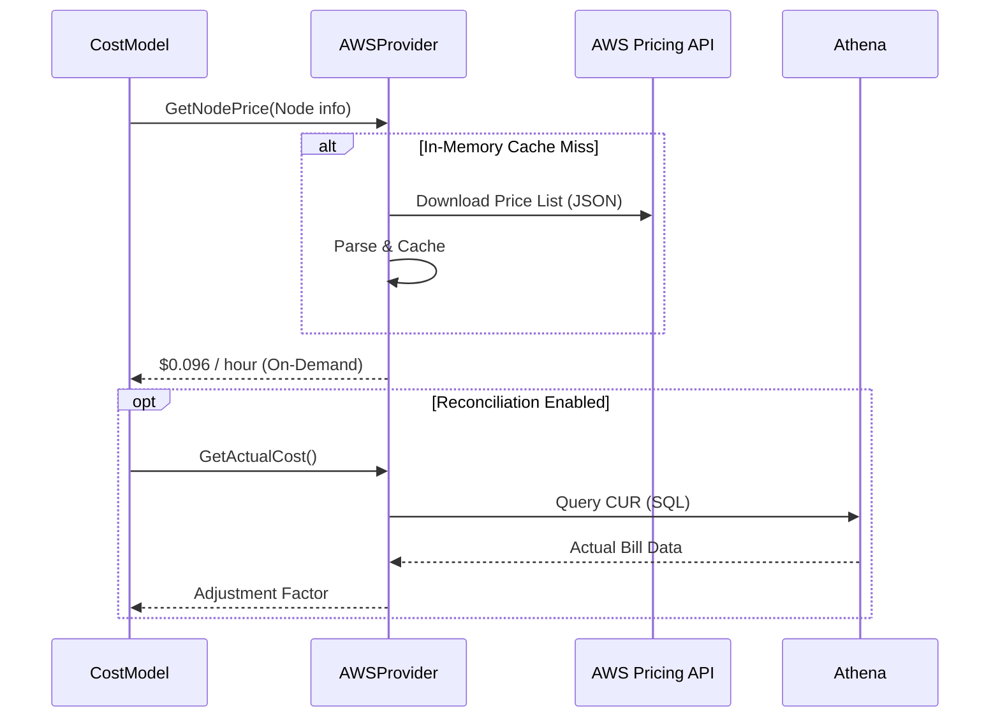

# OpenCost Deep Dive: クラウドコストを「見える化」する仕組み

Kubernetes の利用拡大に伴い、多くの組織が直面するのが「コスト管理」の課題です。
**OpenCost** は、CNCF の Incubating Project であり、ベンダー中立な方法で Kubernetes のコストをリアルタイムに計算・配分するための標準仕様と実装を提供しています。

今回は `opencost/opencost` のソースコードを読み解き、どのようにして「Pod 単位のコスト」という抽象的な値を算出しているのか、その裏側を解説します。

## 1. OpenCost のアーキテクチャ: Metrics + Pricing = Cost

OpenCost の核心は、**「リソース使用量（Metrics）」と「単価（Pricing）」を掛け合わせる** というシンプルな計算式にあります。
しかし、それを動的な Kubernetes 環境で正確に行うためには、高度なアーキテクチャが必要です。

```mermaid
graph TD
    %% Styling
    classDef component fill:#e1f5fe,stroke:#01579b,stroke-width:2px;
    classDef data fill:#fff9c4,stroke:#fbc02d,stroke-width:2px;
    classDef external fill:#f3e5f5,stroke:#7b1fa2,stroke-width:2px,stroke-dasharray: 5 5;

    subgraph "Kubernetes Cluster"
        Agent[OpenCost Agent<br>(CostModel)]:::component
        Prometheus[Prometheus]:::component
        KubeAPI[Kube API]:::external
    end

    subgraph "Cloud Provider"
        Billing[Billing API / Pricing API]:::external
        CUR[Cost & Usage Report<br>(Athena/BigQuery)]:::external
    end

    KubeAPI -- "Node/Pod Spec" --> Agent
    Prometheus -- "CPU/RAM Usage (PromQL)" --> Agent
    
    Billing -- "List Price (e.g. $0.1/hr)" --> Agent
    CUR -- "Reconciliation (Actual Bill)" --> Agent

    Agent -- "1. Query Metrics" --> Prometheus
    Agent -- "2. Fetch Pricing" --> Billing
    Agent -- "3. Calculate Cost" --> CostData[Cost Allocation Model]:::data
```

### 主要コンポーネント

1.  **CostModel (`pkg/costmodel`)**: 計算ロジックの中核。Metrics と Pricing を統合します。
2.  **Prometheus Source (`modules/prometheus-source`)**: PromQL を発行し、時系列データを取得します。
3.  **Cloud Provider (`pkg/cloud`)**: AWS, GCP, Azure などの価格情報を抽象化して取得します。

## 2. Metric Collection: PromQL の魔術

OpenCost は、自身でメトリクスを収集するのではなく、既存の Prometheus に依存します。
`opencost/modules/prometheus-source/pkg/prom/metricsquerier.go` には、コスト計算に使われる生の PromQL が定義されています。

例えば、PV（Persistent Volume）のコスト計算には以下のようなクエリが使われます。

```go
// modules/prometheus-source/pkg/prom/metricsquerier.go

const pvCostQuery = `avg(avg_over_time(pv_hourly_cost{%s}[%s])) by (%s, persistentvolume, volumename, uid, provider_id)`
```

ここで重要なのは、`pv_hourly_cost` というメトリクス自体は、OpenCost の **Metrics Emitter** が計算して Prometheus にエクスポートしている点です。つまり、OpenCost は「価格情報をメトリクスとして Prometheus に書き込み」、それを「再び読み出して集計する」というループを行っています。

## 3. Pricing: 単価の取得

「CPU 1コアあたりいくらか？」という情報は、クラウドプロバイダーごとに異なります。
`pkg/cloud/provider` パッケージがこの抽象化を担当しています。

### AWS の場合 (`pkg/cloud/aws/provider.go`)
AWS の Public Pricing API (`https://pricing.us-east-1.amazonaws.com/...`) から JSON をダウンロードし、インスタンスタイプ（例: `m5.large`）ごとのオンデマンド価格を取得します。
さらに、Spot Instance の場合は `Spot Data Feed` を、正確な請求額との突合には `Athena` (Cost and Usage Report) を利用します。



## 4. Allocation: コストの配分ロジック

取得した「使用量」と「単価」は、`Allocation` という構造体 (`core/pkg/opencost/allocation.go`) にマッピングされます。

```go
type Allocation struct {
    Name string
    Properties *AllocationProperties // Namespace, Controller, Pod, etc.
    
    // CPU Cost
    CPUCoreHours   float64
    CPUCost        float64
    
    // RAM Cost
    RAMByteHours   float64
    RAMCost        float64
    
    // GPU, PV, Network...
}
```

OpenCost の強力な点は、この `Allocation` を柔軟に集計（Aggregation）できることです。
`CostModel.ComputeKubeModelSet` メソッド (`pkg/kubemodel`) は、指定された期間（Window）の全データを取得し、Namespace 別、Deployment 別、あるいは Label 別にコストを積み上げます。

### Idle Cost (アイドリングコスト) の配分
Kubernetes コスト管理の難問は「使われていないリソース（Idle）」の扱いです。
OpenCost は設定により、Idle コストを：
1.  **Cluster**: クラスタ全体のオーバーヘッドとして計上
2.  **Node**: ノードごとの空き容量として計上
3.  **Distribute**: 稼働している Pod に按分して上乗せ

といった形で柔軟に配分できます。

## まとめ

OpenCost は、「Prometheus という共通言語」と「Cloud Provider API」の間を取り持つ翻訳機のような存在です。

- **Prometheus**: リソースが「どれだけ」使われたか。
- **Cloud Provider**: それが「いくら」なのか。
- **OpenCost**: それを「誰が」払うべきか。

この3つを自動で結びつけることで、エンジニアは「今デプロイした Pod が月額いくらかかるか」を即座に知ることができるのです。
FinOps を始めるなら、まずはこの「コストの解像度」を上げるところから始めてみてはいかがでしょうか。
