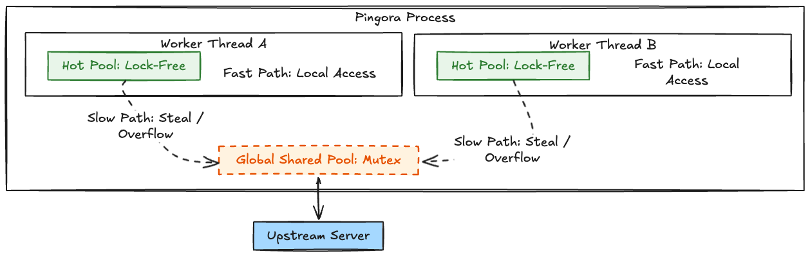
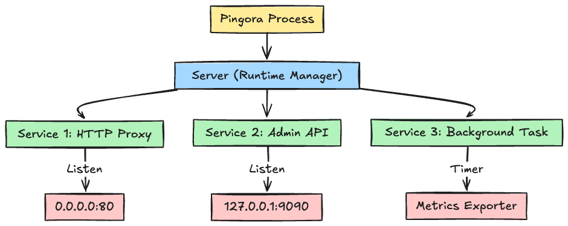

# Introduction

"Why did we need to discard the world's most widely used web server?"

In 2022, Cloudflare's announcement of "Pingora" was shocking. They had taken their infrastructure, which had been running on NGINX for years, and rewrote it from scratch in Rust.
The reasons were **"Memory Safety"** and **"Inefficiency caused by process barriers."**

NGINX's C-based code always carries the risk of Segfaults. Furthermore, its process-based architecture meant that connections couldn't be shared between workers, leading to unnecessary TLS handshakes.

In 2026, Pingora v0.7.0 has evolved beyond a simple proxy into a **"Programmable Network Infrastructure."** In this article, we will dissect Pingora's internal structure and what developers need to implement to use it.

## 1. Architecture Diagram: Killing Lock Contention with "2-Stage Pools"

What supports Pingora's high throughput is a mechanism that efficiently reuses connections across threads.

### NGINX (Process-based)

Because workers exist as independent processes, a worker cannot use an "idle connection" held by its neighbor. It is forced to establish a new connection.

### Pingora (Thread-based + 2-Layer Pool)

All threads exist within the same memory space. The key here is the distinction between the **"Lock-Free Hot Pool"** and the **"Global Shared Pool (Mutex)."**



#### Why is the shared part a `Mutex`?

For sharing "read-only" data like configurations, `ArcSwap` (RCU) is the strongest choice. However, it is unsuitable for things like connection pools where **"frequent insertion and removal (state changes) occur."**

Pingora achieves both practical performance and flexibility through a tiered approach: **"Handle 90% of traffic with the local pool (Lock-Free), and hit the Mutex only when it overflows or runs empty."**

> **Column: What is AtomicPtr?**
> The `AtomicPtr` used in the Hot Pool implementation is a type for atomically reading and writing pointers (memory addresses). It realizes "safe pointer swapping" at the CPU instruction level without using locks (Mutex). As a result, accessing the thread-local pool executes at a speed close to "raw memory access."

## 2. Server vs Service: Doing Everything in One Process

When reading Pingora's code, you encounter the concepts of `Server` and `Service`. This is an abstraction for **"performing multiple roles within a single process."**



* **Server**: The overall supervisor. It handles signals (Ctrl+C), graceful shutdowns, and **Tokio Runtime management**.
* **Service**: The concrete work. Not only "proxying on port 80," but tasks like "background tasks that periodically aggregate metrics" can also be defined as a Service.

### Unique Runtime Management

When using Pingora, users do not need to write `#[tokio::main]`. The `Server` calls `Runtime::new()` internally and sets up the runtime with the optimal number of threads and Work-Stealing settings for each Service. This frees users from infrastructure tuning (like thread pool management) and allows them to concentrate on logic.

## 3. Implementation Contract: What Should Developers Write?

When implementing a proxy with Pingora, the core is the `ProxyHttp` trait.
Defining the following **3 elements** is the condition for a minimum "working proxy."

### 1. `type CTX`: Request "Memory"

Define the state you want to keep for each request. You put things like authentication info or measurement start times here. If you don't need it, `()` is fine.

### 2. `fn new_ctx()`: Initializing "Memory"

Define how to create the `CTX` at the start of each request.

### 3. `async fn upstream_peer()`: Deciding "Where to?" (Most Important)

This is the heart of the proxy. You look at the request URL or headers, decide **"which IP and which port to ultimately send this to,"** and return an `HttpPeer` struct.

> **Column: Creating Custom Services**
> `http_proxy_service` is a `Service` implementation for HTTP proxies, but if you implement the `Service` trait yourself, you can register arbitrary background tasks to the `Server`.
> Also, by using helpers like `background_service("Metrics", my_task)`, you can easily define tasks that keep running in the background without opening a port.

## 4. Hands-on: Building a Custom Load Balancer

Let's actually implement `upstream_peer` on a Mac.

### Step 1: Project Preparation

```bash
cargo new my-proxy
cd my-proxy
```

Specify the latest Pingora in `Cargo.toml`.

```toml
[dependencies]
pingora = { version = "0.7", features = ["lb"] }
tokio = { version = "1.0", features = ["full"] }
async-trait = "0.1"
env_logger = "0.10"
```

### Step 2: Implementation (`src/main.rs`)

```rust
use async_trait::async_trait;
use pingora::prelude::*;
use log::info;

pub struct MyProxy;

#[async_trait]
impl ProxyHttp for MyProxy {
    // Use () if you don't need per-request state
    type CTX = ();
    
    fn new_ctx(&self) -> Self::CTX {
        ()
    }

    async fn upstream_peer(&self, _session: &mut Session, _ctx: &mut ()) -> Result<Box<HttpPeer>> {
        // Define TLS connection to Cloudflare (1.1.1.1)
        let peer = Box::new(HttpPeer::new(
            "1.1.1.1:443",
            true, // TLS enabled
            "one.one.one.one".to_string(),
        ));
        info!("Proxying to 1.1.1.1:443");
        Ok(peer)
    }
}

fn main() {
    env_logger::init();
    
    // Initialize Server (Skipping config file loading for this demo)
    let mut my_server = Server::new(None).unwrap();
    my_server.bootstrap();

    // Create Service and bind port
    let mut my_proxy_service = http_proxy_service(&my_server.configuration, MyProxy);
    my_proxy_service.add_tcp("0.0.0.0:6188");
    
    info!("Simple proxy listening on 0.0.0.0:6188");

    my_server.add_service(my_proxy_service);
    my_server.run_forever();
}

```

### Step 3: Verification

```bash
cargo run
```

From another terminal:

```bash
# Request to port 6188
curl -v -H "Host: one.one.one.one" http://localhost:6188
```

If you get a response from the backend specified in `upstream_peer`, it's a success!

**Sample Repository**: [https://github.com/kanywst/p1ng0r4](https://github.com/kanywst/p1ng0r4)

## Conclusion

With Pingora, a proxy is no longer a "static configuration file," but becomes **"software that can dynamically change its behavior."**

* Explosively fast connection reuse via **Lock-Free Hot Pool**.
* Flexible configuration via **Server/Service** model.
* Safety and expressiveness via **Rust**.

For infrastructure engineers in 2026, **"the power to manipulate protocols with Rust"** is becoming more required than the power to write YAML.

## References

* [Pingora GitHub - proxy_trait.rs](https://github.com/cloudflare/pingora/blob/main/pingora-proxy/src/proxy_trait.rs)
* [Cloudflare Blog - How we built Pingora](https://blog.cloudflare.com/how-we-built-pingora-the-proxy-that-connects-cloudflare-to-the-internet/)
