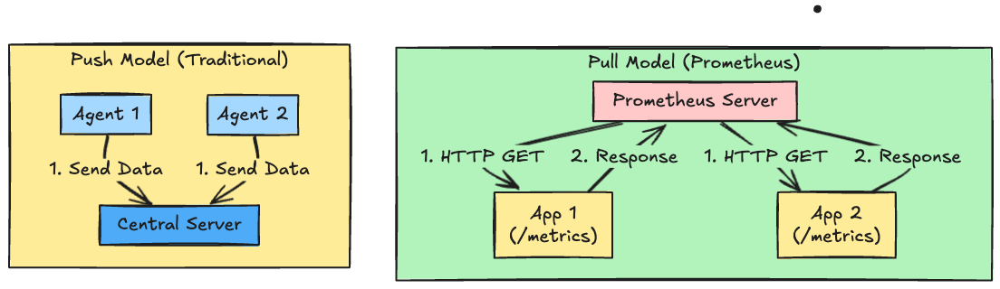
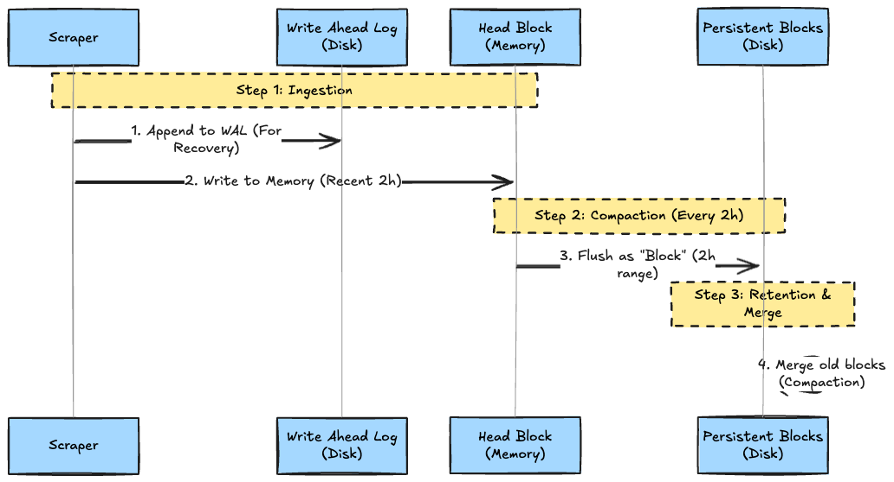
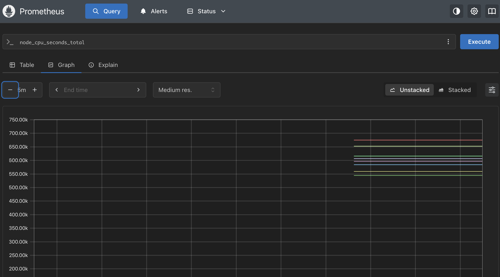
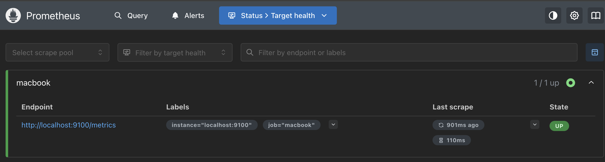

# Introduction

When you hear "monitoring tool," **Prometheus** is likely the first thing that comes to mind.
While it is as ubiquitous as air in the Kubernetes world, can you explain in detail how data flows inside it and how it is stored on disk?

* "Why does the server fetch data (Pull) instead of the agents sending it (Push)?"
* "How does it write millions of metrics at high speed?"

In this article, we will deep dive into the architecture of Prometheus and the internal structure of its heart, the **TSDB (Time Series Database)**.

---

## 1. The Architecture: Why Pull?

The most defining feature of Prometheus is its **Pull-based** architecture.

### Push vs Pull

Traditional monitoring tools (such as Zabbix Agent or Datadog Agent) mainly used a **Push model**, where agents send data to a central server. However, Prometheus adopts a **Pull model**, where the server accesses each target to collect data.



### Benefits of the Pull Model

1. **Easier Health Checks (Liveness Monitoring)**: You can immediately determine that "No response when fetching" equals "System is down" (via the `up` metric).
2. **Server Load Control**: Since the server (Prometheus) can collect data at its own pace, it prevents DDoS-like states caused by massive amounts of incoming traffic.
3. **Simpler Targets**: Applications simply need to expose a `/metrics` HTTP endpoint; they do not need to know the IP address or credentials of the monitoring server.

---

## 2. Components Overview

The Prometheus ecosystem consists of several independent components.


* **Service Discovery**: Integrates with Kubernetes API, EC2, etc., to dynamically identify "where the Pods/servers to be monitored are right now."
* **Scraper**: Sends HTTP requests to discovered targets and collects data.
* **TSDB**: Efficiently stores time-series data.
* **Alertmanager**: Aggregates and suppresses alerts fired based on rules (Grouping/Inhibition), and notifies channels like Slack or PagerDuty.

---

## 3. Deep Dive: TSDB Internals

Prometheus's TSDB (Time Series Database) is a custom-implemented **local storage engine dedicated to time-series data**. Currently, the architecture known mainly as "TSDB V3" is used.

Unlike general RDBMS or NoSQL, it is designed with extreme optimization for **"Append-only writing of massive numerical data" and "High-speed querying of recent data."**

### 3-1. Basic Architecture: Head and Block

TSDB manages data by splitting it into the **Head (latest data in memory)** and **Blocks (past data on disk)**.



#### Head Block (Write Layer)

* **Role:** The place that receives the latest sample data being sent.
* **Memory:** All recent data (up to about 3 hours) is held in memory and responds immediately to queries.
* **Durability (WAL):** To prepare for process crashes, writes are simultaneously recorded in the **WAL (Write-Ahead Log)** on the disk. Upon restart, this WAL is replayed to restore the memory state.

#### Persistent Block (Persistence Layer)

* **Role:** When data in the Head passes a certain amount of time (default 2 hours), it is flushed to disk as an immutable **Block**.
* **Structure:** Managed in directories, each Block functions as a completely independent database (holding its own index).
* **Compaction:** In the background, old Blocks are merged together (Compaction) and reconstructed into larger Blocks to optimize indexing and organize data.

---

### 3-2. On-Disk Data Structure

Looking at the Prometheus data directory (`/data`), the structure is as follows:

```text
/data
├── wal/                  # Head Block log (for recovery)
├── chunks_head/          # Memory-mapped chunks of the Head Block (mmap)
├── 01H.../               # Persisted Blocks (directories every 2 hours)
│   ├── meta.json         # Metadata (duration, statistics, etc.)
│   ├── index             # Inverted Index (Label -> Series ID)
│   ├── chunks/           # Actual data (compressed time-series data)
│   └── tombstones        # Deletion flags (physical deletion occurs during Compaction)
└── lock                  # For exclusive locking
```

---

### 3-3. Key Technical Components

#### A. Compression Algorithm (Gorilla Compression)

Adopting a compression method based on Facebook's Gorilla paper, data is reduced to an average of about 1.37 bytes per sample.

* **Time Delta:** Timestamps take the difference (Delta) from the previous sample, and then variable-length encode the "Delta-of-Delta."
* **XOR Compression:** Values (Float64) take the XOR with the previous value, recording only the changed bit parts. If value changes are small, this boasts a very high compression rate.

#### B. Inverted Index

To quickly look up "which labels are associated with which time series data (Series)," it uses an **Inverted Index** similar to search engines.

* Example: When a query `app="nginx"` comes in, it immediately retrieves the list of corresponding Series IDs (Posting List) from the index and uses those IDs to access chunk data.
* This structure ensures that tag (Label) search speed does not degrade easily even as data volume increases.

#### C. mmap (Memory Mapped File)

When reading past Blocks, Prometheus does not manage the cache itself but relies on the **OS Page Cache using the `mmap` system call**.

* **Benefits:** Since it is outside the scope of Go's GC (Garbage Collection), it does not pressure heap memory even when handling massive amounts of data, and can utilize the OS's free memory as cache to the fullest.
* **Note:** If you try to use Page Cache beyond the memory limit (cgroup limit) in container environments, you become susceptible to the behavior of the OS OOM Killer and swap effects.

---

## 4. Hands-on: Verification on Mac

Let's actually run Prometheus on a Mac and collect metrics from your own machine.
Since there is a native binary for Mac, you can try it easily without using Docker or Multipass.

### Step 1: Install & Run Node Exporter

First, prepare the monitoring target. We will use Node Exporter, introduced in the previous article.

```bash
# Install and start Node Exporter
brew install node_exporter
brew services start node_exporter

# Verify operation (http://localhost:9100/metrics)
curl -s localhost:9100/metrics | head
```

### Step 2: Install Prometheus

Next, install the Prometheus server itself.

```bash
brew install prometheus
```

### Step 3: Configuration (`prometheus.yml`)

Create a configuration file for Prometheus. It works with default settings, but we will write a minimal configuration for understanding.

```yaml
# prometheus.yml
global:
  scrape_interval: 15s # Scrape data every 15 seconds

scrape_configs:
  - job_name: "macbook"
    static_configs:
      - targets: ["localhost:9100"] # Specify Node Exporter
```

### Step 4: Run Prometheus

Start it by specifying the configuration file.

```bash
prometheus --config.file=prometheus.yml
```

### Step 5: Explore Data

Access `http://localhost:9090` in your browser.

1. Click the **Graph** tab.
2. Type `node_cpu_seconds_total` in the search bar and click **Execute**.
3. Switch to the **Graph** tab, and the CPU usage of your Mac should be graphed!



If data is not arriving, check the **Status -> Targets** page. If the `macbook` job is "UP" (green), it is a success.



---

## Conclusion

Prometheus is not just a data collection tool.

1. **Pull Model**: Server-driven data collection allows it to operate stably even in large-scale environments.
2. **TSDB**: Combines WAL and in-memory Head Block to achieve both reliability and performance.
3. **Ecosystem**: Integration with Exporters and Service Discovery allows monitoring of practically anything.
