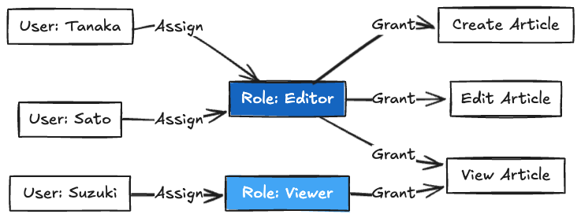
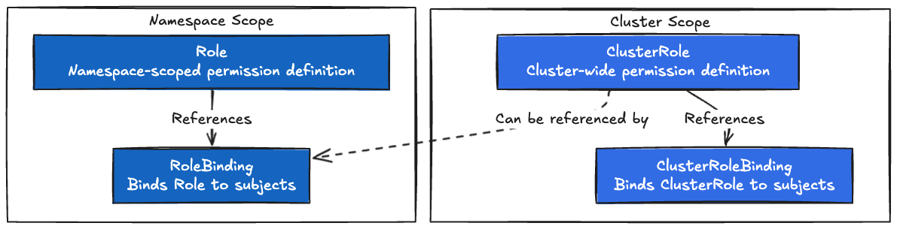
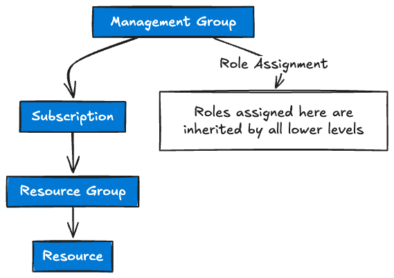
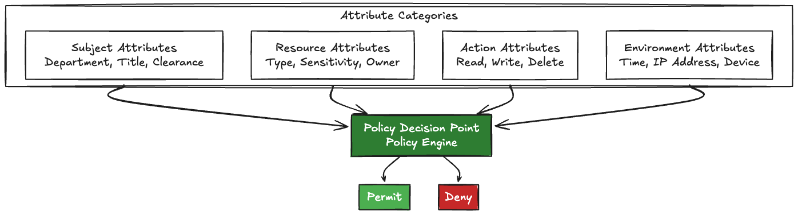
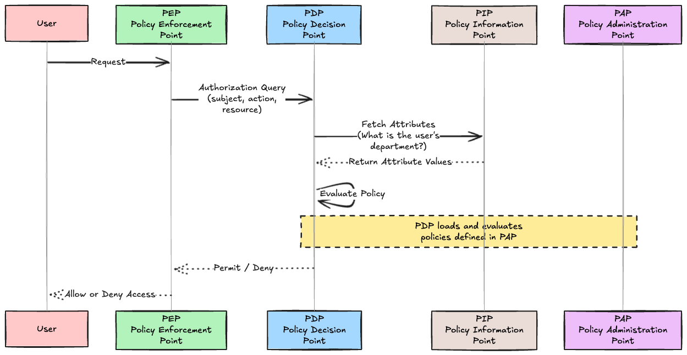
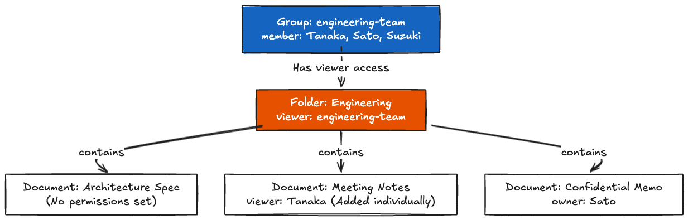
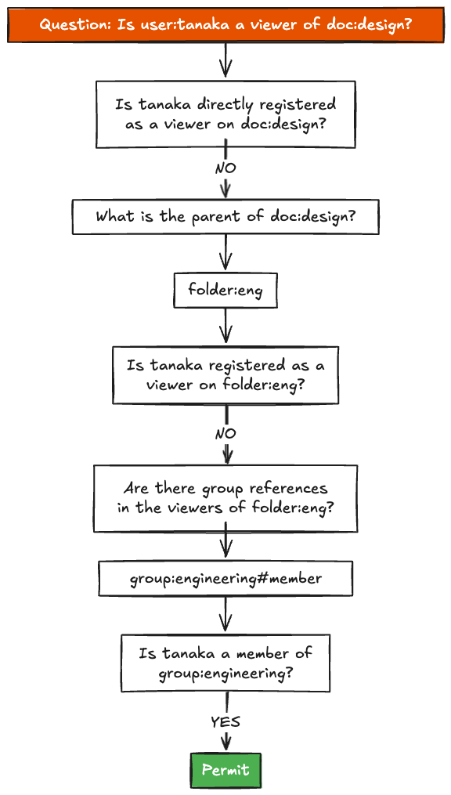
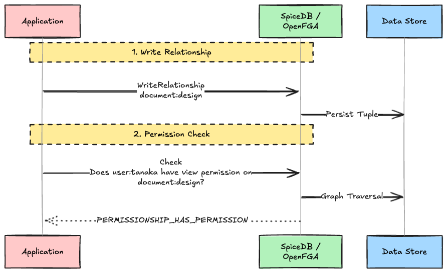
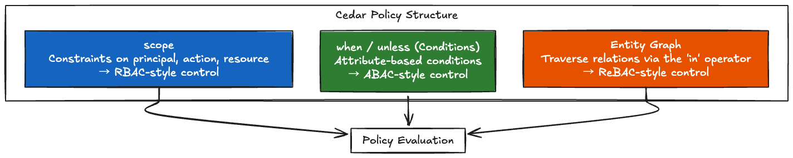
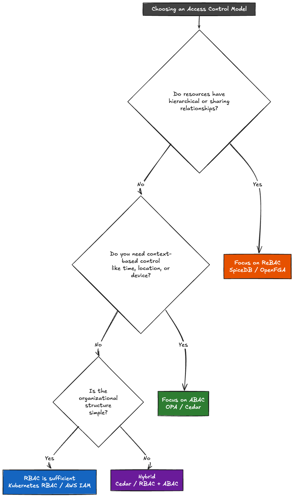

# Introduction

With the shift toward microservices and the widespread adoption of multi-tenant SaaS, requirements that cannot be expressed by traditional access control are rapidly increasing.

Have you ever heard the term **Role Explosion**?

RBAC alone is not enough. So, is ABAC the answer? Or ReBAC, which we hear a lot about lately? What exactly is the difference?

In this article, we will compare three access control models—RBAC, ABAC, and ReBAC—by looking at practical policy examples from actual products (AWS IAM, Kubernetes, Cedar, OpenFGA, and SpiceDB).

---

## 1. RBAC — Role-Based Access Control

### 1.1 The Basic Structure of RBAC

Let's start with RBAC. It is the simplest model and likely the first one everyone encounters.

What it does is straightforward: **Assign roles to users, and assign permissions to roles.** Users do not hold permissions directly; they acquire them through their roles.



The reasons this became so widespread are:

- For a new user, you only need to assign one role.
- If you ask, "Who has the Editor role?", you can get an answer immediately.
- It is easy for non-engineers to understand.

### 1.2 NIST RBAC Model — The 4 Levels

Although I said it's just "assigning roles," RBAC actually has stages. NIST defines four levels.

| Level   | Name                  | Added Functionality                                  | Example                                              |
| :------ | :-------------------- | :--------------------------------------------------- | :--------------------------------------------------- |
| Level 1 | **Flat RBAC**         | Basic structure: User → Role → Permission            | Most applications fall here                          |
| Level 2 | **Hierarchical RBAC** | Role inheritance. Higher roles include lower ones    | A Manager also has Member permissions                |
| Level 3 | **Constrained RBAC**  | Separation of Duties (SoD). Mutually exclusive roles | "Approver" and "Applicant" cannot be the same person |
| Level 4 | **Symmetric RBAC**    | Reverse lookup from Permission → Role                | "Which roles have S3 write permissions?"             |

In practice, Levels 1 and 2 are the most common. Level 3 (Separation of Duties) is required in highly regulated fields like finance and healthcare.

### 1.3 RBAC in Real Products

#### Kubernetes RBAC

Kubernetes RBAC is essentially NIST Level 1 (Flat RBAC) with the addition of Namespace scoping. It uses four main resources.



```yaml
# Permission definition (ClusterRole)
apiVersion: rbac.authorization.k8s.io/v1
kind: ClusterRole
metadata:
  name: pod-reader
rules:
- apiGroups: [""]
  resources: ["pods"]
  verbs: ["get", "list", "watch"]

---
# Assignment to user (RoleBinding)
apiVersion: rbac.authorization.k8s.io/v1
kind: RoleBinding
metadata:
  name: read-pods
  namespace: default
subjects:
- kind: User
  name: jane
  apiGroup: rbac.authorization.k8s.io
roleRef:
  kind: ClusterRole
  name: pod-reader
  apiGroup: rbac.authorization.k8s.io
```

A key characteristic of Kubernetes RBAC is that it is **Allow-only** (explicit denys do not exist). Permissions are purely additive; if multiple RoleBindings overlap, all allowed actions are combined.

#### The Role-Based Part of AWS IAM

```json
{
  "Version": "2012-10-17",
  "Statement": [{
    "Effect": "Allow",
    "Action": ["s3:GetObject", "s3:PutObject"],
    "Resource": "arn:aws:s3:::my-bucket/*"
  }]
}
```

This policy is attached to an IAM Role (e.g., `S3-ReadWrite-Role`), and users or services assume that role (`AssumeRole`). This is the RBAC portion.

However, AWS IAM is not pure RBAC. As we will see later, it also allows ABAC-like controls via the `Condition` block.

#### Azure RBAC

Azure provides over 120 built-in roles (Owner, Contributor, Reader, etc.) and features a hierarchical scope structure.



Roles assigned at a higher scope are inherited by lower scopes. This is different from NIST Level 2 role hierarchies; this is inheritance through the **resource hierarchy**. This concept of "permission inheritance via resource hierarchy" is actually quite close to ReBAC principles.

---

## 2. Role Explosion — The Limits of RBAC

### 2.1 What is Role Explosion?

RBAC works well at a small scale. However, as an organization or system grows, **the number of roles increases exponentially**. This is Role Explosion.

Let's look at five causes identified in Evolveum's documentation.

### 2.2 Cause 1: The Cartesian Product Effect

This is the most typical cause. When there are multiple "axes" determining access rights, the combinations multiply the number of roles.

For example, assume we have these three axes:

- **Job Function**: Sales, Engineering, HR (3 types)
- **Location**: Tokyo, Osaka, Fukuoka (3 locations)
- **Project**: Project A, B, C (3 projects)

3 × 3 × 3 = **27 roles**. Just three axes yield 27 roles.

In a real enterprise: 50 Job Functions × 20 Locations × 10 Projects = **10,000 roles**. Managing 10,000 roles like "Sales-Tokyo-ProjA", "Sales-Tokyo-ProjB", "Sales-Osaka-ProjA"... is an administrative nightmare.

### 2.3 Cause 2: Atomization

In an attempt to make roles reusable, they are broken down into granular pieces. This creates a massive amount of fine-grained shared component roles like "Basic Access," "Email Usage," or "VPN Access." The total number of roles to manage actually increases.

### 2.4 Cause 3: The "One Role Per User" Problem

As cases of "this person needs special access" pile up, you end up with effectively as many roles as there are users. The very purpose of using roles is defeated.

### 2.5 Causes 4 & 5: Lack of Policy and Lifecycle Management

There are no criteria for creating roles, and obsolete roles are never deleted. As Evolveum points out: "**Roles are created as needed, but rarely deleted.**"

### 2.6 The Core of Role Explosion

Ultimately, the root of role explosion is **the limitation of RBAC's expressive power**. RBAC can only express "**Who** → Role → **Can do what**". But in reality, questions like these arise:

- **When?** — I only want to allow access during business hours.
- **From where?** — I only want to allow access from the corporate network.
- **Whose resources?** — Users should only be able to edit resources they own.
- **In what relationship?** — Contents of a folder should inherit the parent folder's permissions.

When you try to express these in RBAC, you have to create a new role for every condition. That is why roles explode.

ABAC and ReBAC break through this limitation.

---

## 3. ABAC — Attribute-Based Access Control

### 3.1 The Basic Structure of ABAC

ABAC (Attribute-Based Access Control) solves RBAC's inability to answer "When? From where?". Instead of roles, access decisions are based on **Attributes**.

The attributes used for decisions fall into four categories.



Do you see the difference from RBAC? Actually, a "role" can be treated as just another attribute in ABAC (like `role == "Manager"`).

The fundamental difference is that **while RBAC requires static pre-classification ("assigning a role beforehand"), ABAC evaluates dynamically based on the facts (attributes) available at that exact moment.**

Instead of creating a role for "Sales Manager in the Tokyo Office", you write a policy: `department == "Sales" AND location == "Tokyo" AND role == "Manager"`. If a new branch opens or an external contractor temporarily joins, the policy remains unchanged; only the attribute values change.

### 3.2 XACML Architecture — The Reference Model for ABAC

When implementing ABAC, there is an unavoidable architectural concept to understand. It comes from XACML (eXtensible Access Control Markup Language). While XACML itself is XML-based and rarely used today, its core concepts of the **PEP / PDP / PAP / PIP** components live on in engines like OPA and Cedar.



| Component | Role                                                     | Modern Implementation Examples       |
| :-------- | :------------------------------------------------------- | :----------------------------------- |
| **PEP**   | Intercepts the request and enforces the PDP's decision.  | API Gateway, Middleware              |
| **PDP**   | Evaluates the policy and makes the Permit/Deny decision. | OPA, Cedar, AWS Verified Permissions |
| **PAP**   | Creates and manages policies.                            | Admin UI, Git Repository             |
| **PIP**   | Fetches necessary attributes at runtime.                 | LDAP, Database, External APIs        |

### 3.3 RBAC vs ABAC — Eliminating Role Explosion

Let's solve the "50 Job Functions × 20 Locations × 10 Projects = 10,000 roles" problem using ABAC.

**With RBAC**: 10,000 roles are required.

**With ABAC**:

```text
Policy 1:
  IF subject.department == resource.allowed_department
  AND subject.location == resource.allowed_location
  AND subject.project IN resource.allowed_projects
  THEN permit
```

**It takes exactly one policy.** Where RBAC needed 10,000 roles, ABAC handles it with a single policy. If new locations or projects are added, the policy does not need to change.

### 3.4 ABAC in Real Products

#### AWS IAM Conditions (Tag-Based ABAC)

AWS IAM implements ABAC through the `Condition` block in policies. Using tags as attributes is the typical pattern.

```json
{
  "Version": "2012-10-17",
  "Statement": [{
    "Effect": "Allow",
    "Action": ["ec2:StartInstances", "ec2:StopInstances"],
    "Resource": "*",
    "Condition": {
      "StringEquals": {
        "ec2:ResourceTag/Department": "${aws:PrincipalTag/Department}"
      }
    }
  }]
}
```

This policy reads: "**Allow starting and stopping EC2 instances if the resource's Department tag matches the user's Department tag.**" Sales personnel can only operate Sales instances. Developers can only operate Developer instances. You only need one policy.

Even the official AWS documentation explicitly states: "**ABAC requires fewer policies.**"

#### OPA / Rego

OPA (Open Policy Agent) is a CNCF Graduated project and policy engine (v1.14 as of March 2026). You write policies in a declarative language called Rego.

```rego
package httpapi.authz

default allow = false

# Users can read their own resources
allow = true {
    input.method == "GET"
    input.path = ["resources", resource_id]
    input.user == data.resources[resource_id].owner
}

# Managers can read their subordinates' resources
allow = true {
    input.method == "GET"
    input.path = ["resources", resource_id]
    data.resources[resource_id].owner == subordinate
    subordinate in data.reports_to[input.user]
}

# The admin role can do anything
allow = true {
    input.user_attributes.role == "admin"
}
```

OPA allows you to freely mix RBAC-like evaluations (`role == "admin"`) and ABAC-like evaluations (`owner == user`) within policies. It is highly flexible, but because you can do almost anything, it can become chaotic if the team doesn't standardize how policies are written.

> [!TIP]
> When adopting OPA in production, structural best practices are essential. For example, using a common `input` JSON schema (`user`, `method`, `path`, `resource`, etc.) across all endpoints, and separating base common packages from microservice-specific packages using directory structures.

### 3.5 Challenges of ABAC

ABAC solves role explosion, but introduces new challenges.

| Challenge                       | Description                                                                                         |
| :------------------------------ | :-------------------------------------------------------------------------------------------------- |
| **Policy Complexity**           | As the combinations of attributes grow, the policies themselves become complex.                     |
| **Auditing Difficulty**         | Answering "Can User X access Resource Y?" requires runtime attribute values.                        |
| **Attribute Reliability (PIP)** | **The biggest weakness.** If the PIP goes down or returns false data, the control system collapses. |
| **Debugging Difficulty**        | It is difficult to trace exactly *why* a request was permitted or denied.                           |

Particularly, **reverse lookup queries like "Who has access to this resource?" are extremely difficult**, which is a major weakness. In RBAC, you just list "users with this role." In ABAC, you would have to re-evaluate the attributes of every single user. You also must account for network latency to the microservice (PIP) fetching user info from the API Gateway (PEP).

---

## 4. ReBAC — Relationship-Based Access Control

### 4.1 Understanding ReBAC through Google Drive

While ABAC solved role explosion, it struggles with **chains of relationships**, such as "files within a folder should have the same permissions as the folder." Enter ReBAC (Relationship-Based Access Control), a model that determines access based on the **relationships between objects**.

The easiest way to understand this is by thinking of Google Drive.



Breaking down what is happening here:

1. **Group Membership**: Tanaka, Sato, and Suzuki are members of `engineering-team`.
2. **Folder Permission**: `engineering-team` is a viewer of the `Engineering` folder.
3. **Permission Inheritance**: Documents inside the `Engineering` folder inherit viewer permissions from the folder's viewers.
4. **Individual Addition**: Tanaka has been individually added as a viewer to the `Meeting Notes`.

This is neither RBAC nor ABAC. "I can see it because it's in the folder" and "I can see it because I'm in the group"—access rights are derived by traversing **chains of relationships**. This is ReBAC.

### 4.2 ReBAC Data Model — The Relation Tuple

At the core of ReBAC is a simple data model called the **Relation Tuple**, a format popularized by Google Zanzibar.

```text
object#relation@user
```

It simply states: "**A specific user (or user set)** belongs to **a specific relationship** of **a specific object**."

| Tuple                                        | Meaning                                                         |
| :------------------------------------------- | :-------------------------------------------------------------- |
| `folder:eng#viewer@group:engineering#member` | Members of the `engineering` group are viewers of `folder:eng`. |
| `doc:design#parent@folder:eng`               | The design doc is a child (belongs to parent) of `folder:eng`.  |
| `group:engineering#member@user:tanaka`       | Tanaka is a member of the `engineering` group.                  |
| `doc:minutes#viewer@user:tanaka`             | Tanaka is a viewer of the minutes doc (individually added).     |

### 4.3 Permission Derivation — Graph Traversal

The most defining characteristic of ReBAC is that **permissions are derived through graph traversal**. Let's look at the process to answer "Can Tanaka view the design doc?".



The key point here is that **the policy contains a defined rule stating "viewers of a folder are also viewers of the documents inside."** Based on this rule, the engine traverses the graph to ultimately derive the permission.

### 4.4 Problems Solved by ReBAC

ReBAC naturally solves the problems that RBAC and ABAC struggle with.

| Problem                                                    | RBAC                         | ABAC                                           | ReBAC                                                    |
| :--------------------------------------------------------- | :--------------------------- | :--------------------------------------------- | :------------------------------------------------------- |
| **Hierarchical Permission Inheritance**<br>Folder → File   | Impossible (Flat structure)  | Difficult (Hard to express hierarchy via attr) | **Naturally Expressive**<br>Traverses `parent` relations |
| **Reverse Lookups**<br>"Who can access this resource?"     | Handled via role lists       | Extremely difficult<br>Requires full re-eval   | **Naturally Supported**<br>Reverse graph traversal       |
| **Sharing / Collaboration**<br>"Share this doc with Alice" | Requires creating a new role | Requires assigning attributes                  | **Just add 1 tuple**<br>`doc:X#viewer@user:Alice`        |
| **Adapting to Org Changes**<br>Team A moves under Team B   | Reassign roles entirely      | Bulk attribute updates                         | **Update 1 relation**<br>Repoint the `parent` relation   |

### 4.5 Google Zanzibar — Planetary-Scale ReBAC

Google Zanzibar is a system that implements ReBAC at a planetary scale. A paper on it was published at USENIX ATC in 2019, revealing it manages over 2 trillion Relation Tuples and processes 10 million requests per second with a p95 latency of less than 10ms.

> [!CAUTION]
> The biggest hurdle when implementing ReBAC in distributed systems is consistency dilemmas like the **"New Enemy Problem."** If a request to "access a resource" arrives before the information that "permissions were revoked" propagates, the revoked user might gain access. Zanzibar solves this using consistency tokens called **Zookies** (similar to timestamped Cookies).

I will do a deep dive into Zanzibar's architecture another time.

From here on, we will look at practical policy examples from OSS implementations heavily influenced by Zanzibar's design—SpiceDB and OpenFGA. By 2025–2026, both have significantly matured. The concept of Zookies has also been implemented in both as SpiceDB's `ZedToken` and OpenFGA's `Consistency` options.

---

## 5. ReBAC in Real Products

### 5.1 SpiceDB (Authzed)

SpiceDB (by Authzed) is the OSS implementation most faithful to Zanzibar's design. As of March 2026, it has reached v1.50, and recent additions focus on the AI agent era, such as LangChain integration (`langchain-spicedb`) and Postgres FDW-based SQL querying.

Models are defined using a schema language called `.zed`.

```zed
definition user {}

definition group {
    relation member: user | group#member
}

definition folder {
    relation parent: folder
    relation viewer: user | group#member
    relation editor: user | group#member

    permission view = viewer + editor + parent->view
    permission edit = editor + parent->edit
}

definition document {
    relation parent_folder: folder
    relation owner: user
    relation viewer: user | group#member
    relation editor: user | group#member

    permission view = viewer + editor + owner + parent_folder->view
    permission edit = editor + owner + parent_folder->edit
    permission delete = owner
}
```

Let's organize how to read this schema:

| Syntax                 | Meaning                                                    | Example                         |
| :--------------------- | :--------------------------------------------------------- | :------------------------------ |
| `relation X: user`     | Users can be assigned to relationship X.                   | `relation owner: user`          |
| `permission Y = A + B` | Y is the union (OR) of A and B.                            | `view = viewer + editor`        |
| `parent_folder->view`  | Traverse the `parent_folder` relation and grab its `view`. | Inherit the folder's view perm. |
| `A & B`                | Intersection (AND).                                        | Requires both relations.        |
| `A - B`                | Exclusion (Subtract).                                      | Subtract B from A.              |

#### SpiceDB Caveats (Conditional Relations)

SpiceDB supports **Caveats**, combining ReBAC with ABAC-style conditions.

```zed
caveat ip_allowlist(user_ip ipaddress, cidr string) {
    user_ip.in_cidr(cidr)
}

definition document {
    relation viewer: user with ip_allowlist
    permission view = viewer
}
```

This allows expressing conditional relationships like "Is a viewer, but only accessible from the internal corporate network." You can evaluate the ReBAC relationship graph and the ABAC attribute checks simultaneously.

### 5.2 OpenFGA (Auth0 / Okta)

OpenFGA is a Zanzibar-based OSS developed by Auth0 (Okta) and was promoted to a **CNCF Incubating project in October 2025**. As of March 2026, it is at v1.13. Contributors have grown by 49% year-over-year to over 6,200, showing strong momentum. Models are defined via DSL.

```text
model
  schema 1.1

type user

type group
  relations
    define member: [user, group#member]

type folder
  relations
    define owner: [user]
    define viewer: [user, group#member]
    define parent: [folder]
    define can_view: viewer or owner or can_view from parent

type document
  relations
    define owner: [user]
    define editor: [user, group#member]
    define viewer: [user, group#member]
    define parent: [folder]
    define can_view: viewer or editor or owner or can_view from parent
    define can_edit: editor or owner
    define can_delete: owner
```

Summarizing the notational differences from SpiceDB:

| Concept          | SpiceDB                            | OpenFGA                          |
| :--------------- | :--------------------------------- | :------------------------------- |
| Union            | `A + B`                            | `A or B`                         |
| Graph Traversal  | `parent->view`                     | `can_view from parent`           |
| Type Constraints | `relation X: user \| group#member` | `define X: [user, group#member]` |
| Intersection     | `A & B`                            | `A and B`                        |
| Exclusion        | `A - B`                            | `A but not B`                    |

In terms of expressive power, SpiceDB has an edge, allowing complex models using intersection and exclusion. OpenFGA focuses on unions (`or`), prioritizing simplicity. The choice depends on your team's specific requirements.

### 5.3 Writing and Checking Relationship Tuples

Writing tuples and hitting the Check API follows a similar pattern in both engines.



---

## 6. Cedar — Integrating RBAC, ABAC, and ReBAC

### 6.1 What is Cedar?

Cedar is an open-source policy language developed by AWS (v4.9 as of March 2026). It serves as the backend for Amazon Verified Permissions. In June 2025, pricing for Verified Permissions was **slashed by 97%** ($5 per million requests), drastically lowering the barrier to entry. Furthermore, in March 2026, Amazon Bedrock AgentCore Policy went GA, establishing Cedar as an **authorization language for AI Agents**.

Cedar's design philosophy is "**Integrating RBAC, ABAC, and ReBAC into a single language.**"



### 6.2 Cedar Policy Examples

#### Pattern 1: Pure RBAC

```cedar
// Members of the Teachers role can submit and answer problems
permit (
    principal in Role::"Teachers",
    action in [
        Action::"submitProblem",
        Action::"answerProblem"
    ],
    resource
);
```

`principal in Role::"Teachers"` is the role membership check. Pure RBAC.

#### Pattern 2: Pure ABAC

```cedar
// Non-confidential documents can be viewed by anyone
permit (
    principal,
    action == Action::"viewDocument",
    resource
)
when { resource.classification != "confidential" };
```

Checking resource attributes (`classification`) inside the `when` block. Pure ABAC.

#### Pattern 3: RBAC + ABAC Hybrid

```cedar
// Allow viewing data if the user is in the viewDataRole,
// is not locked out, is using MFA,
// and the resource belongs to their Tenant
permit (
    principal in Role::"viewDataRole",
    action == Action::"viewData",
    resource
)
when {
    principal.account_lockout_flag == false &&
    context.uses_mfa == true &&
    resource in principal.Tenant
};
```

RBAC in the scope (`in Role::"viewDataRole"`), ABAC in `when` (MFA checks), and ReBAC in `resource in principal.Tenant` (traversing the tenant relationship)—three models integrated into a single policy.

#### Pattern 4: ReBAC — Resource Owner

```cedar
// Owners can view the document
permit (
    principal,
    action == Action::"viewDocument",
    resource
)
when { principal == resource.owner };

// Users in the document's viewACL can view it,
// excluding private documents
permit (
    principal,
    action == Action::"viewDocument",
    resource
)
when { principal in resource.viewACL }
unless { resource.isPrivate };
```

`principal in resource.viewACL` traverses the entity graph to see if the user is in the document's Access Control List. This is the ReBAC portion.

### 6.3 Cedar's Design Principles

Cedar has three core design principles.

| Principle                   | Description                                                                                                    |
| :-------------------------- | :------------------------------------------------------------------------------------------------------------- |
| **Default Deny**            | All access is denied unless explicitly permitted by a `permit` policy.                                         |
| **Forbid overrides Permit** | If even a single `forbid` policy matches, access is denied, regardless of how many `permit` policies match.    |
| **Formal Verification**     | The ability to answer questions like "Can the admin role access HR data?" via static analysis of the policies. |

**Formal verification** is Cedar's unique strength. You can take a theorem (a property you want to prove), such as "Is there any path where an external user can view a document where `isPrivate == true`?", and run it through an SMT solver (Automated Theorem Prover). Being able to mathematically prove that unintended access cannot occur before deploying policies is a feature that OPA and SpiceDB do not natively have.

---

## 7. Comparison of the 3 Models

### 7.1 Selection Criteria



### 7.2 Detailed Comparison

| Aspect                                        | RBAC                        | ABAC                                    | ReBAC                                     |
| :-------------------------------------------- | :-------------------------- | :-------------------------------------- | :---------------------------------------- |
| **Decision Basis**                            | Roles                       | Attributes (Subject, Resource, Env)     | Relationships between objects             |
| **Granularity**                               | Coarse (Role level)         | Fine (Combinations of attributes)       | Medium to Fine (Chains of relations)      |
| **Suitable Use Cases**                        | Internal tools, simple IAM  | Compliance, multi-attribute decisions   | SaaS, document sharing, hierarchies       |
| **Implementation Complexity**                 | Low                         | Medium to High                          | High                                      |
| **Performance**                               | Fast (Simple lookups)       | Medium (Fetching/evaluating attributes) | Watch out (Depends on graph depth)        |
| **Scalability Risks**                         | Role Explosion              | Policy Complexity                       | Massive graph size / Recursion depth      |
| **Reverse Lookup**<br>"Who has access?"       | Easy                        | Extremely difficult                     | Supported (Graph Traversal)               |
| **Context Control**<br>"Time/Location limits" | Impossible                  | Excellent                               | Limited natively (Extendable via Caveats) |
| **Auditability**                              | Easy                        | Difficult                               | Medium (Long chains are hard to trace)    |
| **Representative Implementations**            | Kubernetes RBAC, Azure RBAC | OPA, AWS IAM Conditions                 | SpiceDB, OpenFGA, Ory Keto                |

### 7.3 Real-World Systems are Hybrids

In the real world of authorization systems, very few rely purely on a single model.

| Service          | RBAC                    | ABAC                  | ReBAC                        |
| :--------------- | :---------------------- | :-------------------- | :--------------------------- |
| **AWS**          | IAM Roles / Policies    | IAM Conditions / Tags | Verified Permissions (Cedar) |
| **Google**       | Cloud IAM Roles         | —                     | Zanzibar                     |
| **Typical SaaS** | Admin / Member / Viewer | IP Allowlist, MFA Req | Folder sharing, Workspaces   |

Almost everyone layers 2 or 3 models. So, what is the practical way to stack them?

1. **RBAC as the baseline** — Manage broad roles like Admin / Member / Viewer via RBAC. It's simple and universally understood.
2. **Add ABAC for contextual control** — Handle IP restrictions, MFA requirements, and business hour limitations via ABAC.
3. **Introduce ReBAC for resource sharing and hierarchies** — Use ReBAC for folder permission inheritance and document sharing.

You don't need to adopt ReBAC from day one. Starting with RBAC, and bringing in ABAC or ReBAC when you see signs of role explosion or complex sharing requirements, is the most practical path.

---

## 8. Industry Trends for 2025–2026

As of March 2026, the authorization space is moving rapidly. Here are the key trends to watch.

**AI Agent authorization has become the largest theme.** Cedar was adopted as the authorization language for AI agents in Amazon Bedrock AgentCore Policy. SpiceDB announced its LangChain integration. Oso released risk control features specifically for "Coding Agents." Cerbos is partnering with Tailscale to provide AI agent authorization. Nearly every player is accelerating support for AI agents.

**Market consolidation is accelerating.** CrowdStrike acquired SGNL for $740M (January 2026), and FusionAuth acquired Permify (November 2025). Authorization is transitioning from a standalone category to an integrated part of broader security platforms.

**Standardization has matured.** The OpenID AuthZEN Authorization API 1.0 was approved as a Final Specification in January 2026. With an industry standard for the communication protocol between PDP and PEP, swapping authorization engines or integrating multiple systems is becoming significantly easier.

---

## Conclusion

| What you want to achieve                      | Model to Choose | Products to Consider                              |
| :-------------------------------------------- | :-------------- | :------------------------------------------------ |
| Simple role management                        | RBAC            | Kubernetes RBAC, AWS IAM                          |
| Fine-grained control via attributes & context | ABAC            | OPA (v1.14), AWS IAM Conditions                   |
| Document sharing, hierarchical permissions    | ReBAC           | SpiceDB (v1.50), OpenFGA (v1.13, CNCF Incubating) |
| The whole package (RBAC + ABAC + ReBAC)       | Hybrid          | Cedar v4 (Amazon Verified Permissions)            |

Asking "which model is the strongest" is meaningless. You choose based on "what you want to control." Start with RBAC, add ABAC when roles multiply, and pull in ReBAC when you face resource sharing and hierarchies. You don't need to build the "everything" solution from the start.
