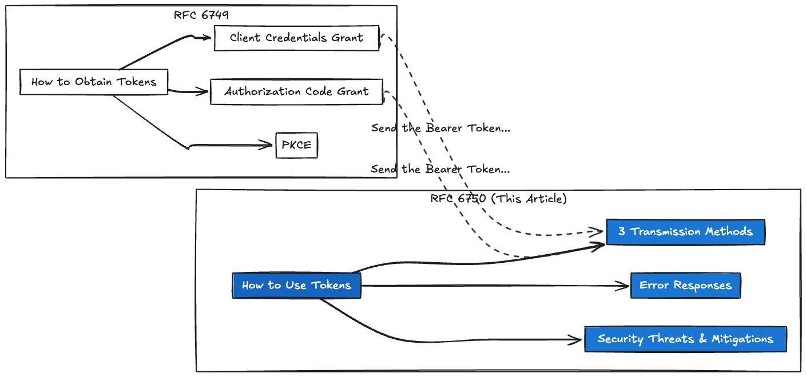
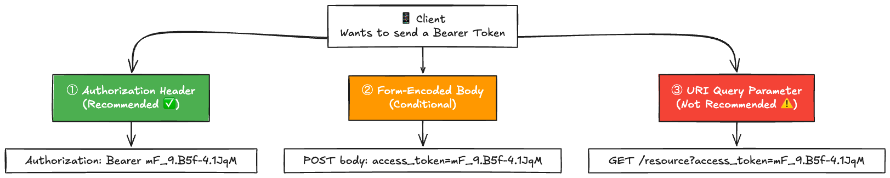
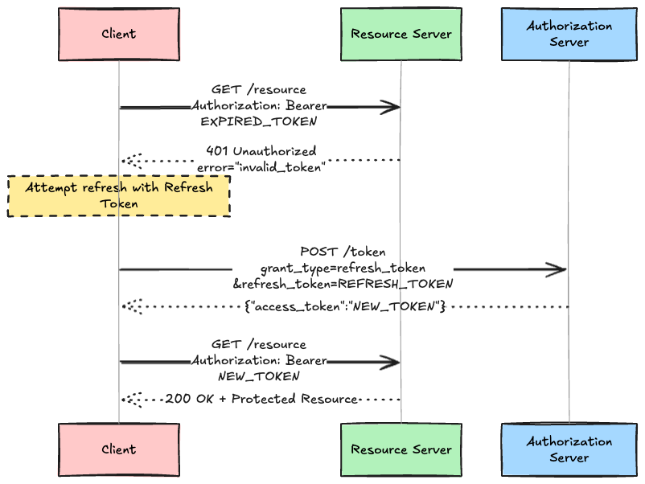
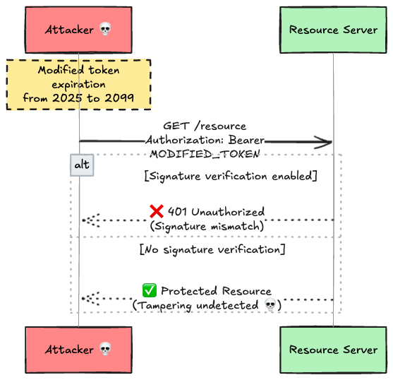
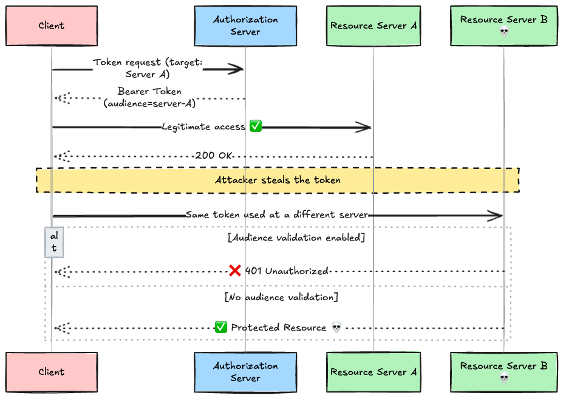
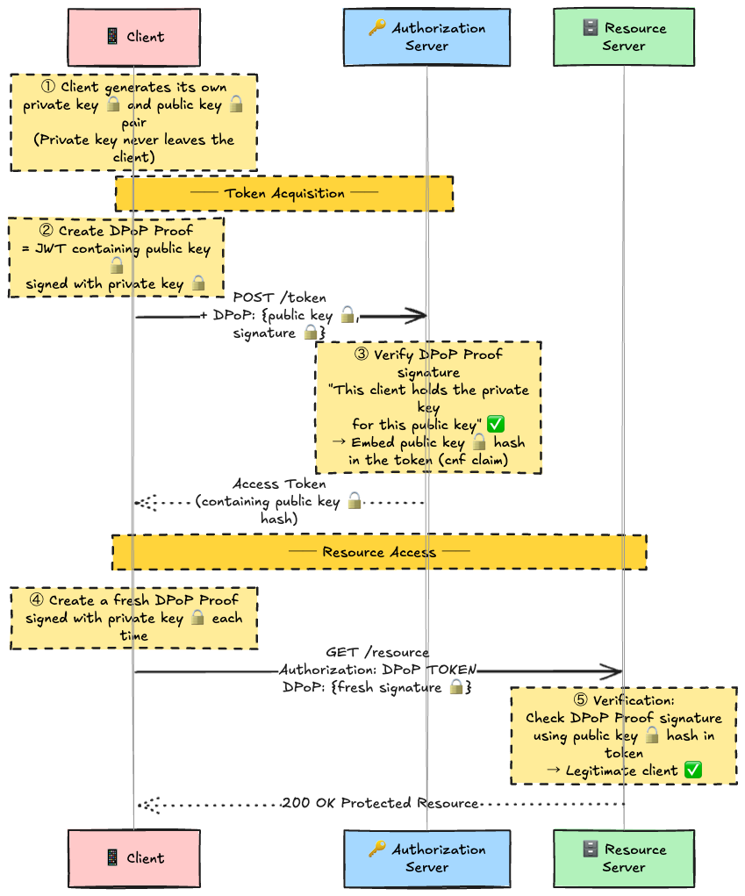
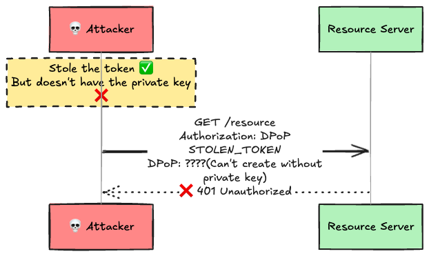

# Introduction

In the previous article, we dissected RFC 6749 (OAuth 2.0 Authorization Framework). You should now understand the big picture of OAuth 2.0 — the roles, Grant Types, and token acquisition flows.

But you might still have some questions:

- "I got an access token... how do I actually send it to an API?"
- "What does the `Bearer` in `Authorization: Bearer xxx` even mean?"
- "When a token is invalid, what response should the server return?"

RFC 6749 defines **how to obtain tokens**. RFC 6750, on the other hand, defines **how to use tokens**. It covers how to present an access token to a resource server, how the resource server should respond to errors, and how to handle Bearer Tokens securely.

This article walks through RFC 6750 based on the original text to build a solid understanding of Bearer Token mechanics from the ground up.

---

## Scope of This Article

Let's first clarify the relationship between RFC 6749 and RFC 6750.



This article assumes you've already obtained a token (covered by RFC 6749). If not, read the previous article first.

---

## 1. What Is a Bearer Token?

Let's start with the definition. RFC 6750 §1.2 states:

> A security token with the property that any party in possession of the token (a "bearer") can use it in any way that any other party in possession of it can. Using a bearer token does not require a bearer to prove possession of cryptographic key material (proof-of-possession).

In short, it's a **"whoever has it can use it" token**. Think of it like cash. If someone steals cash from your wallet, they can spend it just fine. Bearer Tokens work the same way — an attacker who steals the token is indistinguishable from the legitimate client.


This "whoever has it can use it" property is both the greatest strength and the greatest weakness of Bearer Tokens. That's why RFC 6750 dedicates significant space to **secure transmission methods** and **security threats and mitigations**.

---

## 2. Three Ways to Send a Bearer Token

RFC 6750 §2 defines **three methods** for sending Bearer Tokens to resource servers. Only **one method** may be used per request (§2: "Clients MUST NOT use more than one method to transmit the token in each request").



### 2.1 Authorization Request Header Field (Recommended ✅)

**The method RFC 6750 most strongly recommends.** Resource servers **MUST support this method**.

```http
GET /resource HTTP/1.1
Host: server.example.com
Authorization: Bearer mF_9.B5f-4.1JqM
```

Simply place the `Bearer` scheme + a space + the token string in the `Authorization` header.

The token string format is defined by the following ABNF:

```abnf
b64token    = 1*( ALPHA / DIGIT /
                  "-" / "." / "_" / "~" / "+" / "/" ) *"="
credentials = "Bearer" 1*SP b64token
```

This format allows Base64url characters — alphanumerics, a few symbols, and padding `=`. JWTs fit this format perfectly.

**Why is this the recommended method?**

1. **Conforms to the HTTP Authentication Framework (RFC 7235)** — Credentials go in a standardized location, so proxies and load balancers handle them properly
2. **Not exposed in the URL** — Won't appear in browser history or server logs
3. **Independent of the request body's Content-Type** — Works with JSON, form data, or anything else

### 2.2 Form-Encoded Body Parameter (Conditional)

Use only when the `Authorization` header is unavailable. Resource server support is optional (MAY).

```http
POST /resource HTTP/1.1
Host: server.example.com
Content-Type: application/x-www-form-urlencoded

access_token=mF_9.B5f-4.1JqM
```

This method requires **all five conditions** to be met:

| Condition    | Description                                              |
| ------------ | -------------------------------------------------------- |
| Content-Type | Must be `application/x-www-form-urlencoded`              |
| Encoding     | Body must use URL-encoded format                         |
| Body         | Must be single-part                                      |
| Characters   | ASCII only                                               |
| HTTP Method  | Must **NOT** be `GET` (only methods with body semantics) |

`GET` is excluded because the HTTP spec doesn't define standard semantics for `GET` request bodies.

### 2.3 URI Query Parameter (Not Recommended ⚠️)

```http
GET /resource?access_token=mF_9.B5f-4.1JqM HTTP/1.1
Host: server.example.com
```

RFC 6750 is clear about this:

> its use is not recommended, due to its security deficiencies

**Why is this not recommended?**

If you absolutely must use this method, the additional requirements are:

- Clients SHOULD send a `Cache-Control: no-store` header
- Server success responses SHOULD include `Cache-Control: private`

> **OAuth 2.1 bans this method entirely.** Never use it in new implementations.

### Summary of the Three Methods

| Method                   | Recommendation    | Server Support  | Use Case                                      |
| ------------------------ | ----------------- | --------------- | --------------------------------------------- |
| **Authorization Header** | ✅ Recommended     | MUST (Required) | All cases                                     |
| **Form Body**            | ⚡ Conditional     | MAY (Optional)  | When `Authorization` header is unavailable    |
| **URI Query**            | ⛔ Not Recommended | MAY (Optional)  | Only when neither header nor body is possible |

---

## 3. The WWW-Authenticate Response Header

When Bearer Token authentication fails, the resource server returns information to the client via the `WWW-Authenticate` header. This mechanism is defined by the HTTP Authentication Framework (RFC 7235).

### Response to Unauthenticated Requests

When a request is made with no authentication credentials:

```http
HTTP/1.1 401 Unauthorized
WWW-Authenticate: Bearer realm="example"
```

Simple. Just "bring me a Bearer Token." **No error code should be included** (§3.1: "the resource server SHOULD NOT include an error code or other error information").

Why? Telling a client that hasn't even attempted authentication "your token is invalid" would only cause confusion.

### Response When a Token-Bearing Request Fails

When a token was sent but authentication failed, include the reason:

```http
HTTP/1.1 401 Unauthorized
WWW-Authenticate: Bearer realm="example",
                  error="invalid_token",
                  error_description="The access token expired"
```

### WWW-Authenticate Attributes

| Attribute           | Required        | Description                                                |
| ------------------- | --------------- | ---------------------------------------------------------- |
| `realm`             | Optional        | Protection space identifier. Defined in RFC 7235. Max once |
| `scope`             | Optional        | Required scope for access. Space-delimited. Max once       |
| `error`             | On auth failure | Error code (see below)                                     |
| `error_description` | Optional        | Developer-facing error description. **Not for end-users**  |
| `error_uri`         | Optional        | URI to a web page explaining the error                     |

---

## 4. Error Codes

RFC 6750 §3.1 defines three error codes, each with a recommended HTTP status code.

### invalid_request — 400 Bad Request

Returned when the request itself is malformed.

**Specific scenarios:**

- Missing a required parameter
- Contains an unsupported parameter
- Duplicate parameters
- **Multiple token transmission methods used** (e.g., token in both header and query)
- Otherwise malformed request

```http
HTTP/1.1 400 Bad Request
WWW-Authenticate: Bearer realm="example",
                  error="invalid_request",
                  error_description="Multiple methods used to include access token"
```

### invalid_token — 401 Unauthorized

Returned when the token itself has a problem. **The client MAY obtain a new token and retry.**

**Specific scenarios:**

- Token has expired
- Token has been revoked
- Token has been tampered with
- Otherwise invalid

```http
HTTP/1.1 401 Unauthorized
WWW-Authenticate: Bearer realm="example",
                  error="invalid_token",
                  error_description="The access token expired"
```

A typical client flow after receiving this response:



### insufficient_scope — 403 Forbidden

The token is valid, but it doesn't have the required scope for this resource.

```http
HTTP/1.1 403 Forbidden
WWW-Authenticate: Bearer realm="example",
                  error="insufficient_scope",
                  scope="admin:read admin:write"
```

The `scope` attribute MAY indicate what scope is required. The client can use this as a hint to request additional authorization.

### Error Code Comparison

| Error Code           | HTTP Status | Cause              | Client Action                    |
| -------------------- | ----------- | ------------------ | -------------------------------- |
| `invalid_request`    | 400         | Malformed request  | Fix the request and resend       |
| `invalid_token`      | 401         | Invalid token      | Obtain a new token and retry     |
| `insufficient_scope` | 403         | Insufficient scope | Request additional authorization |

---

## 5. Example Access Token Response

RFC 6750 §4 shows an example response when the authorization server returns an access token.

```http
HTTP/1.1 200 OK
Content-Type: application/json;charset=UTF-8
Cache-Control: no-store
Pragma: no-cache

{
  "access_token":"mF_9.B5f-4.1JqM",
  "token_type":"Bearer",
  "expires_in":3600,
  "refresh_token":"tGzv3JOkF0XG5Qx2TlKWIA"
}
```

The two cache-control headers here are critical:

| Header          | Value      | Purpose                                                 |
| --------------- | ---------- | ------------------------------------------------------- |
| `Cache-Control` | `no-store` | Prevents proxies and browsers from caching the response |
| `Pragma`        | `no-cache` | HTTP/1.0 compatible cache prevention (legacy support)   |

Tokens are sensitive information, and you must prevent intermediate proxies or browsers from storing them.

---

## 6. Security Threats

This is the heart of RFC 6750. Because Bearer Tokens can be used by anyone who possesses them, they face various threats. RFC 6750 §5 organizes these threats based on NIST SP 800-63.

Let's look at each threat in more detail.

### Token Manufacture / Modification

An attacker forges a token or modifies the contents of an existing token (e.g., extending the expiration or escalating the scope).



**Mitigation:** Protect token integrity with digital signatures (RS256, etc.) or HMAC (HS256, etc.). When using JWT (= JWS), the resource server **MUST** perform signature validation. Implementations that allow `alg: none` are inexcusable.

### Token Disclosure

The token is leaked to unintended third parties. This is the most common threat.

### Token Redirect

A token issued for Resource Server A is used to gain unauthorized access to Resource Server B.



**Mitigation:** Include an `aud` (audience) claim in the token, and have the resource server validate that the token was intended for it.

### Token Replay

An attacker intercepts a legitimately used token and reuses it.

**Mitigation:** Use short token lifetimes (one hour or less recommended) and TLS to prevent eavesdropping.

---

## 7. Security Recommendations

RFC 6750 §5.3 summarizes seven security recommendations.

| #   | Recommendation                      | RFC Level   | Notes                                               |
| --- | ----------------------------------- | ----------- | --------------------------------------------------- |
| 1   | **Safeguard Bearer Tokens**         | Overarching | The most fundamental and important principle        |
| 2   | **Validate TLS Certificate Chains** | MUST        | Prevents DNS hijacking token theft                  |
| 3   | **Always Use TLS (https)**          | MUST        | HTTP traffic should be assumed compromised          |
| 4   | **Don't Store in Cookies**          | MUST NOT    | Cookies default to plaintext. Requires CSRF defense |
| 5   | **Use Short Lifetimes**             | SHOULD      | One hour or less. Even shorter for browser contexts |
| 6   | **Scope Tokens Narrowly**           | SHOULD      | Audience restriction + least privilege              |
| 7   | **Don't Put Tokens in URLs**        | SHOULD NOT  | Leaked via logs, history, and Referer               |

### Implementation Example: Resource Server Validation (Go)

Here's a typical token validation flow on the resource server side, incorporating these recommendations:

```go
func validateBearerToken(r *http.Request) (*Claims, error) {
    // 1. Extract token from Authorization header
    auth := r.Header.Get("Authorization")
    if auth == "" {
        return nil, ErrNoToken // → 401, WWW-Authenticate: Bearer realm="example"
    }

    // Verify "Bearer " prefix
    const prefix = "Bearer "
    if !strings.HasPrefix(auth, prefix) {
        return nil, ErrInvalidRequest // → 400, error="invalid_request"
    }
    tokenStr := auth[len(prefix):]

    // 2. Validate token (signature + claims verification)
    claims, err := verifyJWT(tokenStr)
    if err != nil {
        return nil, ErrInvalidToken // → 401, error="invalid_token"
    }

    // 3. Validate expiration
    if time.Now().After(claims.ExpiresAt) {
        return nil, ErrInvalidToken // → 401, error="invalid_token"
    }

    // 4. Validate audience (Token Redirect mitigation)
    if claims.Audience != "https://api.example.com" {
        return nil, ErrInvalidToken
    }

    // 5. Validate scope
    if !claims.HasScope(requiredScope) {
        return nil, ErrInsufficientScope // → 403, error="insufficient_scope"
    }

    return claims, nil
}
```

---

## 8. The Load Balancer and TLS Termination Problem

RFC 6750 §5.2 contains an often-overlooked but critically important note for production deployments:

> In some deployments, including those utilizing load balancers, the TLS connection to the resource server terminates prior to the actual server that provides the resource.

In other words, after TLS is terminated at the load balancer, communication to the backend may be in plaintext.


Tokens can be stolen in this segment. RFC 6750's requirement:

- Sufficient confidentiality protection **MUST** be implemented between the load balancer and backend
- Token encryption is one such measure

Practical mitigations include:

1. **Use TLS on internal networks as well** (mTLS or service mesh)
2. **Strip the token at the load balancer and forward only the validation result**
3. **Enforce network isolation with VPCs and private subnets**

---

## 9. The Limits of Bearer Tokens and the Evolution to DPoP

Bearer Tokens as defined by RFC 6750 have over a decade of proven track record, but they have a fundamental weakness: **if stolen, game over**.

Think of a Bearer Token as a **hotel key card**. Anyone who picks it up can enter the room. No ID check required.

**DPoP (Demonstrating Proof of Possession)**, RFC 9449, was created to solve this problem. DPoP works like "key card + your personal signature." Even if someone steals the key card (token), they can't open the door without your signature (a private key-based cryptographic proof).

### How DPoP Works

The critical point here is that **the client itself generates the key pair**. Not the authorization server.



**Why is this secure?**

Suppose an attacker steals the token. The token itself contains binding information (the `cnf` claim) that says "this token is exclusively for the owner of this public key."

```json
// Inside the stolen token (JWT)
{
  "sub": "user123",
  "scope": "read",
  "cnf": {
    "jkt": "0ZcOCORZNYy-DWpqq30jZyJGHTN0d2HglBV3uiguA4I"
    //       ↑ SHA-256 hash of the client's public key
  }
}
```

To access the resource server, a DPoP Proof signed with the **private key** corresponding to this public key is required. The private key only exists inside the client. So the attacker can't create a valid DPoP Proof, and access is denied.



### Bearer vs DPoP vs mTLS Comparison

| Property              | Bearer (RFC 6750) | DPoP (RFC 9449)   | mTLS (RFC 8705)            |
| --------------------- | ----------------- | ----------------- | -------------------------- |
| **Binding**           | None              | Application layer | TLS layer                  |
| **Theft Resistance**  | ❌ None            | ✅ Yes             | ✅ Yes                      |
| **Deploy Complexity** | Low               | Medium            | High (PKI required)        |
| **Public Clients**    | ✅ Supported       | ✅ Supported       | ❌ Not supported            |
| **Typical Use**       | General purpose   | SPAs & mobile     | Server-to-server & finance |
| **OAuth 2.1**         | Still usable      | Recommended       | Recommended                |

---

## 10. RFC 6750 and the Surrounding Spec Map

RFC 6750 is not a standalone specification — it's part of the OAuth 2.0 ecosystem.

| RFC          | Name                   | Relationship to RFC 6750                                 |
| ------------ | ---------------------- | -------------------------------------------------------- |
| RFC 6749     | OAuth 2.0 Framework    | How to obtain tokens (prerequisite)                      |
| **RFC 6750** | **Bearer Token Usage** | **How to use tokens (this article)**                     |
| RFC 9449     | DPoP                   | Sender-constrained token to compensate Bearer's weakness |
| RFC 8705     | mTLS Token Binding     | TLS-layer token binding                                  |
| RFC 9068     | JWT Access Token       | Standardized format for Bearer Tokens                    |
| RFC 7009     | Token Revocation       | API to revoke compromised Bearer Tokens                  |
| RFC 7662     | Token Introspection    | API to query Bearer Token metadata                       |
| RFC 9700     | Security BCP           | Consolidated OAuth security best practices               |

---

## Conclusion

RFC 6750 is a short 18-page spec, but it's packed with essential principles for using Bearer Tokens correctly.

Three takeaways:

1. **Send Bearer Tokens via the `Authorization: Bearer xxx` header.** Don't use URLs or form bodies
2. **Bearer Tokens are game over if stolen.** That's why TLS is mandatory, lifetimes must be short, scopes must be narrow, and tokens must never appear in logs
3. **If theft resistance is required, consider DPoP (RFC 9449) or mTLS (RFC 8705)**

RFC 6749 defines how to **obtain** tokens. RFC 6750 defines how to **use** them. You need both to see the complete picture of the OAuth 2.0 token flow.

## References

- [RFC 6750 - The OAuth 2.0 Authorization Framework: Bearer Token Usage](https://datatracker.ietf.org/doc/html/rfc6750)
- [RFC 6749 - The OAuth 2.0 Authorization Framework](https://datatracker.ietf.org/doc/html/rfc6749)
- [RFC 9449 - OAuth 2.0 Demonstrating Proof of Possession (DPoP)](https://datatracker.ietf.org/doc/html/rfc9449)
- [RFC 8705 - OAuth 2.0 Mutual-TLS Client Authentication and Certificate-Bound Access Tokens](https://datatracker.ietf.org/doc/html/rfc8705)
- [RFC 9700 - OAuth 2.0 Security Best Current Practice](https://datatracker.ietf.org/doc/html/rfc9700)
- [RFC 9068 - JSON Web Token (JWT) Profile for OAuth 2.0 Access Tokens](https://datatracker.ietf.org/doc/html/rfc9068)
