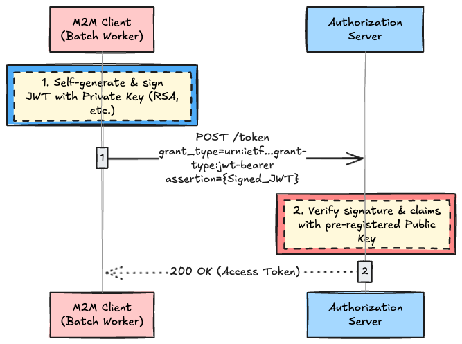
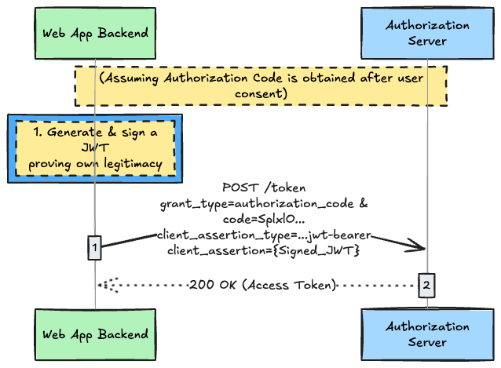

# Introduction

I perfectly understand how human users authenticate in modern web apps via OAuth 2.0. A browser opens, the user clicks "Allow" on a consent screen, and an access token is issued. 

But the other day, while looking at a backend architecture involving dozens of microservices, a fundamental question hit me: **"How does machine-to-machine (M2M) authentication actually work when there is no human sitting in front of a browser?"**

For a long time, the answer was passing around a `client_secret`—essentially a static password. However, in 2026, hardcoding access keys in CI/CD pipelines like GitHub Actions or configuration files is considered a risky, legacy practice. In its place, mechanisms that dynamically generate temporary credentials—most notably **Workload Identity Federation**—have become the standard.

Do you know the protocol specification that underpins this "secretless" M2M authentication infrastructure? That would be **RFC 7523 (JSON Web Token (JWT) Profile for OAuth 2.0)**.

In this article, I will dissect RFC 7523 to deeply explore why we are finally being liberated from the technical debt of `client_secret`.

---

## 1. The Relationship Between RFC 7521 and 7523: The Box and Its Contents

To understand RFC 7523, we must first look at its parent, **RFC 7521**.

RFC 7521 defines a "framework" stating that, "In OAuth 2.0, you may use an **assertion** (verifiable data containing a claim) for client authentication or authorization grants." However, this specification does not dictate the actual data structure of the assertion.

So, the rulebook that materialized this by saying, "Well, let's use the easily handled **JWT (JSON Web Token)** as the data format for that assertion," is **RFC 7523**.

| Role                   | Corresponding RFC | Summary                                                                           |
| :--------------------- | :---------------- | :-------------------------------------------------------------------------------- |
| **Abstract Framework** | RFC 7521          | Common rules for using assertions (The Box).                                      |
| **JWT Profile**        | **RFC 7523**      | The star of this article. Specific implementation rules using JWT (The Contents). |
| SAML Profile           | RFC 7522          | For SAML XML, often seen in enterprise legacy systems.                            |

---

## 2. The "Two Powerful Use Cases" Brought by JWT

To integrate JWT into the OAuth 2.0 paradigm, RFC 7523 clearly defines **two independent use cases**. Mixing these up will invariably lead to pitfalls during implementation, so pay close attention.

1. **JWT as an Authorization Grant**
2. **JWT as Client Authentication**

These are completely different concepts. They can be used separately or both at the same time. Let's look at the raw mechanics of each.

### Use Case 1: Using JWT as an "Authorization Grant" (The Secret of M2M Communication)

Imagine a log aggregation worker for a batch process running late at night. There is no human sitting in front of a browser to click the "Allow Access" button.

The standard Authorization Code Grant relies on human interaction. However, by using the JWT grant defined in RFC 7523, the client (such as a batch server) can **cryptographically sign a JWT itself using its private key, hurl it directly at the authorization server, and pillage an access token**.

#### Flow Diagram

It is an incredibly simple, almost violently streamlined flow with all the fat trimmed off.



At this point, the HTTP request looks like the following. The most striking detail is that there is absolutely no `client_secret` included in the request (assuming the authorization server's policy allows this). The signed JWT itself serves as a rock-solid proof of "who I am and what I am asking for."

```http
POST /token HTTP/1.1
Host: as.example.com
Content-Type: application/x-www-form-urlencoded

grant_type=urn%3Aietf%3Aparams%3Aoauth%3Agrant-type%3Ajwt-bearer
&assertion=eyJhbGciOiJSUzI1NiIsImtp...[Signed_JWT]...
```

### Use Case 2: Using JWT for "Client Authentication" (Goodbye, client_secret)

The other use case is substituting the infamous `client_secret` with a JWT as proof of identity in a standard flow (e.g., when exchanging an authorization code for an access token). If you've ever implemented backend communication for "Sign in with Apple," you've undoubtedly gone through this exact flow.



In this case, the JWT is bundled into the `client_assertion` parameter. Because you no longer need to save static passwords in network routing paths or GitHub environment variables, the security risk dramatically plummets.

---

## 3. The Validation "Claims" You Must Never Compromise On

"If throwing a JWT gets you a token, how do we block an attacker who just makes up a random JWT?"

Section 3 of RFC 7523 lays out **absolutely merciless, strict validation rules** for the claims that must be included in the JWT payload. The authorization server **MUST reject** immediately any JWT that breaks even a single one of these rules.

| Claim                  |   Required   | The Truth of Implementation & Attack Vectors                                                                                                                                                                                                                         |
| :--------------------- | :----------: | :------------------------------------------------------------------------------------------------------------------------------------------------------------------------------------------------------------------------------------------------------------------- |
| **`iss`** (Issuer)     | **Required** | **"Who issued this?"** For client authentication, this is your own `client_id`. The comparison is done via Simple String Comparison based on RFC 3986.                                                                                                               |
| **`sub`** (Subject)    | **Required** | **"Who is this claim about?"** For authorization grants, this must match the entity delegating authority (e.g., user). For client authentication, it must match the `client_id`.                                                                                     |
| **`aud`** (Audience)   | **Required** | **"Who is this addressed to?"** This must contain the **token endpoint URL of the authorization server**. Forgetting to validate this leads to a fatal vulnerability where **a legitimate JWT issued for a different service is intercepted and diverted to yours**. |
| **`exp`** (Expiration) | **Required** | **"The expiration date."** If it's in the past, reject it. In realistic cloud deployments, setting an extremely short window of 5–15 minutes is standard practice to minimize risk if intercepted.                                                                   |

Furthermore, the following properties are critical for security:

* **`jti` (JWT ID)**: A unique identifier for the JWT. By caching this alongside the `exp` claim, the authorization server can memorize used `jti`s and refuse to accept them again, **perfectly preventing replay attacks**. While technically MAY (optional) by spec, it is virtually mandatory in production.
* **Cryptographic Algorithm**: RFC 7523 Section 5 explicitly states that **`RS256` (RSA signature) is Mandatory-to-Implement**. Lazy implementations that try to get away with `none` or `HS256` (which requires sharing a secret key) are strictly forbidden under this specification.

---

## Conclusion

RFC 7523 is not just "one of the ways to use JWT." It represents the **final end to the endless, agonizing game of "where do we hide the static passwords?"** that we've suffered through for years.

Accidentally pushing a Google Cloud service account key (JSON) to GitHub, only to have a Bitcoin mining cluster spun up seconds later leading to thousands of dollars in damages—such tragedies could be completely prevented with RFC 7523 and the Workload Identity architectural patterns built on top of it.

The era of manually pasting `client_secret` into source code and CI/CD environment variables is over. If your system is still executing legacy password-based authentication, you should immediately consider transitioning to a modern architecture utilizing public-key cryptography and JWT grants.

---

### Resources

* [RFC 7523 - JSON Web Token (JWT) Profile for OAuth 2.0 Client Authentication and Authorization Grants](https://datatracker.ietf.org/doc/html/rfc7523)
* [RFC 7521 - Assertion Framework for OAuth 2.0 Client Authentication and Authorization Grants](https://datatracker.ietf.org/doc/html/rfc7521)
