# Introduction

In my previous article exploring RFC 6750 (Bearer Token Usage), I concluded with the following statement:

> **If theft resistance is required, consider DPoP (RFC 9449) or mTLS (RFC 8705)**

Today, we will take a deep dive into **RFC 8705**.

In the world of OAuth 2.0, access tokens are fundamentally treated as Bearer Tokens—meaning they are "tokens that grant access to anyone who possesses them." They operate much like cash: if someone steals it from you, it"s gone, and they can spend it.

RFC 8705 addresses this inherent vulnerability by providing two distinct approaches utilizing **mTLS (Mutual TLS)**:

1. **mTLS Client Authentication** — Authenticating the client using an X.509 certificate instead of a `client_secret`.
2. **Certificate-Bound Access Token** — Binding the access token to the client"s certificate, rendering it useless if stolen.

It is crucial to understand that these two mechanisms are computationally and conceptually independent. You can use one without the other, or both together. Grasping this independence is the first key step to understanding RFC 8705.

---

## Prerequisites for this Article

This article assumes you have a foundational understanding of:

- RFC 6749 (The foundational OAuth 2.0 authorization flows)
- RFC 6750 (How Bearer Tokens are transmitted and their associated security threats)
- Basic mechanisms of TLS (Server authentication, certificate chains)

---

## 1. What Exactly is mTLS?

First, let"s clarify the concept of "mutual TLS." Without this foundation, the entirety of RFC 8705 will seem obscure.

### Traditional TLS (One-Way Authentication)

When you access a website via `https://` in your browser, a TLS handshake occurs. In this traditional setup, **only the server** presents a certificate to prove its identity.

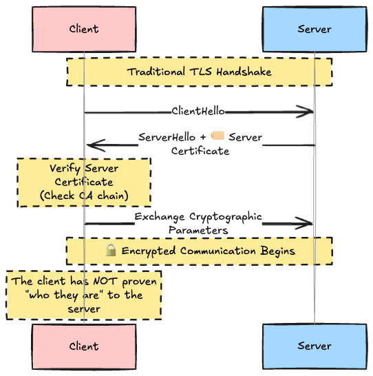

The server proves "I am the authentic server you intended to connect to," but at the TLS layer, the server has no idea who the client is. Client authentication in this model is entirely delegated to the application layer (e.g., username/password, API keys, cookies).

### mTLS (Mutual Authentication)

In mTLS, **the client also presents a certificate**. The server sends a `CertificateRequest`, and the client responds with its certificate and a proof of possession of the corresponding private key (`CertificateVerify`).

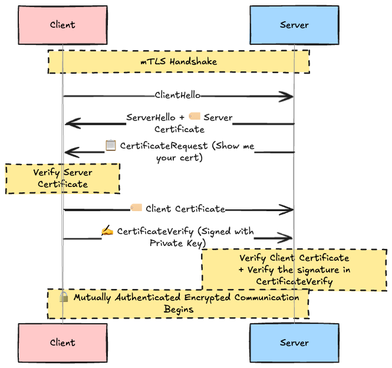

Two critical things happen here:

1. **The client sends its certificate** — To prove its identity.
2. **The client sends a `CertificateVerify` message** — To prove it actually possesses the private key corresponding to the public key in the certificate.

Certificates, by nature, are public information and can be freely copied. However, the `CertificateVerify` signature cannot be generated without the private key. Therefore, **possession of the private key is mathematically proven**.

---

## 2. The High-Level Structure of RFC 8705

RFC 8705 is broadly divided into two distinct parts. The hallmark of this specification is that each part can be implemented independently.

| Section    | Specification Feature                          | Primary Goal                                                                     | Implementation Methods / Choices                                                                 |
| :--------- | :--------------------------------------------- | :------------------------------------------------------------------------------- | :----------------------------------------------------------------------------------------------- |
| **Part 1** | **mTLS Client Authentication** (Section 2)     | Authenticate the client using an X.509 certificate instead of a `client_secret`. | PKI Method (`tls_client_auth`) OR Self-Signed Certificate Method (`self_signed_tls_client_auth`) |
| **Part 2** | **Certificate-Bound Access Token** (Section 3) | Prevent token theft by binding the access token to the client"s certificate.     | Embed hash inside JWT (`cnf.x5t#S256`) OR return hash via Token Introspection                    |

**Case for using both:**

- A client uses mTLS to authenticate itself to the Authorization Server, **AND** the resulting access token is bound to that same certificate for use at the Resource Server.

**Cases for using only one:**

- Using Certificate-Bound Tokens for a Public Client (e.g., SPA, mobile app) → Client authentication is handled by other means like PKCE.
- Using mTLS Client Authentication solely to secure the `/token` endpoint, without binding the resulting access token to the certificate.

---

## 3. Part 1: mTLS Client Authentication

### The Role of `token_endpoint_auth_method`

Before diving in, let"s clarify the baseline. In OAuth 2.0, the mechanism a client uses to authenticate at the token endpoint is specified by a **metadata parameter** (client configuration data pre-registered at the Authorization Server) called `token_endpoint_auth_method`.
Here are the values registered in the IANA "OAuth Token Endpoint Authentication Methods" registry:

| Value                             | Defined In   | Description                                                |
| :-------------------------------- | :----------- | :--------------------------------------------------------- |
| `none`                            | RFC 7591     | No authentication (Used for Public Clients)                |
| `client_secret_post`              | RFC 7591     | Send `client_secret` in the POST body                      |
| `client_secret_basic`             | RFC 7591     | Send `client_secret` via HTTP Basic Auth                   |
| `client_secret_jwt`               | RFC 7523     | Send a JWT signed with a symmetric `client_secret`         |
| `private_key_jwt`                 | RFC 7523     | Send a JWT signed with a private key (Asymmetric)          |
| **`tls_client_auth`**             | **RFC 8705** | **PKI-based mTLS (Covered in this article)**               |
| **`self_signed_tls_client_auth`** | **RFC 8705** | **Self-signed certificate mTLS (Covered in this article)** |

RFC 8705 adds `tls_client_auth` and `self_signed_tls_client_auth` to this registry. In other words, **mTLS client authentication is simply one of the available choices for "Token Endpoint Authentication Methods," standing shoulder-to-shoulder with `client_secret_basic` and `private_key_jwt`.**

To be honest, `client_secret_basic` remains the most widely adopted method today. Major OAuth providers like Google, GitHub, and Auth0 use it by default. While it may seem archaic, there"s a simple truth to it: **under the hood, it is fundamentally just username/password authentication using a shared secret model (`client_id` and `client_secret`).**

Why does it persist? **Because it is overwhelmingly easy for developers.** It requires zero knowledge of crypto-suites or complex key management; you simply shove a string into an HTTP header. As long as the transport layer is protected by TLS, providers generally consider this trade-off in simplicity acceptable.

mTLS typically comes into play in high-security environments like Financial-grade APIs (FAPI) or Zero Trust architectures, where **the leakage of a `client_secret` would be catastrophic**.

By comparing **what is pre-registered with the IdP (Authorization Server)** for each method, the physical differences become clear:

| Authentication Method             | Pre-Registered at the IdP                                     | Secret Held by the Client             |
| :-------------------------------- | :------------------------------------------------------------ | :------------------------------------ |
| `client_secret_basic`             | `client_secret` (Shared Secret)                               | Exact same `client_secret`            |
| `private_key_jwt`                 | Public Key (JWK Set)                                          | Private Key                           |
| **`tls_client_auth`**             | `tls_client_auth_subject_dn`, etc. (Subject info of the cert) | CA-issued Certificate + Private Key   |
| **`self_signed_tls_client_auth`** | `jwks` / `jwks_uri` (JWK Set containing the cert)             | Self-signed Certificate + Private Key |

With `client_secret`, **both the Authorization Server and the Client hold the exact same secret**. Conversely, the mTLS family operates on **asymmetric cryptography** where the private key exists solely on the client side. Even if the Authorization Server is fully compromised, the client"s private key remains secure—this is the strongest motivation to migrate to mTLS.

### Why use Certificates instead of client_secret?

In RFC 6749, Confidential Clients authenticate at the token endpoint using a `client_secret`. However, `client_secret` has several critical weaknesses:

| Comparison Point        | Weaknesses of `client_secret`                                                                                      | Advantages of X.509 Certificates (mTLS)                                                                                                     |
| :---------------------- | :----------------------------------------------------------------------------------------------------------------- | :------------------------------------------------------------------------------------------------------------------------------------------ |
| **Leakage Risk**        | Included in HTTP bodies or Basic Auth headers, making it vulnerable to leakage via access logs or network proxies. | Protected entirely at the TLS transport layer. Authentication credentials are never exposed in application-layer logs.                      |
| **Rotation Complexity** | Changing the secret requires synchronous updates on both the Authorization Server and the Client.                  | With `tls_client_auth`, the client can simply obtain a new cert with the same Subject from the CA. No IdP configuration changes are needed. |
| **Trust Model**         | Both parties hold the same symmetric secret. If the IdP is breached, all client secrets are compromised.           | The private key resides only on the client. The IdP verifies using public cryptography (Asymmetric).                                        |

### Common Rules for mTLS Authentication

There are common rules that apply to both mTLS authentication methods defined in RFC 8705 (Section 2):

1. The underlying TLS connection between the client and the authorization server **MUST be established using mTLS**.
2. The client **MUST include the `client_id` parameter** in its requests — The server does not attempt to implicitly determine the client solely from the certificate"s content; the client must explicitly identify itself via `client_id`.
3. If the certificate is missing or does not match the expected registered parameters, the server returns an `invalid_client` error.

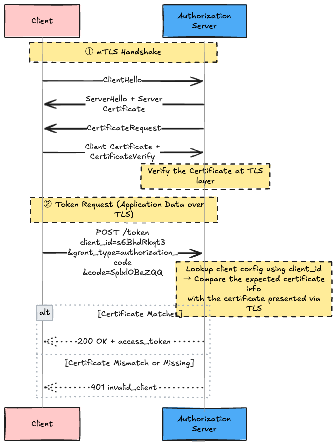

The requirement to mandate the `client_id` is driven by practical implementation realities. Attempting to reverse-lookup a client securely based solely on the certificate"s Subject DN introduces thorny DN normalization issues (handling spaces, casing, encoding). Providing the `client_id` allows the server to immediately fetch the corresponding client configuration in O(1).

### 3.1 PKI Method (`tls_client_auth`)

This represents the traditional, enterprise use case for X.509 certificates. It relies on a certificate issued by a trusted Certificate Authority (CA) and mandates full certificate chain validation.

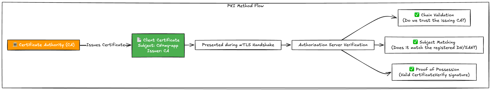

**Client Registration Metadata** — This is data **pre-registered in the Authorization Server"s database**. It is not injected into the request or the certificate itself. It is configured manually by an admin or automatically via the Dynamic Client Registration API (RFC 7591).

It serves as the expected value (e.g., "This client"s certificate should have exactly this Subject"). During runtime, the IdP compares this expectation against the actual certificate presented during the mTLS handshake.

| Metadata Parameter           | Description                | Example                      |
| :--------------------------- | :------------------------- | :--------------------------- |
| `tls_client_auth_subject_dn` | The Subject DN of the cert | `CN=my-app,O=Example,C=US`   |
| `tls_client_auth_san_dns`    | The dNSName SAN            | `client.example.com`         |
| `tls_client_auth_san_uri`    | The URI SAN                | `https://client.example.com` |
| `tls_client_auth_san_ip`     | The IP Address SAN         | `192.168.1.100`              |
| `tls_client_auth_san_email`  | The rfc822Name (email) SAN | `admin@example.com`          |

Clients must use **exactly one** of these parameters. You cannot declare a Subject DN and a SAN simultaneously.

You might wonder: "Wait, if I only specify an email address (`tls_client_auth_san_email`), couldn"t an attacker just generate a malicious self-signed certificate with that same email address and bypass authentication?"

This highlights the critical importance of the first verification step: **Validation by the Certificate Authority (CA)**.
During the mTLS handshake, the Authorization Server strictly checks **"Was this certificate issued by a CA I explicitly trust?"** (Self-signed or rogue CA certificates are instantly rejected at the TLS layer). Only after the certificate passes this rigorous trust-chain validation does the server proceed to match the Subject attributes against its metadata. Thus, matching even a single attribute is sufficient to guarantee the client"s identity, as the CA has already vouched for it.

Here is a concrete example of registration:

```json
// Example payload for Dynamic Client Registration
{
  "client_name": "my-app",
  "token_endpoint_auth_method": "tls_client_auth",
  "tls_client_auth_subject_dn": "CN=my-app,O=Example,C=US",
  "grant_types": ["authorization_code"]
}
```

And the runtime verification flow:

```
① Pre-Registration (One-time)
   Admin -> IdP DB: tls_client_auth_subject_dn = "CN=my-app"

② Runtime
   Client -> IdP: mTLS (presents cert) + POST /token client_id=abc
   IdP:
     1. Look up DB for client_id=abc -> retrieves tls_client_auth_subject_dn = "CN=my-app"
     2. Inspect the Subject DN of the cert presented via mTLS -> "CN=my-app"
     3. They match -> Authentication Successful ✅
```

**The absolute greatest advantage of the PKI method:** Certificate rotation is trivial. As long as the client acquires a new certificate from the trusted CA featuring the exact same Subject DN/SAN, absolutely zero configuration changes are required on the Authorization Server.

### 3.2 Self-Signed Certificate Method (`self_signed_tls_client_auth`)

Designed for environments lacking a PKI infrastructure (i.e., you don"t want to operate a CA). The client generates its own self-signed certificate and uses that directly.


The fundamental difference from the PKI method is that **certificate chain validation is entirely skipped**. The root of trust is no longer a CA; it is the mathematical equivalence (usually a hash comparison) to the specific certificate that was pre-registered beforehand.

The certificate is communicated to the server by embedding it within a JWK Set using the `x5c` (`X.509 Certificate Chain`) parameter. This JWK Set is then registered using either the `jwks` parameter (passing the JSON directly by value) or the `jwks_uri` parameter (providing a URL to fetch the JSON).

```json
{
  "kty": "EC",
  "x": "1yfLHCpXqFjxCeHHHMVDTcLscpb07KUxudBmOMn8C7Q",
  "y": "8_coZwxS7LfA4vOLS9WuneIXhbGGWvsDSb0tH6IxLm8",
  "crv": "P-256",
  "x5c": [
    "MIIBBjCBrAIBAjAKBggqhkjOPQQDAjAPMQ0wCwYDVQQDDARtdGxzMB4..."
  ]
}
```

#### How does the Authorization Server find the right certificate?

You might be wondering: "If a client connects with a self-signed certificate, does the authorization server iterate through millions of registered JWKs trying to find a match?"

The answer is an emphatic **No**. This is precisely why the standard mandates the inclusion of the `client_id` parameter, as mentioned in the common rules.

The runtime verification flow works like this:

```
① Pre-Registration
   Client: "I am client_id=xyz. Here is my cert (via jwks / jwks_uri)"
   -> Stored in the IdP DB

② Runtime
   Client -> IdP: mTLS (presents cert) + POST /token client_id=xyz
   IdP:
     1. Uses client_id=xyz from the request body to query the DB.
     2. Fetches the JWK Set specifically bound to client_id=xyz (fetching from the URI if using jwks_uri).
     3. Compares the certificate embedded in that JWK Set (x5c) against the certificate presented over the mTLS connection.
     4. They match -> Authentication Successful ✅
```

In other words, **the server never searches through other clients' registration data**. It strictly queries the dedicated JWK Set linked uniquely to the incoming `client_id`.

Using `jwks_uri` is highly recommended, as it allows seamless certificate rotation without requiring the Authorization Server administrators to update their database. The client simply updates the JSON file hosted at their own `jwks_uri` with the new certificate, and the Authorization Server will automatically fetch the updated cert using the `client_id` as the index.

### Comparison of the two `token_endpoint_auth_method` approaches

| Feature                   | PKI Method (`tls_client_auth`)               | Self-Signed Method (`self_signed_tls_client_auth`) |
| :------------------------ | :------------------------------------------- | :------------------------------------------------- |
| **Issuer of Certificate** | Trusted CA                                   | The Client itself                                  |
| **Chain Validation**      | ✅ Yes                                        | ❌ No                                               |
| **Registration Data**     | Subject DN or SAN                            | JWK Set (`jwks` / `jwks_uri`)                      |
| **Rotation Strategy**     | Re-issue cert with identical Subject from CA | Client updates the `jwks_uri` JSON                 |
| **Revocation Check**      | Possible (CRL / OCSP)                        | Impossible / Not applicable                        |
| **Requires PKI?**         | ✅ Yes                                        | ❌ No                                               |
| **Ideal Environment**     | Enterprise architectures, Banking APIs       | Microservices, Development/Staging environments    |

---

## 4. Part 2: Certificate-Bound Access Token

This is the crown jewel of RFC 8705. By cryptographically binding the access token to the client"s certificate, we definitively solve the "if it"s stolen, you"re dead" crisis inherent to Bearer Tokens.

### Recalling the Vulnerability of Bearer Tokens

Bearer Tokens grant access to resources simply by being presented. The resource server possesses absolutely no mechanism to verify if the "presenter" of the token is the legitimate "entity it was issued to."

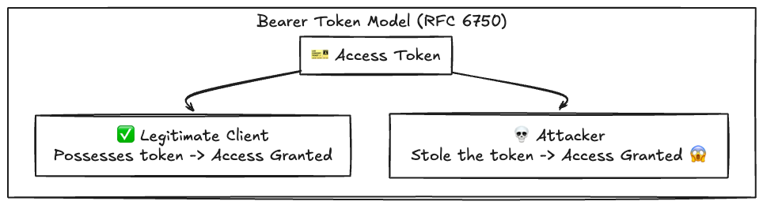

### The Solution: Certificate-Bound Tokens

The solution is remarkably elegant: The authorization server essentially burns the SHA-256 fingerprint (hash) of the client"s certificate directly into the access token. When attempting to access a protected API, the resource server inspects the mTLS connection, computes the hash of the presented certificate, and verifies that it perfectly matches the hash permanently embedded within the token.

If an attacker manages to steal the access token, it is completely worthless because the attacker lacks the corresponding private key necessary to establish the required mTLS connection.

### The Holistic View of Token Binding

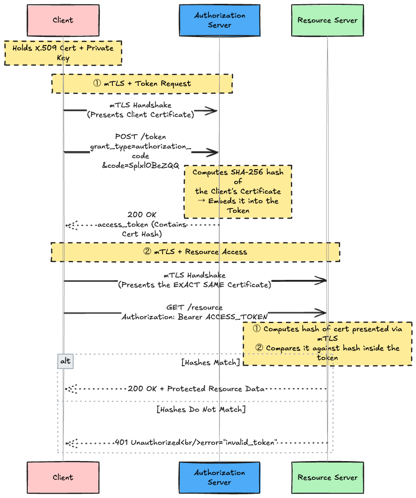

The absolute golden rule here is that **the client MUST use the identical certificate when talking to the Token Endpoint AND the Resource Server**. If different certificates are used, the hash verification will fail, resulting in an immediate 401 Unauthorized.

### 4.1 Binding within a JWT (`cnf.x5t#S256`)

If the issued access token is structured as a JSON Web Token (JWT), the certificate"s hash is injected into a `cnf` (confirmation) claim under the member name `x5t#S256`.

```json
{
  "iss": "https://server.example.com",
  "sub": "ty.webb@example.com",
  "exp": 1493726400,
  "nbf": 1493722800,
  "cnf": {
    "x5t#S256": "bwcK0esc3ACC3DB2Y5_lESsXE8o9ltc05O89jdN-dg2"
  }
}
```

The string value of `x5t#S256` is derived as follows:

1. Obtain the **DER encoding** of the client certificate.
2. Calculate the **SHA-256 hash** of that DER binary byte stream.
3. Encode the resulting hash digest using **base64url encoding** (omitting any trailing `=` padding characters).


The resource server"s job is trivially simple: execute this exact computational pipeline on the certificate it receives via mTLS, and perform a strict string comparison against the `x5t#S256` value inside the JWT.

### 4.2 Binding via Token Introspection

In scenarios where the access token is an opaque string (meaning the resource server cannot decode its contents), the resource server must utilize Token Introspection (RFC 7662) to query the authorization server for the token"s metadata. The introspection response JSON will proactively include the `cnf.x5t#S256` object.

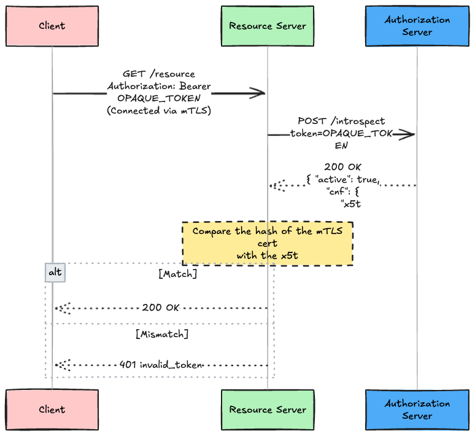

Whether parsing a JWT locally or utilizing Introspection over the network, the verification logic remains immutable: **Does the hash of the currently presented mTLS certificate == the hash cryptographically bound to the token?**

### 4.3 Discovery Metadata

Authorization Servers and Clients can explicitly declare their support for Certificate-Bound Tokens via OAuth 2.0 Discovery metadata.

**Authorization Server Metadata (RFC 8414):**

```json
{
  "issuer": "https://server.example.com",
  "tls_client_certificate_bound_access_tokens": true
}
```

**Client Registration Metadata:**

```json
{
  "client_id": "s6BhdRkqt3",
  "tls_client_certificate_bound_access_tokens": true
}
```

Both parameters are booleans and default to `false` if absent.

---

## 5. Public Clients Can Use Certificate-Bound Tokens

This concept, detailed in RFC 8705 §4, is frequently overlooked but represents a **crucial reality for implementing mTLS in the real world**.

As emphasized at the beginning, mTLS Client Authentication and Certificate-Bound Tokens are **entirely decoupled mechanisms**. This decoupling proves vital when dealing with Public Clients (e.g., mobile apps, SPAs).

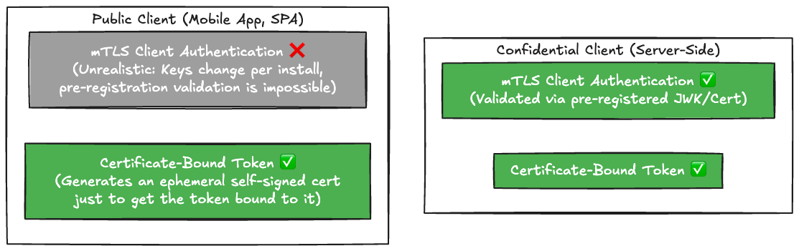

### Why don't Public Clients perform "Client Authentication"?

Imagine a real-world smartphone application with millions of active users. What happens if we attempt to use `self_signed_tls_client_auth` (client authentication via pre-registered JWKs) for this app?

- **Share the same private key across all users?** → You would have to embed the private key directly into the application binary. Attackers could trivially extract it via reverse engineering, instantly destroying the mTLS security model for the entire userbase. Absolutely unacceptable.
- **Generate unique keys per device upon installation and register a JWK for each? (Dynamic Client Registration)** → This means generating and registering a unique `client_id` and `jwks` against the Authorization Server for every single app install sequence. This creates millions of registration overhead events, bloating the IdP database to unmanageable sizes. While theoretically possible, it is systemic insanity and practically impossible to maintain.

### The Realistic mTLS Flow for Mobile Apps

Therefore, mobile apps (Public Clients) **gracefully abandon the concept of "mTLS Client Authentication"** entirely. (They delegate authentication to mechanisms like PKCE).

However, they still desperately want the security benefits of an "unstealable" token. Here is how they achieve it:

1. Immediately upon installation, the mobile app leverages a secure enclave (e.g., Apple's Secure Enclave, Android's Keystore) to silently generate a localized, "personal" self-signed certificate.
2. **Crucially, the app NEVER registers this certificate (JWK) with the Authorization Server.**
3. When it"s time to request a token, the app initiates a request to the `/token` endpoint, establishing an mTLS connection and presenting this ephemeral self-signed certificate. (The Authorization Server must be configured to accept *any* incoming client certificate without throwing a TLS verification error).
4. The Authorization Server implements the following logic: "I am not going to verify who you are or the validity of this certificate. I will ignore pre-registered JWKs. **However, I will calculate the hash of the certificate you just presented over this mTLS connection, and I will strictly burn that hash into the access token I am about to mint.**"
5. The mobile app receives the hash-bound access token. For all subsequent API calls, it utilizes the exact same ephemeral self-signed certificate to establish an mTLS session with the Resource Server.

Through this elegant flow, Public Clients can fully realize the benefits of Certificate-Bound Tokens without burdening the Authorization Server with the operational nightmare of pre-registering and managing millions of JWKs.

RFC 8705 explicitly states (SHOULD) that if an Authorization Server issues a Refresh Token to a Public Client under these conditions, the Refresh Token must also be bound to that ephemeral certificate.

---

## 6. mTLS Endpoint Aliases

This feature (defined in RFC 8705 §5) quietly solves a major logistical headache in production environments.

### The Problem

An Authorization Server supporting mTLS must configure its TLS stack to emit a `CertificateRequest` during the TLS handshake. However, if this request is sent to legacy, non-mTLS clients (like standard web browsers performing normal OAuth login flows), **the browser will intercept the request and spawn an aggressive "Select a Certificate" popup dialog to the end-user.** This creates immediate end-user confusion and destroys UX.

### The Solution

Deploy a dedicated, segregated endpoint hosted on an entirely separate domain alias specifically for mTLS traffic. Only mTLS-capable clients are routed to this host.

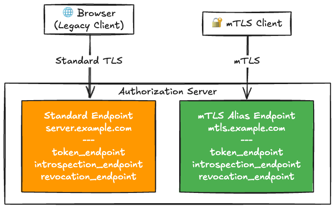

This is declared within the Authorization Server"s Discovery Metadata using the `mtls_endpoint_aliases` parameter:

```json
{
  "issuer": "https://server.example.com",
  "token_endpoint": "https://server.example.com/token",
  "introspection_endpoint": "https://server.example.com/introspect",
  "revocation_endpoint": "https://server.example.com/revo",
  "tls_client_certificate_bound_access_tokens": true,
  "mtls_endpoint_aliases": {
    "token_endpoint": "https://mtls.example.com/token",
    "introspection_endpoint": "https://mtls.example.com/introspect",
    "revocation_endpoint": "https://mtls.example.com/revo"
  }
}
```

mTLS clients **MUST prefer** utilizing the endpoints defined within `mtls_endpoint_aliases`. For capabilities not mapped to an alias (e.g., `authorization_endpoint`), clients fallback to utilizing the standard endpoint definitions.

By separating the traffic via entirely different hostnames, infrastructure teams can easily segregate their TLS configurations, leaning on TLS SNI (Server Name Indication) routing, or even deploying entirely separate load balancer infrastructure for mTLS.

---

## 7. Implementation Considerations

RFC 8705 §6 outlines critical caveats and considerations for those implementing the spec.

### 7.1 Authorization Server Considerations

| Common Architectural Pattern              | Description                                                                                                                                                                                                 |
| :---------------------------------------- | :---------------------------------------------------------------------------------------------------------------------------------------------------------------------------------------------------------- |
| **Pattern 1: Optional mTLS Request**      | The server issues a `CertificateRequest`, but if the client fails to provide a certificate, the TLS handshake still succeeds (falling back to application-layer authentication logic like `client_secret`). |
| **Pattern 2: Dedicated Alias Hosts**      | Architecturally splitting traffic between a strict mTLS host and a standard host (utilizing `mtls_endpoint_aliases`).                                                                                       |
| **Pattern 3: Loosened Trust Constraints** | Configuring the TLS stack to purposefully skip CA certificate chain validation (essential when supporting the `self_signed_tls_client_auth` mechanism).                                                     |

### 7.2 Resource Server Considerations

There is a profound design philosophy embedded here. Although the Resource Server accepts connections via mTLS, **it explicitly DOES NOT need to perform X.509 certificate chain validation.**

Why? Because the Resource Server"s sole mandate is cryptographic Token Binding ("Is this token strictly tethered to this specific certificate?"). **The responsibility of establishing the certificate's overarching trustworthiness (CA signatures, revocation status, semantic validity) belongs entirely to the Authorization Server.**

The Resource Server must remain laser-focused on Proof-of-Possession. Once it successfully verifies that the hash of the presented certificate matches the hash sealed inside the token, it simply falls back to evaluating standard OAuth parameters: validating the `exp` (expiration) and ensuring the `scope` satisfies the demands of the requested protected resource.

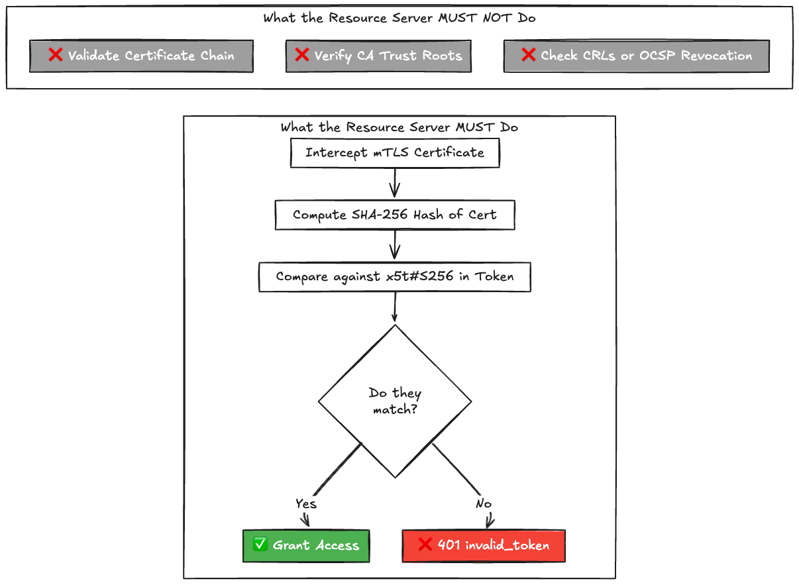

### 7.3 Expiry of Certificates and Bound Tokens

Because the access token is inextricably bound to a specific certificate"s fingerprint, whenever a client rotates its certificate, all previously issued access tokens immediately become permanently invalid (because the hash of the new certificate will mismatch the hash embedded in the old tokens).

This is handled seamlessly by treating it exactly like a standard token expiration event: the client simply leverages its Refresh Token to acquire a freshly minted access token bound to the new certificate fingerprint.

### 7.4 Incompatibility with the Implicit Grant

Certificate-Bound Tokens fundamentally require the token to be issued resulting from an mTLS connection made against the `/token` endpoint. The Implicit Grant flow skips the token endpoint entirely, returning the token directly from the authorization endpoint to the browser, making this binding mechanism structurally impossible.

Given that the Implicit Grant is aggressively deprecated and effectively outlawed in OAuth 2.1, this incompatibility is largely irrelevant for modern architectures.

### 7.5 TLS Termination at the Edge

A ubiquitous architectural reality is terminating TLS at fleet-edge load balancers, API Gateways, or reverse proxies. The challenge then becomes ferrying the intricacies of the client"s certificate back to the upstream application servers.


While defining the specifics of this proxy translation is outside the purview of RFC 8705, industry standards heavily rely on headers like `X-SSL-Client-Cert`, or `X-Forwarded-Client-Cert` (specifically utilized by service meshes like Envoy/Istio). To prevent trivial spoofing of these headers by malicious actors, the upstream backend application must be rigorously configured to fundamentally distrust these headers unless the connection explicitly originated from a verified, trusted internal proxy IP.

---

## 8. Security Considerations

### 8.1 Certificate-Bound Refresh Tokens

For Confidential Clients, the Refresh Token is implicitly bound to the certificate by virtue of the fact that utilizing the Refresh Token requires successfully establishing mTLS client authentication against the token endpoint.

For Public Clients, as analyzed in §4, RFC 8705 dictates that the Authorization Server SHOULD explicitly cryptographically bind the Refresh Token to the client"s ephemeral self-signed certificate.

### 8.2 Security of the Cryptographic Hash

The entirety of the token binding architecture relies on the integrity of the SHA-256 algorithm. If an advanced attacker were capable of generating a spurious certificate that resulted in a hash collision (yielding the exact same SHA-256 fingerprint), the binding could be compromised. Provided the pre-image resistance of SHA-256 holds against future crypto-analysis, this attack vector remains computationally infeasible.

### 8.3 Certificate Spoofing Attacks

In PKI deployments (`tls_client_auth`), if an Authorization Server exhibits overly promiscuous trust by trusting an excessively broad pool of Certificate Authorities, an attacker might compromise a poorly secured subsidiary CA, instruct it to issue a forged certificate possessing the exact same Subject DN as a legitimate client, and execute a successful spoofing attack.

The mitigation is straightforward: **Enforce aggressive least-privilege on Trusted CAs.** Never blindly trust root CAs for authentication purposes.

### 8.4 Privacy Implications

In legacy TLS versions (1.2 and prior), the client certificate is actively transmitted in **plaintext** across the wire during the handshake phase. A passive eavesdropper monitoring network traffic could intercept this certificate, extracting identity data and tracking client behavior.

TLS 1.3 completely remediates this vulnerability by encrypting the client certificate transmission phase of the handshake. Upgrading to TLS 1.3 whenever technically feasible should be a priority.

---

## 9. mTLS vs DPoP vs Bearer — A Comprehensive Comparison

Let"s synthesize the differences between RFC 8705 (mTLS), RFC 9449 (DPoP), and RFC 6750 (Legacy Bearer Tokens).

| Attribute                       | Bearer (RFC 6750)   | DPoP (RFC 9449)                          | mTLS (RFC 8705)                              |
| :------------------------------ | :------------------ | :--------------------------------------- | :------------------------------------------- |
| **Binding Layer**               | None                | Application Layer (HTTP)                 | Transport Layer (TLS)                        |
| **Theft Resistance**            | ❌ None              | ✅ Yes                                    | ✅ Yes                                        |
| **Required Cryptography**       | None                | Public/Private Keypair                   | X.509 Certificate + Private Key              |
| **Requires PKI?**               | None                | ❌ No                                     | Depends on Method                            |
| **Public Client Compatibility** | ✅ Yes               | ✅ Yes                                    | ✅ Yes (See §4)                               |
| **Deployment Complexity**       | Low                 | Medium                                   | High                                         |
| **Replay Attack Protection**    | ❌ No                | ✅ Yes (via `jti`, `htm`, `htu`)          | ✅ Yes (Inherited from TLS session integrity) |
| **XSS Vulnerability**           | ❌ High              | △ Medium (Risk if private key is stolen) | ✅ Immune (Cannot be exploited via JS)        |
| **Typical Use-Cases**           | General/Legacy APIs | SPAs, Mobile Apps                        | Server-to-Server, Financial APIs             |
| **Status in FAPI 2.0**          | ❌ Prohibited        | ✅ Recommended Option                     | ✅ Recommended Option                         |

### Architectural Decision Tree

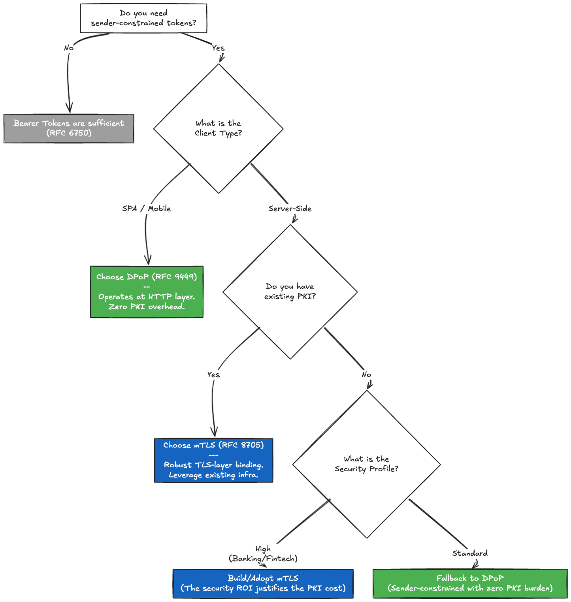

### The Perspective of FAPI 2.0

The Financial-grade API (FAPI) 2.0 standard absolutely mandates the usage of "sender-constrained access tokens", rendering legacy Bearer Tokens obsolete. To achieve this, FAPI 2.0 officially recognizes and approves both mTLS and DPoP.

While FAPI 1.0 Advanced essentially cornered implementers into utilizing mTLS, the elevation of DPoP as a first-class citizen in FAPI 2.0 reflects the explosive growth of the Open Banking ecosystem and the increasing dominance of mobile app and SPA-based financial clients where mTLS is architecturally cumbersome.

---

## 10. The RFC 8705 Specification Map

| RFC / Spec   | Title                             | Relationship to RFC 8705                                               |
| :----------- | :-------------------------------- | :--------------------------------------------------------------------- |
| RFC 6749     | OAuth 2.0 Framework               | Fundamental prerequisites                                              |
| RFC 6750     | Bearer Token Usage                | Defines the "Bearer vulnerabilities" that mTLS was built to solve      |
| **RFC 8705** | **mTLS + Certificate-Bound**      | **The subject of this article**                                        |
| RFC 9449     | Demonstrating Proof of Possession | A competing approach to sender-constrained tokens (App Layer)          |
| RFC 7662     | Token Introspection               | A mechanism used to verify Certificate-Bound opaque tokens             |
| RFC 9068     | JWT Access Token Profile          | Standardizes embedding the `cnf.x5t#S256` claim within a JWT           |
| RFC 7800     | Proof-of-Possession for JWT       | Discovers and defines the `cnf` claim apparatus                        |
| FAPI 2.0     | Financial-grade API Security      | An overarching framework that mandates the adoption of mTLS or DPoP    |
| RFC 9700     | Security BCP                      | A best-practice mandate heavily recommending sender-constrained tokens |

---

---

## Bonus Column: Handling "Identity" in OAuth

While not strictly defined by RFC 8705, understanding exactly how "identity" works under the hood is non-negotiable for grasping complex topics like mTLS. The mental model of "who is authenticating who" often gets tangled. Let"s dissect some pervasive misunderstandings.

### Misconception 1: "A `client_id` is issued per user."

**This is entirely false.** A `client_id` is granted exclusively to the **Application as an entity** (e.g., Notion, Slack, or your custom third-party app). Whether Alice uses Notion or Bob uses Notion, the Notion backend will present the exact same `client_id` to the Authorization Server.

The Authorization Server performs **Client Authentication** to mathematically prove: "The entity calling me right now is indeed Notion." Only after proving that does it issue an access token granting "Notion the authority to access Alice's resources." The identity of the user (Alice) is then woven into the background of that access token via the `sub` claim.

### Misconception 2: "The ID Token dictates whose Access Token it is."

**This is also a partial fallacy.**
The information denoting "who" the user is (`sub`) exists **both behind the Access Token AND inside the ID Token**. However, they serve completely bifurcated architectural purposes based on the "audience".

| Characteristic          | Access Token (OAuth)                                       | ID Token (OIDC)                                                        |
| :---------------------- | :--------------------------------------------------------- | :--------------------------------------------------------------------- |
| **Audience (Consumer)** | **The API (Resource Server)**                              | **The Client (e.g., Notion app itself)**                               |
| **Core Objective**      | "Whose data am I authorized to touch?" (**Authorization**) | "Who is the human currently logged in to my app?" (**Authentication**) |
| **Payload Format**      | Opaque String OR JWT                                       | Strictly a decodable JWT                                               |

The API (Resource Server) receives an Access Token, inspects it (via JWT decoding or Token Introspection), extracts the underlying `sub: Alice` data, and executes access control logic. The Client application (Notion) never needs to know, care, or attempt to read the contents of the Access Token.

### Misconception 3: "The backend of the Authorization Server is defined by OAuth."

The intricate dance of redirecting a user to a "Login Screen", checking unhashed passwords, or validating biometric data is **bluntly deemed out of scope (Out of Band) by the OAuth 2.0 (RFC 6749) specification.**

Because OAuth simply refuses to care how you authenticate a user, real-world architectures fork into two primary design patterns:

1. **Monolithic (Coupled) Architecture:** A single Web Application codebase handles both the complex OAuth Token issuance cryptography AND hosts the raw HTML login screens and SQL User Databases.
2. **Federated (Decoupled) Architecture:** Pure OAuth engines like "Ory Hydra" handle strictly token issuance. When challenged to log a user in, the engine blindly deflects the request, redirecting the user to an entirely isolated, specialized server (e.g., a custom corporate login portal, Google, or Azure AD). In these setups, the pure OAuth engine and the downstream Identity Provider communicate via distinct protocols like OIDC, SAML, or proprietary Admin API webhooks.

This uncompromising separation of concerns—OAuth aggressively refusing to dictate *how* authentication is done—is precisely why the industry can effortlessly slop passwords, WebAuthn, Passkeys, and third-party social logins directly in front of the OAuth flow without modifying the protocol.

---

## Conclusion

RFC 8705 delivers two independent axes of security enhancement:

1. **mTLS Client Authentication** — Discarding symmetric `client_secret` strings in favor of robust X.509 certificate validation. This functions via either rigorous PKI chains or nimble self-signed configurations.
2. **Certificate-Bound Access Token** — Burning the SHA-256 hash (`cnf.x5t#S256`) of a certificate irrevocably into an access token. Stolen tokens are neutralized immediately without the paired private key.

If you remember exactly three things from this article, make them these:

- **The two mechanisms are architecturally independent.** You can deploy Client Authentication in isolation, or Certificate-Bound Tokens in isolation. As shown, Public Clients successfully wield Certificate-Bound Tokens without ever authenticating the client via mTLS.
- **Resource Servers are absolved from validating Certificate Chains.** They merely assert hash congruency. The burden of CA trust validation rests exclusively upon the shoulders of the Authorization Server. Provided the token passes the Proof-of-Possession hash check, the Resource Server proceeds with standard token validation (checking `exp`, `scope`).
- **DPoP and mTLS are peers, not adversaries.** They solve the same problem at different layers of the OSI stack. Choose based on your client topology and PKI maturity. FAPI 2.0 proudly mandates either.

The dreaded vulnerability of Bearer Tokens ("If it"s stolen, it"s game over") has been decisively solved by the industry via RFC 8705 and RFC 9449. When architecting new APIs today, failing to evaluate and deploy sender-constrained tokens is rapidly becoming an indefensible engineering decision.

## References

* [RFC 8705 - OAuth 2.0 Mutual-TLS Client Authentication and Certificate-Bound Access Tokens](https://datatracker.ietf.org/doc/html/rfc8705)
* [RFC 6749 - The OAuth 2.0 Authorization Framework](https://datatracker.ietf.org/doc/html/rfc6749)
* [RFC 6750 - The OAuth 2.0 Authorization Framework: Bearer Token Usage](https://datatracker.ietf.org/doc/html/rfc6750)
* [RFC 9449 - OAuth 2.0 Demonstrating Proof of Possession (DPoP)](https://datatracker.ietf.org/doc/html/rfc9449)
* [RFC 7800 - Proof-of-Possession Key Semantics for JSON Web Tokens (JWTs)](https://datatracker.ietf.org/doc/html/rfc7800)
* [RFC 9700 - OAuth 2.0 Security Best Current Practice](https://datatracker.ietf.org/doc/html/rfc9700)
* [FAPI 2.0 Security Profile](https://openid.net/specs/fapi-2_0-security-profile.html)
