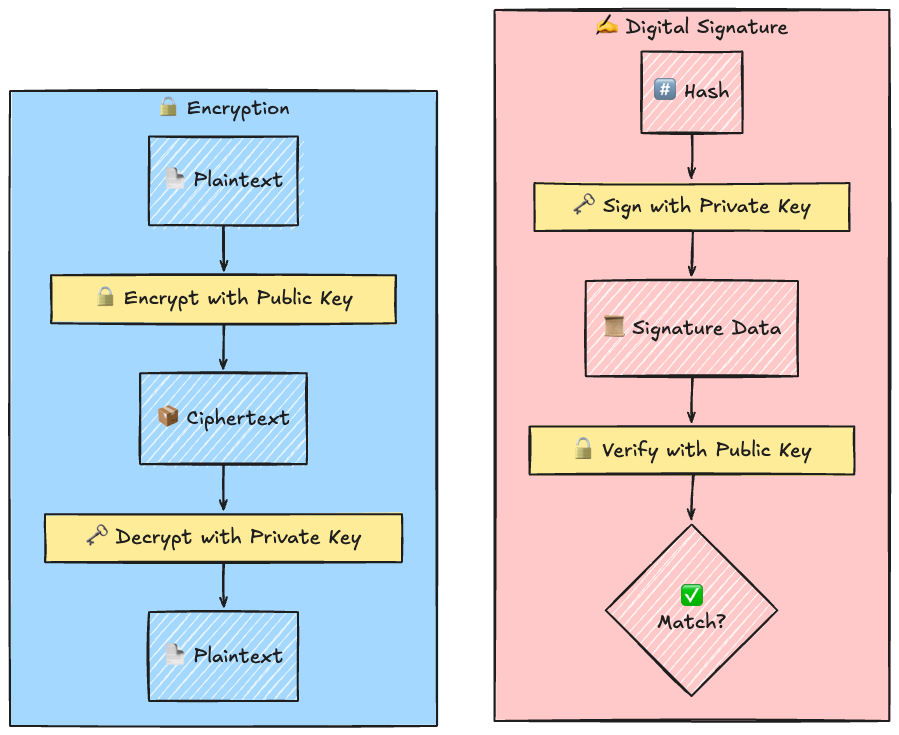
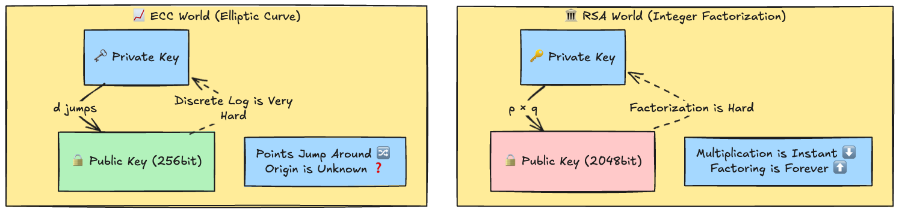
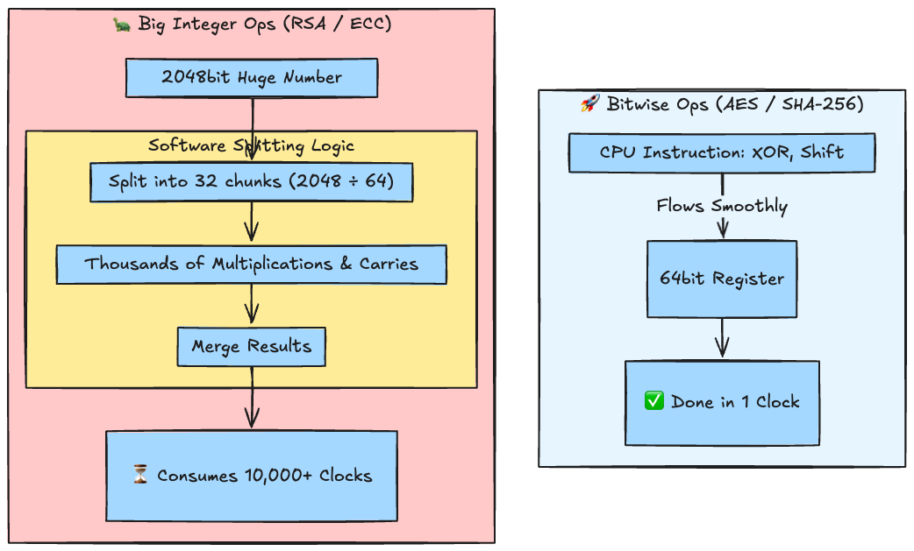
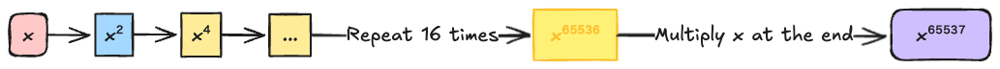
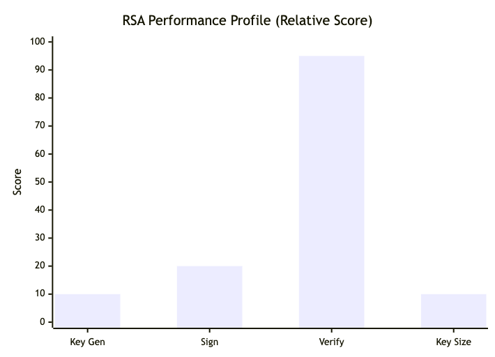
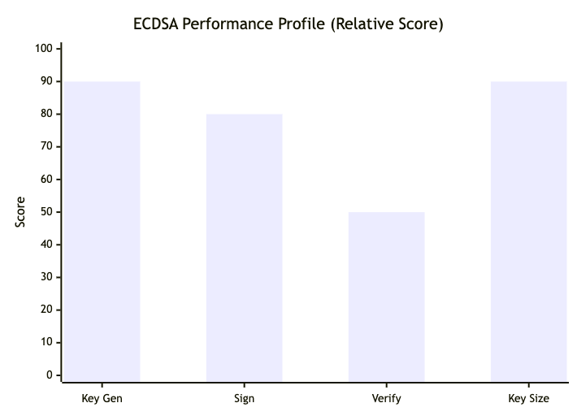
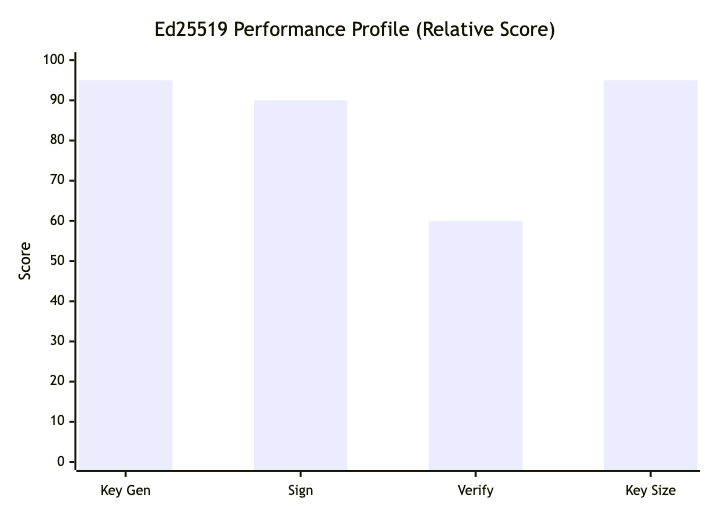

# Introduction

Digital signatures are the bedrock of web security, blockchains, and TLS communication.
We often understand them as "signing with a private key and verifying with a public key," but have you ever felt the numbers behind them? **"Why is RSA verification so fast?"** **"Why is ECDSA becoming mainstream?"**

In this article, we'll revisit the basics of encryption and signatures, and then dive into a thorough comparison of the performance characteristics of RSA, ECDSA, and the modern Ed25519 using benchmarks in Go.

---

## 1. Difference Between Encryption and Signature Verification

The fundamental difference lies in their **"purpose"** and the **"direction of key usage"**.

* **Encryption**: Protects **"Confidentiality"**. Anyone can lock it (Public Key), but only the owner can open it (Private Key).
* **Digital Signature**: Protects **"Integrity"** and **"Authenticity"**. Only the owner can create it (Private Key), but anyone can verify it (Public Key).



## 2. Types of Encryption

There are broadly two types (plus hybrid):

1. **Symmetric Key Encryption**
   * **Feature:** Uses the same key for encryption and decryption. Extremely fast.
   * **Examples:** AES, ChaCha20.

2. **Public Key Encryption**
   * **Feature:** Uses a pair of keys (public/private). Computationally heavy, but solves the key distribution problem.
   * **Examples:** RSA, Elliptic Curve Cryptography.

## 3. Signature Algorithm Mechanics: Why Short Keys for ECC?

Let's compare the three major algorithms. Here, **ECC (Elliptic Curve Cryptography)** refers to the next generation of public key cryptography using elliptic curves.

### Difference in Mathematical Hardness

RSA and ECC differ fundamentally in "how they protect".



### 🧐 Why are "Short Keys" Safe?

You might think "Short keys = Weak".
However, the way the "difficulty to crack" scales for an attacker is completely different.

* **RSA (Sub-exponential)**: Even if you lengthen the key, the difficulty of cracking it only rises "gently". Since efficient attack methods (like the General Number Field Sieve) have been found, keys must be extremely long to remain safe (like stacking a Jenga tower very high).
* **ECC (Exponential)**: Just lengthening the key slightly causes the cracking difficulty to **explode**. Since no efficient way to solve it has been found, even a short key ensures sufficient complexity (like a complex maze).

> **Authoritative Standard**: The National Institute of Standards and Technology (NIST) defines that "RSA 3072-bit" and "ECC 256-bit" have equivalent security strength (128-bit security). This is the biggest reason the modern web is migrating to ECC.

* **RSA Signature**: Relies on the difficulty of "prime factorization of huge numbers". To maintain security against advancing attack methods, very long keys of **2048~4096 bits** are required.
* **ECDSA**: Uses calculations on an **Elliptic Curve**. It achieves the same security as RSA with a key length of only **256 bits** (about 1/10 to 1/12 of RSA), dramatically improving communication efficiency.
* **Ed25519 (EdDSA)**: A modern scheme that makes ECDSA faster and safer.

## 4. Why is Signature Verification "Heavy"? (Comparison with Bitwise Ops)

When we talk about "heavy/light processing" in cryptography, the standard is **Bitwise Operations**.

### Bitwise Operations (Representative of Light Processing)
These are simple operations like "swapping 0 and 1" or "shifting left/right" that the CPU excels at.
Symmetric encryption like AES is built by combining these bitwise operations like a puzzle, so it runs incredibly fast even without dedicated hardware.

### Public Key Cryptography (Heavy Processing)
On the other hand, digital signatures involve **"mathematical calculations on huge numbers"**.
* **RSA:** Multiplying a 2048-bit number (about 600 decimal digits!) thousands of times.
* **ECC:** Jumping and moving points thousands of times on an elliptic curve graph.

Since these calculations do not fit into standard CPU registers (64-bit width), they must be calculated using software tricks, consuming vastly more time (clock cycles) than bitwise operations.

### 🍎 Analogy: Calculator vs. Giant Long Division

* **Bitwise Ops (Symmetric Key AES etc.)**
  * **Image**: "Calculating $123 + 456$ on a calculator"
  * Uses built-in CPU functions (circuits), so the answer comes out **instantly** when you press the button.

* **Big Integer Ops (Public Key RSA/ECC etc.)**
  * **Image**: "Doing **super huge long division** by taping 100 sheets of drawing paper together"
  * The CPU's calculator (register) only holds 64 digits, but RSA requires 2048 digits.
  * Therefore, it requires **muddy manual labor** (software processing) to split the numbers, calculate thousands of times, and stitch them back together.

### ⚙️ Visualization: Traffic Jam Inside the CPU



In this way, for a CPU, digital signature processing is like "forcing oversized cargo through a tiny door". This is why signature verification is overwhelmingly heavier than encryption (like AES).

## 5. Thorough Comparison: RSA vs ECDSA vs Ed25519

Let's visualize the "strengths and weaknesses" of each algorithm with charts (Relative scores/Conceptual diagrams based on benchmark results).

**RSA (2048)**: Verification is "Godspeed".
> **Trivia: Why so fast?** <br>
> The public exponent $e$ used in RSA verification calculation ($s^e \pmod n$) is usually **65537** ($2^{16}+1$). In binary, this is `10000000000000001`, having only two `1` bits. This allows the computer to complete verification with minimal calculation steps.

#### ❓ Question: "Is such a simple number secure?"

Sharp point. You might think, "Is it okay for part of the key to be a simple fixed value?"

1. **Why is it safe?**: RSA's security relies on "Can you factorize the Public Key ($N$)?" $e$ (65537) is like the "lock mechanism (turn right to close)". Even if the mechanism is public, the matching **Private Key ($d$)** cannot be created unless $N$ is factorized, so it is safe.
2. **Why does fewer 1s mean faster?**: Computers are good at "squaring". Calculating $x^{65537}$ isn't done by multiplying 60,000 times foolishly. Instead, it repeats "squaring" 16 times ($x^{65536}$) and multiplies the original $x$ just once at the end (total 17 times). This is the trick of "Fewer 1 bits = Faster" (Binary Method).





**ECDSA (P-256)**: Overall balanced and excellent, but it has a weakness where the private key can leak if "good quality random numbers" cannot be generated during signing.

)

**Ed25519**: Uses "Deterministic Signatures" that do not use random numbers for signing. It is the modern champion, possessing speed, safety, and compactness.



## 6. Hands-on Experiment: Measure Speed on Your PC

Let's measure not just theory, but the actual speed difference on your local machine.
If you have a Go environment, you can run this immediately on Mac, Windows, or Linux.

### Step 1: Preparation

Create a directory and initialize a Go module.

```bash
mkdir crypto-bench
cd crypto-bench
go mod init crypto-bench
```

### Step 2: Create Benchmark Code

Save the following code as `main_test.go`.
Since it only uses Go's standard library, no extra `go get` is needed.

```go
package main

import (
	"crypto/ecdsa"
	"crypto/ed25519"
	"crypto/elliptic"
	"crypto/rand"
	"crypto/rsa"
	"crypto/sha256"
	"testing"
)

// Message hash (signature target)
var hashed = sha256.Sum256([]byte("This is a dummy message for benchmarking"))

// --- RSA Benchmark ---
func BenchmarkRSA_GenerateKey(b *testing.B) {
	for i := 0; i < b.N; i++ {
		_, _ = rsa.GenerateKey(rand.Reader, 2048)
	}
}
func BenchmarkRSA_Sign(b *testing.B) {
	priv, _ := rsa.GenerateKey(rand.Reader, 2048)
	b.ResetTimer()
	for i := 0; i < b.N; i++ {
		_, _ = rsa.SignPKCS1v15(rand.Reader, priv, 0, hashed[:])
	}
}
func BenchmarkRSA_Verify(b *testing.B) {
	priv, _ := rsa.GenerateKey(rand.Reader, 2048)
	sig, _ := rsa.SignPKCS1v15(rand.Reader, priv, 0, hashed[:])
	pub := &priv.PublicKey
	b.ResetTimer()
	for i := 0; i < b.N; i++ {
		_ = rsa.VerifyPKCS1v15(pub, 0, hashed[:], sig)
	}
}

// --- ECDSA Benchmark ---
func BenchmarkECDSA_GenerateKey(b *testing.B) {
	for i := 0; i < b.N; i++ {
		_, _ = ecdsa.GenerateKey(elliptic.P256(), rand.Reader)
	}
}
func BenchmarkECDSA_Sign(b *testing.B) {
	priv, _ := ecdsa.GenerateKey(elliptic.P256(), rand.Reader)
	b.ResetTimer()
	for i := 0; i < b.N; i++ {
		_, _ = ecdsa.SignASN1(rand.Reader, priv, hashed[:])
	}
}
func BenchmarkECDSA_Verify(b *testing.B) {
	priv, _ := ecdsa.GenerateKey(elliptic.P256(), rand.Reader)
	sig, _ := ecdsa.SignASN1(rand.Reader, priv, hashed[:])
	pub := &priv.PublicKey
	b.ResetTimer()
	for i := 0; i < b.N; i++ {
		_ = ecdsa.VerifyASN1(pub, hashed[:], sig)
	}
}

// --- Ed25519 Benchmark ---
func BenchmarkEd25519_GenerateKey(b *testing.B) {
	for i := 0; i < b.N; i++ {
		_, _, _ = ed25519.GenerateKey(rand.Reader)
	}
}
func BenchmarkEd25519_Sign(b *testing.B) {
	_, priv, _ := ed25519.GenerateKey(rand.Reader)
	msg := []byte("This is a dummy message for benchmarking")
	b.ResetTimer()
	for i := 0; i < b.N; i++ {
		_ = ed25519.Sign(priv, msg)
	}
}
func BenchmarkEd25519_Verify(b *testing.B) {
	pub, priv, _ := ed25519.GenerateKey(rand.Reader)
	msg := []byte("This is a dummy message for benchmarking")
	sig := ed25519.Sign(priv, msg)
	b.ResetTimer()
	for i := 0; i < b.N; i++ {
		_ = ed25519.Verify(pub, msg, sig)
	}
}
```

### Step 3: Run

Run the following command in your terminal:

```bash
go test -bench .
```

### Reference Values (Apple M1)

Here are the results on my local environment (Apple M1). How did yours compare?

```text
BenchmarkRSA_GenerateKey-8            12      92,789,597 ns/op  (approx 92.8 ms)
BenchmarkRSA_Sign-8                  992       1,224,537 ns/op  (approx 1.2 ms)
BenchmarkRSA_Verify-8              40353          30,185 ns/op  (approx 0.03 ms)

BenchmarkECDSA_GenerateKey-8       99610          12,207 ns/op  (approx 0.012 ms)
BenchmarkECDSA_Sign-8              49204          26,407 ns/op  (approx 0.026 ms)
BenchmarkECDSA_Verify-8            21112          57,008 ns/op  (approx 0.057 ms)

BenchmarkEd25519_GenerateKey-8     74140          16,186 ns/op  (approx 0.016 ms)
BenchmarkEd25519_Sign-8            60168          19,883 ns/op  (approx 0.020 ms)
BenchmarkEd25519_Verify-8          27704          45,312 ns/op  (approx 0.045 ms)
```

#### Interpretation of Results

* **RSA**: Key generation is devastatingly slow, but **verification is 1.5x faster than Ed25519**. It still has value in legacy environments where minimizing client-side load is critical.
* **Ed25519**: Reigns supreme in signing speed and has the best overall balance.

## Summary

1. **Encryption "Hides", Signatures "Prove"**.
2. **ECC (Elliptic Curve Cryptography)** offers equivalent security with **1/10th the key length of RSA** due to mathematical efficiency.
3. Compared to Symmetric Key Encryption which runs on **Bitwise Operations**, Digital Signatures are heavy because they perform **Huge Mathematical Operations**.
4. When in doubt, choosing **Ed25519** is the most balanced and secure choice for modern applications.

**Whats the next**

I'd like to explore NIST SP 800-57 in depth.
