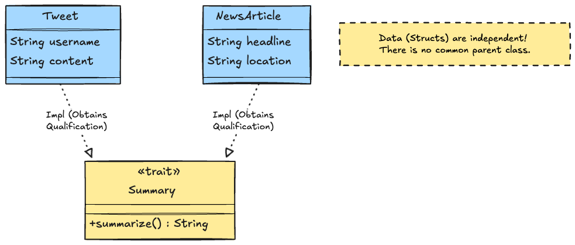
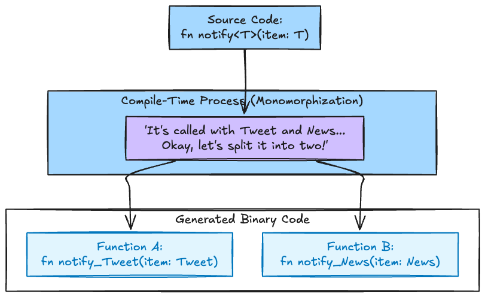
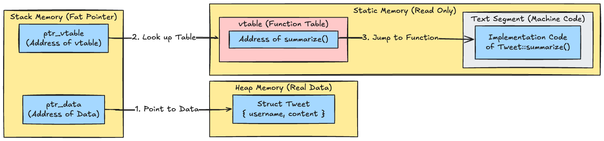
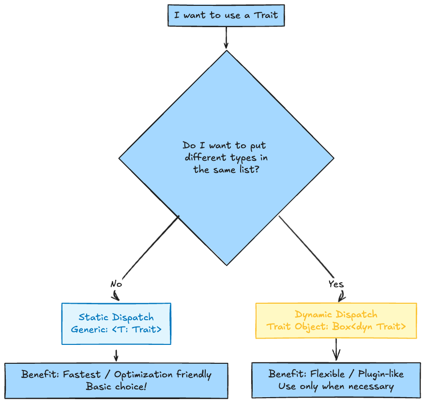

# Introduction

For those coming from Java or TypeScript, **Rust Traits** are often dismissed with, "Ah, so they're basically interfaces, right?"

True, they are the same in that they "define common behavior."
However, Rust traits have powerful features not found in other languages.
The key difference is that the programmer can explicitly choose between **"Zero-cost Abstraction (Static Dispatch)"** and **"Runtime Polymorphism (Dynamic Dispatch)"**.

In this article, we will visualize the difference between these two dispatch methods at the **memory level** to help you unlock the true power of traits.

## 0. Prerequisite: The Roles of struct, trait, and impl

Before diving in, let's clarify the roles of three important keywords in Rust.
Features that are often bundled together as "Classes" in other languages (like Java/C#) are clearly separated in Rust.

|  Rust Term   |       Role (Concept)       |                                              Code Image                                               |
| :----------: | :------------------------: | :---------------------------------------------------------------------------------------------------: |
| **`struct`** |      **Model (Data)**      |                 `struct User { id: i32, name: String }`<br>"What data does it hold?"                  |
| **`trait`**  |  **Interface (Catalog)**   |       `trait Greet { fn say_hello(&self); }`<br>"What functions must it have? (Signature only)"       |
|  **`impl`**  | **Logic (Implementation)** | `impl Greet for User { fn say_hello... { println! } }`<br>"The actual processing content (Body code)" |

The relationship is: "For the data **`User`** (`struct`), we implement the functionality **`Greet`** (`trait`) to behave specifically like this (`impl`)."

## 1. Conceptual Diagram: Not a "Parent", but a "Qualification"

There is an important distinction here. Unlike "Inheritance" in Java, **Traits are not the 'Parent' of the Struct.**

* ❌ **Inheritance**: `Dog` (Child) is born from `Animal` (Parent). `Dog` *is an* `Animal`.
* ⭕ **Implementation**: `Dog` (Just data) obtains the `Walkable` (Can walk) qualification later.

Structs are independent data. Think of Traits as **"Functionality Stickers (Qualifications)"** that you stick onto that data.



`Tweet` and `NewsArticle` are strangers. They have no common parent.
It just so happens that they both passed the "Summary" qualification exam (implemented it) and are wearing that sticker.

## 2. What is Dispatch?

"Dispatch" refers to the process of deciding **"Where in memory (which address) should the CPU jump to?"** when you write `item.summarize()`.

1. **Static Dispatch**: The compiler determines at compile-time, "This is definitely a Tweet," and hardcodes `JUMP 0x1000`. **(No hesitation = Fast)**
2. **Dynamic Dispatch**: The runtime checks the contents of `item`, thinks, "Hmm, this is News. Let me check the table... okay, the destination is `0x2000`," and then jumps. **(Takes effort = Slightly slower)**

## 3. Static Dispatch: Compile-time Magic (Monomorphization)

This is the default and recommended method in Rust. It uses **Generics**.

```rust
// T is "something" that implements Summary
fn notify<T: Summary>(item: &T) {
    println!("Breaking: {}", item.summarize());
}
```

When you compile this, the Rust compiler performs **Monomorphization**, which is essentially "advanced copy-pasting."
It automatically generates a dedicated function for each concrete type used.



### Why is it fast?

There is zero "What type is this?" checking at runtime.
The call to `notify(tweet)` is rewritten into a direct jump instruction to `notify_Tweet(tweet)` at compile time. This is called **"Zero-cost Abstraction."**

* **Pros**: Zero runtime overhead. Optimizations like inlining are easy.
* **Cons**: Binary size increases slightly because code is duplicated for each type.
* **Syntax**: `impl Trait` or `<T: Trait>`

## 4. Dynamic Dispatch: Runtime Flexibility (Fat Pointer & vtable)

However, Generics cannot handle every case.
For example, when you want to create a "List containing a mix of Tweets and News."
In `Vec<T>`, `T` must be resolved to a single type at compile time.

This is where **Trait Objects (`Box<dyn Trait>`)** come in.

```rust
// We can mix different types!
let list: Vec<Box<dyn Summary>> = vec![
    Box::new(tweet),
    Box::new(news),
];
```

### What is happening in memory? (Important!)

`Box<dyn Summary>` is not just a simple pointer.
It becomes a **Fat Pointer** that holds two things: a "pointer to the data" and a "pointer to the function table (vtable) for that type."



At runtime, it looks at `ptr_vtable` every time, performs a lookup to find "Where is the `summarize` function for this guy?", and then jumps.

* **Pros**: Different types can be treated uniformly. Enables plugin systems.
* **Cons**: Cost of vtable lookup (pointer double jump). Slower than static dispatch.
* **Syntax**: `Box<dyn Trait>`, `&dyn Trait`

## 5. 2026 Perspective: Evolution of Async Traits

Previously (before 2023), writing `async fn` inside traits was a hassle. However, as of 2026, **Native Async Traits** are Stable and free to use.

```rust
trait Database {
    // You can write this normally now! (Rust 1.75+)
    async fn fetch_user(&self, id: u32) -> Option<User>;
}
```

**Note**: If you use a trait with `async fn` via **Dynamic Dispatch (`dyn Database`)**, you still need to be careful about `Send` bounds and Boxing.
If you just want to "create an `async` trait," write it as is. But if you want to "stuff them into a `Vec`," you'll need some knowledge of `Box::pin`.

## 6. Hands-on: Executable Complete Code

Let's actually run this. If you copy and paste the code below into `main.rs`, it will work with `cargo run`.

```rust
// --- main.rs ---

// 1. Definition of Trait (Interface)
trait Summary {
    fn summarize(&self) -> String;
}

// 2. Data Structures and Implementation
// --- Tweet ---
struct Tweet {
    username: String,
    content: String,
}

impl Summary for Tweet {
    fn summarize(&self) -> String {
        format!("Tweet by {}: {}", self.username, self.content)
    }
}

// --- NewsArticle ---
struct NewsArticle {
    headline: String,
    location: String,
    author: String,
}

impl Summary for NewsArticle {
    fn summarize(&self) -> String {
        format!("News: {} ({}, by {})", self.headline, self.location, self.author)
    }
}

// 3. Function for Static Dispatch (Generics)
// Compile-time: Creates two separate functions, one for Tweet and one for News
fn notify_static<T: Summary>(item: &T) {
    println!("【Static】{}", item.summarize());
}

fn main() {
    let tweet = Tweet {
        username: String::from("kanywst"),
        content: String::from("I fully understand Rust Traits"),
    };

    let article = NewsArticle {
        headline: String::from("Rust 2026 Edition Released"),
        location: String::from("Tokyo"),
        author: String::from("Rust Team"),
    };

    println!("--- Static Dispatch (Monomorphization) ---");
    // Zero call cost. Basically, use this.
    notify_static(&tweet);
    notify_static(&article);

    println!("\n--- Dynamic Dispatch (Trait Object) ---");
    // Use this when you want to handle different types together.
    // Box<dyn Summary> holds two pointers: to "Data" and "vtable"
    let items: Vec<Box<dyn Summary>> = vec![
        Box::new(tweet),
        Box::new(article),
    ];

    for item in items {
        // Decides the method by looking up the vtable at runtime
        println!("【Dynamic】{}", item.summarize());
    }
}
```

## 7. Practical Example: Which one should I use?

If you are unsure, decide using the flowchart below.



## Conclusion

Rust's strength lies in the fact that you can use these two not "somehow," but "intentionally."

* Basically, use **Generics (Static)** to maximize performance.
* Use **Trait Object (Dynamic)** only when you need flexibility.

When you can flip this switch at will, you will become true friends with the Rust compiler.

## References

* [The Rust Programming Language - Traits](https://doc.rust-lang.org/book/ch10-02-traits.html)
* [The Rust Programming Language - Trait Objects](https://doc.rust-lang.org/book/ch17-02-trait-objects.html)
