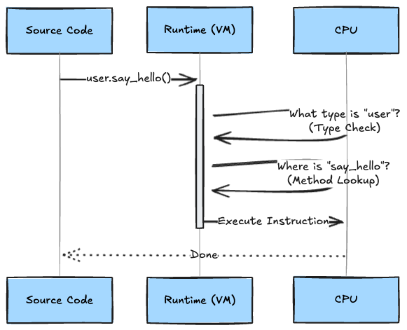
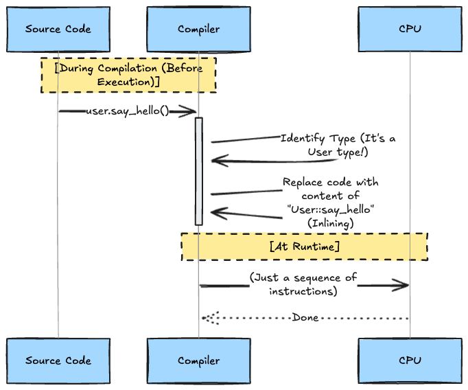
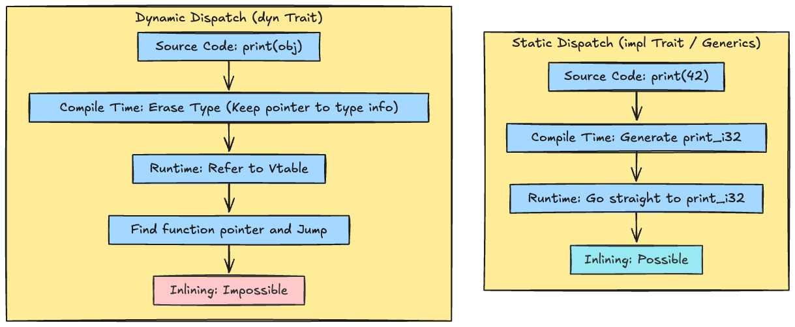

# Introduction

In the world of programming, there has long been a believed "Law of Equivalent Exchange":

* **Human ease (Abstraction)** = **Machine struggle (Slower execution speed)**

For example, when using `list.map()` in Python, checks (costs) occur every time internally, such as "Is this a list?" or "What is the type of the element?".
Therefore, in situations requiring extreme performance, it was considered righteous for humans to take on the burden and write "raw" code like in C.

However, the **"Zero-Cost Abstractions"** advocated by Rust and C++ break this law.

> **"No matter how beautiful the code you write, the compiler will rewrite it into 'gritty optimized code' before executing it."**

This is the true nature of zero-cost abstractions.

## 1. Definition: Two Meanings of "Zero-Cost"

C++ creator Bjarne Stroustrup defined this with two rules:

1. **Unused features cost nothing**
   * There are no features that "run on their own and eat up CPU even when not used," like Garbage Collection (GC).
2. **What you use, you couldn't hand code any better**
   * Even if you use convenient features (like iterators), the compiler converts them into code equivalent to what a seasoned programmer would write by hand.

In other words, **"Taking the easy way out isn't cutting corners (in fact, the machine produces a perfect final draft for you)."**

## 2. Conceptual Diagram: Timing of "Translation"

Why is this possible? The key is **"When the effort is made."**

### Costly Abstraction (Java/Python)

Translation (interpretation) happens at runtime. It's like traveling with an interpreter; there is always a time lag.



### Zero-Cost Abstraction (Rust/C++)

Translation is completed perfectly at compile time. It's like memorizing the local language perfectly before going on a trip.



At runtime, neither "Type Checks" nor "Method Lookups" remain. Only the "Instructions" remain.

## 3. Deep Dive: The Magic Trick

What exactly is the compiler doing? Let's introduce two representative magic tricks.

### A. Monomorphization = "Advanced Copy-Paste"

Functions using generics (`<T>`) are copy-pasted and converted into **"dedicated functions for each concrete type used"** at compile time.

**Rust Code:**

```rust
fn print<T: Display>(x: T) {
    println!("{}", x);
}

fn main() {
    print(42);      // i32
    print("hello"); // &str
}
```

**Post-Compilation Image (Behind the scenes):**
The compiler realizes, "Ah, it's being used with `i32` and `&str`," and automatically creates dedicated functions.

```rust
// Generated automatically by the compiler
fn print_i32(x: i32) { ... }
fn print_str(x: &str) { ... }

fn main() {
    print_i32(42);      // Calls the dedicated function (No hesitation!)
    print_str("hello"); // Calls the dedicated function
}
```

At runtime, there is no need to think "What is `T`?". The answer is decided from the start. This is called **Static Dispatch**.

### B. Inlining = "Erasing Function Boundaries"

Calling a function itself incurs a slight cost (jump instructions, etc.).
The compiler takes the contents of small functions and **embeds them directly into the caller (Inlining)**.

**Rust Code:**

```rust
// Iterator chain
data.iter().map(|x| x * 2).sum()
```

**Post-Compilation Image:**
`map`, `sum`, and `iter` all vanish, and ultimately it becomes assembly equivalent to a "hand-written loop" like below.

```rust
let mut sum = 0;
for i in 0..data.len() {
    sum += data[i] * 2;
}
```

This is the reason why "using iterators doesn't make it slow (in fact, it can be faster due to omitted bounds checks)."

## 3.5. The Catch: The Price and Limits of Magic

Now, an important question arises.
**"So, are all abstractions zero-cost?"**

The answer is **No**.
Rust has two worlds: "Static Dispatch (Magic exists)" and "Dynamic Dispatch (No Magic)." Confusing these will lead to painful results.

### Static vs Dynamic Dispatch Comparison



### Trade-off: What are you paying?

|       Feature        |      Syntax Example      |     Execution Speed     | Binary Size | Inlining |                    Characteristics                     |
| :------------------: | :----------------------: | :---------------------: | :---------: | :------: | :----------------------------------------------------: |
| **Static Dispatch**  | `fn foo<T: Trait>(x: T)` | **Fastest (Zero-Cost)** | **Bloated** |    ◎     | Copy-paste code generation per type (Monomorphization) |
| **Dynamic Dispatch** | `fn foo(x: &dyn Trait)`  |  Slow (Vtable lookup)   |    Small    |    ×     |   Only one code. Confirms "Who are you?" at runtime    |

"Zero-Cost Abstraction" mainly applies to **Static Dispatch**.
When using `dyn Trait` (Trait Objects), just like interfaces in Java or virtual functions in C++, runtime overhead (Vtable lookup) occurs, and the magic of inlining is dispelled.

It's not that you should "abstract everything."
**"Write with static (zero-cost) by default, and switch to dynamic (costly) only where flexibility is needed."** This distinction is where a Rust engineer's skill shines.

## 4. Hands-on: Verification for Skeptics

"Really? Abstraction has to be slower."
Doubting this is proof of a healthy engineer. Let's actually verify it.

The following two functions compile to **exactly the same assembly code** (in `--release` build).

```rust
// 1. High-level writing style (Iterator)
pub fn sum_iterator(data: &[i32]) -> i32 {
    data.iter()
        .map(|x| x * 2)
        .filter(|x| x % 3 == 0)
        .sum()
}

// 2. Low-level writing style (Hand-written Loop)
pub fn sum_loop(data: &[i32]) -> i32 {
    let mut sum = 0;
    for x in data {
        let val = x * 2;
        if val % 3 == 0 {
            sum += val;
        }
    }
    sum
}
```

If you look at tools like [Godbolt](https://godbolt.org/noscript/rust), you can confirm that both are identical.
In other words, **there is no longer a need to agonize over "readability vs speed."**

## Conclusion

In 2026, AI has started writing code, and software is becoming more complex (and bloated) than ever before.
If you let AI do "rich class design" in Python or JS, you are heading straight for cloud bankruptcy.

However, with Rust, **"No matter how abstract the code AI writes is, the compiler will reconcile everything and optimize it."**

* **Human (and AI)**: Write easy-to-understand abstract code.
* **Compiler**: Translate to gritty optimized code.
* **CPU**: Execute at explosive speed.

This "perfect division of labor" is the benefit of zero-cost abstractions.
Don't be afraid to overuse generics and iterators. (But be careful with overusing `dyn`!)

## References

* [Rust zero-cost abstractions in action](https://blog.rust-lang.org/)
* [Bjarne Stroustrup - Foundations of C++](https://www.stroustrup.com/)
