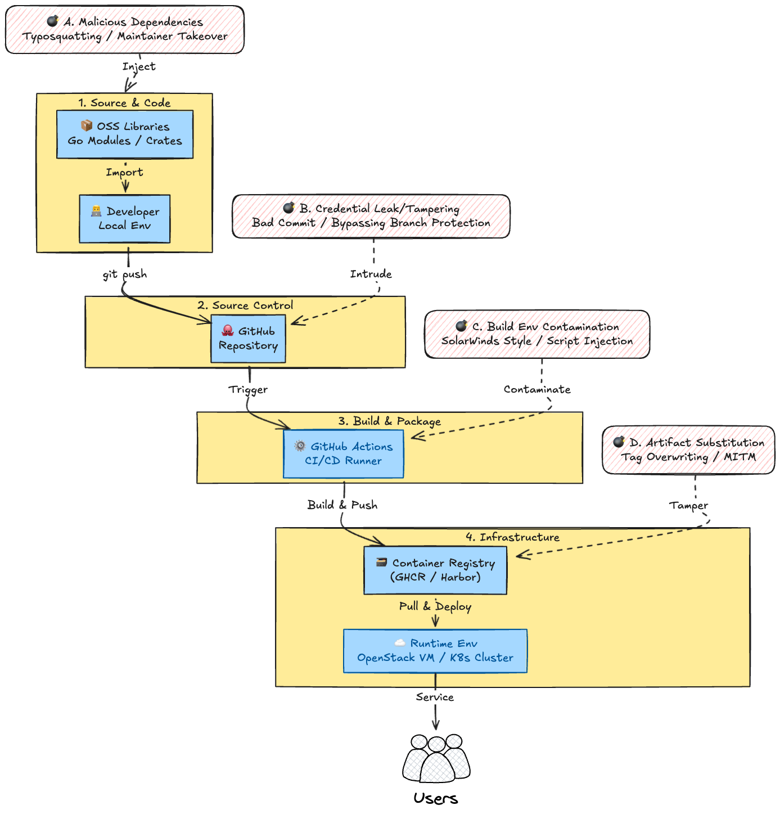
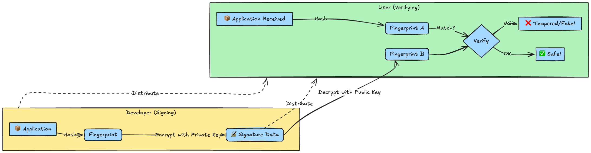
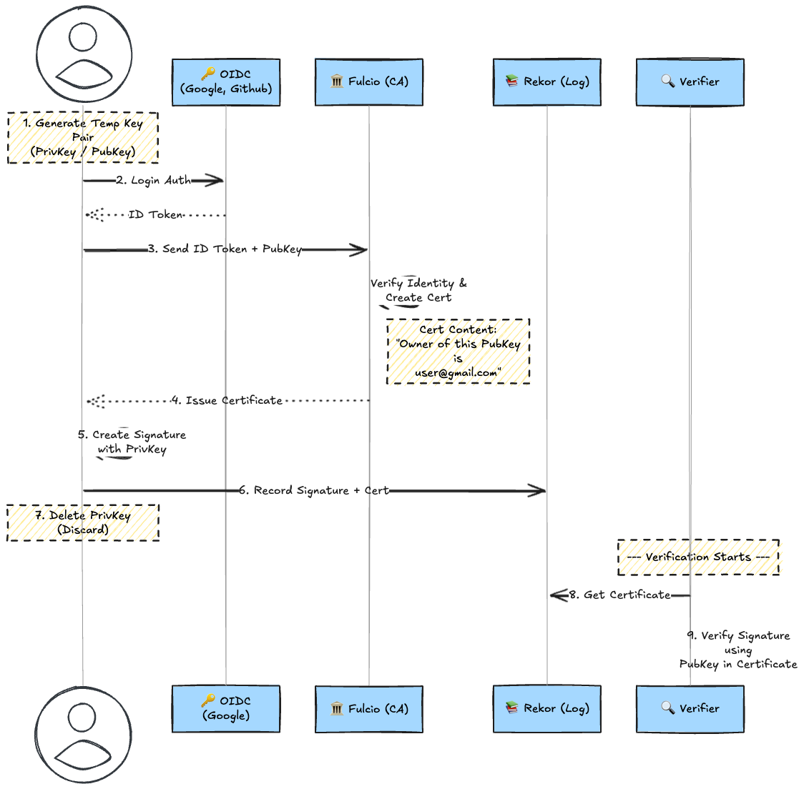
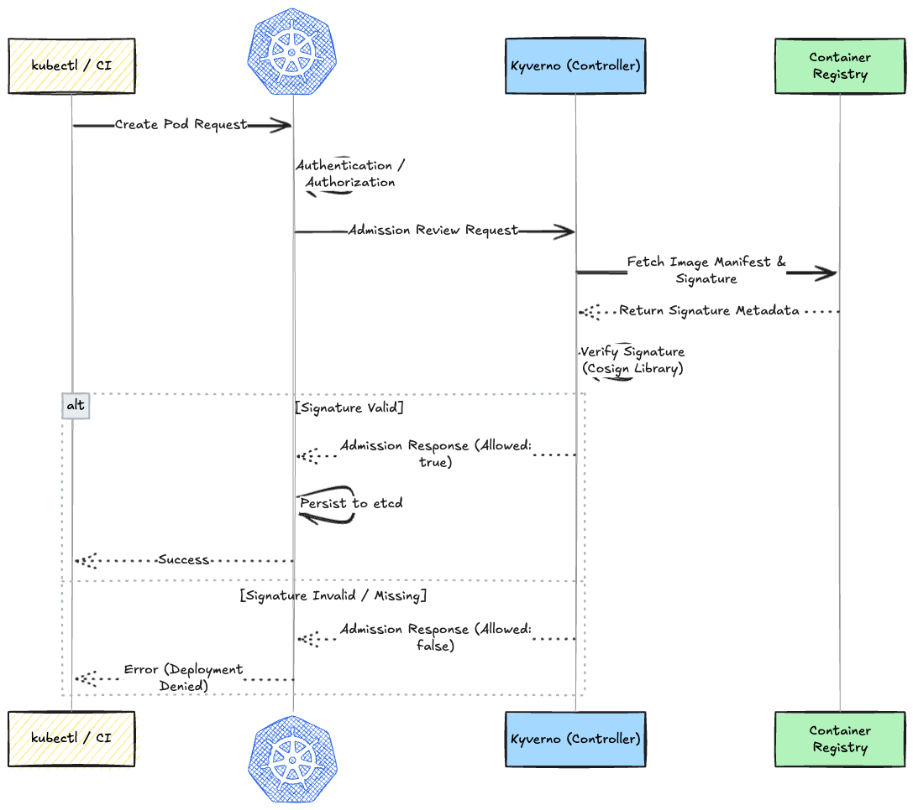

# Introduction

In modern software development, the "code we write ourselves" is only a small fraction of the entire application. Every day, we combine numerous OSS libraries and container images—our "components"—to build systems.

But what if malicious code is included in those "components"? Or what if someone swaps the artifact between the build and deployment stages?

These **Software Supply Chain Attacks** are no longer a distant problem for someone else. As proven by the Log4j and XZ Utils incidents, we live in an era where the trusted supply chain itself can become a threat.

In this article, we will learn about two critical technologies to counter these threats—**SBOM (Software Bill of Materials)** and **Code Signing**—by actually getting our hands dirty.

## 1. What is Supply Chain Security

The software supply chain refers to the entire series of processes: implementing code using libraries and frameworks in a programming language, managing it on GitHub, building it with GitHub Actions, and deploying it to cloud environments like OpenStack VMs/PMs or Kubernetes until it reaches the end user.

The essence of a supply chain attack is "someone secretly mixing in malware or other malicious elements somewhere in the process from development to deployment."



When trying to develop an application today, using OSS libraries, frameworks, and third-party components is unavoidable. It can be said that we are no longer 'writing code' but rather 'assembling parts.'

In the past, we were afraid of simple vulnerabilities like Log4j (`CVE-2021-44228`, `CVE-2021-45046`). But now, in 2026, cases where **"the source of the components itself holds malice"** like the XZ Utils (`CVE-2024-3094`) incident, or **"the trusted supply route suddenly betrays us"** like Polyfill.io, are occurring.

To protect ourselves from these attacks, we need **SBOM** and **Code Signing**.

## 2. What is SBOM?

SBOM stands for "Software Bill of Materials." It is a list of the components that make up the software (OSS libraries, third-party components, etc.), their dependencies, and license information.

### Experiments

#### 1. Installing Syft

First, install `syft`, a CLI tool developed by Anchore.

```bash
# Mac (Homebrew)
brew tap anchore/syft
brew install syft
```

```bash
# Verify installation
syft version
# Application:   syft
# Version:       1.40.0
# BuildDate:     2026-01-08T12:16:49Z
# GitCommit:     Homebrew
# GitDescription: [not provided]
# Platform:      darwin/arm64
# GoVersion:     go1.25.5
# Compiler:      gc
# SchemaVersion: 16.1.2
```

#### 2. Basic Scanning

Let's start in the simplest way by scanning a lightweight `alpine` image. Syft can pull information directly from the registry even if you don't have the Docker image locally.

```bash
syft alpine:latest
#  ✔ Parsed image                         sha256:e8f9ca9f1870bc194d961e259fd1340c641bf188e0d02e58b86b86445a4bc128
#  ✔ Cataloged contents                          410dabcd6f1d53f1f4e5c1ce9553efa298ca6bcdd086dfc976b8f659d58b46d2
#    ├── ✔ Packages                        [16 packages]
#    ├── ✔ File digests                    [78 files]
#    ├── ✔ Executables                     [17 executables]
#    └── ✔ File metadata                   [78 locations]
# NAME                    VERSION      TYPE
# alpine-baselayout       3.7.1-r8     apk
# alpine-baselayout-data  3.7.1-r8     apk
# alpine-keys             2.6-r0       apk
# alpine-release          3.23.2-r0    apk
# apk-tools               3.0.3-r1     apk
# busybox                 1.37.0-r30   apk
# busybox-binsh           1.37.0-r30   apk
# ca-certificates-bundle  20251003-r0  apk
# libapk                  3.0.3-r1     apk
# libcrypto3              3.5.4-r0     apk
# libssl3                 3.5.4-r0     apk
# musl                    1.2.5-r21    apk
# musl-utils              1.2.5-r21    apk
# scanelf                 1.3.8-r2     apk
# ssl_client              1.37.0-r30   apk
# zlib                    1.3.1-r2     apk
```

Just like that, the OS packages (apk) are listed.

You can see that even a small image like `alpine` consists of dozens of libraries (Ingredients).

#### 3. Output in Standard Formats (SPDX vs CycloneDX)

Instead of the human-readable table format, we will output in standard machine-readable formats.

##### A. SPDX (The Linux Foundation)

A format recognized as an international standard (ISO/IEC 5962).

[spdx.dev](https://spdx.dev/)

```bash
# Output SPDX in JSON format
syft alpine:latest -o spdx-json > sbom-spdx.json
#  ✔ Parsed image                         sha256:e8f9ca9f1870bc194d961e259fd1340c641bf188e0d02e58b86b86445a4bc128
#  ✔ Cataloged contents                          410dabcd6f1d53f1f4e5c1ce9553efa298ca6bcdd086dfc976b8f659d58b46d2
#    ├── ✔ Packages                        [16 packages]
#    ├── ✔ File metadata                   [78 locations]
#    ├── ✔ Executables                     [17 executables]
#    └── ✔ File digests                    [78 files]
```

##### B. CycloneDX (OWASP)

Led by OWASP, known for web security, this format has high compatibility with vulnerability management tools.

[CycloneDX](https://cyclonedx.org/)

```bash
# Output CycloneDX in JSON format
syft alpine:latest -o cyclonedx-json > sbom-cyclonedx.json
#  ✔ Parsed image                         sha256:e8f9ca9f1870bc194d961e259fd1340c641bf188e0d02e58b86b86445a4bc128
#  ✔ Cataloged contents                          410dabcd6f1d53f1f4e5c1ce9553efa298ca6bcdd086dfc976b8f659d58b46d2
#    ├── ✔ Packages                        [16 packages]
#    ├── ✔ Executables                     [17 executables]
#    ├── ✔ File metadata                   [78 locations]
#    └── ✔ File digests                    [78 files]
```

#### 4. Inspecting the Contents

The output JSON is huge, but let's check the important "Ingredients".

1. **Metadata (Component Name & Version):**

    Basic information on "what is inside."

    ```bash
    # SPDX
    cat sbom-spdx.json | jq '.packages[] | {name: .name, version: .versionInfo}' | head -n 5
    ## {
    ## "name": "alpine-baselayout",
    ## "version": "3.7.1-r8"
    ## }
    # CyclonDX
    ## Extract component name and version
    cat sbom-cyclonedx.json | jq '.components[] | {name: .name, version: .version, type: .type}' | head -n 5
    ## {
    ##   "name": "alpine-baselayout",
    ##   "version": "3.7.1-r8",
    ##   "type": "library"
    ## }
    ```

2. **PURL (Package URL):**

    This is a "globally unique ID for the package." This becomes the key when checking against vulnerability DBs.

    ```bash
    # Extract only PURL (Package URL)
    # SPDX
    cat sbom-spdx.json | jq '.packages[].externalRefs[]? | select(.referenceType == "purl") | .referenceLocator' | head -n 5
    ## "pkg:apk/alpine/alpine-baselayout@3.7.1-r8?arch=aarch64&distro=alpine-3.23.2"
    ## "pkg:apk/alpine/alpine-baselayout-data@3.7.1-r8?arch=aarch64&distro=alpine-3.23.2&upstream=alpine-baselayout"
    ## "pkg:apk/alpine/alpine-keys@2.6-r0?arch=aarch64&distro=alpine-3.23.2"
    ## "pkg:apk/alpine/alpine-release@3.23.2-r0?arch=aarch64&distro=alpine-3.23.2&upstream=alpine-base"
    ## "pkg:apk/alpine/apk-tools@3.0.3-r1?arch=aarch64&distro=alpine-3.23.2"
    # CycloneDX
    cat sbom-cyclonedx.json | jq '.components[].purl' | head -n 5
    # "pkg:apk/alpine/alpine-baselayout@3.7.1-r8?arch=aarch64&distro=alpine-3.23.2"
    # "pkg:apk/alpine/alpine-baselayout-data@3.7.1-r8?arch=aarch64&distro=alpine-3.23.2&upstream=alpine-baselayout"
    # "pkg:apk/alpine/alpine-keys@2.6-r0?arch=aarch64&distro=alpine-3.23.2"
    # "pkg:apk/alpine/alpine-release@3.23.2-r0?arch=aarch64&distro=alpine-3.23.2&upstream=alpine-base"
    # "pkg:apk/alpine/apk-tools@3.0.3-r1?arch=aarch64&distro=alpine-3.23.2"
    ```

    We found that by managing SBOMs, we can use information like "Component Name," "Version," and "PURL (Unique ID)" to instantly know via `grep` if we are affected when news hits tomorrow saying "There is a vulnerability in bash version 5.1."

## 3. What is Code Signing?

Code Signing is a security technology that applies a digital signature to software or files, guaranteeing the authenticity (it is genuine) of the creator and integrity (it has not been tampered with).



Traditional methods like signing/verifying with GPG keys are like carrying around a physical seal; if you lose it or it gets stolen, it's over. Management is difficult.

Code Signing with tools like Sigstore issues a **valid private key for only a brief moment** when you log in with Google or GitHub.

Once the signing is done, the key is discarded. In other words, you do not manage private keys.

"Who signed it and when" is recorded in an immutable ledger (Rekor).

### Experiments

#### 1. Installing the Tool (Cosign)

Install `cosign`, a tool from the Sigstore project.

```bash
# Mac (Homebrew)
brew install cosign
```

Verify:

```bash
cosign version
#   ______   ______        _______. __    _______ .__   __.
#  /      | /  __  \      /       ||  |  /  _____||  \ |  |
# |  ,----'|  |  |  |    |   (----`|  | |  |  __  |   \|  |
# |  |     |  |  |  |     \   \    |  | |  | |_ | |  . `  |
# |  `----.|  `--'  | .----)   |   |  | |  |__| | |  |\   |
#  \______| \______/  |_______/    |__|  \______| |__| \__|
# cosign: A tool for Container Signing, Verification and Storage in an OCI registry.
#
# GitVersion:    v3.0.4
# GitCommit:     6832fba4928c1ad69400235bbc41212de5006176
# GitTreeState:  "clean"
# BuildDate:     2026-01-09T21:17:16Z
# GoVersion:     go1.25.5
# Compiler:      gc
# Platform:      darwin/arm64
```

#### 2. Preparation for the Experiment

Since setting up Docker Hub accounts is tedious, we will use `ttl.sh`, a registry that allows **"anyone to push, and images disappear after a set time."** This is perfect for learning.

> [!TIP]
> ttl.sh is a fast and free public container registry service that temporarily stores container images like Docker images. By including an expiration time (seconds or hours) in the tag name, images are automatically deleted, making it ideal for CI/CD tests and temporary distribution.

First, tag a local image (like alpine) with a unique tag.
We generate a `UUID` to ensure the random ID doesn't clash with others.

```bash
# Generate a random ID
export UUID=$(uuidgen | tr '[:upper:]' '[:lower:]')
export IMAGE_NAME="ttl.sh/${UUID}/my-signed-image:1h"

# Tag an existing image (alpine)
docker pull alpine:latest
docker tag alpine:latest $IMAGE_NAME

# Push to registry (No login needed!)
docker push $IMAGE_NAME
```

#### 3. Signing

This is the highlight. We don't create a private key. We sign using a Google or GitHub account.

**Command:**

```bash
cosign sign $IMAGE_NAME
```

**What happens when you run this:**

1. A browser opens, asking you to log in to an OIDC provider (Google, GitHub, Microsoft).
2. If you log in and see the success screen, it worked.
1.

You might be concerned about logs like this appearing:

> `WARNING: Image reference ... uses a tag, not a digest ...`

Ideally, the best practice is to specify an immutable hash value like `cosign sign ttl.sh/...@sha256:abcde...`.

> `Note that if your submission includes personal data ... it will be part of an immutable record.`
> `This information will be used for signing ... and cannot be removed later`

Sigstore (Cosign) records "when and who signed" in a blockchain-like immutable ledger (Rekor).

This ledger is **open to the whole world (Public Transparency Log)**.

In other words, **"Your email address (e.g., Gmail) will remain in the internet logs forever as the person who signed this image."**

This means that while key management is unnecessary and easy, the trade-off is that your email address is left in the public log as your "Identity."

#### 4. Verifying the Signature

You might wonder, "How do we verify if there's no key?"
When verifying, you specify **"Who signed it (email/ID)"** and **"Which provider (Issuer) was used"**.

```bash
# (Replace `<your-email>` with the email you used to log in)
cosign verify \
  --certificate-identity="<your-email>" \
  --certificate-oidc-issuer="https://github.com/login/oauth" \
  $IMAGE_NAME
# Verification for ttl.sh/09dc8b35-cabd-4bd8-885f-.../my-signed-image:1h --
# The following checks were performed on each of these signatures:
#   - The cosign claims were validated
#   - Existence of the claims in the transparency log was verified offline
#   - The code-signing certificate was verified using trusted certificate authority certificates
# [{"critical":{"identity":{"docker-reference":"ttl.sh/09dc8b35-cabd-4bd8-885f-.../my-signed-image:1h"},"image":{"docker-manifest-digest":"sha256:410dabcd6f1d53f1f4e5c1ce9553efa298ca6bcdd086dfc976b8f659d58b46d2"},"type":"https://sigstore.dev/cosign/sign/v1"},"optional":{}}]
```

The signature details are displayed in JSON format. This completes the proof that **"This image was undoubtedly signed by me via GitHub authentication."**

#### 5. Where is the Signature Actually Located?

```bash
# The signature itself is also stored in the registry
cosign triangulate $IMAGE_NAME
# ttl.sh/09dc8b35-cabd-4bd8-885f-.../my-signed-image:sha256-410dabcd6f1d53f1f4e5c1ce9553efa298ca6bcdd086dfc976b8f659d58b46d2.sig
```

Cosign does not manage signature data as a separate file but **stores it in the same registry as the target image, as an associated tag (.sig).**
This allows signature management using just the registry, without preparing a special database on the infrastructure side.



Next, let's combine SBOM and Code Signing.

## 4. Connecting Attestation

Code Signing Attestation is a mechanism where software developers combine SBOM and Code Signing to digitally sign apps or drivers, guaranteeing the publisher's authentication and integrity (that it hasn't been tampered with). It uses certificates issued by a Certificate Authority, preventing warnings during installation and allowing users to use software safely.

* **Until now:**
  * Image: "I am signed (Authentic)."
  * SBOM: "I am the ingredient list (sitting somewhere over there)."
  * **Problem:** "Is this ingredient list really for this image? Did someone swap it?"
* **Attestation:**
  * "I (the developer) swear (sign) that the contents of this 'Image' are undoubtedly this 'SBOM'."

This makes the Image and SBOM treated as an **indivisible set**.

### Experiments

We will use the same `$IMAGE_NAME` from the previous chapter.
If time has passed and the `ttl.sh` image has disappeared, please Push it again.

#### Step 1: Regenerate SBOM for Signing

Just to be safe, generate the latest SBOM from the current image.

```bash
# Generate SBOM (CycloneDX format) from image
syft $IMAGE_NAME -o cyclonedx-json > sbom.json

# Check if content exists
ls -lh sbom.json
```

#### Step 2: Execute Attestation

Here we use the `cosign attest` command.
It's a command to "Attach this file (SBOM) as a predicate to this image and sign it."

```bash
cosign attest --yes \
  --predicate sbom.json \
  --type cyclonedx \
  $IMAGE_NAME
```

*(Browser authentication runs again)*

#### Step 3: Verify Attestation

We verify not just "if it is signed," but if we can extract the **"Correct, signed SBOM."**
We use `verify-attestation` instead of simple `verify`.

```bash
# Verify (Replace email with yours)
cosign verify-attestation \
  --type cyclonedx \
  --certificate-identity="<your-email>" \
  --certificate-oidc-issuer=https://github.com/login/oauth \
  $IMAGE_NAME
# Verification for ttl.sh/09dc8b35-cabd-4bd8-885f-.../my-signed-image:1h --
# The following checks were performed on each of these signatures:
#   - The cosign claims were validated
#   - Existence of the claims in the transparency log was verified offline
#   - The code-signing certificate was verified using trusted certificate authority certificates
# {"payload":"eyJfdHlwZSI6Imh0dHBzOi8...
```

A huge JSON flows on the screen. This is the **"SBOM protected by signature."**

You can see that `payloadType: application/vnd.cyclonedx+json` and actual package information are included in the output.

Usually, SBOM files tend to be scattered across Git repositories or file servers. However, with Attestation, the SBOM is **stored in the container registry as a set with the image.**

When a K8s cluster pulls an image, the "correct SBOM" automatically comes with it.

It also seems possible to "attach scan results."

This enables advanced security gates (foreshadowing Chapter 5) such as **"Allow deployment only for images that have been scanned for vulnerabilities and have an attestation certifying no High vulnerabilities."**

## 5. Use Case: Policy Enforcement with Kubernetes

### Technical Concept: Admission Controller

Kubernetes has a feature called **Admission Controller** that hooks requests to verify or modify them after authentication/authorization of the API request is complete, but immediately before the object is persisted to etcd.

For signature verification, we use the **Validating Admission Webhook** within this.
By registering a policy engine like `Kyverno` or `OPA Gatekeeper` as a Webhook, it intercepts Pod creation requests, verifies the signature on the external registry, and decides whether to allow or deny the request.

#### Architecture Diagram



### Enforcement Behavior

The behavior when this policy is applied is as follows:

1. **Attempt to deploy an unsigned image**
   * The API Server receives `Allowed: false` from `Kyverno` / `OPA Gatekeeper` and denies the request.
   * The error message `no matching signatures found` is returned, and the Pod is not created.
2. **Attempt to deploy a legitimately signed image**
   * `Kyverno` / `OPA Gatekeeper` verifies the signature on the registry and confirms it matches the defined `subject` and `issuer`.
   * `Allowed: true` is returned to the API Server, and the Pod is created successfully.

### 6. Conclusion

We have taken a deep dive into SBOM and Code Signing, the core technologies of supply chain security.

Finally, let's review why these are necessary.

1. The danger of "Unknown Contents"
   1. Having no SBOM is like eating food without knowing what's in it.
   2. When a new vulnerability (Next Log4j) is discovered in the future, having an SBOM allows us to instantly identify "where the impact is" and respond quickly.
2. The danger of "Unknown Creator"
   1. Having no signature is like sending cash in an envelope that anyone can open.
   2. By using Code Signing, especially transparent signing technologies like Sigstore, we gain a strong guarantee that "This was undoubtedly made by a trusted developer and has not been tampered with."

**What's the next**

1. **Cosign (Sigstore)** introduced here is a very deep project.
   1. Although we didn't dig deep this time, understanding the internal architecture of the Certificate Authority `Fulcio` and the Transparency Log `Rekor` will allow building a more robust security foundation.

Not just "built and done," but "taking responsibility until it reaches the end user."
That is the mindset of supply chain security required of engineers from now on.
