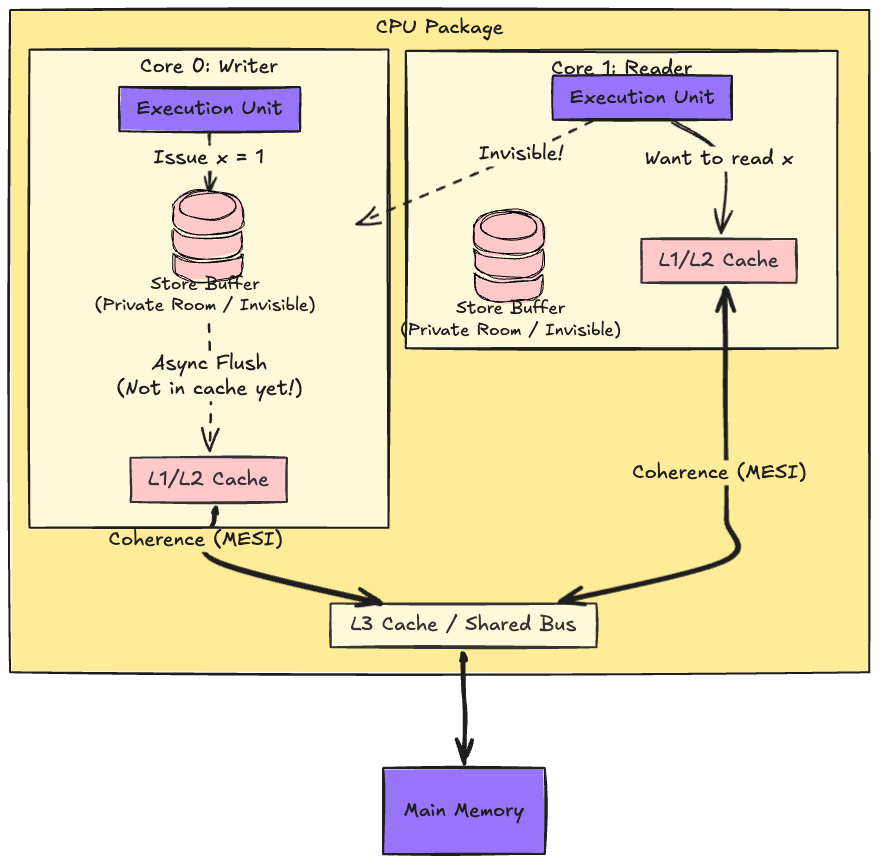
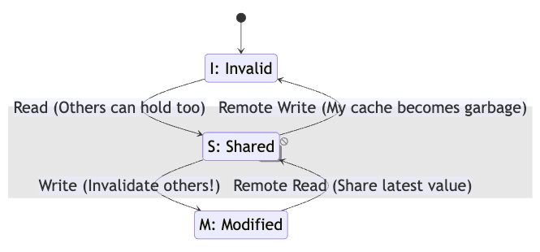
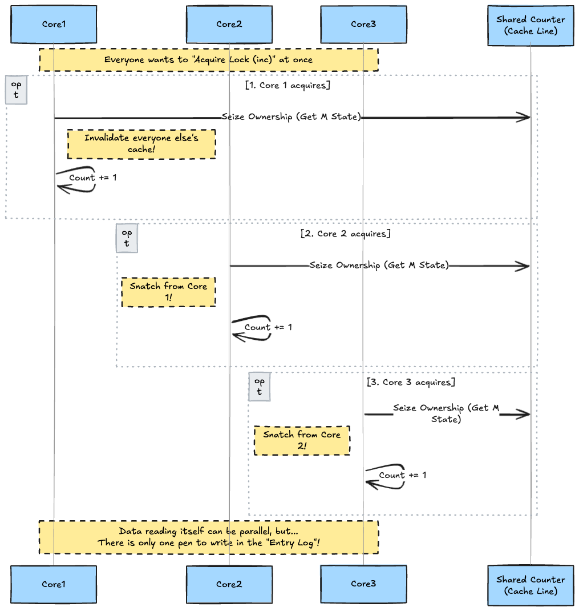
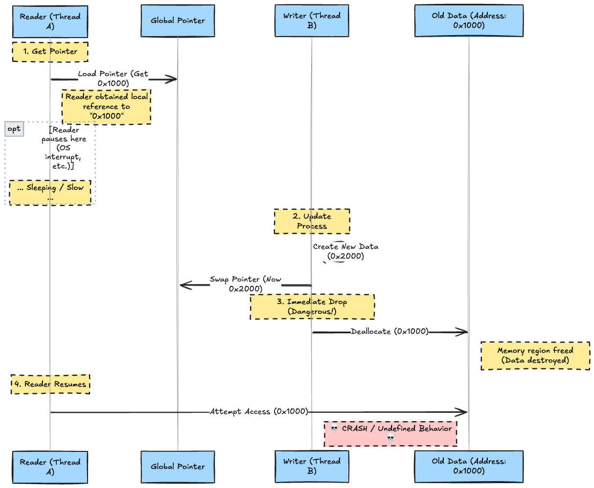
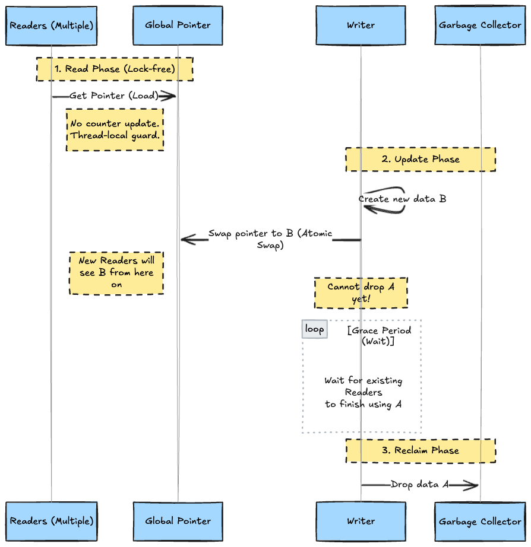

# Introduction

In 2026, it has become the norm for server-side CPUs to exceed 128 cores, and ARM architectures like Apple Silicon dominate the desktop. In this environment, the act of "sharing a variable" in multi-threaded programming compels a surprisingly complex coordination at the hardware level, far beyond what the source code suggests.

This article starts with the physical behavior of hardware, such as CPU caches and store buffers, and proceeds to explain step-by-step why `Mutex` is necessary, why `RwLock` is sometimes insufficient, and why `ArcSwap` (RCU-like synchronization) is frequently chosen in modern Rust applications.

By reading this, the true meaning of `Send` / `Sync` and the rationale behind library selection for performance should become clear.

---

## 1. Hardware Lies: Memory Is Not Written Instantly

"A value written by Thread A is not visible to Thread B." The main culprit of this counter-intuitive phenomenon is not just compiler optimization. It lies in the physical structure of the CPU itself.

For modern CPUs (3GHz+), accessing main memory (DRAM) feels "eternally" slow. To bridge this speed gap, CPUs possess multiple layers of **L1, L2, L3** "caches" (high-speed temporary storage).

However, the problem occurs **even before** reaching the cache.

### Store Buffer: The "Secret Room" Before the Cache

When a CPU executes the instruction `x = 1`, that data is not immediately written even to the L1 cache. It is temporarily hoarded in a tiny buffer specific to each CPU core called the **Store Buffer**.

This is the scene of the "disappearance" in concurrency. Look at the diagram below.



The "physical reality" shown in this diagram is as follows:

1. **L1/L2 Cache (Sharable Area):**
The cache area at the bottom of the diagram is protected by a mechanism called **"Cache Coherence."** If data is here, Core 1 can pull the latest data from Core 0's L1 cache (via L3).
1. **Store Buffer (Complete Secret Room):**
However, `x=1` is still in the red **Store Buffer**. This is **Core 0's completely private property**, and there is physically no way for Core 1 to peek inside.

### The First Step to Visibility: Flushing

* **Core 0 (Self)** can see the contents of its own store buffer (Store-to-Load Forwarding). Therefore, in an immediate subsequent read, `x` appears to be `1`.
* **Core 1 (Other)** goes to read `x`, but since Core 0's store buffer is invisible, it reads the **old value (e.g., 0)** residing in the L1/L2 cache or main memory.

This is the true nature of the phenomenon where "the code says I wrote it, but the other side can't see it." The instruction that forcibly flushes data from the store buffer to the cache (making it visible to everyone) is the **Memory Barrier (Fence)**.

However, even if the memory barrier causes data to reach the L1 cache, **the battle is only half over.** "Data arriving at a visible place" and "everyone seeing the same value" are two different problems.

---

## 2. Cache Coherence and the MESI Protocol

The moment data is flushed from the store buffer to the L1 cache, a new problem arises.

Even if Core 0's L1 cache is updated to `x=1`, Core 1's L1 cache might still hold the previously read `x=0`. If left unchecked, this leads to a "split-brain" state where the variable's value differs between cores.

The mechanism that prevents this and reconciles inconsistencies across all core caches is **Cache Coherence (MESI Protocol)**.

### MESI State Transitions

The CPU tags and manages the state of data for each cache line (typically 64 bytes).

* **M (Modified):** Modified. Only this core holds the latest value `x=1`. No other core is allowed to have it.
* **E (Exclusive):** Exclusive. Only this core has it, but it hasn't been changed (clean).
* **S (Shared):** Shared. Other cores might also have `x=0`. Read-only.
* **I (Invalid):** Invalid. Does not hold the data, or the held data is stale.



### The Hidden Cost of "Writing"

The most important point is **"To write (S→M), you must Invalidate the caches of other cores."**

When Core 0 modifies `x`, it sends a signal via the bus saying, "Core 1, the `x` you are holding is now garbage!" (Invalidate Request). Core 1 receives this, marks its cache as `Invalid`, and only then can Core 0 complete the write.

This communication (Core 0 → Core 1) is the true identity of the "invisible latency" in concurrency.

---

## 3. Memory Ordering and Atomics

To prevent hardware (store buffers and caches) from arbitrarily reordering operations, the programmer must instruct **Memory Barriers (Fences)**. This corresponds to the `Ordering` argument in Rust's atomic operations.

### The 3 Major Orderings

1. **Relaxed (`Ordering::Relaxed`)**
   * **Guarantee:** Only the integrity of the variable itself (no data races).
   * **Order:** Guarantees absolutely no ordering relationship with preceding or succeeding instructions.
   * **Usage:** Simple statistical counters, etc., where causality is not required.
2. **Release / Acquire (`Ordering::Release` / `Ordering::Acquire`)**
   * **Release (Writer):** Operations before this cannot move after it. A signal that "preparation is complete up to here." Similar effect to flushing the store buffer.
   * **Acquire (Reader):** Operations after this cannot move before it. A signal to "use the latest data from here on."
   * **Usage:** Mutex implementation, data hand-offs.
3. **SeqCst (`Ordering::SeqCst`)**
   * **Guarantee:** Guarantees that all changes appear in a "single total order" seen from all threads.
   * **Cost:** The heaviest. Issues expensive barrier instructions even on x86, stalling the pipeline.

### The Truth About Locks (Mutex)

`lock()` and `unlock()` in a Mutex are not magic instructions, but applications of the atomic operations described above.

```rust
// Conceptual Implementation
fn unlock() {
    // 1. Finished writing data
    data = ...; 
    
    // 2. Release Store.
    // Prevents "writing data (1)" from being reordered after "state=0 (2)".
    // This guarantees that when another thread acquires the lock, the data write is definitely finished.
    state.store(0, Ordering::Release);
}

fn lock() {
    // 1. Acquire Load (actually CAS, etc.).
    // Prevents "reading data (2)" after acquiring lock from coming before acquiring lock (1).
    while state.compare_exchange(0, 1, Ordering::Acquire, ...).is_err() { ... }
    
    // 2. Safe to read data here
    let x = data;
}

```

---

## 4. The Cost of Locks: Mutex and RwLock

### The Limit of Mutex

Mutex is simple, but it hinders parallelism.

* **Serialization:** No matter how many CPU cores you have, only one can execute the critical section.
* **Context Switch:** If the lock cannot be acquired, control is returned to the OS scheduler (sleep), incurring the cost of thread switching (several microseconds).

### The RwLock Trap: The "Read" implies "Write" Paradox

"If there are many reads, use `RwLock` (Read-Write Lock)" is a standard rule of thumb, but it is not a silver bullet.

`RwLock` does indeed allow multiple threads to "read" data simultaneously. However, to achieve this, it must internally **update (write) a shared counter variable representing "how many people are reading now."**

Here lies a physical contradiction.

1. **Logical Operation:** "I'm only reading the data, so I shouldn't interfere with other threads."
2. **Physical Operation:** "To increment the count (`fetch_add`), I must monopolize the write permission for this variable."

To perform an atomic increment (`fetch_add`), the CPU core must put the target cache line into the **Modified** state. In other words, it must invalidate other cores' caches and forcibly snatch ownership of the cache line to itself.

What happens when this occurs simultaneously across many threads?



This phenomenon is called **Cache line bouncing**.

The cache line "ball" flies between cores at high speed like ping pong. This communication cost piles up, leading to a situation where **"processing doesn't progress due to physical communication waiting, even though not waiting for a lock (sleep)."**

This is the physical reason why `RwLock` does not scale in modern (2026) environments where CPU core counts exceed 128.

---

## 5. Lock-Free and the "Trash Disposal" Problem (Reclamation)

The "Lock-Free" approach, which updates data using atomic pointer operations without locks (sleep), is a powerful weapon for speeding up writes.

However, Lock-Free has a massive inherent difficulty: **"Memory Reclamation."**

### The "Deleted While Still Reading" Problem

The basis of Lock-Free is "create new data and swap the pointer."
The problem is **when to discard the "old data (garbage)" after the swap.**

If the writer side immediately `drop`s the data thinking "I swapped the pointer, so the old one isn't needed," a **Use-After-Free** error occurs.

Look at the "Timing of Death" below.



### Why Can't We Prevent This?

When using Mutex, no one can change or delete data while the lock is held, so this problem does not occur.

However, in the Lock-Free world:

1. **Reader:** There is a **physical gap** between "acquiring the pointer" (Load) and "reading its contents" (Access).
2. **Writer:** Can interrupt in that gap and delete the data. There is no way to know that the Reader is still holding that pointer.

In GC (Garbage Collection) languages like Java or Go, the GC monitors that "someone still holds a reference, so don't delete it," hiding this problem from the programmer.

However, when implementing Lock-Free in a language with manual memory management (ownership model) like Rust, you must solve the difficult problem of **"How to confirm that everyone has finished reading without a lock?"** by yourself.

---

## 6. RCU and ArcSwap: Making Reads Extremely Light

The mechanism that solves this "must not delete while reading threads exist" problem and prevents cache contention like `RwLock` is the **RCU (Read-Copy-Update)** concept, and its representative implementation in Rust is `ArcSwap`.

### Mechanism of ArcSwap (RCU-like)

The `arc-swap` crate works as follows:

1. **Read (Reader):**
   * Does **not** increment a shared counter.
   * Instead, it places a mark (Guard) in a thread-local area (per CPU core area) saying "I'm reading this now."
   * **It is blazing fast because no communication (cache line sharing) with other cores occurs.**
2. **Write (Writer):**
   * Create new data (Copy).
   * Atomically swap the pointer (Update).
   * **Do not discard old data immediately.** Check the "Reading" marks of all threads and wait until it is confirmed that no one is reading the old data (or wait for the reference count to become 0).



### Comparison: RwLock vs ArcSwap

|     Feature     |                       RwLock                       |                     ArcSwap (RCU)                     |
| :-------------: | :------------------------------------------------: | :---------------------------------------------------: |
|  **Read Cost**  | Low-Medium (Atomic op required = Cache contention) |            **Minimal** (No/Few atomic ops)            |
| **Scalability** |  Degrades with more cores due to cache contention  |   **Linear Scale** (No interference between cores)    |
| **Write Cost**  |                Low (Just take lock)                |      High (Wait for all Readers to finish, etc.)      |
|  **Use Case**   |       General cases with mixed reads/writes        | Cases where **read frequency is overwhelmingly high** |

Configuration (Config), Certificates, and Routing Tables have characteristics of "updating once every few minutes/hours, reading every request (thousands per second)." This is the sole territory of `ArcSwap`.

---

## 7. Rust Practice Patterns (2026 Edition)

We understand the theory. So, how should we use them in actual application code?
In 2026, it is standard not to rely solely on `Mutex<T>`, but to select the "right tool for the right job" based on access patterns.

Here are 5 major use cases and their "standard" implementation patterns.

### Case 1: Configuration Hot Reload (Read-Heavy / Write-Rare)

Configuration data or routing tables that "might update once a minute but are read 10,000 times a second." Using `RwLock` here results in death by cache contention among reader threads.
`arc-swap` adopting the **RCU (Read-Copy-Update)** pattern is the optimal solution.

```rust
use arc_swap::ArcSwap;
use std::sync::Arc;

// Application-wide configuration
#[derive(Debug, Default)]
pub struct AppConfig {
    pub feature_flags: HashMap<String, bool>,
    pub db_timeout_ms: u64,
}

pub struct ConfigService {
    // Use ArcSwap instead of RwLock<AppConfig>
    // This allows Readers to read without locks or atomic writes
    current_config: ArcSwap<AppConfig>,
}

impl ConfigService {
    // Read (Lock-Free / Wait-Free)
    pub fn get_config(&self) -> Arc<AppConfig> {
        // load_full() increments the ref count internally and returns an Arc
        // * If read frequency is extremely high, using guard() is also an option
        self.current_config.load_full()
    }

    // Write (Updates can be slow)
    pub fn reload_config(&self, new_config: AppConfig) {
        // Create new config and atomically swap
        // Old config is automatically Dropped when references from all threads are gone
        self.current_config.store(Arc::new(new_config));
    }
}

```

### Case 2: Shared Hash Map (High Concurrency Write)

Cache or session management where "many threads read and write to a Dictionary (Map) simultaneously."
A huge `RwLock<HashMap>` is NG because of the queue formed by write lock waiting.
Use `DashMap` which adopts **Sharding (Partitioning)**, or the high-performance cache `moka`.

```rust
use dashmap::DashMap;

// User session management
// DashMap is internally divided into multiple "Shards (small HashMaps)"
// The shard to access is determined by the hash value of the key,
// so lock contention does not occur if accessing different keys
pub struct SessionStore {
    sessions: DashMap<UserId, SessionData>,
}

impl SessionStore {
    pub fn update_activity(&self, user_id: UserId) {
        // Granularity of lock is fine, so it doesn't degrade overall performance
        if let Some(mut session) = self.sessions.get_mut(&user_id) {
            session.last_active = Instant::now();
        }
    }
}

```

### Case 3: Simple Metrics Counter (Metrics)

If you are just counting "number of requests" or "number of errors," locks are unnecessary.
Use **Atomic Integers** and loosen the ordering constraints to achieve maximum performance.

```rust
use std::sync::atomic::{AtomicU64, Ordering};

pub struct Metrics {
    request_count: AtomicU64,
}

impl Metrics {
    pub fn increment_request(&self) {
        // Relaxed: Does not guarantee ordering with other memory operations (Lightest)
        // Since only the accuracy of the counter matters, the order of surrounding processing is irrelevant
        self.request_count.fetch_add(1, Ordering::Relaxed);
    }

    pub fn snapshot(&self) -> u64 {
        self.request_count.load(Ordering::Relaxed)
    }
}

```

### Case 4: State Integrity Protection (Fine-grained Mutex)

Cases where multiple variables need to be updated while strictly maintaining consistency, like "bank balance transfer."
This is strictly the turn for `Mutex`. However, the iron rule is to **"minimize the lock holding duration."**

```rust
use std::sync::Mutex;

pub struct BankAccount {
    // Wrap only the data that needs protection with Mutex, not the whole struct
    inner: Mutex<AccountData>,
}

struct AccountData {
    balance: i64,
    history: Vec<Transaction>,
}

impl BankAccount {
    pub fn deposit(&self, amount: i64) {
        // Scope of the lock (critical section) is only here
        let mut data = self.inner.lock().unwrap();
        data.balance += amount;
        data.history.push(Transaction::new(amount));
        // Unlocked immediately upon exiting scope
    }
}

```

### Case 5: Async Event Notification (Signaling)

When you want to broadcast the fact that "something happened," rather than sharing data.
Instead of setting a flag in shared memory (polling), use **Channels**.

```rust
use tokio::sync::broadcast;

// Notification for application shutdown or config change
pub async fn run_server() {
    // broadcast channel: 1 Sender : Many Receivers
    let (tx, _rx) = broadcast::channel(16);
    let tx_clone = tx.clone();

    // Start worker task
    tokio::spawn(async move {
        let mut rx = tx_clone.subscribe();
        loop {
            tokio::select! {
                _ = do_heavy_work() => {},
                // Break loop upon receiving
                Ok(_) = rx.recv() => break,
            }
        }
        println!("Worker stopped gracefully.");
    });

    // Notify if something happens
    tokio::signal::ctrl_c().await.unwrap();
    tx.send(()).unwrap(); // Broadcast to all workers
}

```

---

### Summary: Decision Tree for Tool Selection

In Rust concurrency in 2026, if you are unsure, choose based on the following criteria.

| Situation | Recommended Pattern / Crate | Reason |
| --- | --- | --- |
| **Read 99% : Write 1%** | `arc-swap` (RCU) | Zero cache contention during reading. |
| **Frequent Mixed Read/Write (Map)** | `DashMap` (Sharding) | Reduces contention probability by splitting lock regions. |
| **Simple Numeric Increment/Decrement** | `AtomicU64` (Relaxed) | No lock required. Completed at CPU instruction level. |
| **Complex Consistency Required** | `Mutex` (Standard) | Stops reliably. But keep scope minimal. |
| **Event / Termination Notification** | `broadcast` / `watch` | Solve with messages instead of state sharing. |
| **Cache (TTL/Eviction)** | `moka` | Balances concurrency with cache-specific management. |

---

### Conclusion

* **Be Aware of Hardware:** The behavior of cache lines and store buffers is the root of performance and bugs. Be conscious of the "invisible" costs.
* **If Read-Heavy, ArcSwap:** For sharing data that rarely changes, like configuration values or master data, consider `ArcSwap` as the first choice instead of `RwLock`.
* **Mutex is Sufficient for Simple Sharing:** If contention is low, the standard `Mutex` is fast enough. Excessive optimization is unnecessary.
* **Channels for Complex State Management:** If state transitions are complex, it is wise to avoid memory sharing and escape to message passing (Actor model approach).

Correctly understanding the concurrency Toolbox and using the right tool in the right place. That is the key to building robust and fast systems.
