# Introduction

In my previous article, "Supply Chain Security: A Deep Dive into SBOM and Code Signing," we took Cosign's keyless signing for a spin. You run `cosign sign`, your browser pops up, you log in with GitHub, and boom—your container image is signed. No private key management. The moment the signing is done, the key is thrown away into the void.

It was insanely convenient. But honestly? I had absolutely no idea what was happening under the hood.

"If we threw the key away, how the hell can we verify it later?"
"What's the point of a certificate that expires in 10 minutes?"
"What exactly is a 'transparency log' recording anyway?"

And fundamentally, why were they so obsessed with erasing the very concept of a "key"?

Fast forward to 2026, and the software supply chain landscape is a complete bloodbath. Just look at what happened in March and April: attackers stole CI/CD credentials via Trivy GitHub Action tag poisoning, and immediately capitalized on the Claude Code source leak with package squatting. The attack trend has completely shifted from "exploiting code vulnerabilities" to "compromising the build process and CI/CD pipelines to inject malicious payloads." We're no longer asking, "Is this library safe?" We are asking, "Can you cryptographically prove this binary was built from the official repo, through the official CI?" If you can't, nobody is going to trust your artifact.

Traditional code signing with GPG completely fell apart in the face of this reality. Long-lived private keys bled out of CI/CD server environment variables, ex-employees' keys were left rotting, and nobody—literally nobody—took CRLs (Certificate Revocation Lists) seriously because they were too slow.

That's why Sigstore isn't just trying to be another tool. It wants to be the **"Let's Encrypt for Code Signing."** Just as Let's Encrypt eradicated manual certificate management and forced the entire web to HTTPS, Sigstore wants to rip the concept of "key management" out of developers' hands. They are building a world of "Ubiquitous Code Signing," where signing artifacts happens as naturally as breathing.

To bridge my initial confusion with this massive vision, I decided to completely tear down Sigstore's internals. How Fulcio issues certificates, how Rekor uses Merkle Trees to mathematically detect tampering, and how TUF guards the root of trust. As a follow-up to the previous "getting started" guide, today we are exposing the insane Rube Goldberg machine running behind the scenes just so we can throw our keys away.

---

## 1. Prerequisites: What You Need to Know

Before we dive into Sigstore, let's nail down three concepts. Skip this if you already know them.

### 1.1 What is OIDC (OpenID Connect)?

OIDC is a protocol where a third party proves "who you are." When you log in to Google or GitHub, that provider issues an **ID Token**—a signed JSON Web Token (JWT). This JWT contains a cryptographically signed statement from the provider saying, "The owner of this email address successfully authenticated at this exact time."

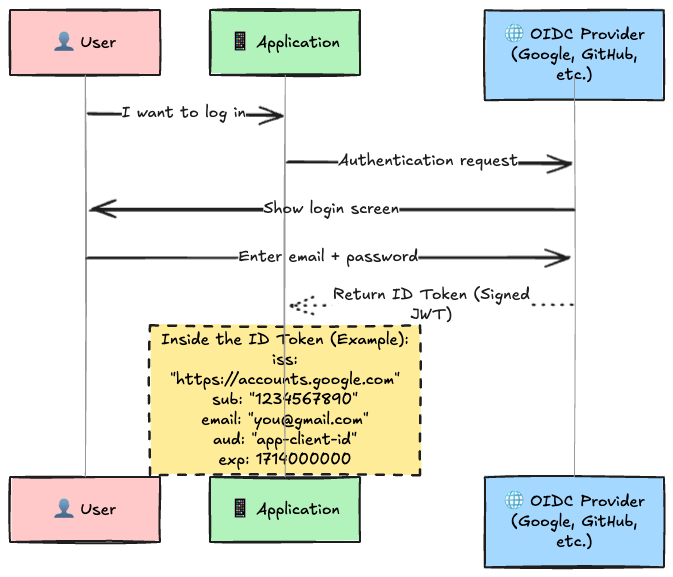

Sigstore hijacks this exact mechanism for "signer identity proof." In other words, **it replaces GPG keys with Google/GitHub account verification.**

### 1.2 The Basics of X.509 Certificates and CAs

The X.509 certificates you know from HTTPS are electronic documents where a Certificate Authority (CA) guarantees that "this public key belongs to this entity."

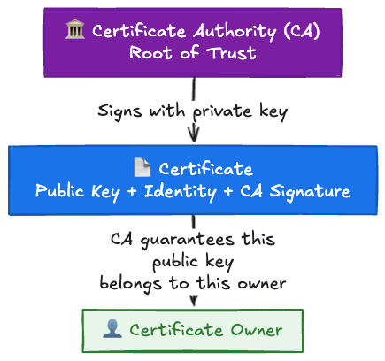

The field inside the certificate that dictates "who this entity is" is called the **SAN (Subject Alternative Name)**. It holds an email address or a URI. For a Let's Encrypt certificate, a domain name like `example.com` sits in the SAN.

Normal certificates live for a year or more. Because of that, you need massive revocation infrastructures like **CRL (Certificate Revocation List)** or **OCSP (Online Certificate Status Protocol)** just in case a private key leaks. But let's be real—they are complex, slow, and browsers frequently ignore them anyway.

### 1.3 What is Certificate Transparency (CT)?

In 2011, a Dutch CA named DigiNotar got hacked, and bogus certificates for `*.google.com` were minted. This nightmare birthed **Certificate Transparency (CT)**.

The idea behind CT is brutally simple: **"Force CAs to log every single certificate they issue into a public, append-only log so anyone can watch them."** If a certificate isn't in the log, the browser outright rejects it. This way, even if a CA gets compromised and mints fake certs, the community will catch it by monitoring the logs.

Sigstore dragged this CT concept into the code-signing world. The certificates Fulcio issues are recorded in a CT Log, and every single signing event is recorded in Rekor (the transparency log).

---

## 2. The Big Picture of Sigstore

With the prerequisites out of the way, let's look at the architecture. Sigstore isn't a single binary; it's a squad of four components working together.

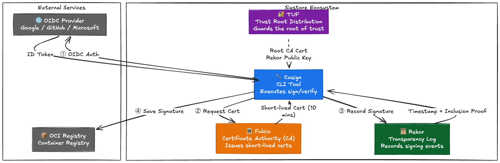

| Component  | In a Nutshell                                                  | Traditional Equivalent                 |
| :--------: | :------------------------------------------------------------- | :------------------------------------- |
| **Cosign** | The CLI doing the actual signing and verifying.                | `gpg sign` / `gpg verify`              |
| **Fulcio** | The CA issuing 10-minute certs based on OIDC identity.         | CAs like DigiCert                      |
| **Rekor**  | The public, append-only ledger recording all signing events.   | Didn't exist                           |
|  **TUF**   | Securely distributes Fulcio's Root CA and Rekor's public keys. | Manually curling/installing root certs |

When we ran `cosign sign` in the last article, it was orchestrating all of this behind the scenes. Let's rip open each component.

---

## 3. Fulcio: The 10-Minute Certificate Authority

Let's start with Fulcio. This is where Sigstore's most radical idea lives.

### Why Limit Certificates to 10 Minutes?

As mentioned earlier, legacy code signing relied on "long-lived private keys." This is a disaster because:

- You have to guard the private key with your life (using HSMs or Vault).
- If it leaks, you have to trigger the agonizing CRL/OCSP revocation process.
- Revocation checks are slow and clients often bypass them.

Fulcio annihilates this problem. **"If we make the certificate's lifespan so short that an attacker has no time to exploit it, we don't need revocation management at all."** Ten minutes is just enough time to verify the OIDC token, issue the cert, perform the signature, and log it to Rekor. After that, the certificate turns into garbage.

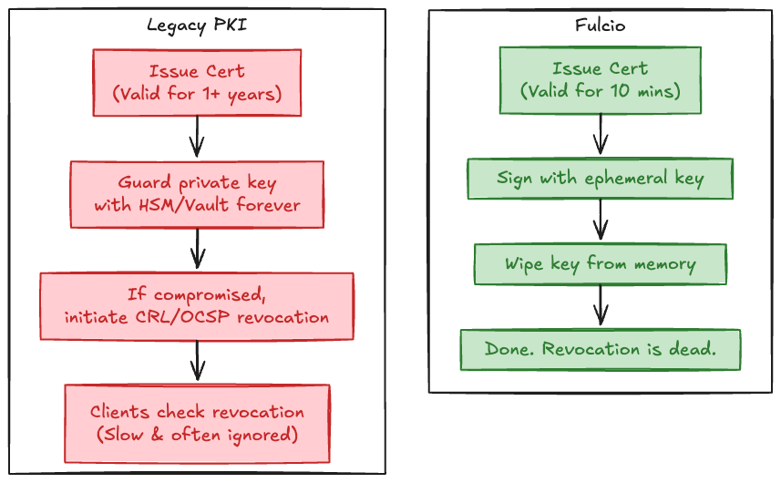

### The Internal Flow of Issuing a Certificate

When a request hits Fulcio's `POST /api/v2/signingCert`, a 7-step process kicks off before you get your cert.

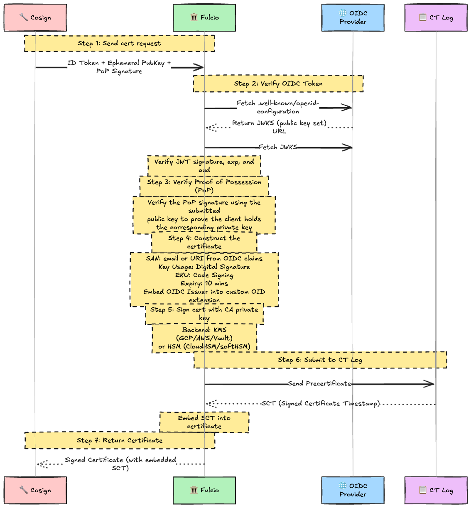

Let's clarify Step 3: **PoP (Proof of Possession)**. Before hitting Fulcio, Cosign generates an ephemeral key pair and signs the OIDC token's `sub` claim with its private key. Fulcio verifies this signature using the provided public key. This proves "the guy asking for this cert actually owns the private key for it," preventing attackers from tying someone else's public key to their own cert.

Step 6 submits it to a CT Log, as discussed in Section 1.3. If Fulcio's CA key is compromised and rogue certs are minted, clients will reject them because they aren't in the CT Log. **Recording to the CT Log is the fail-safe to monitor Fulcio itself.**

### Certificate Chain Structure

Fulcio builds a 3-tier certificate chain, identical to HTTPS.

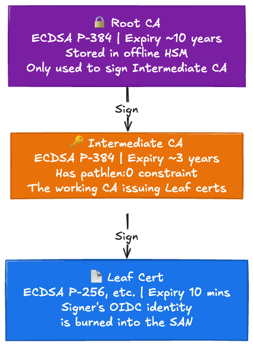

The `pathlen: 0` constraint ensures that the intermediate CA cannot spawn any downstream CAs. The Leaf cert is explicitly restricted to signing code.

### SAN: Engraving the Signer's Identity

Fulcio automatically populates the SAN based on the OIDC Provider.

| OIDC Provider     | SAN Type | Example Value                                                             |
| :---------------- | :------- | :------------------------------------------------------------------------ |
| Google            | Email    | `you@gmail.com`                                                           |
| GitHub (Personal) | Email    | `you@users.noreply.github.com`                                            |
| GitHub Actions    | URI      | `https://github.com/org/repo/.github/workflows/build.yml@refs/heads/main` |
| GitLab CI         | URI      | `https://gitlab.com/org/repo//.gitlab-ci.yml@refs/heads/main`             |
| SPIFFE            | URI      | `spiffe://example.org/workload`                                           |
| Kubernetes SA     | URI      | `https://kubernetes.io/namespaces/default/serviceaccounts/my-sa`          |

The GitHub Actions integration is particularly brilliant. Because the workflow file path and Git ref are burned directly into the SAN, **you get an X.509-level guarantee that "this image was signed by this specific workflow, in this specific repo, from this specific branch."**

### OID Extensions: Hardcoding CI/CD Provenance

Fulcio embeds custom OID extensions (Private Enterprise Number: `1.3.6.1.4.1.57264`) into the cert. In CI/CD environments, the entire build provenance is explicitly recorded.

| OID (`.1.N`) | Field Name               | Content                                       |
| :----------- | :----------------------- | :-------------------------------------------- |
| `.1.8`       | OIDC Issuer              | `https://token.actions.githubusercontent.com` |
| `.1.9`       | Build Signer URI         | Workflow path + ref                           |
| `.1.11`      | Runner Environment       | `github-hosted` or `self-hosted`              |
| `.1.12`      | Source Repository URI    | `https://github.com/org/repo`                 |
| `.1.13`      | Source Repository Digest | Commit SHA                                    |
| `.1.14`      | Source Repository Ref    | `refs/heads/main`                             |
| `.1.20`      | Build Trigger            | `push`, `pull_request`, etc.                  |
| `.1.21`      | Run Invocation URI       | URL to the CI run                             |

By just inspecting the Fulcio cert, you know *exactly* which repo, commit, workflow, trigger, and runner signed the binary. GPG signatures could never even dream of doing this.

---

## 4. Rekor: The Transparency Log Powered by Merkle Trees

If Fulcio is the CA minting certs, Rekor is the public ledger immutably recording every signing event.

### The Problem Rekor Solves

Fulcio and CT Logs leave one gaping hole: We need temporal proof that **"this signature actually happened while the 10-minute certificate was still valid."** The certificate dies in 10 minutes, but if someone forges a signature using that cert 2 hours later, validating the cert chain alone won't tell you if the signature happened within the validity window.

Rekor solves this. When it receives a signing event, it records the exact time as `integratedTime` and signs it with its own private key. This acts as mathematical proof that the signature took place while the cert was alive.

Furthermore, Rekor structures its log as a **Merkle Tree**, allowing anyone to mathematically verify that historical entries haven't been tampered with.

### What is a Merkle Tree?

A Merkle Tree is a binary hash tree designed to efficiently verify data integrity. It's the exact same voodoo powering Bitcoin's blockchain.

The logic is simple: Put data hashes in the leaf nodes, concatenate two hashes and hash them again, and bubble it all the way up to a single Root Hash.

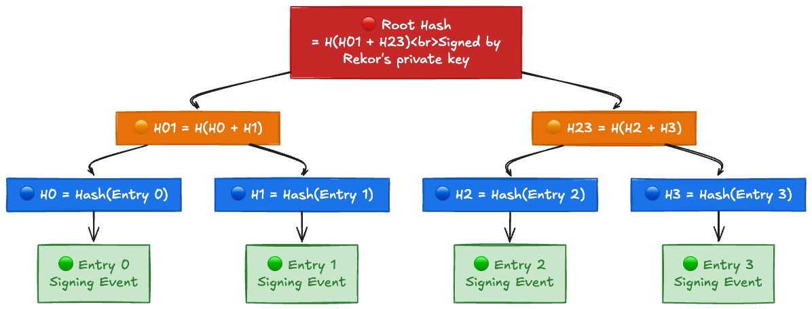

Because the Root Hash is signed and made public, **if you tamper with a single entry anywhere in the tree, the Root Hash completely changes and the signature breaks**. That's how append-only logs guarantee integrity.

### Inclusion Proof: Mathematically Proving an Entry Exists

Suppose we want to prove, "Is Entry 2 really in this log?" Doing it naively requires downloading the entire log, but with a Merkle tree, you only need **O(log n)** hashes.

To construct an Inclusion Proof for Entry 2, you only need the **hashes of the sibling nodes along the path from Entry 2 to the Root**.

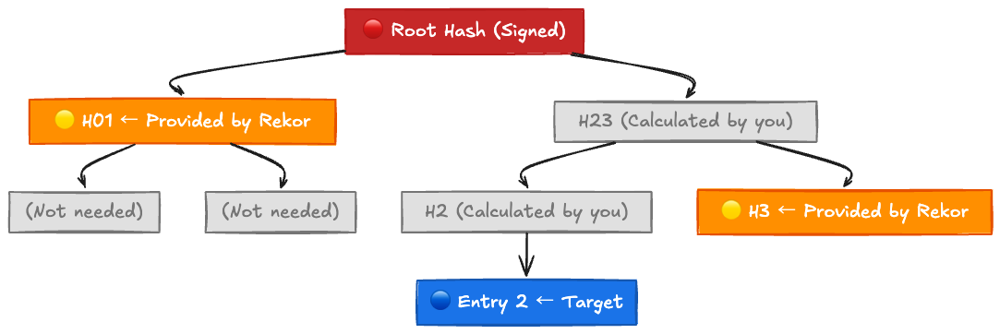

Verification flow:

```
1. H2 = Hash(Entry 2)              ← You calculate this locally
2. H23 = Hash(H2 + H3)             ← H3 comes from Rekor
3. Root' = Hash(H01 + H23)         ← H01 comes from Rekor
4. Check if Root' matches Rekor's signed Root Hash
```

For a tree with 4 entries, you only need **2 hashes** (H3 and H01). Even for a tree with a million entries, you only need about 20 hashes. That's the terrifying efficiency of O(log n).

### The Data Written into Rekor

Each entry (usually a `hashedrekord` type) contains:

```json
{
  "apiVersion": "0.0.1",
  "kind": "hashedrekord",
  "spec": {
    "data": {
      "hash": {
        "algorithm": "sha256",
        "value": "410dabcd6f1d..."
      }
    },
    "signature": {
      "content": "MEUCIQDx...(base64 encoded signature)...",
      "publicKey": {
        "content": "LS0tLS1C...(base64 encoded Fulcio cert)..."
      }
    }
  }
}
```

Rekor also slaps on server-side metadata:

| Field                               | What it is                                               |
| :---------------------------------- | :------------------------------------------------------- |
| `logIndex`                          | The sequential index in the log (0, 1, 2, ...)           |
| `integratedTime`                    | The UNIX timestamp when Rekor added the entry            |
| `logID`                             | The ID of the log shard                                  |
| `verification.inclusionProof`       | The Merkle Inclusion Proof (array of hashes + Root Hash) |
| `verification.signedEntryTimestamp` | The timestamp signed by Rekor's private key              |

This `integratedTime` and `signedEntryTimestamp` are your temporal proof. Even after the Fulcio certificate dies 10 minutes later, **Rekor's immutable ledger will forever testify that "at that specific moment, this cert was valid."** This is the magic trick that lets us throw our keys away.

### Rekor v2: The Next-Gen Tessera Architecture

Rekor v1 ran on Google's Trillian (the exact same backend used for Certificate Transparency) backed by MariaDB. However, **Rekor v2**, which went GA in October 2025, completely swapped out the backend for **Trillian-Tessera** (a tile-based transparency log implementation).

Key changes from v1 to v2:

| Feature         | v1                                                | v2                                          |
| :-------------- | :------------------------------------------------ | :------------------------------------------ |
| Backend         | Trillian + MariaDB                                | Tessera (Tile-based)                        |
| Supported Types | 11 types (`hashedrekord`, `dsse`, `intoto`, etc.) | Only `hashedrekord` and `dsse`              |
| API             | Multiple endpoints                                | `POST /api/v2/log/entries` only             |
| Reads           | Processed by server                               | Highly cacheable via CDN                    |
| Witnessing      | Dependent on external systems                     | Natively embedded                           |
| Timestamps      | Generated by Rekor                                | Sourced from a separate Timestamp Authority |
| URLs            | Single URL                                        | Sharded (`logYEAR-rev.rekor.sigstore.dev`)  |

Rekor v1 will continue running concurrently, with a 1-year deprecation notice before it is frozen. Clients (Cosign v2.6.0+) automatically shift to v2 based on the `SigningConfig` and `TrustedRoot` distributed via TUF.

### Hands-on: Querying Rekor

Let's pull the signature from our previous article straight out of Rekor.

```bash
# Install rekor-cli
brew install rekor-cli

# Check the state of the log
rekor-cli loginfo
# Verification Successful!
# Tree Size: 161024891
# Root Hash: 5a4b...

# Search for entries signed by your email
rekor-cli search --email you@example.com
# Found matching entries (listed by UUID):
# 24296fb24b8ad77a...

# Fetch the raw entry data
rekor-cli get --uuid 24296fb24b8ad77a...
# LogID: c0d23d6ad406973f...
# Attestation:
# Index: 95829475
# IntegratedTime: 2026-01-11T12:34:56Z
# UUID: 24296fb24b8ad77a...
# Body: {
#   "HashedRekordObj": {
#     "data": { "hash": { "algorithm": "sha256", "value": "..." } },
#     "signature": { "content": "...", "publicKey": { "content": "..." } }
#   }
# }
```

Your signature is immortalized in a public log. Since anyone in the world can read it, if an attacker somehow bypasses OIDC and signs something using your identity, you will spot the anomaly simply by monitoring the ledger.

---

## 5. TUF: Defending the Root of Trust

Everything we've discussed relies on a single, terrifying assumption: **"The Fulcio Root CA and the Rekor public key are authentic."** If an attacker swaps those out, the entire house of cards collapses instantly.

Safely distributing this "Trust Root" is the job of **TUF (The Update Framework)**.

### Why the Naive Approach Fails

You might think, "Just hardcode the root cert into the Cosign binary!" But that's a trap for two reasons:

1. **Forced binary updates for key rotation.** Every time Fulcio rotates its Root CA, every single user globally would have to re-download and reinstall Cosign.
2. **CDN compromise leads to total takeover.** If the download server gets hacked, attackers just ship a modified binary with their own root cert. Game over.

TUF is a framework specifically engineered to mathematically defeat rollback attacks, freeze attacks, mix-and-match attacks, arbitrary software attacks, and total-collapse-via-single-key compromises.

### The Four Roles of TUF

TUF structures its chain of trust using four metadata files (roles).

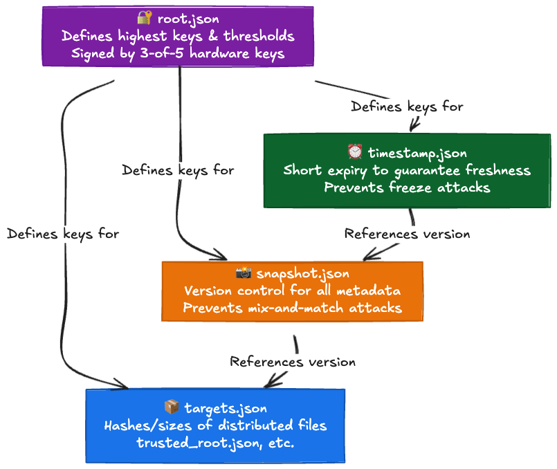

Here's how they interact:

- **root.json**: The absolute god-key. It defines the public keys for all other roles and their threshold signatures (e.g., 3-of-5).
- **targets.json**: Records the hashes and sizes of the actual files we want (`trusted_root.json`, `fulcio.crt.pem`, `rekor.pub`).
- **snapshot.json**: Locks down the exact versions of the targets. This stops attackers from mixing an old `targets.json` with a new `root.json`.
- **timestamp.json**: Updated constantly with a very short lifespan. This physically prevents attackers from feeding you stale metadata and claiming it's fresh.

### The Root Key Ceremony: Forging Trust in Public

`root.json` is the single most critical file in Sigstore's security model. It is signed during a highly-orchestrated public event called the **Key Ceremony**. The first one in June 2021 was literally live-streamed on CloudNative.tv.

Five trusted keyholders take physical hardware security keys and perform a 3-of-5 threshold signature to mint the `root.json`. The entire process is recorded, audited, and committed to the `sigstore/root-signing` repo. Unless an attacker physically robs three keyholders at gunpoint simultaneously, `root.json` cannot be forged.

### Bootstrapping: Establishing Trust on First Run

Cosign ships with a very old, foundational `root.json` hardcoded into the binary. On the first run, it executes the following protocol to safely fetch the latest Trust Root.

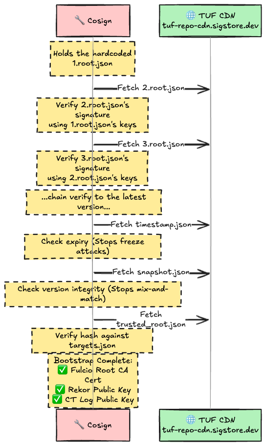

The genius here is the **chained verification of `root.json`**. Version N is explicitly verified by the keys from Version N-1. This means Sigstore can continuously rotate its root keys without forcing you to update your CLI binary. If the CDN is compromised and serves a bogus `root.json`, your client instantly rejects it because the previous key's signature won't match.

The final payload, `trusted_root.json`, hands you everything you need—Fulcio's CA chain, Rekor's key, CT Log keys—safely and securely.

---

## 6. The Full Flow: Deconstructing `cosign sign`

Now that we understand the trinity of Fulcio, Rekor, and TUF, let's look at exactly what happens when you type `cosign sign $IMAGE`.

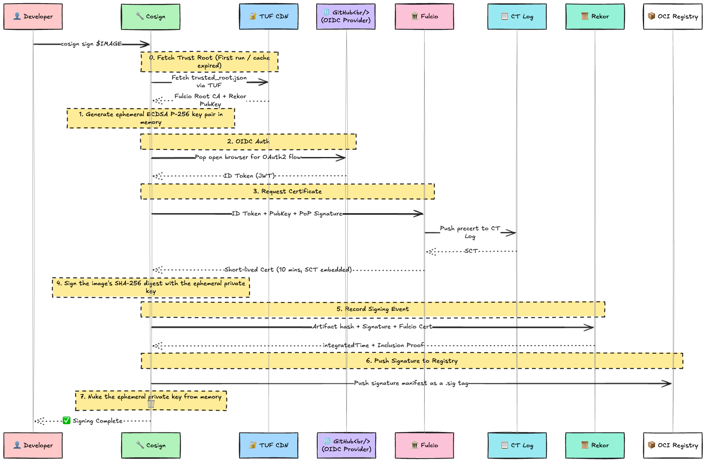

### Side Note: What "Signing a Container" Actually Means

Let's clear up a massive misconception. "Signing an image" does **not** mean injecting signature data inside the container image or its metadata.

If you modify the container image to append a signature, the image's hash (digest) instantly changes, invalidating the signature you just applied. It's a fatal **chicken-and-egg problem**.

Cosign bypasses this using a **Detached Signature** approach:

1. It calculates the hash of the pristine image manifest (Step 4).
2. It takes the resulting signature data, and instead of cramming it into the image, it **pushes it back to the exact same registry, right next to the original image, disguised as a dummy OCI Artifact with a `.sig` tag** (Step 6).
   *Note: The latest OCI v1.1 spec added the Referrers API, allowing manifests to link to each other directly without relying on ugly `.sig` tags.*

Signing a container literally just means **"creating cryptographic proof of its hash and sliding it quietly onto the shelf next to the original."**

The private key only exists in RAM for the few seconds between Step 1 and Step 7. Once it's nuked, nobody in the universe—not even you—can ever sign anything with it again.

When you verify it, you don't use a key; you use an **identity**:

```bash
cosign verify $IMAGE \
  --certificate-identity="you@gmail.com" \
  --certificate-oidc-issuer="https://accounts.google.com"
```

Here's the verification logic:

1. Pull the signature manifest (the `.sig` tag) from the registry.
2. Extract the signature, the Fulcio cert, and the Rekor log entry.
3. Validate the cert chain up to the Fulcio Root CA (which we got from TUF).
4. Verify Rekor's `integratedTime` falls inside the cert's 10-minute validity window.
5. Confirm the cert's SAN exactly matches `--certificate-identity`.
6. Confirm the cert's Issuer OID matches `--certificate-oidc-issuer`.
7. Use the public key embedded in the cert to mathematically verify the image digest signature.
8. Verify Rekor's Inclusion Proof using Rekor's public key (from TUF).

If all checks pass, you have irrefutable cryptographic proof that "This exact image was signed by this specific identity, authenticated by this specific OIDC provider, at that exact point in time."

---

## 7. GitHub Actions Integration: Total Automation

Where this architecture truly screams is inside a CI/CD pipeline. GitHub Actions natively provides its own OIDC Provider (`https://token.actions.githubusercontent.com`). Cosign automatically detects it, bypasses the browser popup, and executes a fully headless keyless signing flow.

### Workflow Configuration

```yaml
name: Build and Sign
on:
  push:
    branches: [main]

jobs:
  build-sign:
    runs-on: ubuntu-latest
    permissions:
      id-token: write    # Required to mint the OIDC token
      packages: write    # Required to push to GHCR
      contents: read

    steps:
      - uses: actions/checkout@v4

      - uses: sigstore/cosign-installer@v3

      - name: Login to GHCR
        uses: docker/login-action@v3
        with:
          registry: ghcr.io
          username: ${{ github.actor }}
          password: ${{ secrets.GITHUB_TOKEN }}

      - name: Build and Push
        id: build-push
        run: |
          IMAGE="ghcr.io/${{ github.repository }}:${{ github.sha }}"
          docker build -t "$IMAGE" .
          docker push "$IMAGE"
          DIGEST=$(docker inspect --format='{{index .RepoDigests 0}}' "$IMAGE")
          echo "digest=$DIGEST" >> "$GITHUB_OUTPUT"

      - name: Sign with Cosign (keyless)
        run: cosign sign --yes ${{ steps.build-push.outputs.digest }}
```

Adding `permissions.id-token: write` is all it takes. Cosign detects it's running inside CI, grabs the token, and does its job.

### Verifying the CI Signature

```bash
cosign verify \
  ghcr.io/myorg/myrepo@sha256:abc123... \
  --certificate-identity="https://github.com/myorg/myrepo/.github/workflows/build.yml@refs/heads/main" \
  --certificate-oidc-issuer="https://token.actions.githubusercontent.com"
```

This verification command guarantees one thing: **"This image was irrefutably built and signed by the build.yml workflow inside the myorg/myrepo repository, triggered from the main branch."**

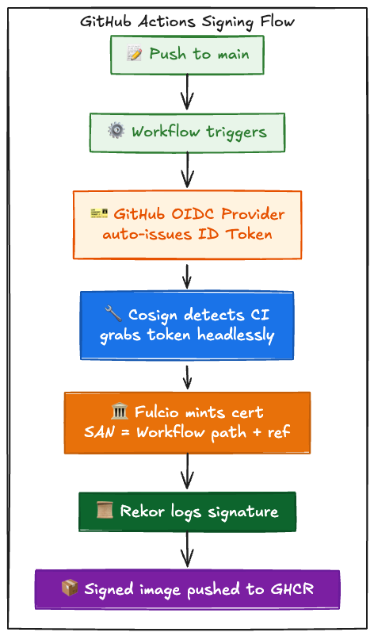

---

## 8. Kubernetes Policy Controller: Forcing the Rules

Once you can sign things, the next logical step is "refuse to deploy anything that isn't signed." While I showed off Kyverno in the last article, the Sigstore project natively maintains the **Policy Controller**, a dedicated Admission Webhook.

### How It Works

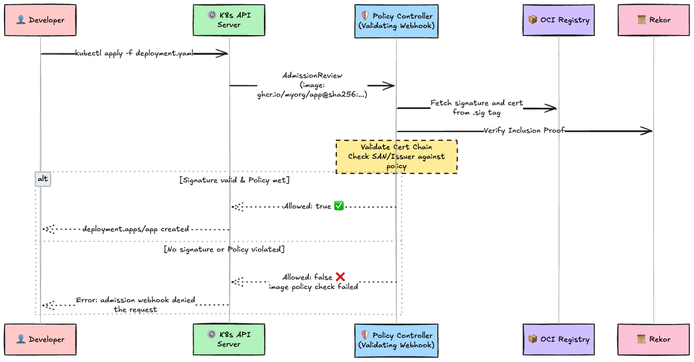

### Setup

```bash
# Install Policy Controller
helm repo add sigstore https://sigstore.github.io/helm-charts
helm install policy-controller sigstore/policy-controller \
  -n cosign-system --create-namespace

# Opt-in your target namespace
kubectl label namespace default policy.sigstore.dev/include=true
```

### ClusterImagePolicy: Defining the Law

```yaml
apiVersion: policy.sigstore.dev/v1beta1
kind: ClusterImagePolicy
metadata:
  name: require-github-actions-signed
spec:
  images:
    - glob: "ghcr.io/myorg/**"
  authorities:
    - keyless:
        url: https://fulcio.sigstore.dev
        identities:
          - issuer: "https://token.actions.githubusercontent.com"
          subject: "https://github.com/myorg/myrepo/.github/workflows/build.yml@refs/heads/main"
```

This policy dictates: **"Images under `ghcr.io/myorg/` are ONLY allowed to run if they were signed by the build.yml workflow on the main branch via GitHub Actions."**

Evaluation logic:
- If multiple `ClusterImagePolicy` resources match, **all** of them must be satisfied (AND).
- If a single policy has multiple `authorities`, **any one** of them will satisfy it (OR).

### Enforcing SBOM Attestations

The SBOM Attestations we covered previously can also be enforced here. You can write custom policies in CUE or Rego.

```yaml
apiVersion: policy.sigstore.dev/v1beta1
kind: ClusterImagePolicy
metadata:
  name: require-vuln-scan-passed
spec:
  images:
    - glob: "ghcr.io/myorg/**"
  authorities:
    - keyless:
        url: https://fulcio.sigstore.dev
        identities:
          - issuer: "https://token.actions.githubusercontent.com"
            subject: "https://github.com/myorg/myrepo/.github/workflows/build.yml@refs/heads/main"
      attestations:
        - name: vuln-scan
          predicateType: https://cosign.sigstore.dev/attestation/vuln/v1
          policy:
            type: cue
            data: |
              predicateType: "cosign.sigstore.dev/attestation/vuln/v1"
              predicate: {
                scanner: {
                  result: "PASSED"
                }
              }
```

This policy creates an ironclad rule: **"Only deploy images that have a cryptographically signed Attestation proving they passed the vulnerability scanner."** You can literally enforce this at the Kubernetes Admission Webhook level.

---

## 9. Expanding the Ecosystem: Beyond Containers

Sigstore cut its teeth on container images, but as of 2026, its reach has exploded.

**PyPI (Python)**: Sigstore-based attestations hit GA in November 2024. Projects using Trusted Publishing (GitHub Actions OIDC to PyPI) automatically get Sigstore signatures applied with zero workflow changes. Currently, ~5% of the top 360 packages are on board, pumping over 20,000 attestations.

**npm (Node.js)**: Trusted Publishing went GA in July 2025. Publishing via OIDC automatically attaches a Sigstore provenance attestation to the package.

**Maven Central (Java)**: Rolled out native support for Sigstore signatures in January 2025.

**Rekor Monitor**: OpenSSF is actively hardening Rekor Monitor for production use. It handles Rekor v2, certificate validation, and TUF integration. We've already seen cases where malicious package releases were caught purely by monitoring Rekor logs.

---

## 10. Threat Modeling: What Breaks When Things Go Wrong?

Sigstore is a powerhouse, but it's not magic. Here is a breakdown of what happens if its core components get compromised, and the mitigations in place.

| Threat                       | Impact                                                    | Mitigation                                                                                     |
| :--------------------------- | :-------------------------------------------------------- | :--------------------------------------------------------------------------------------------- |
| **OIDC Provider Compromise** | Rogue ID Tokens mint certs under someone else's identity. | CT Logs record all certs. Identity owners can spot anomalies by monitoring the logs.           |
| **Fulcio CA Compromise**     | Attacker mints arbitrary certificates.                    | Unlogged certs are rejected by clients. The community monitors CT logs to catch it.            |
| **Rekor Compromise**         | Logs altered or fake entries injected.                    | Blocked by v2 native Witnessing, Merkle consistency proofs, and signed Root Hashes.            |
| **TUF Root Compromise**      | The entire root of trust is swapped out.                  | Requires compromising 3-of-5 hardware keys. Audited via highly public Key Ceremonies.          |
| **Ephemeral Key Theft**      | Attackers forge signatures.                               | Keys live in RAM for seconds. Cert dies in 10 minutes. The signature must already be in Rekor. |

The brilliance here is that **a single component failure does not cause a systemic collapse.** If Fulcio goes rogue, the CT Log catches it. If Rekor is compromised, the Witnesses catch it. If the OIDC provider is breached, log monitoring catches it.

---

## 11. Legacy PKI vs. Sigstore

Let's wrap up by comparing Sigstore against legacy code-signing PKI.

| Aspect                | Legacy Code Signing PKI                                           | Sigstore                                                   |
| :-------------------- | :---------------------------------------------------------------- | :--------------------------------------------------------- |
| **Key Management**    | Hoard keys in HSM/Vault forever.                                  | Generate ephemerally, wipe instantly. Zero management.     |
| **Identity**          | Tied to an organization (costs money, requires corporate entity). | Tied to your OIDC ID (Google/GitHub, free).                |
| **Cert Lifespan**     | Years. Requires complex CRL/OCSP.                                 | 10 minutes. Revocation is obsolete.                        |
| **Cost**              | Commercial CAs: $200-$500+/year.                                  | Free (Public Good Instance).                               |
| **Transparency**      | None. Completely opaque.                                          | Every signature immortalized in Rekor.                     |
| **Verification UX**   | You have to manually fetch the signer's public key.               | Just specify the `identity` and `issuer`.                  |
| **OSS Compatibility** | Terrible. No corporate entity, key distribution nightmare.        | Flawless. Uses developer IDs, perfectly automatable in CI. |

Legacy PKI asked, "**Do you trust this specific key?**" Sigstore fundamentally shifts this to, "**Do you trust this specific identity, at this exact point in time?**" Transparency logs deliver the temporal proof, and short-lived certificates eradicate the nightmare of key lifecycle management.

---

## 12. Conclusion

We just tore apart the engine that makes `cosign sign` feel like magic.

1. **Fulcio** verifies your OIDC ID Token and mints a certificate that self-destructs in 10 minutes. It logs everything to a CT Log, meaning CA compromises can't hide.
2. **Rekor** forces every signing event into an immutable Merkle Tree. Inclusion proofs and signed timestamps permanently testify that the signature happened while the cert was alive.
3. **TUF** defends the root of trust with 3-of-5 threshold signatures and chained verification. Even a hacked CDN can't force-feed you a fake root cert.
4. Hook this into the **GitHub Actions OIDC Provider**, and you get completely automated, headless CI/CD signing.
5. Slap down **Policy Controller** on your cluster, and you establish a hard deployment gate.

They call Sigstore the "Let's Encrypt of code signing." Just like Let's Encrypt made HTTPS the default, Sigstore is turning ubiquitous code signing into the new standard. The fact that npm, PyPI, and Maven Central are aggressively adopting it proves the momentum is real.

The next time you hit `cosign sign`, take a second to appreciate the insane engineering behind it. Fulcio minting a 10-minute cert, Rekor hashing the log into a Merkle tree, and TUF stubbornly defending the root—all so you can throw your keys into the void.
