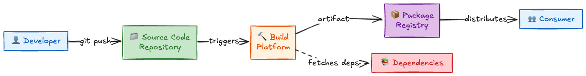
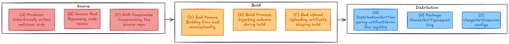
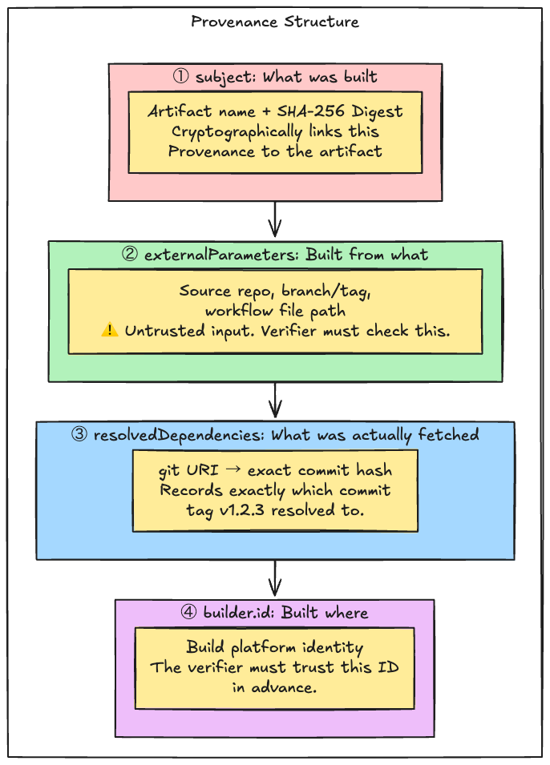
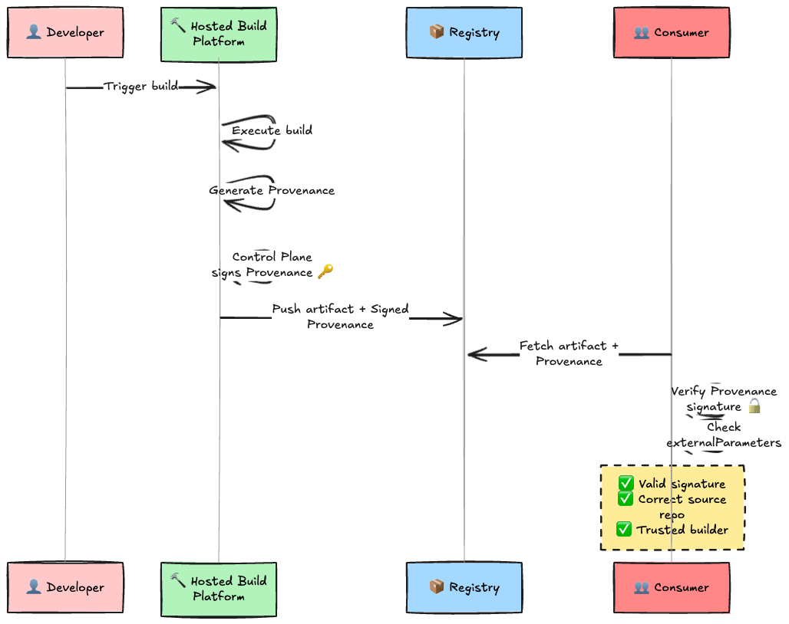
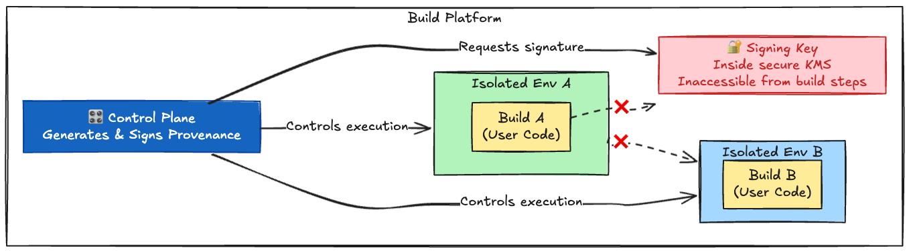
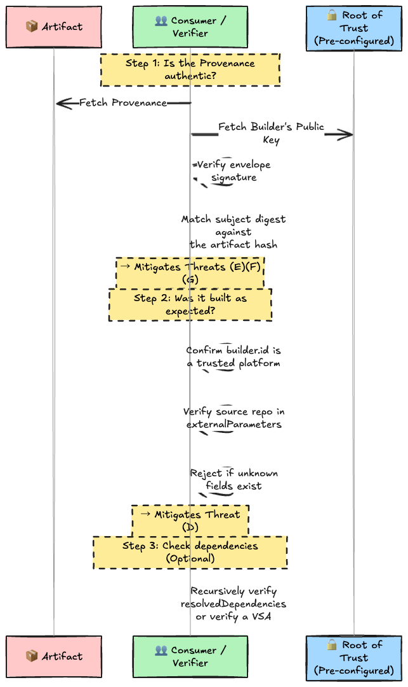
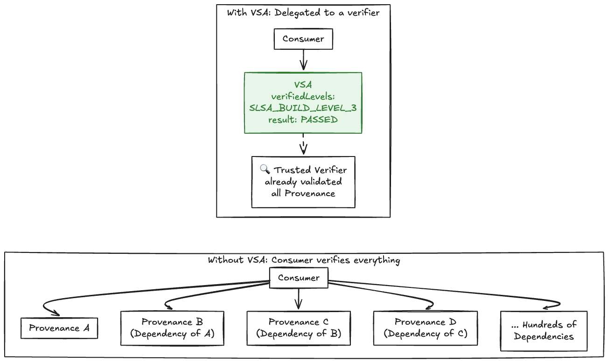
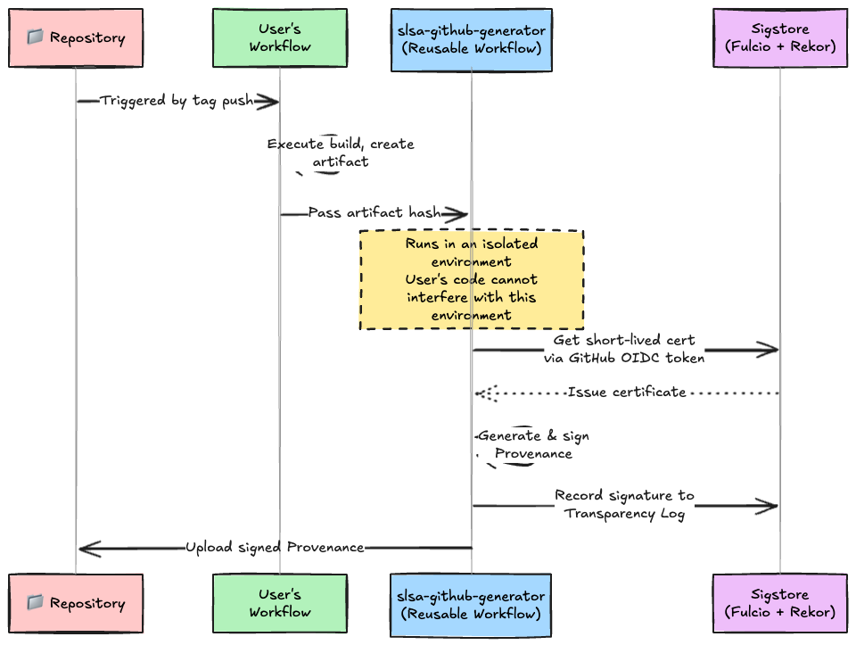

# Introduction

When I first investigated the SolarWinds incident, one technical detail absolutely floored me.

The attackers planted malware called **SUNSPOT** on SolarWinds' build servers. SUNSPOT monitored the build process every single second, and the moment the Orion platform build kicked off, it swapped the `InventoryManager.cs` source code with a backdoored version. Once the build finished, it swapped it back. Zero traces were left in the source code repository. The resulting binary was signed with a perfectly legitimate SolarWinds certificate and shipped to over 18,000 organizations.

The most terrifying part of this attack? **The signature was 100% valid.** Code signing only guarantees "this signer signed this file." It completely fails to guarantee "this binary was built from the correct source code via an untampered build process."

The Codecov incident later that year shared a similar structure. Attackers used leaked credentials to upload a malicious script directly into an GCS bucket, completely bypassing the build process. Users downloaded it directly. An artifact that never even touched the build process was distributed as legitimate.

So, what would have stopped this? What we need is **verifiable evidence** recording "which source this binary came from, on what platform it was built, and exactly how it was produced."

**SLSA (Supply-chain Levels for Software Artifacts, pronounced 'salsa')** is a framework explicitly designed to generate and verify this exact evidence. Google proposed it in 2021, and it's now an OpenSSF project. v1.1 was officially approved in April 2025, and v1.2, which introduced the Source Track, dropped in November 2025.

In this deep dive, we are ripping through the primary SLSA specification to explain exactly what we are protecting and how we protect it.

---

## Prerequisites: What You Need to Know

### What is the Supply Chain?

The software supply chain encompasses every single step from writing code to running it on a user's machine.



Between `git push` and `npm install` or `docker pull`, a massive amount of infrastructure intervenes: the build platform, dependency resolution, publishing, and distribution. **Every single point in this diagram is a target.** SolarWinds was a compromise of the "Build Platform," while Codecov was an attack on the "Distribution."

### The Limits of Code Signing

Digital signatures guarantee exactly two things: "The owner of the private key signed this," and "It hasn't been modified since." That's it. It guarantees absolutely nothing else.

SUNSPOT swapped the source code *during* the build. The resulting binary was then signed with a legitimate certificate. **The signature was mathematically perfect. But nobody could verify the relationship between the source code and the final binary.**

This is the massive blind spot SLSA aims to fix.

### Terminology Checklist

Let's nail down the jargon before we proceed.

- **Provenance**: Verifiable metadata describing "where," "how," and "from what" a software artifact was created. The core concept of SLSA.
- **Attestation**: An authenticated statement about a software artifact. Provenance is a type of Attestation.
- **in-toto**: A framework to secure the software supply chain. SLSA uses its Attestation format.
- **DSSE (Dead Simple Signing Envelope)**: The envelope format used to sign Attestations. It wraps a JSON payload with a digital signature.
- **Build Platform**: A hosted service that executes the build (e.g., GitHub Actions, Google Cloud Build).
- **Control Plane**: The management component inside the build platform that controls execution and generates Provenance. It is strictly isolated from user-defined build steps (the data plane).
- **Tenant**: The user or project using the build platform. In GitHub Actions, each repository's workflow acts as a tenant.

---

## The Big Picture of SLSA

SLSA is a framework that defines "what must be guaranteed at each stage of the supply chain" across different levels. It aligns nicely with NIST's Secure Software Development Framework (SSDF).

The key here is that SLSA isn't a monolithic checklist. It's broken down into **Tracks** tackling different aspects of the supply chain, with progressive **Levels** inside each track.

Current tracks:

- **Build Track** (since v1.0): Protects build integrity. The most mature track.
- **Source Track** (added in v1.2): Protects source code integrity.
- **Build Environment Track** (drafting): Protects the integrity of the build execution environment.
- **Dependency Track** (drafting): Manages risks from dependencies.

We'll focus heavily on the fully released Build and Source Tracks.

---

## Threat Model: What Are We Protecting Against?

To understand SLSA's design, you must understand the threat model. SLSA categorizes supply chain threats into 9 buckets, from **(A)** to **(I)**.



SLSA doesn't fix everything. **It directly mitigates threats (B) through (G).** A malicious producer (A), typosquatting (H), and bad usage (I) are explicitly out of scope.

If we map real-world incidents to this threat model, it becomes terrifyingly clear this isn't just theoretical:

| Threat  | Incident                     | What Happened                                                                       | SLSA Mitigation                                    |
| :------ | :--------------------------- | :---------------------------------------------------------------------------------- | :------------------------------------------------- |
| **(B)** | SushiSwap (2021)             | A contractor with repo access pushed a commit stealing crypto.                      | Source Track L4: Two-person review                 |
| **(C)** | PHP (2021)                   | Attackers compromised PHP's self-hosted git server and injected a backdoor commit.  | Source Track: Robust SCM requirements              |
| **(D)** | The Great Suspender (2020)   | A new maintainer published an extension built from an unverified, different source. | Build Track: Detect source mismatch via Provenance |
| **(E)** | SolarWinds (2020)            | SUNSPOT swapped source files during the build and signed it.                        | Build Track L3: Isolated builds                    |
| **(F)** | Codecov (2021)               | Attackers directly uploaded a malicious script to GCS using leaked credentials.     | Build Track: Detect missing build via Provenance   |
| **(G)** | Package Mirror Attack (2008) | Researchers proved they could serve arbitrary packages by operating a mirror.       | Build Track: Verify origin via Provenance          |

---

## Provenance: The Core of SLSA

Before looking at the Build Track levels, you must understand SLSA's lifeblood: **Provenance**. Every level in the Build Track revolves around this concept.

Provenance is metadata detailing "where," "how," and "from what" an artifact was generated. SLSA structures this using the [in-toto attestation](https://github.com/in-toto/attestation) format.

Let's look at what GitHub Actions spits out:

```json
{
  "_type": "https://in-toto.io/Statement/v1",
  "subject": [{
    "name": "my-app-v1.2.3.tar.gz",
    "digest": { "sha256": "a1b2c3d4..." }
  }],
  "predicateType": "https://slsa.dev/provenance/v1",
  "predicate": {
    "buildDefinition": {
      "buildType": "https://slsa-framework.github.io/github-actions-buildtypes/workflow/v1",
      "externalParameters": {
        "workflow": {
          "ref": "refs/tags/v1.2.3",
          "repository": "https://github.com/example/my-app",
          "path": ".github/workflows/release.yml"
        }
      },
      "resolvedDependencies": [{
        "uri": "git+https://github.com/example/my-app@refs/tags/v1.2.3",
        "digest": { "gitCommit": "abc123..." }
      }]
    },
    "runDetails": {
      "builder": {
        "id": "https://github.com/slsa-framework/slsa-github-generator/.github/workflows/generator_generic_slsa3.yml@refs/tags/v2.1.0"
      }
    }
  }
}
```

This structure holds 4 critical elements:



**externalParameters** is absolutely crucial. This is the "external input" to the build, and SLSA considers it untrusted. The consumer must check this field to answer, "Was this built from the correct repo and tag?" The Great Suspender incident happened entirely because this "built from what" verification didn't exist.

**builder.id** is equally important. When consumers see this ID, they assume "this build platform meets SLSA Build L3." In other words, **trusting the build platform is a hard prerequisite.** This reflects SLSA's core principle: "Trust the platform, verify the artifact."

---

## Build Track: Guaranteeing the Build

With Provenance understood, let's dissect the Build Track. Each level is defined by "how hard it is to forge the Provenance."

### Build L1: Provenance Exists

The bare minimum. The build process spits out Provenance.

L1 Requirements:
- Follows a consistent build process (e.g., scripted).
- Provenance is generated (contains builder.id, buildType, externalParameters, subject).
- **Provenance does NOT need to be signed.**

You might ask, "If it's unsigned, what's the point?" It actually has massive value. Just having Provenance makes incident response vastly easier. You can instantly answer, "Which commit did this binary come from?" It also prevents release accidents, like building from the wrong branch.

However, in L1, forging Provenance is trivial. An attacker just edits the file.

### Build L2: Signed Provenance

Two game-changing differences from L1:

1. **The build runs on a hosted platform** (not a developer's laptop).
2. **Provenance is signed by the build platform.**



Crucially, the signature is applied by the **platform's control plane**, not the tenant (user). If the tenant signed it, leaked credentials would allow attackers to mint fake Provenance. Because the control plane signs it, forging Provenance requires compromising the build platform itself.

L2 completely neuters Codecov-style attacks. An artifact uploaded directly without triggering a build simply won't have a platform-signed Provenance. When the consumer verifies it, the attack fails.

But L2 has a flaw: **It doesn't require isolation between tenants on the same platform.** A malicious tenant could theoretically interfere with another tenant's build or access signing keys.

### Build L3: Hardened Builds

L3 is engineered to defeat SolarWinds-style attacks. It adds 3 requirements:

1. **Isolated builds**: Every build runs in a strictly isolated environment.
2. **Invisible signing keys**: User-defined build steps have zero access to the signing keys.
3. **Complete externalParameters**: Every single external input is logged in the Provenance.



Think back to SUNSPOT. It hijacked the build environment to swap source files. L3 makes this agonizingly difficult:

- Because builds are isolated, injecting malware from the outside requires breaching the platform itself.
- Even if attackers inject malware into the build step, they can't access the signing key, meaning they can't forge a validly signed Provenance.
- Because the Control Plane generates the Provenance, the tenant's code cannot manipulate what gets written.

It makes attacks *difficult*, not *impossible*. If the control plane has a vulnerability, L3 falls. But the bar is raised exponentially.

### Build Track Level Comparison

| Requirement                          |     L1      |                L2                |                   L3                    |
| :----------------------------------- | :---------: | :------------------------------: | :-------------------------------------: |
| Consistent build process             |      ✅      |                ✅                 |                    ✅                    |
| Provenance generation                |      ✅      |                ✅                 |                    ✅                    |
| Hosted build platform                |             |                ✅                 |                    ✅                    |
| Signed Provenance                    |             |                ✅                 |                    ✅                    |
| Build isolation                      |             |                                  |                    ✅                    |
| Invisible signing keys               |             |                                  |                    ✅                    |
| Complete externalParameters          |             |                                  |                    ✅                    |
| **Difficulty of forging Provenance** | **Trivial** | **Requires platform compromise** | **Requires exploiting vulnerabilities** |

---

## Source Track: Defending the Source Code

While the Build Track protects the "integrity of the build process," the Source Track protects the "integrity of the source code handed to the build." It's a relatively new addition finalized in v1.2.

The problem the Source Track solves is dead simple: If you generate flawless Provenance in the Build Track but the source code was already poisoned, you've accomplished nothing. In the PHP incident, attackers hacked the git server and injected a backdoor commit. The Build Track alone cannot tell if that commit is legitimate.

### The 4 Levels of the Source Track

**Source L1: Version Controlled.** Source code is stored in a VCS like Git. It's vastly superior to emailing ZIP files, but offers almost zero guarantees.

**Source L2: History and Provenance.** Branch history must be continuous and immutable. The Source Code Management (SCM) system must issue a Source Provenance Attestation for every revision. Think of this as Build Provenance for code: it records "when, by who, and how the change was made." Force pushes and history rewriting are banned.

**Source L3: Technical Controls.** The SCM **enforces policies at the system level**. Rules like "no direct pushes to main" aren't just polite requests in a README; they are technically impossible to violate. Verifiers can mathematically prove "this revision was created following the correct procedures."

**Source L4: Two-Person Review.** All changes to protected branches require review by two trusted individuals. This entirely blocks SushiSwap-style attacks where an insider pushes malicious code unilaterally. If one developer's credentials are stolen, the second reviewer acts as a hard wall.

---

## Verification Flow: What Must Consumers Check?

Generating and signing Provenance is useless if nobody checks it. SLSA dictates a strict 3-step verification process for consumers.



**Step 1** asks, "Has this Provenance been tampered with?" You verify the signature and ensure the subject digest inside the Provenance perfectly matches the actual artifact in your hands. This proves it wasn't swapped for a fake binary.

**Step 2** asks, "Was it built the way we expected?" This is where **externalParameters verification** happens. Is the builder.id trusted? Is the source repo legitimate? Is the workflow what we expected? SLSA demands that you **reject the artifact if there are unknown fields**. This prevents verifiers from accidentally ignoring unexpected parameters.

**Step 3** is recursive dependency verification. But let's be real: traversing the Provenance of every single dependency is an operational nightmare. This is exactly what **VSA (Verification Summary Attestation)** solves.

### VSA: Making Dependency Verification Realistic

A VSA is a higher-level attestation stating, "A trusted verifier has already validated the Provenance for this artifact."



npm implemented exactly this model. When you upload a package, npm verifies the Provenance server-side and displays the result on npmjs.com. Consumers treat npm as the trusted verifier, entirely bypassing the need to verify individual Provenance files themselves.

---

## Real-World Implementations

### GitHub Actions: Achieving Build L3

The mechanism that generates SLSA Build L3 Provenance on GitHub Actions is `slsa-framework/slsa-github-generator`.



This is how the L3 isolation requirement is met. Provenance generation is implemented as a **Reusable Workflow** running in a completely separate execution environment from the user's workflow. The user's code has zero access to the Provenance generation or signing process.

It leverages Sigstore's keyless signing. GitHub Actions workflows generate OIDC (OpenID Connect) tokens at runtime containing proof of "which repo, which workflow, and which trigger ran this." `slsa-github-generator` presents this token to Fulcio (Sigstore's CA) to grab a short-lived signing certificate. The signature is immortalized in Rekor (transparency log). This achieves publicly verifiable signatures with zero long-term key management.

### npm: The Deepest Ecosystem Integration

npm rolled out Provenance support in 2023, boasting the deepest SLSA integration of any package ecosystem to date.

- Simply appending the `--provenance` flag to `npm publish` pushes packages with Provenance from GitHub Actions or GitLab CI/CD.
- Build Provenance details are front and center on every package page on npmjs.com.
- `npm audit signatures` can batch-verify the Provenance of your entire dependency tree.
- Provenance is signed via Sigstore and recorded in public transparency logs.

### PyPI: PEP 740 Digital Attestations

PyPI officially introduced Digital Attestation support in November 2024 via PEP 740. It operates in tandem with Trusted Publishing (OIDC-based auth from GitHub Actions, etc.). PyPA's publishing action v1.11.0 enables it by default, bringing around 20,000 packages into Attestation-ready status.

However, as of November 2024, only about 5% of the top 360 most downloaded packages actually carried Attestations. While roughly two-thirds of the top packages haven't cut a release since the feature dropped, the ecosystem integration is undeniably shallower than npm right now. You can track adoption at [Are we PEP 740 yet?](https://trailofbits.github.io/are-we-pep740-yet/).

---

## What SLSA Does Not Cover

It's incredibly tempting to say, "It's SLSA Build L3 compliant, so it's perfectly safe." But it's not. Misunderstanding SLSA's boundaries breeds fatal overconfidence.

**It does not evaluate code quality.** SLSA doesn't care if your source code is riddled with zero-days. It guarantees "the code wasn't tampered with," not "the code is inherently safe."

**There is no transitive trust.** Just because an artifact hits SLSA Build L3 does not mean its dependencies are L3. SLSA levels apply strictly to a single artifact. Dependencies must be verified recursively.

**It does not prevent typosquatting.** Installing `1odash` instead of `lodash` is entirely outside SLSA's jurisdiction. However, because Provenance hardcodes the source repo URL, it can be weaponized to verify, "Did this package actually come from the repo I think it did?"

**It does not protect against malicious producers.** If the author intentionally writes malware into the codebase, SLSA won't stop it. Open-source visibility increases detection, but that's not a feature of SLSA itself.

---

## Conclusion

SLSA is a framework to mathematically verify "what source this software came from, and what exact process built it."

The Build Track progressively raises the bar for forging Provenance: L1 guarantees it exists, L2 adds platform signatures, and L3 isolates the build environments. The Source Track aggressively locks down code change management, peaking at L4 with mandatory two-person reviews.

Six years after SolarWinds, the ecosystem is rapidly catching up. GitHub Actions' `slsa-github-generator`, npm's native Provenance, and PyPI's PEP 740 are hardening the supply chain infrastructure. The spec itself is actively evolving, with v1.1 and v1.2 dropping in 2025 to officially enshrine the Source Track.

Will SLSA prevent every attack? No. But the difference between "we have absolutely no idea where this binary came from" and "we have mathematically verifiable evidence" is night and day—both for incident response times and the sheer wall attackers have to climb to compromise your software.

---

## References

- [SLSA Specification v1.2](https://slsa.dev/spec/v1.2/)
- [SLSA v1.1 Approved (2025-04)](https://slsa.dev/blog/2025/04/slsa-v1.1)
- [SLSA v1.2 Announcement (2025-11)](https://slsa.dev/blog/2025/11/announce-slsa-v1.2)
- [SLSA GitHub Repository](https://github.com/slsa-framework/slsa)
- [slsa-github-generator](https://github.com/slsa-framework/slsa-github-generator)
- [slsa-verifier](https://github.com/slsa-framework/slsa-verifier)
- [in-toto Attestation Framework](https://github.com/in-toto/attestation)
- [npm Provenance](https://docs.npmjs.com/generating-provenance-statements/)
- [PyPI Digital Attestations (PEP 740)](https://blog.pypi.org/posts/2024-11-14-pypi-now-supports-digital-attestations/)
- [SUNSPOT Technical Analysis (CrowdStrike)](https://www.crowdstrike.com/en-us/blog/sunspot-malware-technical-analysis/)
- [Codecov Post-Mortem](https://about.codecov.io/apr-2021-post-mortem/)
- [OpenSSF](https://openssf.org/)
