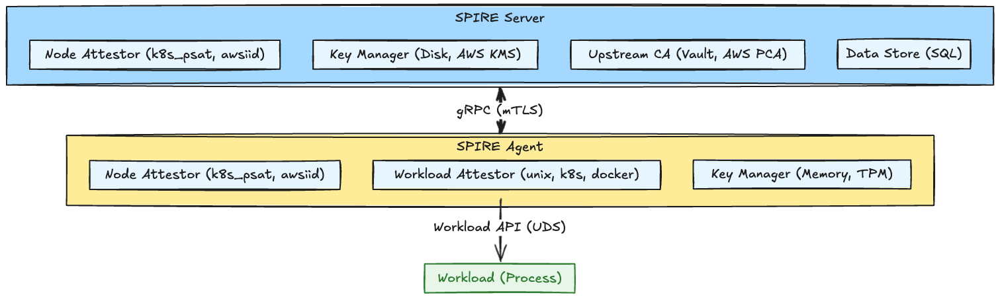
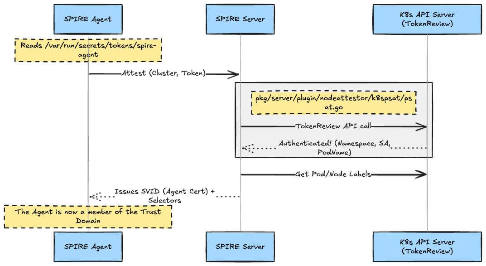
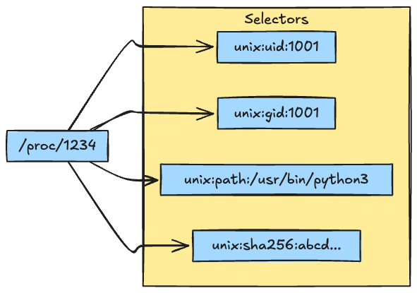
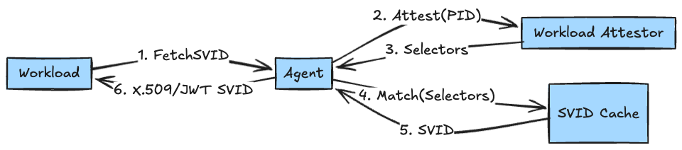
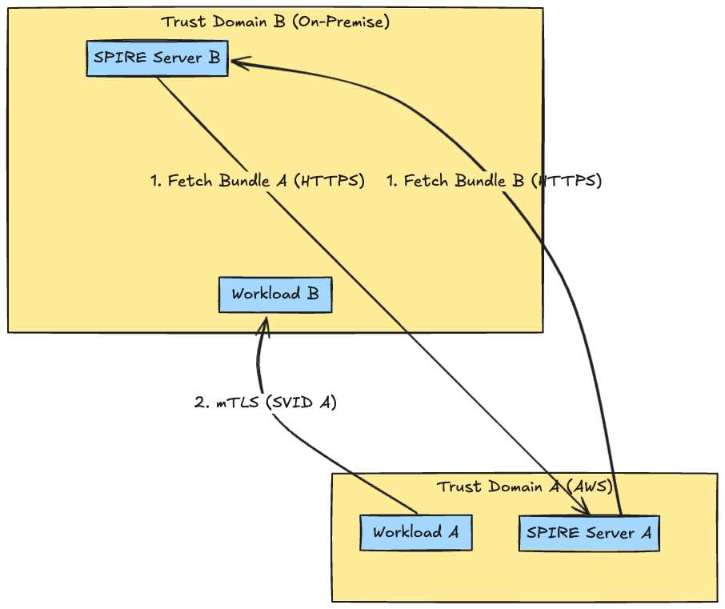

# Introduction

It is 2026. Are your microservices still embedding "API keys" in environment variables?
Or, are you still placing static credentials on on-premise servers just to use AWS IAM roles?

All of these boil down to the **"Secret Zero"** problem — the chicken-and-egg dilemma of "how to securely deliver the first secret (credential)."

SPIFFE (Secure Production Identity Framework For Everyone) and its implementation, SPIRE, are the global standards for **"Workload Identity"** that fundamentally solve this problem.
In this article, we will dissect the SPIRE source code (`pkg/agent`, `pkg/server`) and explain in detail the mechanism by which a process proves "who it is" at the kernel level to construct a Chain of Trust.

## 1. Internal Architecture: Plugin Ecosystem

SPIRE is highly modularized, with all core functions implemented as plugins.



## 2. Node Attestation: The Origin of Trust (Chain of Trust)

When the SPIRE Agent starts up, it must first prove "whether this node (machine) itself is trustworthy." This is Node Attestation.

### In the case of Kubernetes PSAT (Projected Service Account Token)

In the `k8s_psat` method, which is standard in K8s environments, a signed JWT (PSAT) issued by K8s is used.

> Although **Projected Volume** is used for implementation, the actual entity of the token is what is known as a **Bound Service Account Token**. Unlike traditional static tokens, this is strongly bound to the Pod's lifecycle (time, audience, and object).

The core of this method is that the **SPIRE Server communicates directly with the K8s API Server to verify the validity of the token.**



The SPIRE Server verifies the validity of the token via the `TokenReview` API and retrieves the UID and labels of the node behind it.
In multi-cluster configurations, the architecture ensuring connectivity (Reachability) from the Server to each cluster's API Server, or using **SPIRE Federation** to establish trust relationships, has become the best practice in 2026.

## 3. Workload API: The Gateway to Zero Trust

The window through which a workload (process) obtains an SVID from the SPIRE Agent is the **Workload API**, provided via a Unix Domain Socket (UDS).

There are no "passwords" here. The Agent identifies who is speaking to it based on kernel metadata.

### Peer Tracking: Completely Preventing PID Reuse Attacks

Simple identification by PID carries the risk of spoofing due to PID recycling (wrapping around).
SPIRE implements a **robust mechanism in `pkg/common/peertracker` that eliminates Race Conditions.**


1. **`SO_PEERCRED`**: Directly obtains the source PID from the kernel at the time of socket connection.
2. **Holding the FD**: Immediately after connection, it opens `/proc/<PID>/stat` etc., and maintains that file descriptor (FD).
3. **Atomic Comparison of Starttime**:
When extracting attributes, it compares the **"process start time read from the held FD"** with the **"start time of the same PID currently on `/proc`."**
If the process has terminated and the PID has been reused, the FD will point to the old (dead) process or result in a read error, and will not match the start time of the new process, thus reliably detecting spoofing.

## 4. Workload Attestation: Attribute Extraction

Once the identity of the PID is guaranteed, the next step is to extract the "attributes (Selectors)" of that process.

The SPIRE Agent's `unix` workload attestor (`pkg/agent/plugin/workloadattestor/unix/unix_posix.go`) scans the `/proc` filesystem to collect the following information:

* **UID/GID**: Execution user/group.
* **Supplementary GIDs**: Supplementary groups (`Groups` field in `/proc/<PID>/status`).
* **Path**: Path of the execution binary (symbolic link target of `/proc/<PID>/exe`).
* **SHA256**: Checksum of the binary.

*Note: In container environments (K8s/Docker), the path seen from the host side may differ due to cgroup namespaces, but these are supplemented as container metadata (Namespace, ServiceAccount, ImageID, etc.) by the `k8s` or `docker` attestors.*



## 5. SVID Format: Anatomy of the Certificate

The issued **X509-SVID** is a standard X.509 certificate, but the SPIFFE ID is stored in the **URI** field of the **SAN (Subject Alternative Name)** extension.

```text
Certificate:
    Data:
        Subject: C=US, O=SPIRE, CN=my-app
        X509v3 extensions:
            X509v3 Subject Alternative Name:
                URI:spiffe://example.org/my-app
            X509v3 Key Usage: critical
                Digital Signature, Key Encipherment, Key Agreement
            X509v3 Extended Key Usage:
                TLS Web Server Authentication, TLS Web Client Authentication
```

In the SPIRE Server's `pkg/server/credtemplate/builder.go`, the template is created as follows:

```go
// Excerpt from buildBaseTemplate
return &x509.Certificate{
    SerialNumber:          serialNumber,
    URIs:                  []*url.URL{spiffeID.URL()}, // [Important] Set SPIFFE ID in SAN URI here
    SubjectKeyId:          subjectKeyID,
    BasicConstraintsValid: true,
    PublicKey:             publicKey,
}
```

Thanks to this standard format, even legacy TLS libraries that do not understand SPIFFE IDs can identify the workload simply by parsing the SAN field.

## 6. SVID Issuance: The Realization of Trust

Finally, based on the collected selectors, the appropriate SVID is returned from the SPIRE Agent's cache. If it is not in the cache, the Agent sends a CSR (Certificate Signing Request) to the Server, the Server signs it, and it is distributed to the Agent and then to the Workload.



## 7. [Option] SPIRE Federation: The Bridge Between Trust Domains

While the mechanisms described so far are sufficient within a single cluster, the reality of 2026 is multi-cloud and multi-cluster.
Sharing the same Root CA across all clusters is not recommended from the perspective of security risks (expanding the blast radius) and operational costs.

This is where **SPIRE Federation** comes in.
It allows different **Trust Domains** to exchange their "Trust Bundles" (sets of public keys) with each other, creating a state where **"management systems are separate, but IDs issued by the other party can be verified."**

Although the objective is the same as so-called **Cross-Signing**, the implementation adopts a simpler and flatter **"Trust Bundle Exchange"** method. Instead of delegating signing authority, the method is "adding this Root CA to the trust list as well."

### Bundle Endpoint Standard

The SPIRE Server exposes a SPIFFE-standard **Bundle Endpoint**. The opposing SPIRE Server periodically polls this endpoint to retrieve and update the latest Trust Bundle.



1. **Bundle Exchange**: Server A retrieves Server B's public keys (Bundle) and distributes them to the Agents/Workloads under its control (and vice versa).
2. **Cross-Domain Auth**: When Workload A accesses Workload B, it presents SVID A (signed by A's private key). Workload B uses "Bundle A (A's public keys)" that it has on hand to verify this.

This mechanism enables Zero Trust communication across organizations and clouds while strictly adhering to the principle that **"the Private Key (Signing Key) never leaves the domain."**

## Outlook for 2026: AI and PQC

SPIRE is not standing still.

1. **Post-Quantum Cryptography (PQC)**:
The migration to quantum-resistant signing algorithms (such as Dilithium) is proceeding smoothly thanks to the plugin structure.
2. **AI-Driven Policy**:
Mechanisms where AI plugins detect anomalies like "requests from unusual binary paths" or "abnormal frequency of SVID updates" to dynamically lower trust scores are becoming widespread.

## Conclusion

The essence of SPIFFE/SPIRE lies in **replacing "secrets mediated by humans" with "proofs of behavior" guaranteed by the kernel and infrastructure.**
From the reliable PID acquisition via `SO_PEERCRED` to the ingenious reuse prevention measures using `/proc`, the implementation is packed with engineering wisdom.

I hope this article serves as your first step toward Zero Trust, or perhaps an entrance into a deeper labyrinth.
The chicken-and-egg dilemma has finally been solved.

## References

* [SPIFFE.io](https://spiffe.io/)
* [SPIRE (GitHub)](https://github.com/spiffe/spire)
* [Linux Manual Page: unix(7) - SO_PEERCRED](https://man7.org/linux/man-pages/man7/unix.7.html)
