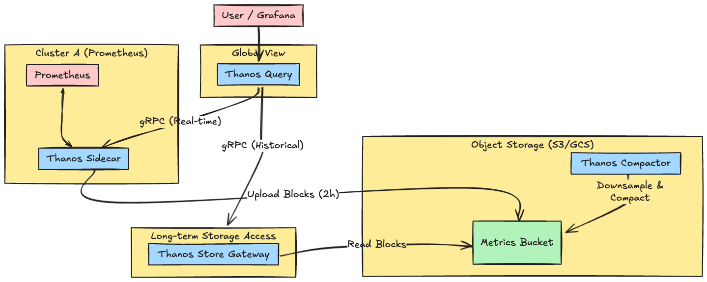
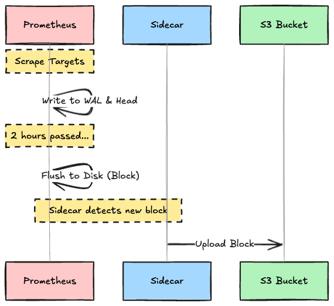
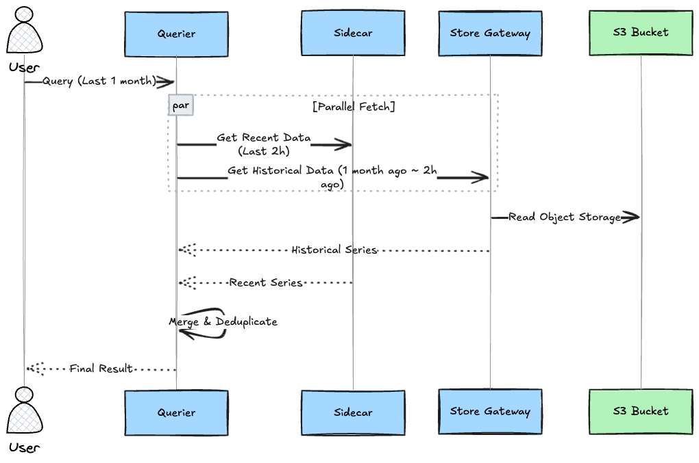
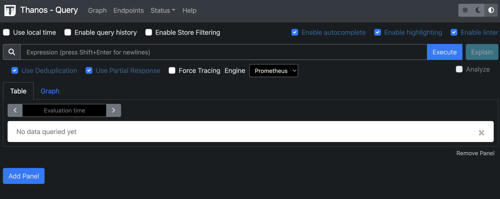

# Introduction

Prometheus is a wonderful tool, but as operations grow in duration and scale, you inevitably hit two major barriers.

1. **The Barrier of Long-term Storage**: Local disk capacity is limited. Even if asked, "I want to see data from a year ago," it is already gone.
2. **The Barrier of Availability (HA)**: Prometheus becomes a single point of failure. If you configure HA (two parallel servers), data becomes duplicated, causing graphs to look jagged.

**Thanos** solves these challenges by utilizing **"Object Storage (such as S3)"** and a **"Microservices Architecture."**

In this article, we will deep dive into the architecture with diagrams to see how each Thanos component coordinates to achieve infinite storage and global querying.

---

## 1. Architecture Overview

Thanos is not a single binary, but a collection of components for specific roles.



---

## 2. Component Deep Dive

Let's look at the role of each component.

### 1. Thanos Sidecar

**"The Courier Next to Prometheus"**

It runs in the same Pod (or server) as Prometheus.

* **Upload**: It detects blocks (every 2 hours) written to disk by Prometheus and immediately uploads them to S3. This allows Prometheus's main disk usage to be minimized (keeping only the last few hours).
* **Proxy**: It receives requests from `Thanos Query` and returns Prometheus's latest data (in-memory data).

### 2. Thanos Store Gateway

**"The Gatekeeper Making S3 Data Searchable"**

It exposes massive amounts of past data in S3 to `Thanos Query` as if it were local.
By caching parts of the data index locally, it reduces access counts to S3 and achieves high-speed querying.

### 3. Thanos Compactor

**"The Storage Organizer"**

It operates on data in S3 in the background.

* **Downsampling**: 15-second precision is unnecessary for "data from a year ago." By thinning out (downsampling) data to "1-hour averages" or "5-minute averages," long-term queries become blazing fast.
* **Compaction**: It merges and organizes small blocks.
* **Retention**: It deletes data that has passed a configured retention period (e.g., 1 year).

### 4. Thanos Query (Querier)

**"The Unified Query Layer Bundling Everything"**

Grafana and similar tools connect to this component.

* **Global View**: It collects data from multiple Sidecars (current) and Store Gateways (past), combines them, and returns the result.
* **Deduplication**: In an HA configuration with two Prometheus servers, the same data is sent from both. However, the Querier automatically performs **Deduplication**, returning a clean single line.

---

## 3. Data Flow: "Write" and "Read"

Let's organize how data flows and how it is read.

### The Write Path



### The Read Path

When a query comes in asking, "I want to see data from the past month":



---

## 4. Hands-on: Local Demo with Docker Compose

Since Thanos has many components and requires S3, running single binaries locally is difficult.
It is standard practice to launch the whole set using Docker Compose with a pseudo-S3 (MinIO).

### Step 1: Create `docker-compose.yaml`

Create a file with the following configuration.

```yaml
version: '3.7'

services:
  # 1. Prometheus with Sidecar
  prometheus:
    image: prom/prometheus:v2.45.0
    volumes:
      - ./prometheus.yml:/etc/prometheus/prometheus.yml
    command:
      - --config.file=/etc/prometheus/prometheus.yml
      - --storage.tsdb.min-block-duration=2h
      - --storage.tsdb.max-block-duration=2h # Fixed for Upload
      - --web.enable-lifecycle

  sidecar:
    image: thanosio/thanos:v0.32.2
    command:
      - sidecar
      - --tsdb.path=/prometheus
      - --prometheus.url=http://prometheus:9090
      - --objstore.config-file=/etc/thanos/bucket_config.yaml
    volumes:
      - ./bucket_config.yaml:/etc/thanos/bucket_config.yaml
    depends_on:
      - minio

  # 2. Object Storage (MinIO)
  minio:
    image: minio/minio
    environment:
      MINIO_ROOT_USER: minio
      MINIO_ROOT_PASSWORD: melovethanos
    command: server /data
    ports:
      - "9000:9000"

  # 3. Thanos Store Gateway
  store:
    image: thanosio/thanos:v0.32.2
    command:
      - store
      - --objstore.config-file=/etc/thanos/bucket_config.yaml
    depends_on:
      - minio

  # 4. Thanos Querier
  querier:
    image: thanosio/thanos:v0.32.2
    ports:
      - "10902:10902"
    command:
      - query
      - --store=sidecar:10901
      - --store=store:10901

```

*(Note: The contents of the configuration file are omitted for simplicity, but connection information to MinIO is described in `bucket_config.yaml`)*

### Step 2: Start and Verify

```bash
docker-compose up -d

```

After startup, access `http://localhost:10902` (Thanos Querier), and you will see a UI similar to Prometheus.
By checking **"Use Deduplication"** here, you can experience Thanos's powerful deduplication feature.



---

## Conclusion

Thanos is the "standard expansion pack" for breaking through Prometheus's limits.

1. **Sidecar**: Escapes data to S3.
2. **Store Gateway**: Makes S3 data readable.
3. **Compactor**: Compresses and organizes data.
4. **Querier**: Bundles everything and removes duplicates.

If you understand this architecture, petabyte-scale metrics infrastructure is nothing to be afraid of.
