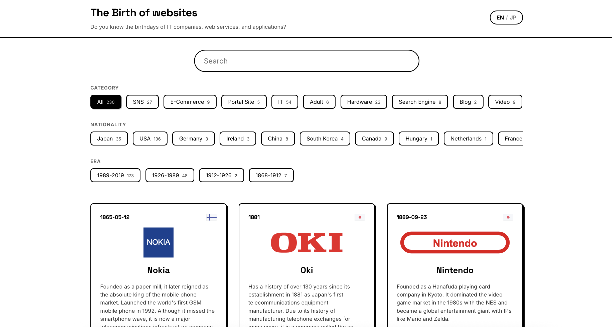

# Introduction

Have you ever wondered when your favorite programming language was actually released? Or when the major platforms we use today first appeared on the internet?

I developed a web service called **[The Birth of Websites](https://kanywst.github.io/thebirthofwebsites/)**.
It is a visual timeline of IT history, exploring the founding dates and origins of major tech companies, web services, programming languages, and operating systems.

TODO: replace github rawa link

## Links

- **Live Demo:** [https://kanywst.github.io/thebirthofwebsites/](https://kanywst.github.io/thebirthofwebsites/)
- **GitHub Repository:** [kanywst/thebirthofwebsites](https://github.com/kanywst/thebirthofwebsites)

---

## What is this app?

"The Birth of Websites" compiles the founding years of IT companies, web services, and technologies, allowing users to visualize decades of IT evolution from the past to the present.

## Motivation

As a software engineer, I have always been fascinated by the evolution of IT. I believe there is great value in exploring the history and transitions of major tech companies, web services, and technologies. Understanding where we came from helps us understand where we are going.

## Methodology

### How I compiled the data

To start, I referred to Wikipedia's [List of most-visited websites](https://en.wikipedia.org/wiki/List_of_most-visited_websites) (and similar lists).

From there, I researched major IT companies and added details about programming languages, OSs, and CNCF Projects. (You might feel the CNCF Projects stand out a bit—that’s simply because I’m a big fan of them! 😄)

Also, to fully understand the evolution of the web, I felt it was impossible to ignore the existence of underground web services, as they have undeniably shaped internet history.

---

## Tech Stack

This project is built as a Single Page Application (SPA) hosted on GitHub Pages.

- **Framework:** [Vue.js 3](https://vuejs.org/)
- **Build Tool:** [Vite](https://vitejs.dev/)
- **Internationalization:** [Vue I18n](https://vue-i18n.intlify.dev/)

I chose Vue 3 and Vite for a lightweight and fast development experience. Since the data is static, hosting it on GitHub Pages was the most efficient choice.

---

## Conclusion

To fully capture the history of IT, the current timeline is likely still missing some information. I plan to continue updating it, referencing sources like [w3techs](https://w3techs.com/).

If you read this and think, "Hey, this is missing!", please let me know in the comments or open an Issue/PR on GitHub. Your contributions are highly appreciated!

I hope this timeline helps you discover some interesting facts about the tools and services we use every day.

Please give it a try and let me know what you think in the comments! If you like the project, I would appreciate a star on GitHub.

**[Check out The Birth of Websites](https://kanywst.github.io/thebirthofwebsites/)**
